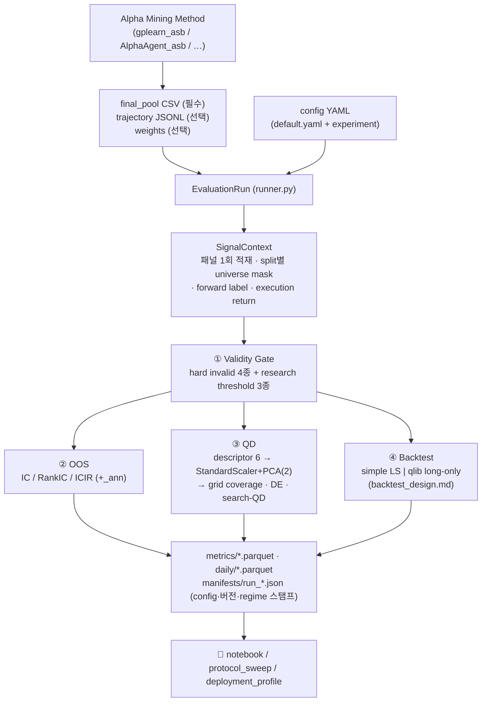

# AlphaSearchBench (ASB) — Implementation Design

이 문서는 **현재 저장소에 구현된 ASB 코드를 직접 읽어** 작성한 implementation-level
설계 문서다. 규범적 배치 프로토콜 명세는 `docs/research_docs/backtest_design.md`,
마이너 측 설계는 `docs/research_docs/GP_asb_design.md`에 있으며, 이 문서는 **평가
프레임워크 전체의 구조·데이터 흐름·계약**을 다룬다.

표기: ✅ 구현됨 · ⚠ 구현되었으나 주의 필요(문서화된 결함·비대칭) · ❌ 미구현 ·
📓 노트북 전용(ASB 코어 아님).

---

## 1. Overview — AlphaSearchBench가 무엇인가

### 1.1 한 문장

> 서로 다른 Formula Alpha Mining 방법이 생성한 alpha pool과 탐색 궤적을 **동일한
> 데이터·universe·split·metric 정의·포트폴리오 규칙** 아래에서 비교하기 위한
> 공통 평가 프레임워크.

### 1.2 각 논문의 자체 결과를 그대로 비교할 수 없는 이유

공표되는 성능은 곱이다: `발견한 수식 × 결합 방법 × 포트폴리오 규칙 × 비용 가정 ×
실행 시맨틱`. 각 연구는 뒤의 네 요소를 자율적으로 고르므로, 최종 수익만 비교하면
**pool 품질과 배치 기계의 품질이 식별되지 않는다.** 여기에 데이터·universe·기간·
IC 정의(Pearson/Spearman, inf 처리, 최소 관측 수)의 차이가 겹친다. 실제로 이
저장소에서 확인된 예: 원본 AlphaEval 계보의 IC는 ±inf 셀을 corr에 포함시켜 그
날을 NaN으로 만들고 NaN 과반이면 0.0을 반환하는 반면, ASB는 inf를 invalid cell로
제외한다(§7.4).

### 1.3 ASB가 해결하는 것 / 하지 않는 것

* ASB는 **evaluator다. mining algorithm이 아니다.** 후보를 생성하거나 fitness로
  선택하지 않는다. `alphasearchbench/`에는 탐색 루프가 없다.
* GP·RL·LLM 등 miner는 (a) 최종 pool, (b) 선택적으로 전 후보 궤적을 제출하고,
  ASB는 이를 **동일 계약**으로 읽어 4축으로 채점한다.
* 반대로 ASB 지표는 마이닝에 되먹임되지 않는다. 단, 방향(`train_sign`) 규약만
  공유한다(§5.4).

### 1.4 네 축이 답하는 질문

| 축 | 질문 | 모듈 |
|---|---|---|
1 Validity | 이 factor는 **평가 가능한가**? | `validity/` |
2 OOS | 미래 구간에 **예측 신호가 존재하는가**? | `oos/` |
3 Quality-Diversity | **어떤 종류**의 alpha를 **얼마나 다양하게** 탐색했는가? | `qd/` |
4 Portfolio Backtest | 포트폴리오로 만들면 **경제적 가치**가 있는가? | `backtest/` |

---

## 2. Overall Architecture & Evaluation Flow

### 2.1 진입점

```bash
python -m alphasearchbench evaluate \
  --config configs/examples/csi800_ref.yaml \
  --input <final_pool.csv> [--trajectory <traj.jsonl>] [--weights <w.json>] \
  --method <label> --seed-id <seed> --out <dir>
```

`cli.py` 서브커맨드 5종과 각 커맨드가 실행하는 단계(`runner.py:545-549`):

| 커맨드 | 실행 단계 |
|---|---|
`evaluate` | validity → oos → qd → backtest |
`oos` | validity → oos |
`qd` | validity → qd |
`backtest` | validity → backtest |
`validity` | validity |

**validity는 항상 먼저 실행된다** — 이후 모든 축이 `passes_gate`를 소비한다.
`--split` 플래그는 ❌ 없다: 모든 단계가 `test` 분할에서 실행된다
(`runner.py:131,156,449`). 다른 분할 평가는 `scripts/protocol_sweep.py --split`만
가능하다.

### 2.2 흐름



### 2.3 모듈 지도

| 경로 | 역할 |
|---|---|
`cli.py` | 인자 파싱 → `EvaluationRun` → 단계 실행 |
`config.py` | `configs/default.yaml` deep-merge, `splits()` 검증 |
`runner.py` | `EvaluationRun` — 입력 로드·게이트·4축 오케스트레이션·manifest |
`data/qlib_bootstrap.py` | qlib init (재-init 차단, qlib 자체 캐시 **비활성**) |
`data/qlib_provider.py` | `FormulaEngine` — 패널 적재·수식 파서·연산자 의미론 |
`data/universe.py` | PIT 멤버십 마스크 + `universe_hash` |
`data/labels.py` | forward return, execution return 4종 |
`data/signal_context.py` | split별 컨텍스트, 2단 신호 엔진, 방향, 결합 신호, 레짐 |
`validity/` | `compute_validity_stats`(15키), `ValidityGate` |
`oos/` | `masked_daily_corr`, `aggregate_ic`, `OOSEvaluator` |
`qd/` | descriptors · projection · grid · diversity(DE) · rre · pfs · trajectory |
`backtest/` | `simple.py`(LS), `qlib_native.py`(long-only), `metrics.py` |
`outputs/writer.py` | 표준 디렉토리·parquet(→pickle 폴백) |
`manifest.py` | 재현 정보 스탬프 |
`scripts/` | `protocol_sweep.py`, `deployment_profile.py`, `pool_rarefaction.py`, `manifest_to_report_table.py` |

---

## 3. Inputs & Standard Interface

### 3.1 final pool (필수 입력)

`inputs/loaders.py:load_result` — **필수 컬럼은 `formula` 하나**. `method`/`seed`는
CLI 인자로 주입되며 없으면 파일명/`"unknown"`으로 대체된다.

| 컬럼 | 용도 |
|---|---|
`formula` | 필수. qlib 함수형 표현식 문자열 |
`signed_train_IC` | 있으면 방향(`train_sign`) 산출에 사용 → 재계산 생략 |
`train_sign` | ⚠ 계약 문서에는 있으나 **코드가 읽지 않는다**(`runner.py:113-128`은 `signed_train_IC`만 본다) |
기타 | 그대로 통과(평가에 미사용) |

`--weights`(json/csv)를 주면 pool 가중으로 사용하고 `weights_source="input"`,
없으면 등가중 `1/n` + `"equal_default"`(`runner.py:60-64`).

### 3.2 trajectory (선택 입력)

`inputs/trajectory.py:load_trajectory` — search-QD와 all_candidates 분석의 활성
조건. 필수 축은 `formula`, `generation`, `idx_in_population`이며 miner는 `**extra`로
임의 필드를 추가할 수 있다.

### 3.3 세 입력 종류와 사용처

| 입력 종류 | 정의 | 사용되는 평가 |
|---|---|---|
**final_pool** | miner가 제출한 최종 alpha 집합 | validity, OOS(factor·pool), QD(`scope="final_pool"`), backtest(factor·pool) |
**all_candidates** | trajectory의 unique 후보 전량 (`qd.descriptor_scope: all_candidates`일 때) | QD descriptor 행 생성(`scope="all_candidates"`), projection fit 폴백, search-QD 좌표 조회 |
**trajectory/generation** | 세대·순번이 붙은 시도 로그 | search-QD(세대별 coverage·엔트로피·신규 니치·centroid 이동), budget(총/unique/memo) |

all_candidates 경로에서 평가 불가 후보는 조용히 사라지지 않고 `skip_reason`
스텁 행으로 남는다(`runner.py:236-249`).

---

## 4. Dataset, Universe & Split Protocol

### 4.1 데이터·universe·benchmark

| 항목 | 구현 |
|---|---|
데이터 | qlib 로컬 번들(`dataset.provider_uri`), region `cn`, freq `day`. qlib `expression_cache`/`dataset_cache`는 **명시적으로 비활성**(`qlib_bootstrap.py:27`) |
필드 | `FEATURE_LIST` 10종: `$adjclose $amount $change $close $factor $high $low $open $volume $vwap` (`qlib_provider.py:43`) |
패널 적재 | `D.features(D.instruments(market="all"), FEATURE_LIST, warmup_start … test_end + right_buffer)` — **1회 적재 후 슬라이스**. ⚠ `panel_start` 인자는 받지만 사용되지 않아 `warmup_start`가 null이면 항상 2005-01-04부터 전 이력을 적재한다 |
universe | `market` 문자열 → `build_universe_mask`가 **PIT 멤버십**(편입·편출 스팬)을 마스크로 만들고 SHA-256 앞 16자를 `universe_hash`로 반환. 생존 편향 없음 |
benchmark | `benchmark.map[market]` (csi300→SH000300, csi500→SH000905, csi800→SH000906, csi1000→SH000852, all→SH000985). 미매핑 시 `ConfigError` |

### 4.2 Split 프로토콜

`config.splits()`가 train/valid/test 3개를 모두 요구한다. ASB-P1.0 기준
(`configs/examples/csi800_ref.yaml`):

```
train 2010-01-01 ~ 2019-12-31   = 마이닝 창. 방향(train_sign)·레짐 임계·PFS σ 산출
valid 2020-01-01 ~ 2020-12-31   = 배치 캘리브레이션·descriptor 기준·PCA fit 기반
test  2021-01-01 ~ 2024-12-31   = 최종 보고 전용
```

### 4.3 Leakage 통제 규칙 (구현 위치와 함께)

| 규칙 | 구현 |
|---|---|
방향은 train에서만 | `signal_context.signed_ic_on_train`은 train 분할만 평가. `oriented()`는 sign을 **입력으로만** 받고 test로 방향을 추정하는 API가 존재하지 않는다 ✅ |
레짐 임계는 train 고정 | 변동성 터사일 임계 = train 벤치마크 변동성의 33/67 분위, 이후 동결·manifest 스탬프 ✅ |
PCA·스케일러는 valid에서 fit | `runner.py:277-291` — **`valid_*` descriptor로만** fit, test descriptor는 transform만 ✅ |
HQ 임계는 config | `qd.quality.threshold`(데이터에서 유도하지 않음) ✅ |
PFS σ는 train | 벤치마크 train 수익률 std ✅ |
test 봉인 | 마이닝 창 ∩ test = ∅ (노트북 assertion), search-QD 좌표는 valid PCA 사용 ⚠ (valid PCA가 NaN이면 test PCA로 폴백하는 경로가 있다 — `runner.py:414-415`) |

⚠ **주의해야 할 두 가지 실제 동작**:
1. **validity는 test 분할에서 평가된다** (`run_validity(split="test")`가 기본이고
   인자 없이 호출됨). 즉 게이트의 coverage·상수일·inf 통계는 OOS 구간 기준이다.
2. **OOS는 test에서만 실행된다** — pool-level valid IC는 저장되지 않으므로,
   valid→test 전이 분석은 QD descriptor의 `valid_IC_1d`를 사용해야 한다(📓).

### 4.4 버퍼와 label horizon

* `dataset.right_buffer_days`(기본 20)는 **캘린더 일수**로 패널 우측을 늘린다.
  실측: test 종료 후 거래일이 약 13행뿐이므로 `forward[20]`은 test 마지막 ~7일이
  NaN이 된다 ⚠ (horizon 1은 안전).
* horizon 집합 = `sorted(set(qd.horizons + oos.horizons))` (기본 `[1,5,10,20]`).
  ⚠ `label.horizon` config 키는 **ASB 코어가 읽지 않는다**(manifest 에코 전용;
  마이너 측에서만 사용).

---

## 5. Factor Computation & Signal Alignment

이 절은 IC·백테스트 오류의 대부분이 정렬에서 발생하기 때문에 독립 절로 둔다.

### 5.1 수식 → 신호

```
formula(str)
 → parse_expression()                  # ("f",$field) / ("c",num) / ("call",name,args)
 → extended_window()                   # qlib get_extended_window_size 미러 (좌·우 확장량)
 → 확장 구간에서 평가 → 요청 구간으로 절단 → float32
 → SignalContext.evaluate(): valid = isfinite(values) & universe_mask
```

**2단 엔진**(`signal_context.py:166-217`): ① 자체 `FormulaEngine`(고속, 함수형
문법) → ② 실패 사유가 `parse_error` / `eval_error:unknown_operator` /
`eval_error:unknown_field`일 때만 **qlib native `D.features`** 로 같은 수식을
계산해 동일 격자에 정렬. 그 외 사유는 재-raise한다. 이는 "다른 신호로의 조용한
대체"가 아니라 **엔진 선택**이며, 사용된 엔진은 `signal_engine` 컬럼으로 기록된다.
native 경로에는 `$` 없는 bare 필드명 차단 가드가 있다(`eval_error:bare_field_name`
— qlib이 종목별 NameError를 폭주시켜 joblib 교착을 유발한 실측에서 도입).

**연산자 의미론**(`qlib_provider.py:12-26`, qlib 0.9.0 미러): 모든 rolling
`min_periods=1`, `N==0`은 expanding, `Ref(x,0)`은 커버리지 시작 행 값,
**`Greater`/`Less`는 비교가 아니라 element-wise max/min**, `Rsquare`는 rolling
std≈0(atol 2e-5) 위치 NaN 마스킹, `Power`는 pandas Series dispatch 경유,
결과는 최종 float32.

### 5.2 Label과 execution return

| 용도 | 정의 |
|---|---|
IC 계산용 label | `forward_return(close,k) = close_{t+k}/close_t − 1` |
백테스트 실현수익 | `execution` 4종 (아래) |

```
same_close        close_{t+1}/close_t − 1        t 종가 신호로 t 종가 체결 (⚠ legacy/낙관)
next_open_oo      open_{t+2}/open_{t+1} − 1      t+1 시가 진입, t+2 시가 리밸런스  ← 기본값
next_open_oc      close_{t+1}/open_{t+1} − 1     t+1 시가 진입, 당일 종가 청산
delayed_close_cc  close_{t+2}/close_{t+1} − 1    t+1 종가 진입, t+2 종가 청산
```

**"t 신호가 언제 거래되는가"**: 기본 `next_open_oo`에서 t 종가에 관측된 신호는
**t+1 시가에 체결**되고 수익은 t+1→t+2 시가 구간에 실현된다. `same_close`는
manifest에 `same_close_is_legacy_optimistic: true`로 무조건 스탬프된다.

label과 execution return 모두 **전체 패널에서 계산한 뒤 분할로 슬라이스**하므로
분할 우측 끝 날짜도 우측 버퍼 범위 내에서는 유효하다.

### 5.3 결측 처리

| 층 | 규약 |
|---|---|
IC/validity | `valid = isfinite(signal) & PIT universe`. ±inf는 **셀 단위로 제외**(그날을 죽이지 않음) |
일별 상관 | 유효쌍 < 2 → 그날 NaN, 비유한 r → NaN. 쌍 0인 날도 NaN으로 시리즈에 남는다 |
z-score | 무효·비유한 → **0**, `std < 1e-8 → 1.0`, ddof=0 (`daily_zscore`) |
결합 신호 | 결측을 0으로 보므로 pool valid = universe mask 전체 ⚠ (backtest는 `abs(combo)>0`으로 더 좁힌다 — 두 축의 셀 집합이 다르다) |
백테스트 | 보유 종목의 execution return이 NaN이면 당일 손익 0, `n_missing_returns` 기록 |

### 5.4 방향(orientation)

```
signed_train_IC (pool CSV) 있으면 그 값, 없으면 train 분할에서 재계산
 → train_sign = +1 if signed_train_IC >= 0 else −1        (0 → +1)
 → oriented = train_sign × values                          (factor 단위)
```
pool 결합은 ⚠ **개별 방향을 적용하지 않는다** — "가중치가 방향을 흡수한다"는
원조 규약(`combined_signal`). ASB-P1.0의 `train_signed_equal` combiner는 이
공백을 메우는 옵션이다(`runner.pool_weights`, §10.2).

---

## 6. Validity Gate (축 ①)

### 6.1 두 층위 분리

**Hard invalidity** — 계산 자체가 불가능하거나 상관 정의가 불가능. 코드 고정,
`validity.mode`와 무관하게 downstream 제외:

| 사유 | 조건 |
|---|---|
`formula_eval_failed:<reason>` | 파서·엔진 예외 (사유 문자열 전체 목록은 `qlib_provider.py`) |
`all_nonfinite` | `n_valid_cells == 0` |
`no_correlatable_day` | `n_correlatable_days == 0` |
`zero_ic_observations` | train 분할에서 유한 일별 IC가 하나도 없음(`mark_zero_ic`) |

**Research-quality threshold** — 계산은 되지만 연구 기준 미달. 3종:
`min_valid_day_ratio`, `min_mean_daily_coverage_ratio`, `min_median_daily_n_valid`.
규약은 **`observed >= threshold` → pass**(경계값 통과), `None`이면 비활성.

`validity.mode`: `report_only`(기본) — 위반을 기록하되 게이트로 쓰지 않음 /
`strict` — 위반 시 제외. 최종 판정은 `passes_gate = hard_valid and research_pass`.

⚠ **현재까지의 ASB 결과는 사실상 hard-invalid 4종만으로 게이팅되었다**:
`configs/default.yaml`은 `mode: report_only` + threshold 3종 모두 `null`이고,
실행된 모든 manifest가 그 상태다. `gplearn_asb/configs/**`의 동명 threshold
(0.05/30/0.90)는 **마이닝 fitness 게이트**의 입력이며 ASB `ValidityGate`와는 다른
소비자다.

⚠ NaN 규약 비대칭: ASB는 `observed < th`로 비교하므로 NaN 관측을 **pass**로,
마이닝 측은 NaN을 **fail**로 처리한다.

### 6.2 진단 통계 15키 (`compute_validity_stats`)

셀 정의: universe cell = PIT 마스크 True / valid cell = universe ∧ finite /
daily coverage = n_valid(t)/n_universe(t) / correlatable day = n_valid≥2 ∧ 분산>0 /
const day = n_valid≥2 ∧ 전부 동일(정확 비교, 허용오차 0).

```
n_total_days, n_valid_days, valid_day_ratio,
mean_daily_n_valid, median_daily_n_valid, min_daily_n_valid,
mean_daily_coverage_ratio, median_daily_coverage_ratio, p10_daily_coverage_ratio,
const_day_ratio, n_correlatable_days,
nan_cell_ratio, inf_cell_ratio, n_universe_cells, n_valid_cells
```

15키 중 **3키만 임계 비교에 쓰이고** 나머지는 진단·보고 전용이다. 평가 실패 행은
결측 규약(`n_`/`min_` → 0, 비율류 → NaN)으로 채워 스키마를 유지한다.

---

## 7. OOS Factor Evaluation (축 ②)

### 7.1 지표와 정의

모든 상관은 단일 커널 `masked_daily_corr(a, b, valid)`로 계산된다 —
**일별 단면 Pearson**, 마스크 = `valid & isfinite(a) & isfinite(b)`,
one-pass 합산식(float64), `cnt < 2 → NaN`, 비유한 r → NaN.

| 지표 | 정의 |
|---|---|
Mean IC | 유한 일별 IC의 **비가중 평균**(단면 크기 가중 없음) |
Mean RankIC | 같은 셀 집합에서 pandas `rank(axis=1)`(tie=average) 후 동일 커널 = Spearman |
ICIR / RankICIR | `mean(daily) / std(daily, ddof=1)`, **raw**(√252 없음). n<2 또는 std=0 → NaN |
`ICIR_ann` / `RankICIR_ann` | raw × √252 |
`n_ic_obs` | 유한 일별 IC 관측일 수 |
IC t-stat | ❌ ASB에는 없다(마이닝 측 `ic_tstat`만 존재) |

`oos.horizons`(기본 `[1]`)의 첫 값이 primary이며 컬럼 접미사가 없고, 추가
horizon은 `_{k}d` 접미사를 받는다. 신호는 항상 `oriented`(§5.4)로 평가된다.

### 7.2 최소 관측 규칙

일별: 유효쌍 < 2 → NaN. 집계: 유한 일 수 0 → mean NaN, < 2 → ICIR NaN.
`aggregate_ic`는 `{mean, icir, icir_ann, n_obs}` 4키만 반환한다.
⚠ RankIC의 관측 수(`n_rank_ic_obs`)는 저장되지 않는다(daily 테이블에서만 복원 가능).

### 7.3 valid→test retention · sign preservation

📓 **ASB 코어가 아니라 노트북에서 계산된다**: 주지표 `ΔIC = IC_test − IC_valid`,
보조 `retention = IC_test/IC_valid`는 `|IC_valid| ≥ 0.01`인 factor에서만,
`sign_preserved = 1[sign(valid)==sign(test)]`. `IC_valid`의 출처는 OOS 테이블이
아니라 **QD descriptor의 `valid_IC_1d`** 다(§4.3의 이유).

### 7.4 마이닝 IC와의 문서화된 차이

| 축 | ASB (`oos/metrics.py`) | 마이닝 (`gplearn_asb/evaluator._daily_ic`) |
|---|---|---|
±inf 셀 | isfinite 마스킹으로 **제외** | isnan만 마스킹 → inf가 그날 corr을 NaN으로 |
수치 | one-pass 합산 | **two-pass 중심화**(pandas `Series.corr` 일치 — 원본 동등성 우선) |
쌍 0인 날 | NaN으로 시리즈 유지 | 시리즈에서 제외 |
병리 요약 | 0 치환 없음, `invalid_reason`으로 보고 | NaN 과반 → **0.0 반환** |

두 정의는 목적이 다르다(ASB=평가 일관성, 마이닝=원본 재현). 같은 factor의 IC가
두 곳에서 다를 수 있음을 전제로 읽어야 한다.

---

## 8. Quality-Diversity Evaluation (축 ③)

### 8.1 왜 Quality와 Diversity를 함께 재는가

최고 성능 하나로 방법을 평가하면 "어떤 영역을 탐색했는가"가 보이지 않는다. 같은
평균 IC를 가진 두 방법이 (a) 한 formula family에 수렴했는지 (b) 서로 다른 시장
국면에 반응하는 alpha를 넓게 찾았는지는 pool의 **행동 공간 분포**에서만 드러난다.
ASB는 각 alpha를 행동 기술자 공간에 놓고, pool의 커버리지와 품질 밀도를 함께
측정한다.

### 8.2 구조

```
Alpha (oriented signal)
 → Behavioral Descriptor 6종 (+구조 3종)            # valid·test 두 분할에서 각각
 → StandardScaler → PCA(2)                          # valid descriptor로만 fit
 → 2D niche grid (20×20)                            # bounds = valid PC 범위 ±5%
 → coverage / occupancy entropy / NN 거리 / HQ coverage
 → (trajectory 있으면) 세대별 search-QD
```

### 8.3 Core descriptor 6종 (`CORE_COLUMNS`)

공통 대비 함수 `D(a,b) = (a−b)/(|a|+|b|+eps)`, `eps = qd.contrast_eps = 1e-4`,
분모가 `qd.contrast_denom_threshold = 1e-3` 미만이면 `*_denom_small` 플래그.

| descriptor | 정의 | 해석 |
|---|---|---|
`horizon` | `Σ_h h·|IC_h| / Σ_h |IC_h|`, h ∈ `qd.horizons`(기본 1,5,10,20). reducer `weighted_abs_ic`(기본) 또는 `argmax_abs_ic` | 정보가 놓인 시계 |
`volatility_response` | `D(IC_고변동일, IC_저변동일)`. 국면은 **train 고정** 벤치마크 20일 변동성의 33/67 분위 | +1 고변동 특화 |
`market_direction_response` | `D(IC_상승일, IC_하락일)` (벤치마크 일수익 부호, 보합 제외) | +1 상승장 특화 |
`liquidity_response` | `D(IC_고유동성셀, IC_저유동성셀)`. 셀 단위 ADV20 백분위 터사일 | +1 유동주 특화 |
`activation_breadth` | `mean_t [N_eff/N_valid]`, `N_eff = 1/Σp²`, `p = |z|/Σ|z|` | 1 균등 분산, →0 집중 |
`rre_qd` | `mean_t 1/(1+KL(p_t‖p_{t−1}))`, p = 일별 rank 정규화(공통 유효셀 ≥2) | 신호의 시간적 안정성(↔회전율 대리) |

구조 컬럼 3종도 항상 계산되어 저장되지만 기본 PCA 축에는 들어가지 않는다:
`signal_coverage`, `signal_weight_turnover`(=½Σ|Δw| 평균), `liquidity_footprint`.

모든 descriptor는 **valid(접두사 `valid_`)와 test(접두사 없음) 두 번** 계산되고,
차이가 `drift_<core>` · `descriptor_drift_raw` · `descriptor_drift_pca`로 남는다.

### 8.4 Projection (PCA)

| 항목 | 구현 |
|---|---|
fit 데이터 | 이 run의 **final-pool `valid_*` descriptor** (유한 행 ≥ max(3, n+1) 필요) |
폴백 | 부족하면 all_candidates의 `valid_*`를 합류(여전히 valid-only) → 그래도 부족하면 projection·grid **생략**하고 `proj_note="skipped:…"` |
스케일링 | `StandardScaler` → `PCA(n_components=qd.projection.n_components, 기본 2)` |
비유한 행 | 드롭하지 않고 `projected=False`로 표시 |
저장 | `manifests/qd_projection/{scaler.pkl, pca.pkl, qd_manifest.json}` + `reference_split`·`reference_runs`·`reference_basis` |
`load_from` | ⚠ 존재하지만 `default.yaml`에 없고 문서화되지 않음 — **공통 좌표계를 쓰려면 이것을 지정해야 한다** |

⚠ **비교 가능성의 한계**: 기본 설정은 run별로 PCA와 grid bounds를 새로 만든다.
따라서 **coverage/entropy 절대값은 method·seed 간 직접 비교 대상이 아니다.**
교차 비교에는 `qd.projection.load_from` + `qd.grid.bounds` 고정이 필요하다.

### 8.5 Grid과 pool QD 지표

* bounds: `qd.grid.bounds`가 있으면 그대로, 없으면 **valid PC 범위 ±5% margin**.
  해상도 기본 `[20,20]` = 400 bin.
* **경계 밖·NaN 점은 클리핑하지 않고 제외**하며 `overflow_ratio`로 보고한다
  (bounds는 valid PC, 점은 test PC이므로 drift가 overflow로 드러난다).
* `coverage = 점유 bin / 400`, `occupancy_entropy_global = H/log(총 bin)`,
  `occupancy_evenness = H/log(점유 bin)`, `pca2d_nn_*`(test PC 최근접거리),
  `rawstd_nn_*`(스케일러 공간).
* `hq_coverage`: `qd.quality.threshold` 이상인 factor만의 coverage.
  ⚠ 임계가 `null`(기본)이면 아무것도 실행되지 않았는데 **0.0으로 기록**된다.
* rarefaction: `qd.rarefaction.n`이 설정된 경우에만 실행(기본 미실행).

### 8.6 Pool QD vs Search QD

| | Pool QD (`qd_pool_metrics`) | Search QD (`qd_generation_metrics`) |
|---|---|---|
대상 | 최종 pool의 게이트 통과 factor | trajectory의 세대별 unique 후보 |
좌표 | test PC(점) / valid PC(bounds) | **valid PC** (없으면 test PC 폴백 ⚠) |
지표 | coverage, entropy, overflow, NN, HQ, DE, budget | 세대별 coverage·entropy·overflow, `new_occupied_bins`, `cumulative_occupied_bins`, `centroid_displacement`, `valid_candidate_rate`, quality 통계 |
budget | `budget_total_evaluations`, `budget_unique_evaluations`, `budget_generations`, `budget_population_size`, `budget_memo_hit_ratio` (⚠ `wall_clock_seconds`는 항상 null) | |

---

## 9. Specialized Diversity Metrics

### 9.1 DE (Diversity Entropy)

두 변형 모두 **공분산 고유값 엔트로피**를 `log(m)`으로 정규화한다
(`p_i = λ_i/Σλ`, `DE = −Σp log p / log m`). factor가 2개 미만이면 계산되지 않는다.

| 변형 | 입력 | 특징 |
|---|---|---|
`AlphaEval_DE_legacy` | 일별 z-score(무효→0)를 전량 flatten | 원조 AlphaEval 호환. ⚠ NaN→0 채움이 상장 이력이 다른 factor 쌍의 DE를 부풀린다 |
`de_common_valid` (+`n_common_cells`, `common_cell_ratio`, `n_factors_used`, `n_factors_dropped`, `reason`) | 모든 factor가 동시에 유효한 **공통 셀**에서 재-z-score | 공통 셀 < 2 또는 factor < 2면 사유와 함께 NaN |

두 구현을 함께 유지하는 이유는 **reference equivalence(원조 수치 재현)와 연구용
정합 지표를 동시에 보존**하기 위함이다. 쌍별(pairwise) DE는 ❌ 미구현.

### 9.2 RRE (Relative Rank Entropy)

`rre_qd`(QD variant)는 descriptor #6으로 파이프라인에 상시 포함된다: 인접 이틀의
**공통 유효 셀**에서만 rank를 매겨 확률화하고 `1/(1+KL)`의 평균을 취한다.
부수 진단 `rre_mean_common_n`, `rre_min_common_n`, `rre_n_pairs_used/skipped`.
`rre_legacy`(원조 union-grid + eps 1e-8 버전)는 구현되어 있으나 ⚠ **파이프라인에서
호출되지 않고 회귀 테스트에서만 사용**된다.

### 9.3 PFS (Perturbation Fidelity Score)

`pfs.enabled` 기본 **false**(비용 때문). 활성 시 test 분할의 모든 descriptor 행에
대해 실행된다. 잡음 σ는 train 벤치마크 일수익 std(기본 `sigma_def:
index_daily_ret_std`), 난수는 `sha256(market|split|noise|seed|draw|dataset|mode)`로
결정화되어 **모든 factor·method가 동일한 교란 텐서를 공유**한다.

| mode | 교란 위치 | 상관 | 출력 |
|---|---|---|---|
`legacy_alphaeval` | 출력 신호 `s·(1+ε)` | 일별 Pearson | `PFS_*_legacy` |
`paper_literal` (기본) | **입력 패널** 10필드 `+ε` | 일별 Spearman | `PFS_Gaussian`, `PFS_t`, `PFS_min` |
`relative_input` (실험) | 입력 패널 `×(1+ε)` | 일별 Spearman | `PFS_*_relative_input` |

Gaussian과 Student-t(dof 3) 두 잡음을 `k_draws`(기본 3)회 반복하고
`PFS_min = min(mean_G, mean_t)`, 드로 간 표준편차도 함께 저장한다.
⚠ 활성 시 `noise_config()`의 `seed` 키가 descriptor의 `seed` 컬럼과 병합 충돌해
`seed_x`/`seed_y`가 된다.

---

## 10. Portfolio Backtest (축 ④)

규범 명세는 `backtest_design.md`. 여기서는 **구현된 것**만 정리한다.

### 10.1 두 엔진

| 엔진 | 구현 | 포트폴리오 |
|---|---|---|
`backtest.mode: simple` (기본) | `backtest/simple.py` | long-short. 선택 규칙 `selection: quantile`(상·하위 `top_fraction`/`bottom_fraction`, 기본 0.2) 또는 `topk`(상·하위 K, `backtest.topk`), gross 1(0.5/0.5 등가중), `rebalance_days`(기본 1; 비리밸런스일은 전일 가중 유지 → 회전 0), 중복(overlap) 종목 제거 |
`backtest.mode: qlib` | `backtest/qlib_native.py` | **long-only** qlib `TopkDropoutStrategy(topk, n_drop)`. naked short가 체결되지 않으므로 long-short는 simple 전용. 상하한가·정지·min_cost는 qlib Exchange가 처리. 벤치마크 수익률을 함께 수집 |

`runner._make_backtest_evaluator`가 `backtest.mode`로 분기한다(이전에는 manifest에만
기록되고 항상 simple이 실행되던 no-op이었고, ASB-P1.0에서 배선됨).

### 10.2 결합(combiner)과 신호

* `combined_signal` = `Σ wᵢ · daily_zscore(alphaᵢ)`.
* `backtest.combiner`: `raw_equal`(기본, label-free) / `train_signed_equal`
  (`wᵢ = sign(train IC)/n'`, `|train IC| ≤ backtest.sign_threshold`거나 판정
  불가면 결합에서 제외하고 `n_no_direction`으로 기록).
* pool 행에 `weights_source`, `combiner`, `n_no_direction`,
  `n_factors_dropped_by_gate`가 기록된다.

### 10.3 타이밍·비용·회전율

* 체결: `backtest.execution`(기본 `next_open_oo`) — **t 신호 → t+1 시가 진입**.
* 비용: `transaction_cost_rate × 회전율`, 회전율 정의는
  `cost_turnover_definition: oneway`(=½Σ|Δw|, 기본) 또는 `l1`. **첫날 건립 비용
  부과**(원본의 첫날 NaN 결함은 재현하지 않음).
* qlib 모드는 비대칭 비용(`open_cost`/`close_cost`)을 사용한다.

### 10.4 지표 (`backtest/metrics.py`)

`AnnRet_arith`(=mean×252), `CAGR`, `Sharpe`(mean/std(ddof=1)×√252, rf 파라미터
존재), `MDD`(**양수 크기 규약**), `mean/annualized_turnover_{l1,oneway}`,
`total_transaction_cost`, `gross_cumulative_return`, `net_cumulative_return`,
`n_days`, `n_skipped_days`, `n_missing_returns`, 일별 시계열(`daily/backtest_daily`).
`bench_return` 컬럼이 있을 때만(=qlib 모드) 추가: `AnnRet_excess`, `IR`,
`MDD_excess`, `AnnRet_bench` — 즉 **IR은 벤치마크 상대 프로토콜에서만 정의된다.**

⚠ 같은 결합 신호에 대해 OOS는 `valid = universe_mask`를, simple 백테스트는
`mask & isfinite(combo) & |combo|>0`을 쓴다(셀 집합이 다름).

---

## 11. Fair Comparison, Reproducibility & Leakage Control

ASB 결과를 "공정한 비교"라 부를 수 있는 근거를 한곳에 모은다.

| 통제 항목 | 구현 상태 |
|---|---|
동일 데이터·universe | ✅ 같은 config면 동일 번들·PIT 마스크, `universe_hash`로 검증 가능 |
동일 split | ✅ `config.splits()` 필수 3분할, manifest 스탬프 |
동일 실행 규칙 | ✅ `execution`이 전 method 공통(그리고 native 타이밍을 의도적으로 덮어씀) |
동일 metric 정의 | ✅ IC/RankIC/ICIR 단일 커널, 회전·비용·MDD 규약 고정 |
동일 결합 규칙 | ✅ 등가중(또는 부호보정) — method 고유 결합은 별 트랙 |
budget 정규화 | ✅ 지표는 산출(`budget_*`), ⚠ **정규화 자체는 분석 단계의 책임**(코어가 강제하지 않음) |
seed | ✅ 평가 seed는 config, PFS·rarefaction 난수는 해시 결정화 |
rarefaction | ✅ QD coverage용 구현 + `scripts/pool_rarefaction.py`(성과용), ❌ 기본 미실행 |
valid에서 결정 | ✅ PCA·스케일러·grid bounds·레짐·방향·PFS σ 모두 train/valid에서만 |
test 봉인 | ✅ 코어에 test로 방향·임계를 정하는 경로 없음. ⚠ search-QD 좌표의 test 폴백 1곳 |
결정성 | ✅ metric 산출물에 timestamp 없음, `created_at`은 manifest만. qlib 자체 캐시 비활성 |
manifest/config 스냅샷 | ✅ 버전·git commit·라이브러리 버전·dataset_version·splits·regime 임계·validity/qd/pfs 에코·`protocol_version` |

**캐시 목록**(모두 프로세스 내, 디스크 캐시 없음): `FormulaEngine._frame_cache`
(formula×구간), `SignalContext._qlib_native_cache`, `_engine_used`,
`QDDescriptorEvaluator._liq_pct_cache`, `PFSEvaluator._pert_engine_cache`,
`EvaluationRun._sign_cache`.

⚠ **manifest만으로 배치 프로토콜을 완전 복원할 수 없다**: `execution` 에코에
`selection`/`topk`/`rebalance_days`/`combiner`/`sign_threshold`가 빠져 있다
(값들은 backtest 결과 행에는 기록됨). Track A 구성이 이 축들을 변화시키므로
프로토콜 스윕 산출물의 `sweep_*.json`을 함께 봐야 한다.

---

## 12. Outputs & End-to-End Example

### 12.1 디렉토리 (실측)

```
<out_root>/                                   # --out (예: gplearn_asb/out/<rid>/asb_eval_ref)
├── metrics/
│   ├── validity_factor_metrics.parquet       # 24컬럼: 게이트 판정 + 15 통계 + signal_engine
│   ├── oos_factor_metrics.parquet            # IC/RankIC/ICIR(+_ann)/n_ic_obs + 방향·복원 여부
│   ├── oos_pool_metrics.parquet              # 결합 신호의 동일 지표 + n_factors·combiner
│   ├── qd_factor_descriptors.parquet         # descriptor(test/valid 쌍) + drift + PCA + scope
│   ├── qd_pool_metrics.parquet               # coverage·entropy·NN·HQ·DE·budget (1행)
│   ├── qd_generation_metrics.parquet         # 세대별 search-QD
│   ├── backtest_factor_metrics.parquet       # factor별 성과
│   └── backtest_pool_metrics.parquet         # pool 결합 성과(+초과수익 지표는 qlib 모드)
├── daily/
│   ├── oos_daily.parquet                     # date×formula_id×horizon: IC·RankIC·n_valid·coverage
│   └── backtest_daily.parquet                # gross/cost/net/turnover/long·short_count …
├── manifests/
│   ├── run_<method>_<seed>.json              # 재현 스탬프 전체
│   ├── qd_projection/{scaler.pkl,pca.pkl,qd_manifest.json}
│   └── descriptor_diagnostics_{pearson,spearman,variance,missing_ratio}.parquet
├── trajectory/ , cache/ , plots/             # 표준 생성(코어는 미사용)
```

`OutputWriter`는 parquet 실패 시 pickle로 폴백하고 그 사실을 manifest
`parquet_fallbacks`에 남긴다.

### 12.2 분석 단계에서의 사용

* 📓 `alphasearchbench/notebooks/asb_results_explorer_v2.ipynb` — run registry로
  위 테이블을 로드해 integrity → 요약표 → pool 백테스트 → validity → OOS(ΔIC·
  retention) → PCA → 니치 grid → search-QD → 계층 통계 → 자동 assertion.
* `scripts/protocol_sweep.py` — 같은 pool을 여러 배치 구성으로 재평가(공식
  `EvaluationRun` 경로 재사용).
* `scripts/deployment_profile.py` — family별 프로파일(median/IQR/PDR/worst).
* `scripts/manifest_to_report_table.py` — 실험 보고서의 세팅 표 자동 생성.

### 12.3 End-to-End 추적 (실측 run `pilot_csi800_strict_42`)

```
① 입력      final_pool CSV의 한 행:
             formula = "Div(Less($low, $change), Abs($amount))"
             signed_train_IC = +0.0xx  → train_sign = +1

② 신호      FormulaEngine.compute(formula, test 구간)
             → (일자 × 종목) float32,  valid = isfinite & PIT universe
             (파서 미지원 문법이면 qlib native로 폴백하고 signal_engine 기록)

③ Validity  compute_validity_stats → 15키
             hard invalid 4종 아님 & (report_only 모드) → passes_gate = True
             → validity_factor_metrics 1행

④ OOS       oriented = +1 × values
             daily IC (Pearson, 유효쌍≥2) → mean IC, ICIR, ICIR_ann
             RankIC = 일별 rank 후 동일 커널
             → oos_factor_metrics 1행 + oos_daily 일별 행

⑤ Descriptor valid·test 두 분할에서 6 core + 3 구조 descriptor
             (horizon·변동성/방향/유동성 반응·activation breadth·rre_qd)
             → drift 계산 → qd_factor_descriptors 1행

⑥ Niche     valid descriptor로 fit한 StandardScaler+PCA(2)에 투영
             → (PCA1, PCA2) → 20×20 grid에서 bin 할당(경계 밖이면 overflow)
             → pool 단위 coverage·entropy·NN·DE 집계

⑦ Backtest  pool 결합: Σ wᵢ·zscore(alphaᵢ)  (raw_equal 기본)
             선택 20/20 → gross 1 long-short → t+1 시가 체결
             → 비용 15bps × 편도 회전 → 일별 net → Sharpe·MDD·회전율
             (실측 pool: test IC +0.00946 / RankIC −0.01520 / ICIR +0.115)

⑧ 보고      manifests/run_*.json (config·버전·regime·protocol_version)
             → 노트북·프로토콜 스윕·실험 보고서(docs/experiments/)
```

---

## 부록 A. 구현 현황 (Implemented / Not implemented)

### A.1 축별 구현 상태

| 영역 | 항목 | 상태 | 비고 |
|---|---|---|---|
데이터 | qlib 번들 적재·PIT universe·`universe_hash` | ✅ | |
데이터 | forward label, execution 4종 | ✅ | 기본 `next_open_oo` |
데이터 | 2단 신호 엔진(자체 + qlib native 폴백) | ✅ | `signal_engine` 기록 |
데이터 | 우측 버퍼 | ⚠ | **캘린더 20일** → horizon 20은 test 말미 ~7일 NaN |
데이터 | `panel_start` 인자 | ⚠ | 받지만 미사용 → warmup null이면 전 이력 적재 |
데이터 | `label.horizon` config | ⚠ | ASB 코어 미사용(manifest 에코 전용) |
데이터 | 연산자 parity 테스트 스위트 | ❌ | 엔진 등가성 재현 테스트만 존재 |
Validity | hard invalid 4종 | ✅ | 코드 고정, 모드 무관 |
Validity | research threshold 3종 + `strict` 모드 | ⚠ | 구현됨. 기본 config가 `report_only`+null이라 **지금까지 미발동** |
Validity | 진단 15키 | ✅ | 3키만 게이트, 12키는 보고용 |
Validity | 평가 분할 | ⚠ | **test 분할에서 판정**(train/valid 아님) |
OOS | IC·RankIC·ICIR·`_ann`·`n_ic_obs` | ✅ | 단일 커널 |
OOS | 다중 horizon | ✅ | `oos.horizons` |
OOS | IC t-stat | ❌ | 마이닝 측에만 존재 |
OOS | valid 분할 OOS 실행 | ❌ | test만 실행 → pool valid IC 미저장 |
OOS | retention·sign preservation | 📓 | 노트북 계산(cutoff 0.01) |
QD | core descriptor 6종 | ✅ | |
QD | 구조 descriptor 3종 | ✅ | 저장되지만 기본 PCA 축 밖 |
QD | valid/test 쌍 계산 + drift | ✅ | |
QD | PCA/스케일러 valid-fit·저장·로드 | ✅ | `load_from`은 ⚠ 미문서화 |
QD | **교차 run 공통 좌표계** | ⚠ | 기본은 run별 fit → coverage 절대값 비교 불가 |
QD | grid coverage·entropy·overflow·NN | ✅ | 경계 밖 제외(클리핑 아님) |
QD | HQ coverage | ⚠ | 임계 null이면 미실행인데 0.0으로 기록 |
QD | rarefaction (coverage) | ✅ | 기본 미실행(`qd.rarefaction.n: null`) |
QD | search-QD(세대별) | ✅ | 좌표는 valid PC, ⚠ NaN 시 test 폴백 |
QD | budget 지표 | ✅ | ⚠ `wall_clock_seconds`는 항상 null |
Diversity | DE legacy / common-valid | ✅ | factor<2면 미기록 |
Diversity | pairwise DE | ❌ | 의도적 미구현 |
Diversity | RRE (QD variant) | ✅ | descriptor #6 |
Diversity | RRE legacy | ⚠ | 구현·테스트만, 파이프라인 미사용 |
Diversity | PFS 3 모드 | ✅ | 기본 off. ⚠ 활성 시 `seed` 컬럼 병합 충돌 |
Backtest | simple long-short(quantile/topk, rebalance_days) | ✅ | |
Backtest | qlib long-only TopkDropout + 초과수익·IR | ✅ | ASB-P1.0에서 배선 |
Backtest | combiner `raw_equal`/`train_signed_equal` | ✅ | 부호 정책 τ_sign 포함 |
Backtest | 학습형 결합(DE-IC, LightGBM) | ❌ | Track C 대상(방법 편입 시) |
Backtest | purge/embargo | ❌ | `backtest_design.md` §6.2 요건 |
Backtest | family 프로파일(median/IQR/PDR/worst) | ✅ | `scripts/deployment_profile.py` |
Backtest | 성과 rarefaction(크기 정규화) | ✅ | `scripts/pool_rarefaction.py` |
운영 | manifest 재현 스탬프·`protocol_version` | ✅ | ⚠ 배치 축 일부 미기록 |
운영 | parquet→pickle 폴백 | ✅ | |
운영 | 입력 계약: 수식 문자열 | ✅ | `formula`만 필수 |
운영 | 입력 계약: precomputed signal + availability timestamp | ❌ | P1.1 로드맵 |
운영 | `train_sign` 입력 컬럼 활용 | ❌ | 문서에는 있으나 코드가 읽지 않음 |

### A.2 알려진 결함·비대칭 요약 (수정 대상 후보)

| # | 내용 | 영향 |
|---|---|---|
1 | `right_buffer_days`가 캘린더 일수 | horizon 20 descriptor의 test 말미 관측 손실 |
2 | HQ 미실행 시 `hq_coverage=0.0` | "커버리지 0"으로 오독 가능 |
3 | PFS 활성 시 `seed` 병합 충돌(`seed_x`) | 계약 문서와 스키마 불일치 |
4 | `qd.dedup != "exact"` 경로 | descriptor 행 중복 → 병합 N×N, `n_factors_dropped` 음수 |
5 | search-QD 좌표의 test PC 폴백 | "test 봉인" 주석과 부분 상충 |
6 | manifest의 배치 축 누락(selection/topk/rebalance/combiner) | manifest 단독으로 프로토콜 복원 불가 |
7 | OOS와 backtest의 pool valid 셀 정의 차이 | 같은 pool의 두 축이 다른 셀 집합 |
8 | `eval_error:insufficient_warmup` 분기 도달 불가 | warmup 축소 시 조용한 편차 가능 |
9 | `signed_ic_on_train`이 horizon 1 하드코딩 | horizon 1이 없는 config에서 `KeyError` |
10 | ASB(NaN=pass)와 마이닝(NaN=fail)의 threshold NaN 규약 차이 | 동명 키의 의미 차이 |

### A.3 문서 지도

| 문서 | 범위 |
|---|---|
`docs/research_docs/ASB_design.md` (본 문서) | 평가 프레임워크 전체 구조·계약·구현 현황 |
`docs/research_docs/backtest_design.md` | 배치 프로토콜 규범 명세(ASB-P1.0, Track A/B/C) |
`docs/research_docs/GP_asb_design.md` | 마이너(GP) 구현 설계 |
`docs/BACKTEST.md`, `METRICS.md`, `QD_DESCRIPTORS.md`, `DATA_CONTRACT.md`, `REPRODUCIBILITY.md` | 모듈별 구현 계약(일부 항목은 본 문서 A.2와 대조 필요) |
`docs/experiments/*.md` | 개별 실험 보고서(사전 고정 판독 규칙·세팅·결과) |
