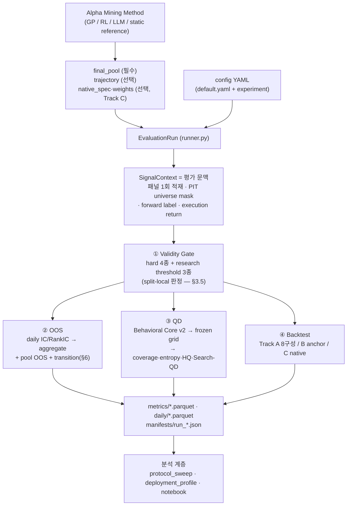

# AlphaSearchBench (ASB) — Framework Design v2

> **문서 성격: framework-level normative specification.** 본문은 **축을
> 넘는 공통 계약(cross-axis contract)** 을 선언하고, 각 축의 정의·수식·
> 파라미터는 컴포넌트 문서가 정본이다. 현행 구현의 충족도는 절 말미
> annotation과 §12로만 기술한다 — 코드 인용(파일:줄)은 충족도의 증거이지
> 사양의 근거가 아니다.
>
> **정본 5문서** (본 문서는 이들을 재정의하지 않는다):
> `validity_gate_design.md`(축 ①) · `oos_test_design.md`(축 ②) ·
> `qd_test_design.md`(축 ③ 집계 프로토콜) · `QD_Descriptors_v2.md`
> (behavioral descriptor, Core v2 Frozen 2026-08-20) ·
> `backtest_design.md`(축 ④).
>
> **계약 버전: `ASB-P1.0-spec` (동결 2026-08-21).** 버전 사다리:
>
> | 버전 | 의미 |
> |---|---|
> | **`ASB-P1.0-spec`** | **계약 명세 동결 — 현재 상태.** 규범 문구·사전등록 값·exact schema가 고정된다. Deferred 실현값(§13.1)은 아직 비어 있어도 성립 |
> | `ASB-P1.0-rc1` | 구현 + VALID calibration + freeze blocker 전항 통과 후, **TEST 직전**에 문서·코드·config·bundle hash를 고정한 상태 |
> | `ASB-P1.0` | `rc1`과 **동일 hash**로 TEST를 1회 실행한 경우에만 승격 |
>
> **`ASB-P1.0` 명칭을 지금 사용하지 않는다.** TEST 이후 규범·파라미터·코드를
> 변경하면 기존 결과는 confirmation evidence가 아니라 **development
> evidence로 격하**된다(§3.8).
>
> 작성 2026-08-20, 계약 동결 2026-08-21. 선행판 `ASB_design.md`(v1)는
> **구현 실측 기술 문서**로 보존되나, 계약 층위의 정본은 본 문서다(v1과
> 어긋나는 서술은 §14의 delta 표를 따른다).

---

## 0. 소관 경계와 상태 어휘

### 0.1 본 문서가 소유하는 것 / 소유하지 않는 것

| | 범위 |
|---|---|
| **소유(정의 원본)** | 축 공통 계약 — **실체·식별자 모델(§3.1 + 부록 A의 exact schema)**, protocol version 소유권, split protocol·purge/embargo·report window, undefined/missingness 규약, eligibility·failure state machine, pool 객체 3층, 분석 단위·Q4 estimand·판독 규율, evidence class와 temporal audit, **output inventory와 logical primary key(§10.2)** |
| **소유하지 않음(요약 + 포인터)** | 각 축의 지표 정의·수식·임계·acceptance test. behavioral descriptor 정의. Track A/B/C 배치 명세 세부 |

> **owner 승격 기록 (2026-08-20 결정 / 2026-08-21 반영 완료).**
> `oos_test_design.md` §7이 "공통 identity 문서가 생기면 본 절은 참조로
> 대체한다"고 스스로 **잠정 owner**를 선언해 두었고,
> `oos_test_design.md` §5.5와 `validity_gate_design.md` §5는
> empty-universe coverage 규약의 확정을 공통 문서에 위임해 두었다. 본
> 문서가 그 owner를 승계하고, **4개 컴포넌트 문서의 해당 문구를 본 문서
> 참조로 교체하는 편집까지 완료**했다(§14.3). 이로써 컴포넌트 간 공통
> 계약 참조의 순환(validity ↔ oos)이 제거되고 의존성이 단방향이 되었다.

### 0.2 상태 어휘 (4문서와 통일)

`qd_test_design.md` §1의 어휘를 프레임워크 정본으로 채택한다.

| 값 | 의미 |
|---|---|
| **Implemented** | 현행 구현이 본 사양을 충족 |
| **Proposed** | 본 문서(또는 컴포넌트 문서)가 **사양으로 채택**했으나 구현 변경 필요 — "미결정 제안"이 아니다 |
| **Not implemented** | 사양은 정의됨, 대응 구현 전무 |
| **Deferred parameter** | 사양(결정 절차·freeze 시점)은 규정되었고 **값만** pre-test runbook / protocol manifest가 채우는 항목 (§13.1) |

**Legacy는 status가 아니다** — 비규범 보존 경로에는 `Implemented` +
**classification tag = legacy / non-normative**를 부여한다(예: PCA
projection 경로).

**v1 기호와의 매핑**: v1의 ✅ → Implemented / ❌ → Not implemented /
⚠ → Implemented + §12 결함 대장 등재 / 📓 → Implemented(notebook 계층,
ASB 코어 아님).

---

## 1. Overview

### 1.1 한 문장

> 서로 다른 Formula Alpha Mining 방법이 생성한 alpha pool과 탐색 궤적을
> **동일한 데이터·universe·split·metric 정의·identity 규약·포트폴리오
> 규칙** 아래에서 비교하기 위한 공통 평가 프레임워크.

### 1.2 왜 각 논문의 자체 결과를 그대로 비교할 수 없는가 — 식별 문제

공표되는 성능은 곱이다:

```
발견한 수식 집합(pool) × 결합 방법(combiner) × 포트폴리오 규칙
                       × 비용 가정 × 실행 시맨틱
```

각 연구가 뒤의 네 요소를 자율적으로 고르므로 최종 수익만 비교하면
**pool 품질과 배치 기계의 품질이 식별되지 않는다.** 여기에 데이터·
universe·기간·IC 정의(Pearson/Spearman, ±inf 처리, 최소 관측 수)의 차이가
겹친다. 실측 예: 원조 AlphaEval 계보의 IC는 ±inf 셀을 corr에 포함시켜 그
날을 NaN으로 만들고 NaN 과반이면 0.0을 반환하는 반면, ASB는 inf를 invalid
cell로 제외하고 병리 상태를 NaN + `invalid_reason`으로 보고한다
(`oos_test_design.md` §5.3, `oos/metrics.py:12-15`).

ASB의 설계 목표는 이 곱을 **분해**하는 것이다: pool을 고정하고 배치를
표준화하거나(Track A), 배치를 원 명세로 두고 native 배치 전체의 시스템
거동을 기술한다(Track C — `backtest_design.md` §1.2·§9).

### 1.3 ASB가 하는 것 / 하지 않는 것

* ASB는 **evaluator다. mining algorithm이 아니다.** 후보를 생성하거나
  fitness로 선택하지 않는다 — `alphasearchbench/`에는 탐색 루프가 없다.
* GP·RL·LLM 등 miner는 (a) 최종 pool, (b) 선택적으로 전 후보 궤적을
  제출하고, ASB는 이를 **동일 계약**으로 읽어 4축으로 채점한다.
* ASB 지표는 마이닝에 되먹임되지 않는다. 공유되는 것은 **orientation
  규약(train-side sign)** 과 데이터·직렬화 계층뿐이다(GP 측 경계 문서:
  `Vanilla_GP_v2.md` §7).
* 주장 문구는 층위를 따른다: "방법 A가 B보다 우수하다"가 아니라 "동일
  표준 배치 아래에서 A의 pool이 B의 pool보다 높은 downstream 유용성을
  보였다"(`backtest_design.md` §1.4).

### 1.4 네 축이 답하는 질문

| 축 | 질문 | 모듈 | 정본 문서 |
|---|---|---|---|
| ① Validity | 이 factor를 **평가해도 되는가**(evaluation eligibility) | `validity/` | `validity_gate_design.md` |
| ② OOS | 미래 구간에 **예측 신호가 존재하는가** | `oos/` | `oos_test_design.md` |
| ③ Quality-Diversity | **어떤 종류**의 alpha를 **얼마나 넓게** 탐색했는가 | `qd/` | `qd_test_design.md` + `QD_Descriptors_v2.md` |
| ④ Portfolio Backtest | 포트폴리오로 만들면 **downstream 유용성**이 있는가 | `backtest/` | `backtest_design.md` |

축의 책임은 겹치지 않는다: OOS는 예측 관계, QD는 행동적 다양성, Backtest는
거래 가능한 성과다. 비용·회전·포트폴리오 규칙은 Backtest 소관이고, 성능
지표의 우열 판정은 Validity 소관이 아니다.

### 1.5 용어 분리 (계약)

같은 단어가 여러 대상을 뜻하면 계약이 조용히 갈라진다. 아래 구분을 5문서가
공유한다.

| 금지/모호 | canonical 용어 |
|---|---|
| `run` | **`mining_run_id`**(탐색 실행) / **`evaluation_run_id`**(ASB 평가 실행). "run 단위 분석"은 **submission 단위**를 뜻한다(§3.7) |
| `pool` | **`factor_set`**(제출 집합) / **`pool_construction`**(combiner 적용) / **`deployment`**(배치 규칙 적용) — 3층(§3.6) |
| `seed` | **`mining_seed`** / **`pfs_seed`** / **`draw_seed`** / **`bootstrap_seed`** — namespace 분리 |
| "구성"·"cell" | Track A의 배치 좌표는 **cell** = `pool_id × deployment_config_id`(8개). "8구성"은 동일 대상의 구어이며 규범 서술에서는 **cell**을 쓴다 |
| "제외" | owner 4층(factor / submission / pool / track)으로 구분(§3.5.3) |
| `candidate` | `factor_set_id`가 식별하는 **gate 이전** 집합(§3.1.4). gate 통과분은 `gate_pass_components` |

---

## 2. Architecture & Evaluation Flow

### 2.1 진입점과 단계

```bash
python -m alphasearchbench evaluate \
  --config configs/examples/csi800_ref.yaml \
  --input <final_pool.csv> [--trajectory <traj.jsonl>] [--weights <w.json>] \
  --method <label> --seed-id <seed> --out <dir>
```

서브커맨드 5종(`cli.py:36-40`)과 실행 단계(`runner.py:483`):

| 커맨드 | 단계 |
|---|---|
| `evaluate` | validity → oos → qd → backtest |
| `oos` / `qd` / `backtest` | validity → 해당 축 |
| `validity` | validity |

**validity는 항상 먼저 실행되고 이후 모든 축이 그 판정을 소비한다.**

### 2.2 흐름



### 2.3 모듈 지도

| 경로 | 역할 |
|---|---|
| `cli.py` | 인자 파싱 → `EvaluationRun` → 단계 실행 |
| `config.py` | `configs/default.yaml` deep-merge, `splits()` 검증 |
| `runner.py` | `EvaluationRun` — 입력 로드·게이트·4축 오케스트레이션·manifest |
| `data/qlib_bootstrap.py` | qlib init (재-init 차단, qlib 자체 캐시 **비활성** — `:27`) |
| `data/qlib_provider.py` | `FormulaEngine` — 패널 적재·수식 파서·연산자 의미론 |
| `data/universe.py` | PIT 멤버십 마스크 + `universe_hash` |
| `data/labels.py` | `forward_return`(:31-35), `execution_return`(:38-50) |
| `data/signal_context.py` | split별 문맥, 2단 신호 엔진, orientation, 결합 신호, 레짐 |
| `validity/` | `compute_validity_stats`(15키), `ValidityGate` |
| `oos/` | `masked_daily_corr`, `aggregate_ic`, `OOSEvaluator` |
| `qd/` | descriptors · projection(legacy) · grid · diversity(DE) · rre · pfs · trajectory |
| `backtest/` | `simple.py`(LS), `qlib_native.py`(long-only), `metrics.py` |
| `outputs/writer.py` | 표준 디렉토리 · parquet(→pickle 폴백) |
| `manifest.py` | 재현 스탬프 |
| `scripts/` | `protocol_sweep.py`, `deployment_profile.py`, `pool_rarefaction.py`, `manifest_to_report_table.py` |

### 2.4 Multi-split orchestration (계약 — v2 소유)

네 축의 정본 문서가 **모두** split별 실행을 요구하므로, run 오케스트레이션
계약을 여기서 단일화한다.

```
VALID  ── calibration 전용 ──▶ QD grid edge·τ_q freeze (qd §2.4)
                              backtest deployment calibration (backtest §6.1)
                              OOS primitive run_oos(valid) (oos §7)
                              Search-QD primary (qd §7.2)
TEST   ── frozen spec 1회 ──▶ 전 축의 최종 보고. 재적합·재선택 금지
```

**요구 사항 (전부 Proposed)**:

1. run은 **동일 evaluation context에서 valid·test 두 primitive를 실행**할 수
   있어야 한다(OOS transition의 전제 — `oos_test_design.md` §7).
2. **validity는 평가하는 split마다 판정**한다(§3.5).
3. QD는 VALID에서 calibration 산출물(edge·τ_q·reference)을 만들고 TEST에서는
   적용만 한다.
4. Backtest는 calibration(validation) 창에서 부분표본 선택·배치 파라미터·
   부호 진단만 수행하고 test는 보고 전용이다.
5. **TEST는 split 1회 평가 + report window 2종 집계**다(§3.3.3) — signal
   panel과 Validity Gate는 1회, `primary_full`·`strict_untouched`는 저장된
   daily에 대한 **날짜 필터 집계**이며 window별 재평가·재보정이 없다.

**충족도**: 현행은 `run_validity`/`run_oos`/`run_backtest`가 모두
`split: str = "test"` 기본값으로 호출되고(`runner.py:131`, `:156`, `:449`),
`run_qd`는 split 인자가 없이 내부에서 valid/test descriptor 쌍을
계산한다(`runner.py:194`). CLI에 `--split` 플래그가 없어 다른 split 평가는
`scripts/protocol_sweep.py --split` 경유만 가능하다. 즉 **2-split
orchestration은 미배선**이다. — *Implementation status: Proposed*

---

## 3. Common Contracts (v2 소유)

### 3.1 실체·식별자 모델 (entity & identity model)

식별자를 나열하지 않고 **6 dimension + evaluation/budget key**로 구조화한다.
하나의 ID가 여러 층위를 겸하면 어느 층위의 질문에도 정확히 답하지 못하므로,
각 ID는 **정확히 하나의 질문**에만 답한다. 모든 출력 테이블의 primary key와
join cardinality는 이 모델에서 파생된다(§10.1).

**ASB Canonical Serialization v1 = RFC 8785 JSON Canonicalization Scheme
(JCS).** 모든 identity 해시 입력은 JCS canonical bytes이며 다른
serialization은 허용하지 않는다 — UTF-8, deterministic key ordering,
whitespace 없음, canonical number representation(부동소수 weight가 해시
입력에 들어가므로 `0.1`과 `1e-1`이 다른 해시를 내면 안 된다). 단순 문자열
concatenation은 금지한다(`"ab"∥"c"` = `"a"∥"bc"` 모호성). 내부 serializer의
출력은 RFC 8785와 **byte-for-byte 동일**해야 한다. 해시 출력 표기는
**lowercase hex SHA-256**으로 고정한다. **exact payload schema·canonical
예시·golden hash는 부록 A**가 정본이며, 컴포넌트 문서는 이를 재정의하지 않고
참조만 한다.

#### 3.1.1 6 dimension

| # | dimension | payload 요지 | 답하는 질문 |
|---|---|---|---|
| **D1** | `submission_id` | `submission_schema_version`, method, `mining_run_id`, `mining_seed`, 입력 artifact digest(**byte-level**) | 누가 제출했는가 |
| **D2** | `factor_set_id` | `factor_set_schema_version`, 정렬된 canonical `formula_id[]` — **split-local gate·combiner 이전** | 무엇을 제출했는가 |
| **D3** | `pool_id` | `pool_schema_version`, `pool_scope`, `construction_input_id`, combiner, `combiner_params`, `weight_source`, `ordered_resolved_weights`, `weight_normalization_policy`, `float_serialization_policy`, `active_components` | 어떻게 결합했는가 |
| **D4** | `deployment_config_id` | `deployment_config_schema_version`, track, engine, selection, fraction/topk, `rebalance_days`, cost rate, turnover 정의, execution enum, gross exposure (+Track B/C: native spec digest·model artifact digest·refit policy·`native_seed`) | 어떻게 배치했는가 |
| **D5** | `evaluation_context_id` | §3.1.6 — **공통 평가 기반만** (split selector 제외) | 어떤 데이터·규약인가 |
| **D6** | `report_window_id` | `report_window_schema_version`, label(`primary_full`\|`strict_untouched`\|`valid_full`), `window_start`, `window_end` | 어느 구간을 보고하는가 |

#### 3.1.2 Evaluation / budget key (dimension 아님)

```
formula_id      = SHA256(JCS({ canonicalization_version,
                               expression_semantics_version,
                               canonical_formula }))
raw_failure_key = SHA256(JCS({ canonicalization_version,
                               expression_semantics_version,
                               raw_submitted_expression }))
evaluation_key  = formula_id       (canonicalization 성공)
                | raw_failure_key  (실패)     ← row key·cache·dedup 단위
proposal_event_id = SHA256(JCS({ proposal_schema_version, mining_run_id,
                                 proposal_ordinal, raw_expression,
                                 retry_provenance }))
```

`evaluation_key`를 도입하는 이유: `formula_id = null`을 row key로 쓰면
canonicalization 실패 행이 **전부 하나의 key로 충돌**한다. 실패 행도
`raw_failure_key`로 유일해진다. budget 계수 규약은 §7.4.

#### 3.1.3 `formula_id` — semantic identity

* `canonical_formula`는 **syntactic canonical form**이다 — algebraic
  simplification(A+B ↔ B+A 동일화)을 하지 않는다.
* **`expression_semantics_version`**(= 입력 계약의 `dsl_version`)을 payload에
  포함한다: 같은 canonical 문자열이 DSL 버전에 따라 다른 의미를 가지면 서로
  다른 대상이 같은 ID를 얻는다.
* **canonical renderer의 문법 범위 (계약)**: renderer는 **ASB가 허용하는
  전체 expression grammar**를 지원해야 하며 그 범위를 `FormulaEngine`
  파서의 범위와 **분리**한다. 두 엔진 중 qlib-native만 평가할 수 있는
  문법(§4.2)이 canonicalize되지 않으면 그 formula는 canonical 평가에서
  배제되는데, 이는 **엔진 선택이 admission을 좌우하는** 결과이므로 허용하지
  않는다. **operator parity suite는 freeze blocker**다(§13.3).
* canonicalization 실패의 canonical reason은
  **`identity_canonicalization_failed`**(owner = factor, stage = identity —
  §3.5.3)이며 **`formula_eval_failed`로 분류하지 않는다** — 후자는 신호 계산
  실패이고 전자는 identity 부여 실패로 조치가 다르다(renderer 확장 vs 입력
  수정). raw formula는 audit field로 보존한다.
* gate 탈락(계산은 되지만 기준 미달)은 `formula_id`를 정상 부여받는다 —
  평가에서 빠지는 이유는 ID 부재가 아니라 `valid = False`다.

#### 3.1.4 `factor_set_id` — 제출 집합의 content identity

* **모집단 = canonicalizable + canonical dedup된 제출 formula 전체,
  split-local gate와 combiner eligibility 이전.** gate 결과는 해시에
  들어가지 않는 `gate_pass_components`(split별 목록)로 관리한다.
* 따라서 **동일 제출물은 VALID·TEST·Full·Strict에서 같은 `factor_set_id`를
  갖는다.** **전원 gate 탈락에도 원래 `factor_set_id`를 유지**한다 —
  "무엇을 제출했는데 전부 탈락했는가"가 추적 목적이므로 제출 내용을 지우면
  목적과 모순이다.
* payload는 **정렬된 candidate `formula_id` 집합만**이다 —
  method/`mining_run_id`/seed·입력 파일 provenance는 **넣지 않는다**. 서로
  다른 method가 동일 집합을 제출하면 같은 ID를 갖는다(중복 제출 탐지에
  유용한 **의도된 성질**). provenance는 D1이 담당한다.
* **`factor_set_id`는 content key이며 row key가 아니다** — 단독으로 join하면
  다대다가 된다(§3.7·§10.2).
* `evaluation_key = raw_failure_key`인 후보는 factor_set에 들어갈 수 없다.
  **전원 canonicalization 실패**인 경우에만 빈 집합의 deterministic ID가
  정당하며, 이때 pool 행은 만들지 않는다(§3.5.3 owner = submission).

#### 3.1.5 `pool_id` — construction identity와 scope

```
pool_id = SHA256(JCS({ pool_schema_version,
                       pool_scope,             # full_factor_set | rarefaction_draw
                       construction_input_id,  # factor_set_id | draw_id
                       combiner, combiner_params,
                       weight_source,
                       ordered_resolved_weights,  # [{formula_id, resolved_weight}, …]
                       weight_normalization_policy,
                       float_serialization_policy,
                       active_components }))      # 정렬된 formula_id 목록
```

* signal-equivalence hash가 아니라 **canonical construction identity**다
  (provenance-first): 결과 신호가 같아도 combiner 정책이 다르면 다른 ID다.
* **resolved weights를 payload에 포함하는 이유**: `active_components`
  (membership)만 commitment하면 **같은 active 집합에 서로 다른 external
  weight를 적용한 두 pool이 같은 ID를 얻는다**. `ordered_resolved_weights`
  대신 digest를 쓸 수 있으나 그 경우 정렬 기준과 부동소수 직렬화 규칙이
  부록 A에 있어야 한다.
* **`pool_scope`**: `full_factor_set`(base Final-Pool) /
  `rarefaction_draw`(§0 rarefaction sub-pool = `rarefaction_pool_id`).
  **"Full/Strict에서 `pool_id` 동일"은 `full_factor_set` scope에만 적용**
  된다 — rarefaction draw는 window별로 다르므로 ID도 다르며 이는 의도된
  동작이다(§3.3.3).
* `rarefaction_draw` scope pool은 provenance로만 계산하며
  `*_pool_metrics`에 행을 만들지 않는다(rarefaction 결과는 전용 테이블 —
  §10.1).
* ⚠ 이 payload는 `pool_schema_version` bump를 동반한다 — 기존 산출물의
  `pool_id`와 값이 달라지므로 버전 간 직접 비교가 불가능하다.

#### 3.1.6 `evaluation_context_id` — 공통 평가 기반만

```
context ⊇ { dataset/bundle identity, universe, calendar,
            전체 train/valid/test split 날짜,
            label definition, canonical expression semantics,
            validity/admission config + validity_protocol_version,
            numerical policy }
            # 현재 평가 중인 split selector(valid|test)는 제외
```

* **축별 protocol version은 context에 넣지 않는다** — 넣으면 QD descriptor
  버전만 바꿔도 validity 행 identity와 OOS cache가 함께 무효화되어, 의존성
  축소 목표와 정반대가 된다. 축 버전은 해당 축의 key/PK가 담는다(§3.2).
* `validity_protocol_version`은 **공통 admission 기반을 규정하므로 context
  payload의 구성요소**다(단순 "소비 선언"이 아니다).
* split selector를 제외하는 이유는 같은 실험의 valid·test primitive가
  `(context_id, split)`으로 정확히 짝지어져야 하기 때문이다.
* 전체 버전 commitment은 별도 **`run_manifest_id`**(§3.2)가 담당한다.

#### 3.1.7 `report_window_id`

* payload = schema version + label + `window_start` + `window_end`.
  **`n_days`를 해시하지 않는다** — 거래 캘린더에 종속되기 때문이며, 거래일
  수는 결과·manifest에서 **검증**한다(§3.3.3).
* label 3종: `valid_full`(VALID은 window 1개) / `primary_full` /
  `strict_untouched`.

#### 3.1.8 파생 identity

| ID | 소관 | 요지 |
|---|---|---|
| `grid_id` | qd | **공간 geometry identity** — descriptor pair + axis order + resolution + frozen edges/range + `grid_reference_id` + grid schema version. **metric을 포함하지 않는다** |
| `qd_metric_id` | qd | {Coverage \| Entropy \| HQCoverage \| max/top-k share \| NN …} + metric protocol/version. grid와 섞으면 grid geometry를 재사용할 수 없다 |
| `grid_reference_id` | qd | reference population 구성 rule + 정렬된 formula_id 집합 + D5 + calibration split + descriptor version + binning rule + **산출된 edge vector** |
| `quality_reference_id` | qd | quality reference 구성 rule + 정렬 집합 + D5 + split + quality metric·horizon + threshold rule + **실현된 \(\tau_q\) 값**·quantile method·algorithm version |
| `analysis_frame_id` | 공통 | rarefaction 분석 frame(eligibility 단계·window·protocol version)의 identity |
| `draw_id` | 공통 | `draw_schema_version`, `analysis_frame_id`, D6, eligibility protocol/version, PRNG algorithm/version, 정렬 membership digest, requested k, selected ids, replicate, `draw_seed` |
| `run_manifest_id` | 공통 | 한 run의 **전체 버전·설정 commitment** |

#### 3.1.9 Active set의 단일 정의 (세 축 공통)

\[
\text{Active} = \{\, i : i\ \text{eligible} \;\wedge\; w_i \neq 0 \,\}
\]

`active_components`(D3 payload) · `n_active_factors` ·
SupportCount/`zero_support_ratio`의 k 범위가 **모두 이 집합**을 쓴다.
`factor_set_id`가 식별하는 candidate 집합은 dedup 후 eligibility 전 전체이므로
external weight = 0인 component도 포함한다.

**충족도**: canonical renderer가 없어 identity 계층 전체가 미도입이다
(§12 결함 #26). — *Implementation status: Not implemented*

### 3.2 Protocol version 소유권 (계통)

버전은 **포함 관계가 아니라 병렬**이며, **각 버전은 자신이 지배하는 산출물의
key/PK에 노출**된다. 축 버전을 공통 context에 몰아넣지 않는 이유는 §3.1.6에
있다. 개수를 문장으로 세지 않는다 — **아래 목록이 정본**이다.

| 버전 필드 | 지배 범위 | key/PK 노출 위치 | 정본 |
|---|---|---|---|
| `validity_protocol_version` | hard reason 집합 · 15키 통계 정의 · 비교 술어 semantics | **D5 payload 구성요소** | 본 문서 §3.1.6 + validity 문서 |
| `canonicalization_version` | canonical formula renderer | `formula_id`·`raw_failure_key` payload | 본 문서 §3.1.2 |
| `expression_semantics_version` | 입력 DSL 의미론(= 입력 계약의 `dsl_version`) | 〃 | 본 문서 §3.1.3 |
| `oos_protocol_version` | pair masking·aggregate·coverage·min-pair semantics | **OOS metric/daily/transition PK** | `oos_test_design.md` §7 |
| `descriptor_protocol_version` | behavioral descriptor 정의 | QD per-alpha·daily intermediate PK | `QD_Descriptors_v2.md` |
| `qd_protocol_version` | QD 집계 프로토콜(grid·quality overlay·Search-QD) | QD summary PK (또는 `grid_id` 경유) | `qd_test_design.md` §2.3 |
| `draw_protocol_version` | rarefaction sampling 프로토콜 | rarefaction 결과 PK | 본 문서 §3.1.8 |
| `backtest_protocol_version` | 백테스트 계산 semantics(회전·비용·지표) | **backtest deployment/profile/daily PK** | `backtest_design.md` |
| `profile_protocol_version` | profile 집계식·8-cell 구성·누락 cell 정책 | backtest profile PK | `backtest_design.md` §4 |
| `protocol_version` | 배치 프로토콜 전체(Track A/B/C 구성·규칙) | manifest | `backtest_design.md` §13 |
| `pool_schema_version` · `factor_set_schema_version` · `submission_schema_version` · `deployment_config_schema_version` · `evaluation_context_schema_version` · `report_window_schema_version` · `proposal_schema_version` · `draw_schema_version` · `analysis_frame_schema_version` · `grid_schema_version` · `qd_metric_schema_version` · `grid_reference_schema_version` · `quality_reference_schema_version` · `run_manifest_schema_version` | 해당 ID payload 스키마 | 각 ID payload | 본 문서 §3.1·부록 A |
| `canonical_serialization` | 고정값 `"RFC8785-JCS"` | manifest | 본 문서 §3.1 |

**`run_manifest_id` (계약)**: 위 전량 + 데이터·코드·설정 스냅샷을 하나로
commitment하는 ID. 축별 버전을 PK에 노출하는 것과 **중복이 아니다** — PK
노출은 "같은 PK에 다른 semantics 결과가 들어가지 않게" 하고,
`run_manifest_id`는 "이 run 전체가 어떤 규약 아래 산출됐는가"를 한 값으로
감사하게 한다. 저장 위치는 `run_manifest` 테이블(§10.1).

> **버전 대안 문구 금지**: "축별 `*_result_id`로 감싼다" 또는
> "`deployment_config_id`가 backtest semantics를 commitment한다"는 대안은
> **채택하지 않는다**. 감사 가능성을 위해 버전 컬럼을 PK에 노출하며, 문서에
> 대안을 병기하지 않는다.

**충족도**: `manifest.py:41`이 `protocol.version`을 스탬프하되
`configs/default.yaml:100-101`이 `null`이라 기록값은 `"unversioned"`다. 그
외 버전 필드는 전부 미도입. — *Implementation status: Proposed*

### 3.3 Split protocol · purge · embargo

#### 3.3.1 C-0 확정 split (사용자 결정 2026-08-19)

정의 원본은 `Vanilla_GP_v2.md` §6이며 ASB는 이를 **소비**한다. 역할 매핑:

```
2015-01-01 ~ 2021-12-31   train / mining window
                          — 탐색·fitness·orientation·레짐 임계·PFS σ
2022-01-01 ~ 2023-12-31   validation / calibration
                          — QD grid·τ_q freeze, 배치 캘리브레이션,
                            부호 진단. candidate fitness 불개입, test 미참조
2024-01-21 ~ 2026-06-30   test (동결)
                          — freeze 후 1회 평가. 보고 전용
```

**판독 규칙 (사전 등록)**: test 보고는 두 구간을 **병기**한다 —
**Primary Full OOS** = 2024-01-21~2026-06-30(표본 확보용 주 구간),
**Strict Untouched Subset** = 2025-01-21~2026-06-30(번들 구성상 미접촉).
전반부(2024-01-21~2025-01-20)는 v1 development(구 test 2021–2024) 관측과
겹치는 **부분 오염** 구간이므로 전체 test를 "완전 untouched"라 서술하지
않는다.

**원칙: 선택은 calibration에서, 보고는 test에서.** test 구간에서의 어떤
파라미터·구성·부분집합·임계 선택도 금지한다.

#### 3.3.2 Purge / embargo와 post-end 참조의 층위 (X2 — 축 간 충돌 해소)

`backtest_design.md` §6.2는 "각 분할의 마지막 h 거래일 절단(purge)"을
요구하고, `oos_test_design.md` §5.2는 "평가 구간 마지막날 label의 post-end
가격 참조 허용(`label_uses_post_end_price`)"을 규정한다. 두 규정은
**분할 경계에서 직접 충돌**한다. 경계를 층위로 분리해 해소한다:

| 경계 | 규약 | 근거 |
|---|---|---|
| **train → validation** | label tail exclusion(train 마지막 h 거래일을 fitness label에서 제외) — **miner 소관**, GP v2에서 구현 완료(`evaluator.apply_label_tail_exclusion`, manifest 스탬프) | train-only 계약의 정확한 준수 |
| **validation → test** | **purge 필수** — validation 말미 h 거래일의 label이 test 구간 가격을 참조하지 않아야 한다. calibration 산출물(edge·τ_q·부호 진단)이 test 정보에 의존하는 채널을 차단 | §3.3.1의 "선택은 calibration에서" |
| **test → 데이터 끝** | **post-end 가격 참조 허용** — 보호할 후속 구간이 존재하지 않으므로 leakage가 아니다. `label_uses_post_end_price`로 기록(`manifest.py:55`) | `oos_test_design.md` §5.2 (post-end 관측은 **target construction 전용**) |

**`max_lookahead` (계약 — 단일 정의)**:

```
max_lookahead = manifest에 등록된 모든 future_reference_offset의 최댓값
```

label horizon·QD Performance-Response horizon·execution lag을 **직접
열거하지 않는다** — 새 label consumer가 추가돼도 누락되지 않게 하기 위해
"미래를 참조하는 모든 offset을 manifest에 등록"하는 쪽을 계약으로 삼는다.
현행 파이프라인 기준 최댓값은 **20 거래일**(`qd.horizons` 최대; primary
label horizon은 1, `next_open_oo` execution lag은 2)이다.

**`max_lookahead_cap` (사전등록 — 확정 2026-08-21)**:

```
max_lookahead_cap = 20 trading days
```

현행 primary/additional horizon의 최댓값과 execution lag을 포괄하는
**프로토콜 상한**이다. **`max_lookahead > cap`인 label·descriptor·execution
config는 거부**한다 — `oos.horizons`는 상한 없는 양의 정수를 허용하므로
(`oos_test_design.md` §4.1) `[60]` 같은 설정이 embargo를 무의미하게 만들 수
있다. 더 긴 horizon을 허용하려면 **protocol version을 bump**한다.

> **cap을 곧바로 전 run의 purge 폭으로 쓰지 않는다**: 실제 purge와 terminal
> buffer는 **각 config의 realization date를 거래일 캘린더로 계산**해 정한다
> (아래 purge 판정). cap은 "이 이상은 받지 않는다"는 상한일 뿐이다.

**purge 판정은 거래 캘린더 기준이다 (계약)**: "각 split의 마지막 h행 절단"이
아니라 **signal date의 target realization date가 다음 protected split에
진입하는지**를 거래 캘린더로 판정한다 — VALID label의 realization date가
TEST 시작일 이상이면 그 signal date를 제외한다. calibration 단계의 backtest
outcome을 선택에 사용한다면 execution lag에도 동일 판정을 적용한다.

> **C-0에서의 실제 여유 (중요)**: validation 종료(2023-12-31) ↔ test
> 시작(2024-01-21) 사이에는 약 3주의 자연 gap이 있다. 이는 거래일 기준
> **약 14 거래일**(2024-01-02~01-19, 번들 캘린더 실측은 배선 시 acceptance
> 항목)이므로 — **primary label horizon h=1은 충분히 확보되지만 20 거래일
> embargo는 충족되지 않는다.** 따라서 VALID에서 horizon-20 supplementary
> 지표(QD Performance-Response)를 산출한다면 **valid 측 purge가 여전히
> 필요**하다. `Vanilla_GP_v2.md` §6 caveat 4의 "경계는 이미 embargo가
> 확보돼 있다"는 서술은 h=1 기준에서 성립하는 것으로 읽어야 한다.

**Right buffer는 거래일 기준이다 (계약)**. purge/embargo와 buffer는 같은
계산의 양쪽 끝이므로 단위가 달라서는 안 된다. 요구 사항:

1. **거래일 단위** — 현행 구현은 `pd.Timestamp(panel_end) +
   pd.Timedelta(days=right_buffer_days)`로 **캘린더 일수**를 더하므로
   (`data/qlib_provider.py:189`, `configs/default.yaml:14`의 기본값 20)
   휴장이 많은 구간에서 실제 확보 거래일이 요구량보다 적어진다 — 이것이
   §12 결함 #1의 근본 원인이다. buffer는 **거래 캘린더에서 세어** 확보한다.
2. **`buffer ≥ max_lookahead`** — `next_open_oo`는 t 신호에 대해 **t+2
   시가**를 필요로 하므로(§4.3) execution lag이 `max_lookahead`에 등록된다.
   label horizon만으로 buffer를 잡으면 TEST 말미의 **execution return이
   조용히 NaN**이 되고, 그 날들은 `n_missing_returns`로만 남아 손익 0으로
   흡수된다.
3. **manifest 기록** — 적용 여부, purge 거래일 수, buffer 거래일 수, 실제로
   참조한 가격 구간의 마지막 날짜를 기록한다(§10.2).

**`label_uses_post_end_price`의 적용 범위 축소 (계약)**: 이 플래그는
**terminal TEST extension 전용**이다 — 즉 "이미 고정된 TEST 구간의
target/execution realization을 완성하기 위해 데이터셋 종료 이후 가격을
참조했다"는 사실만 표시한다. **내부 경계(TRAIN→VALID, VALID→TEST)에서는
이 플래그로 post-end 참조를 정당화할 수 없다** — 그 경계는 purge 대상이다.
`oos_test_design.md` §5.2의 "평가 구간 마지막 날짜"는 이 범위로 읽는다.

QD Behavioral Core v2는 **label-free**이므로 core 4축은 purge 대상이
아니다(`QD_Descriptors_v2.md` §2, `backtest_design.md` §6.2).

**충족도**: purge/embargo 경로가 ASB 코어에 없다.
— *Implementation status: Not implemented*

#### 3.3.3 Report window = aggregation slice (계약)

TEST split 안에 두 보고 구간이 있다(§3.3.1). 이는 **재평가 단위가 아니라
집계 슬라이스**다.

**불변식**:

1. **TEST signal panel은 1회만 계산**한다.
2. **TEST Validity Gate도 1회만 수행**한다.
3. `factor_set_id`와 `pool_id`(scope = `full_factor_set`)는 **Full·Strict에서
   동일**하다.
4. window는 **이미 산출된 daily observation의 날짜 필터**이며,
   metric·descriptor·backtest **집계만** window별로 재계산한다.
5. **window-local gate 재수행 금지**, **window-local factor selection 금지**.
6. 두 window는 **동일한 VALID-frozen artifact**(edge·\(\tau_q\)·
   `grid_reference_id`·`quality_reference_id`)를 소비하며 **window별
   재보정을 하지 않는다**.
7. window별 `window_evaluable`·`n_days`·`n_valid_days`를 기록한다
   (`report_window_id`는 `n_days`를 해시하지 않으므로 여기서 검증한다).

**"재평가 없음"을 가능하게 하는 영구 출력 (계약)**: window 슬라이싱이
성립하려면 daily intermediate가 저장돼 있어야 한다 — `oos_daily`,
`backtest_daily`, 그리고 신규 **`qd_daily_descriptor_intermediates`**
(일별 \(B_t\)·\(T_t\)·\(A_L^Q{}_t\)·\(A_V^Q{}_t\) + leg 진단 +
\(N_t^C\)). **범위 한정**: Final-Pool 대상만이다 — Search-QD는 VALID 단일
window이므로 daily 저장 의무가 없다(§7.4 feasibility 계약 유지).

**Backtest Strict slicing semantics (계약)**: Strict는 별도 백테스트가 아니라
Full 경로의 날짜 슬라이스다 —

* Strict 시작일에 **포지션을 초기화하지 않는다**. Full 경로에서 형성된
  holdings를 그대로 승계한다.
* Strict 구간의 **daily return만** 슬라이싱한다.
* 누적수익·MDD 계산 시 NAV는 1로 rebase할 수 있으나 **holdings는 reset하지
  않는다**.
* Strict 첫날의 turnover·cost는 **Full 경로에서 실제 발생한 값**을 쓴다 —
  신규 건립 비용을 재부과하면 estimand가 바뀐다.

**판독 지위**: primary 분석은 **Primary Full만**이다. Strict는 **사전등록된
supplementary matched robustness panel**(evidence class는 §3.8.1의 audit
결과에 따르며 **C-0에서는 `protocol_held_out`**이다 — "temporal"이라는
형용사를 붙이지 않는다)이며, QD의
6 pairwise grids × Strict는 **추가 co-primary가 아니고 primary
multiplicity에 포함하지 않는다**(§3.7).

— *Implementation status: Not implemented*

### 3.4 Missingness와 undefined 규약

**불변식: undefined ≠ zero.** 평가 불가능 상태는 성능 0으로 치환하지 않고
NaN + reason으로 표현한다(legacy AlphaEval의 "병리 상태 → 0.0 반환"과의
의도적 결별 — `oos_test_design.md` §2).

| 층 | 규약 |
|---|---|
| 셀 | `valid = isfinite(signal) ∧ PIT universe`. **±inf는 셀 단위로 제외**(그날을 죽이지 않음)하고 `inf_cell_ratio`로 진단. Inf→NaN 치환 없음 |
| 일별 상관 | 유효 pair < 2 또는 분산 퇴화/비유한 → 그날 NaN. pair 0인 날도 NaN으로 시리즈에 남는다 |
| z-score | 일별 단면, **ddof=0**, 결측 → 0, `std < 1e-8 → 1.0` 치환. OOS pool·backtest combiner·QD의 B/T가 동일 커널을 쓴다 |
| 집계 | 유한 일 수 0 → mean NaN, < 2 → ICIR NaN |
| QD 지표 | \(N_{in}=0\) → entropy NaN(`no_inrange_points`), \(n_{occ}=1\) → evenness NaN(`single_occupied_cell`), quality-eligible 0 → HQ NaN(`no_quality_eligible_points`), τ_q 미설정 → NaN(`hq_not_configured`), NN eligible < 2 → NaN(`insufficient_points`) |
| Backtest | 보유 종목의 execution return이 NaN이면 당일 손익 0, `n_missing_returns` 기록. 유효 신호 전무일이면 무포지션 + `n_skipped_days` |

**empty-universe coverage = NaN (X1 — 축 간 규약 확정)**

```
|U_t| = 0  →  coverage(t) = NaN        (validity·OOS·QD 공통)
```

`validity_gate_design.md` §5와 `oos_test_design.md` §5.5가 각각 "구현은
0 / 계약은 NaN"으로 등재하고 확정을 공통 문서에 위임했다. 본 문서가
**NaN으로 확정한다**(사용자 결정 2026-08-20) — 근거는 위 불변식이며,
"universe가 비어 평가할 수 없었던 날"과 "종목은 있었는데 신호가 없어
커버리지가 0이던 날"이 같은 값을 갖는 것을 허용하지 않는다.

* 영향: OOS 측은 `n_uni = np.maximum(universe_mask.sum(axis=1), 1)` 분모
  치환을 제거해야 한다(`oos/evaluator.py:58`). validity 측
  `mean_daily_coverage_ratio`는 universe 0인 날을 0으로 집계하므로 계산
  변경이 필요하고, 이는 **판정 semantics 변경 = breaking change**다 —
  `validity_gate_design.md` §9 호환성 절차(버전 명기 + 기존 결과 재평가)를
  따른다.
* **집계 규약 (계약)**: 일별 ratio가 NaN이면 그 날을 **평균의 분모에서
  제외**한다 — `mean_daily_coverage_ratio` = **finite-day mean**이고,
  제외된 날의 수를 **`n_empty_universe_days`로 병기**한다. NaN을 0으로
  치환해 평균을 끌어내리거나, 전체 거래일을 분모로 삼아 암묵적으로 0을
  더하는 것 모두 금지한다(현행 validity 구현은 후자에 해당 — universe 0인
  날을 0으로 집계). 같은 규칙을 `valid_day_ratio`·`median_daily_*`에도
  적용한다: 통계는 정의된 날에서만 계산하고 제외 일수를 함께 보고한다.
* 파생 규약: `zero_support_ratio`(pool 진단)도 \(|U_t| = 0\)에서 NaN
  (`oos_test_design.md` §6과 동일).

**Zero 진단의 3분 (계약 — A-6의 진단 의무)**: 결합 신호의 0은 원인이 세
가지이고 서로 다른 것을 뜻한다. `combo == 0` 비교는 부동소수에서 불안정하므로
tolerance \(\epsilon_0\)(**Deferred parameter**, §13.1)를 둔다. **계수 단위는
`(date, instrument)` signal cell**이다.

| 진단 | 정의 |
|---|---|
| `n_zero_due_to_no_support` | SupportCount = 0 — 모든 component가 결측이라 "신호 없음"이 0으로 보이는 경우 |
| `n_supported_zero` | support ≥ 1이면서 \(\|combo\| \le \epsilon_0\). subreason으로 `all_components_zero` ↔ `cancellation`을 분리 |
| `n_zero_excluded` | backtest에서 그 셀이 포지션 대상에서 제외된 수 |

`n_finite_combined`·`n_nonzero_positionable`을 **동일 단위로 병기**한다. 이
네 값이 있어야 A-6(OOS의 넓은 mask ↔ backtest의 `\|combo\| > 0`)의 차이를
사후에 감사할 수 있다 — A-6는 결함이 아니라 의도된 비대칭이며(§9.3), 진단
의무만 남는다.

— *Implementation status: Proposed (validity·OOS 양측 구현 변경)*

### 3.5 Eligibility 계층과 placeholder·reason taxonomy

#### 3.5.1 Eligibility 계층

```
P_attempt  ⊇  P_evaluated  ⊇  P_behavior  ⊇  P_quality
```

`P_attempt`=모든 candidate proposal / `P_evaluated`=unique evaluation을
시도한 후보(**실패 포함**) / `P_behavior`=signal 평가 성공 + core 4종 전부
finite / `P_quality`=behavior eligible + 해당 split quality finite
(`qd_test_design.md` §2.2). Search-QD budget은 `P_evaluated`,
behavioral 지표는 `P_behavior`, quality overlay는 `P_quality`를 쓴다.

#### 3.5.2 Validity 판정의 split 지역성 (X6 — 축 간 공백 해소)

**계약: validity는 평가하는 split마다 독립적으로 판정한다(split-local).**
따라서 gate 통과 모집단은 split마다 다를 수 있고, 축별 소비 규칙은 다음과
같다.

| 소비자 | 사용하는 gate |
|---|---|
| OOS individual/pool primitive | **그 primitive의 split**의 gate |
| OOS transition | `TransitionValid = valid_valid ∧ valid_test ∧ finite(IC_valid) ∧ finite(IC_test)` (`oos_test_design.md` §7) |
| QD — VALID calibration 모집단 | **VALID** gate 통과 factor |
| QD — TEST Final-Pool 평가 모집단 | **TEST** gate 통과 factor |
| Backtest | 평가 split의 gate |

**차집합 진단 의무**: `n_gate_only_valid` / `n_gate_only_test` /
`n_gate_both`를 pool·run 수준에 기록한다. 두 모집단이 다르면 VALID
calibration과 TEST 평가의 대상 집합이 어긋나므로, 판독 시 이 수치를 함께
읽어야 한다.

**대안을 채택하지 않은 이유**: (a) 어느 split이든 하나의 gate로 고정하면 —
test gate 고정은 VALID calibration이 test 정보에 의존하게 되고, valid gate
고정은 test에서 계산 불가한 factor가 metric NaN을 양산한다. (b) 교집합만
평가하는 방식은 평가 모집단이 두 split 모두에 의존해 §3.3.1의 "test 미참조"
원칙을 깬다. split-local + 차집합 진단이 두 문제를 모두 피한다.

> **알려진 한계 (승계)**: 기본 설정에서 gate 통계가 평가 구간(test)에서
> 계산되므로 **평가 모집단이 평가 구간 데이터에 의존**한다. 성능이 아니라
> *계산 가능성*만으로 제외하므로 orientation/weight 누출은 아니지만 채널로
> 남는다(`validity_gate_design.md` §3·§9 한계 5).

#### 3.5.3 Failure state machine — owner 4층

실패 상태는 **owner(누가 실패했는가)** 와 **stage(어느 단계에서
실패했는가)** 의 조합으로 유일하게 정해진다. 하나의 상태를 두 owner에
동시에 두면(예: pool construction을 시도하지도 않았는데 pool-level reason을
붙이면) 집계와 조치가 어긋난다.

```
failure_owner ∈ { factor, submission, pool, track }
failure_stage ∈ { identity, gate, combiner, input_validation }
```

| owner | stage | reason | 처리 |
|---|---|---|---|
| **factor** | identity | `identity_canonicalization_failed` | factor 행 기록(`evaluation_key = raw_failure_key`), raw formula 보존. canonical 평가 대상 아님 |
| **factor** | gate | `formula_eval_failed:<reason>` · `all_nonfinite` · `no_correlatable_day` · `zero_ic_observations` · `research_threshold_fail:<key>` | validity 행 항상 기록. OOS·Backtest 개별 축은 계산 없이 **placeholder 행**(`valid=False`, metric NaN, `invalid_reason` non-empty). QD는 gate 통과 factor만 순회 → placeholder 없음, `n_factors_dropped_by_gate`로 집계 |
| **submission** | identity | `empty_factor_set_after_identity` — **`n_unique_factors = 0`일 때만** | **pool construction 시도 자체가 없으므로 pool-level 상태가 아니다.** `submission_evaluation_status` 1행(PK = D1 × D5 × split), `factor_set_id` = 빈 집합의 deterministic ID, **`pool_id` 없음** |
| **pool** | gate | `empty_pool_after_gate` — gate를 통과한 canonical candidate 0개 | pool-level invalid placeholder: diagnostic·identity(`pool_id`·`factor_set_id`·`n_*`·`duplicate_rate`·`weight_source`·`combiner`)는 기록, performance metric은 NaN |
| **pool** | combiner | `no_active_components` — candidate는 있으나 Active = ∅(예: `train_signed_equal`의 kept = ∅) | 〃 |
| **track** | input_validation | `malformed_external_weights` — 매핑 invariant W = C 위반 또는 non-empty all-zero external vector | **hard error, metrics 행 없음**(아래 scope 규약) |

세 pool/track 상태는 **원인 단계가 달라 상호배타**다 —
`empty_pool_after_gate`는 상류 validity의 결과,
`no_active_components`는 combiner 정책의 결과, `malformed_external_weights`는
입력 오류다. 진단 시 `n_factors_dropped_by_gate`(전자)와
`n_no_direction`(후자)을 함께 읽는다.

**Hard-error scope = consumer-scoped (계약)**: external weights를 **소비하는
track만 중단**한다. Track A는 제출 weights를 쓰지 않으므로(§3.6) Track C의
weight 오류로 Track A를 중단하지 않는다.

| 오류 | 중단 범위 |
|---|---|
| `malformed_external_weights` | 해당 **track**만 |
| `empty_factor_set_after_identity` | 해당 **submission**의 pool 평가(factor 평가는 계속) |
| config·context 오류(splits 미지정 등) | **batch** 전체 |

**Atomic write 순서 (계약)**: hard error에서도 "조용한 유실 금지"가 성립해야
하므로, **`failed_run_audit_manifest`를 먼저 기록·fsync한 뒤** non-zero
exit한다. 기록 실패가 곧 유실이므로 순서를 뒤집을 수 없다.

**단계별 카운트 의무**: `n_submitted_raw` → `n_identity_failed` →
`n_canonicalized` → `n_unique_factors` → `n_gate_pass` → `n_active_factors`,
그리고 **reason별 count**. 이 사다리가 없으면 어느 단계에서 얼마나 줄었는지
사후에 복원할 수 없다.

**필드명 통일**: 평가 불가 flag의 canonical 이름은 **`valid`(bool) +
`invalid_reason`**(+ `failure_owner`·`failure_stage`)이다.
`backtest_design.md` §8의 `evaluable=false`/`reason=`은 **deprecated
alias**다.

**identity 보존 규칙**: `pool_id`는 placeholder 행에서도 null이 아니다
(`active_components: []`를 포함한 동일 payload의 deterministic hash).
`factor_set_id`는 **gate 탈락 여부와 무관하게 원래 제출 집합의 ID를
유지**한다(§3.1.4) — 빈 집합 ID는 **전원 canonicalization 실패**인 경우에만
정당하다.

**충족도**: factor placeholder는 구현됨(`runner.py:161`, `:454`). pool
placeholder는 미구현 — 현행은 `len(pool_f) >= 1` 가드로 **기록 없이 skip**
한다. owner/stage 필드·submission 상태·카운트 사다리·scope 규약·atomic
write는 전부 구현 변경 대상. — *Implementation status: Proposed*

### 3.6 Pool 객체의 축 공통 계약 (X4)

**pool 객체는 3층이다**: 제출된 **factor 집합**(`factor_set_id`) → 결합
정책을 적용한 **construction**(`pool_id`) → 그 위에 배치 규칙을 적용한
**deployment**(`deployment_config_id`). 축별 소비 층위가 다르므로 이 분리가
필수다.

| 축·용도 | 사용하는 identity | 이유 |
|---|---|---|
| **Final-Pool QD** (§7) | **`factor_set_id`** | QD는 결합이 아니라 제출 집합의 behavioral 다양성을 측정 → combiner-independent |
| as-submitted provenance·크기 정규화(§8.2) | **`factor_set_id`** (+`submission_id`) | 같은 집합의 여러 배치 구성을 하나로 묶어 읽어야 한다 |
| OOS pool 행 | `pool_id` | 결합 신호를 재평가한 값이므로 combiner에 종속 |
| Backtest **deployment cell** 행 | `pool_id` × `deployment_config_id` | 규칙·비용까지 좌표가 되므로 combiner만으로는 식별 불가 |
| Backtest **profile** 행 | `factor_set_id` (+`profile_protocol_version`) | 8 cell을 요약한 pool 특징 벡터(§8.2) |
| Q4 primary | `factor_set_id`(+D1·D5·D6) | §3.7 |

**Track A의 좌표와 identity의 관계 (정확한 진술)**: Track A는 같은 제출 집합에
**combiner 2종 × deployment 4종 = 8 cell**을 적용한다. 따라서 하나의
`factor_set_id` 아래 **`pool_id` 2개**가 생기고, 각 `pool_id`마다
**`deployment_config_id` 4개**가 붙어 **8행**이 된다. `pool_id`는 combiner만
반영하므로 **"8 cell의 identity"가 아니다** — 8 cell은
`pool_id × deployment_config_id`로 식별된다. `deployment_config_id`에
combiner를 넣지 않는 이유도 이 분리다.

"OOS pool 행과 Backtest 행이 같은 대상을 가리킨다"는 요구는 **동일 combiner
좌표 안에서** `pool_id`가 일치해야 한다는 뜻이며, QD 행과의 연결은
`pool_id`가 아니라 **`factor_set_id`로** 한다.

**Pool pipeline (순서 고정 — `oos_test_design.md` §6)**:

```
제출 components
  → formula_id 부여
        canonicalize 실패 → evaluation_key = raw_failure_key, 집합에서 제외
                            (owner=factor, stage=identity)
  → canonical dedup
  → **factor_set_id 생성**            ← gate·combiner 이전 (§3.1.4)
  → [guard] n_unique_factors == 0 ?
        → submission_evaluation_status(empty_factor_set_after_identity) → STOP
  → split-local gate 적용 → gate_pass_components (해시에 들어가지 않음)
  → [guard] |gate_pass_components| == 0 ?
        → pool placeholder(empty_pool_after_gate) → STOP
  → combiner별 eligibility (train_signed_equal: |sic| > τ_sign)
  → [guard] Active == ∅ ?
        → pool placeholder(no_active_components) → STOP
  → weight construction (external | 1/N_unique | signᵢ/|kept|)
        → 매핑 invariant 위반 → malformed_external_weights
                                (hard error, track scope — §3.5.3)
  → **pool_id 생성**(pool_scope = full_factor_set)
  → daily z-score → combined signal → 축별 평가
```

**순서 불변식**: ① `factor_set_id`는 **gate 이전**에 생성된다 — gate 이후에
만들면 같은 제출물이 VALID·TEST에서 다른 ID를 받아 combiner-independent
submission identity라는 정의가 깨진다. ② canonical identity → dedup →
**directional eligibility → weight normalization** 순서는 뒤집을 수 없다
(`train_signed_equal`의 분모 `|kept|`가 filtering 결과에 의존). ③ 세 guard가
있으므로 0-나눗셈 경로는 존재해서는 안 된다.

**rarefaction pool**: `pool_scope = rarefaction_draw`인 construction은
`construction_input_id = draw_id`로 동일 파이프라인을 타되(§3.1.5),
`*_pool_metrics`에 행을 만들지 않고 rarefaction 전용 테이블에 기록한다
(§10.1).

**Track A 제약 (계약)**: `backtest_design.md` §8은 Track A에서 제출
`direction`·`weights`를 **사용하지 않는다**고 규정한다(metadata only).
그런데 현행 구현은 `--weights`를 pool 결합 가중으로 소비하며
(`weight_source="input"`) **OOS pool과 Backtest pool이 같은 결합 신호를
공유**하므로, `--weights`가 주어진 run에서는 **OOS pool 행도 Track A
대상이 아니게 된다.** Q4(§3.7)가 pool OOS 지표와 Track A 성과를 연결하므로
이 채널을 차단한다:

```
Track A run:  두 축(OOS pool · Backtest pool) 모두 제출 weights 무시
              combiner ∈ {raw_equal, train_signed_equal}  (허용 목록)
              → 동일 combiner 좌표에서 두 축의 pool_id 일치
              → 두 좌표는 동일 factor_set_id를 공유
Track C run:  native weights/spec 사용 — 별도 pool_id의 별도 객체
              (factor_set_id는 같을 수 있다 — 같은 집합의 다른 결합)
              Track A 프로파일·순위·primary Q4에 혼입 금지
```

**Track별 combiner 허용 목록 (계약)**: 공유 namespace가 **어떤 값을 담을
수 있는지**는 축 중립이지만 **어떤 값이 허용되는지**는 track 소관이다 —
Track A는 위 2종만, Track C는 제출 `native_spec`이 정의하는 결합만
허용하고, 그 제약은 backtest track config가 강제한다. 공유 키에 임의
combiner를 넣어 Track A로 보고하는 경로가 존재해서는 안 된다.

**Config namespace (계약)**: pool combiner·sign_threshold는 OOS와 Backtest가
공유하는 **축 중립 정책**이므로 `pool.combiner` / `pool.sign_threshold`에
둔다. 현행은 `backtest.combiner` / `backtest.sign_threshold`
(`default.yaml:105-106`)에 있고 OOS pool 평가도 이를 소비하므로
(`runner.py:177-186`) 축 분리 철학과 어긋난다 — 이동하고 기존 키는
deprecated alias로 유지한다(`oos_test_design.md` §8). `backtest_design.md`
§13 체크리스트에는 이 이동 항목이 없어 §14.3 sync 목록에 등재한다.

**필드 명명**: canonical은 **`weight_source`**(단수, `weight_fit_scope`와
짝). 현행 `weights_source`(복수)는 deprecated alias이며 두 컬럼을 동시에
신설하지 않는다.

— *Implementation status: Proposed*

### 3.7 분석 단위와 판독 규율

**분석 단위 (계약 — 용어 정밀화)**: 관측 단위는 **`D1 × D5 × D6 ×
factor_set_id` observation**이다. `run`·`pool`은 중의적이라 쓰지 않는다
(§1.5) — Track A에서 하나의 `factor_set_id`는 `pool_id` 2개와 cell 8개를
낳으므로 "pool 단위"가 곧 관측 단위가 아니고, profile 층의 grain(§8.2)이
관측 단위와 일치한다. **bootstrap·median/IQR의 resampling 단위도 이
observation**이다. 배치 구성이나 grid 종류는 반복 조건이므로
표본 수를 늘리지 않는다 — 10 pool × 8구성은 n=80이 아니라 **n=10**이고,
프로파일은 pool 하나를 요약하는 특징 벡터다(`backtest_design.md` §10).

**집계 계층 (사전등록)**: `alpha → run/seed metric → method summary`.
method 전체에서 alpha를 먼저 pooling한 뒤 metric을 계산하는 것을 금지한다
(`qd_test_design.md` §6.8).

| 대상 | central | dispersion | 구간 추정 |
|---|---|---|---|
| QD method summary | median across runs | IQR | bootstrap CI, **resampling unit = run/seed** (alpha·rarefaction draw 금지) |
| Backtest Track A 프로파일 | median Sharpe / net AnnRet | Sharpe IQR, PDR | **부여하지 않음** — 8구성은 독립 표본이 아니다 |

**paired statistic은 실험이 진짜 paired design일 때만** 쓴다 — GP seed 42와
LLM seed 42는 같은 random realization을 공유하지 않으므로 seed 번호 일치는
pairing 근거가 아니다.

**Q4 estimand와 join (X5·P0-3 — 계약)**. QD 축의 **보고 단위**와 Q4의
**가설 단위**를 분리한다. 둘을 섞으면 "6 grids co-primary"와 "사전등록된
단일 predictor"가 동시에 참인 것처럼 읽혀 join이 카티전이 된다.

| 층 | 규약 |
|---|---|
| **QD 자체 보고** | Primary Full의 **6 pairwise grids = co-primary view**. QD 축의 서술 단위이며 **Q4 가설이 아니다**. cherry-picking 금지(6개 전량 보고), `mean_pairwise_*` 같은 equal-weight 평균은 summary diagnostic 전용 |
| **Q4 confirmatory** | 사전등록된 **단일 triple `(grid_id, qd_metric_id, profile_metric_id)`** → **1:1 join**. 나머지 5 grid·다른 profile metric은 supplementary |
| 대안(택할 경우 명시) | 6개 Q4 가설을 유지하려면 **6개 별도 검정 + multiplicity correction**을 사전등록한다 |

`profile_metric_id`도 사전등록 대상이다 — `median_sharpe` / `pdr` /
`worst_sharpe` / `median_net_annret` 중 무엇이 Q4 primary outcome인지 고정한다
(**Deferred parameter**, §13.1).

**종속변수는 profile 층이다**: Backtest 출력을 **deployment cell 층**과
**profile 층**으로 분리하고(§10.1) Q4는 profile 층을 쓴다 — cell 층을 쓰면
QD 1행에 8행이 붙는다.

**`q4_estimand_status` (단일 규범 — 확정 2026-08-21, 사용자 결정)**:

```
q4_estimand_status    = selected_k        ← 확정 (matched random-k)
selection_mechanism   = random_without_replacement
primary_report_window = primary_full
```

**`selected_k`는 quality top-k 선택이 아니다** — 동일 eligibility frame에서
크기 \(k^*\)의 **무작위 부분집합**을 비복원 추출하는 matched random-k
estimand다. quality-selected top-k는 별도 ablation으로 유지한다
(`backtest_design.md` §5 2차).

**Primary estimand**:

\[
S_{u,r} \sim \operatorname{UniformSubset}\!\big(
\text{TEST gate-pass} \cap \text{behavior-eligible},\ k^* \big),
\qquad r = 1,\dots,R
\]

\[
u = D1 \times D5 \times D6 \times \texttt{factor\_set\_id}
\qquad
X_u = \frac1R\sum_{r=1}^{R} QD(S_{u,r}),
\qquad
Y_u = \frac1R\sum_{r=1}^{R} Profile(S_{u,r})
\]

* QD와 Backtest는 **같은 `draw_id`가 식별하는 동일 \(S_{u,r}\)** 를 함께
  소비한다.
* **Q4 분석에는 evaluation unit당 \((X_u, Y_u)\) 한 쌍만 투입한다.**
  \(R\)개 draw를 **독립 표본으로 세거나 bootstrap unit으로 사용하지
  않는다** — draw 간 SD·MCSE는 **Monte-Carlo 불확실성 진단으로만** 보고한다.
* 집계 순서 불변식: **draw → unit 내 평균 → Q4**. 역순(draw를 그대로 Q4에
  투입)은 금지다.

**`full_pool` 결과의 배치 (계약)**: ① as-submitted system utility의 기본
보고, ② Q4 **supplementary robustness**, ③ `n_unique_factors`·
`n_behavior_eligible`을 병기한 **크기 민감도 분석**. **full-pool Q4를
confirmatory primary로 병기하지 않는다.**

**Q4 semantic selector (사전등록 — 2026-08-21)**:

```
descriptor_pair   = B × T_common
qd_metric         = coverage
profile_metric_id = median_sharpe
+ selected_k 추가 selector: k_star · analysis_frame_id
  · selection_mechanism = random_without_replacement
```

선정 근거(기록): `B × T_common`은 신호 질량의 breadth와 signal-weight
turnover를 결합해 characteristic exposure보다 **방법 전반에 공통적인
배치 가능성·다양성**을 나타낸다. `coverage`는 QD가 실제로 탐색한 행동
공간의 폭을 직접 나타낸다. `median_sharpe`는 8-cell Track A profile의
**연속적이고 강건한 중심 성과**다.

> **정확한 `grid_id`·`qd_metric_id` hash는 VALID 이후에 결합한다** — edge와
> \(K_j\)가 실현되어야 계산되기 때문이다. **VALID 결과를 본 뒤 descriptor
> pair나 metric 종류를 바꾸는 것은 금지**한다(§3.8의 소급 불가 규율).
> 지금 동결되는 것은 위 semantic selector이고, 실현 hash는
> `q4_analysis_spec_id`(부록 A.8b)가 frozen-test gate에서 commitment한다.

**Q4 primary의 exact join (selected_k 경로)**:

```
JOIN qd_rarefaction_metrics  ⨝  backtest_rarefaction_profile_metrics
  ON  draw_id
 AND  submission_id AND evaluation_context_id
 AND  report_window_id AND factor_set_id

join 전 prefilter (사전등록 값으로 고정):
  QD 측       : grid_id = resolved(B × T_common)
                qd_metric_id = resolved(coverage)
                qd_protocol_version · draw_protocol_version = frozen
  Backtest 측 : profile_metric_id = median_sharpe
                profile_protocol_version · backtest_protocol_version
                · draw_protocol_version = frozen
  공통        : analysis_frame_id (frame_stages = gate_pass·behavior_eligible)
                k_star

→ prefilter 후 draw 단위 1 : 1
→ evaluation unit 내부에서 R개 draw를 평균 → (X_u, Y_u)
→ q4_unit_pairs 1행 (PK는 §10.2.3)
```

**Expected join cardinality (쌍별 명시 — "양쪽 uniqueness" 표현 폐기)**:

```
draw 단위 QD row         → rarefaction profile row     1 : 1   ← Q4 primary
evaluation unit          → draw                        1 : R
evaluation unit          → q4_unit_pairs               1 : 1
QD grid row              → profile (full_pool)         6 : 1   ← supplementary
QD row                   → deployment cells            1 : 8
```

`factor_set_id`는 **content key**이므로(§3.1.4) 단독 join 금지이며 위
join에서 D1·D5·D6와 함께 쓰이고 **integrity 검증**을 겸한다. join 전 양쪽의
기대 cardinality를 assertion으로 강제한다.

**Supplementary robustness join (full_pool)**: `qd_grid_summary` ⨝
`backtest_profile_metrics` ON D1·D5·D6·`factor_set_id`(사전등록 grid/metric
filter 후 1:1). 이 경로는 **supplementary 지위**이며 confirmatory primary와
같은 표에 나란히 제시하지 않는다.

**window pairing**: primary = (Full QD × Full outcome), supplementary =
(Strict QD × Strict outcome). **cross-window pairing 금지** — Full QD는 부분
오염 전반부를 포함하므로 Strict 성과의 설명변수로 쓰면 evidence class 주장이
약해진다(§3.3.3·§3.8.1).

**그 외 규율**: 사전등록 밖의 조합은 **exploratory 라벨**을 달고 형식적
다중성 보정은 적용하지 않는다(현 표본 규모에서 공식 추론을 개시하지 않는다는
`backtest_design.md` §10의 강도 규율과 동일 — 점추정치·표본 수만 제시).
primary Q4는 **Track A만** 사용하며 Track B 기반 분석은 supplementary
robustness / external-alignment다.

— *Implementation status: Not implemented (판독 파이프라인 부재)*

### 3.8 Evidence class와 단계 프로토콜

벤치마크 설계는 데이터와 상호작용하며 발전하므로 test 구간을 한 번도
참조하지 않은 설계란 존재하기 어렵다. 이를 은폐하지 않고 단계
프로토콜로 관리한다 — **`backtest_design.md` §7의 규율을 전 축으로
승격**한다(TEST one-shot 논리가 4축 공통이므로).

```
Phase D (development)  — 설계·수정 과정에서 test 구간 결과가 관찰된 단계.
                         모든 결과는 "development evidence" 라벨.
      ↓  freeze (프로토콜 버전 스탬프 — §3.2의 해당 버전 전부)
Phase C (confirmation) — freeze 이후 처음 평가되는 대상의 결과만
                         "confirmation evidence"로 인정.
```

**confirmation evidence 2등급 (구분 의무)**:

| 등급 | 정의 | 예 |
|---|---|---|
| protocol-held-out | freeze 후 처음 평가하는 method / seed / universe | 신규 방법(Alpha101·AlphaGen·AlphaQCM 등), 신규 seed |
| **temporal** (더 강함) | protocol이 **해당 데이터 생성 이전에** 동결됨 | §3.8.1의 5조건을 충족한 구간만. ⚠ **C-0의 Strict는 여기 해당하지 않는다**(freeze가 데이터 생성 이후 — §3.8.1) |

같은 test 구간을 설계 과정에서 반복 관찰했다면 protocol-held-out은 시간
홀드아웃 수준의 독립성이 아니다. Primary Full OOS의 전반부
(2024-01-21~2025-01-20)만의 결과는 development evidence 취급을 벗어나지
못한다. **판독 규칙 사전 등록은 소급 적용할 수 없다** — freeze 이후
confirmation run 실행 **전에** 고정한다.

#### 3.8.1 Temporal evidence audit — 두 시점의 bundle 증거 (계약)

Strict Untouched Subset을 `temporal_confirmation`으로 인정하려면 **freeze
시점과 평가 시점의 bundle을 각각 기록**해야 한다. bundle version 문자열
하나만으로는 **사후 생성·교체된 데이터**와 당시 고정된 번들을 구분할 수 없고,
"평가 시점에 데이터가 있었다"는 사실은 "freeze 시점에 없었다"를 증명하지
못한다.

**Audit 3층 구조 (계약 — 불변성의 출처)**:

```
1층  protocol_freeze_manifest_id
       계약 freeze 시 1회 생성. immutable. **외부 decision log / registry에
       고정**한다. frozen 문서에 ID를 역기록하지 않는다(순환 방지 — §13.4)
2층  run_manifest_id
       1층을 참조(field: protocol_freeze_manifest_id)하고 evaluation
       bundle·실행 시점을 commitment
3층  append-only access log (hash-chained)
       결과 **최초 열람** 사건을 기록. 사후 삽입·삭제가 검출되도록 chain
```

> **정정**: "`run_manifest_id` payload에 audit 필드를 넣으면 소급 수정이
> 방지된다"는 서술은 **부정확**하다 — 문서·필드를 고친 뒤 새 hash를 계산할
> 수 있기 때문이다. 불변성은 **1층의 외부 고정**과 **3층의 append-only
> chain**에서 나오며, 2층 payload는 그 둘을 묶는 참조일 뿐이다.

**`protocol_frozen_at`의 출처 (계약 — P0-4)**: freeze manifest의 시각 필드는
**`manifest_prepared_at`**(준비 시점)이며 **효력 발생 시각이 아니다**.
판정에 쓰는 `protocol_frozen_at`은 **외부 decision log의
`protocol_ratified_at`** 이다.

```
manifest 내부 : manifest_prepared_at
                ratification.status_at_manifest_preparation = "prepared_not_ratified"
                ratification.protocol_ratified_at           = null
                ratification.effective_time_source          = "external_decision_log"
외부 log      : protocol_ratified_at        ← 효력 발생 시각
§3.8.1 판정   : protocol_frozen_at := external_decision_log.protocol_ratified_at
```

manifest는 **외부 고정 이후에도 수정하지 않는다** — 필드명이
`_at_manifest_preparation`으로 시점을 명시하므로 나중에도 문장이 거짓이
되지 않는다. 실제 ratification 시각은 외부 log와 **비규범 pointer**가
참조한다.

**held-out은 정식 평가로 전이하지 않는다 (계약 — 중요)**: ratification
이후 **최초 정식 평가는 정상적인 held-out 평가**이며 그 때문에 소급 분석이
되지 않는다.

| 사건 | evidence_class | 부수 기록 |
|---|---|---|
| ratification 전 미실행·미열람 attestation | **`protocol_held_out`** 확정 | — |
| ratification 이후 최초 정식 평가 | **`protocol_held_out` 유지** | `access_status`: `unaccessed` → `evaluated`, `first_strict_evaluation_at`은 **append-only access log**에 기록 |
| ratification **전에** 결과를 실행·열람한 사실 확인 | `retrospective_subset` | — |
| 결과를 본 뒤 window·분석 규칙을 선택 | `retrospective_subset` | — |

사후에 선행 열람 사실이 발견되면 기존 `protocol_held_out` 판정은
**invalidated**되고 `retrospective_subset`으로 정정한다.

**manifest 기록 의무**:

```
freeze_bundle_{version, content_hash, max_date}
evaluation_bundle_{version, content_hash, max_date}
data_provider / source
protocol_frozen_at
first_strict_evaluation_at
strict 결과 최초 열람 시점
freeze 이후 bundle 갱신 여부
```

**판정 규칙**:

```
temporal_confirmation  (전부 충족)
  protocol_frozen_at < strict_start                     ← 결정적 조건
      (또는 protocol_frozen_at < 해당 구간의 최초 이용 가능일)
  AND protocol_frozen_at < first_strict_evaluation_at
  AND evaluation_bundle_max_date >= strict_end
  AND 두 bundle provenance 검증 가능 (content hash 대조)
  AND freeze 이전 strict 결과 접근 기록 없음
```

| 상황 | 등급 |
|---|---|
| protocol이 **해당 구간 데이터가 생성되기 전에** 동결됨 | `temporal_confirmation` |
| 데이터는 이미 존재했으나 protocol을 먼저 고정하고 평가하지 않았음 | `protocol_held_out` |
| Strict 평가·열람 **이후에** protocol을 확정했음 | `retrospective_subset` |

> **`freeze_bundle_max_date < strict_start`는 충분조건이 아니다 (중요)**.
> 그것은 **우리 로컬 번들이 오래됐다**는 증거일 뿐, freeze 시점에 그
> 데이터가 **세상에 존재하지 않았다**는 증거가 아니다. 두 사실을 혼동하면
> "번들을 늦게 받았다"는 사정을 시간 홀드아웃으로 승격하게 된다.
>
> **C-0의 실제 등급 (2026-08-21 기준 — 하향)**: Strict 구간은
> 2025-01-21~2026-06-30이고 ASB-P1.0은 **아직 동결되지 않았다** — freeze가
> Strict 데이터 생성 **이후**에 일어난다. 따라서 C-0의 Strict Untouched
> Subset은 **`temporal_confirmation`이 될 수 없다**:
> * Strict 결과를 아직 열지 않았다면 → **`protocol_held_out`**
> * 이미 열었다면 → **`retrospective_subset`**
>
> 로컬 번들이 2025-01-20에 종료된다는 사실(`Vanilla_GP_v2.md` §6)은
> **관측 기회의 부재**를 뒷받침하므로 `protocol_held_out`의 근거로는
> 충분하지만 그 이상을 주장하지 않는다. 진정한 temporal confirmation은
> **아직 존재하지 않는 미래 구간을 대상으로 지금 protocol을 동결**해야
> 얻어진다.

— *Implementation status: Not implemented*

---

## 4. Data, Universe, Label & Signal Alignment

이 절은 IC·백테스트 오류의 대부분이 정렬에서 발생하기 때문에 독립 절로
둔다.

### 4.1 데이터·universe·benchmark

| 항목 | 구현 |
|---|---|
| 데이터 | qlib 로컬 번들(`dataset.provider_uri`), region `cn`, freq `day`. qlib `expression_cache`/`dataset_cache`는 **명시적 비활성**(`qlib_bootstrap.py:27`) |
| 필드 | `FEATURE_LIST` 10종 `$adjclose $amount $change $close $factor $high $low $open $volume $vwap` (`qlib_provider.py:43`) |
| 패널 적재 | `D.features(...)`로 warmup_start~test_end+right_buffer를 **1회 적재 후 슬라이스** |
| universe | `market` 문자열 → `build_universe_mask`가 **PIT 멤버십**(편입·편출 스팬)을 마스크로 만들고 SHA-256 앞 16자를 `universe_hash`로 반환. **생존 편향 없음** |
| benchmark | `benchmark.map[market]` (csi300→SH000300, csi500→SH000905, csi800→SH000906, csi1000→SH000852, all→SH000985). 미매핑 시 `ConfigError` |
| split 주입 | `configs/default.yaml:3-4`는 `splits: null` — 미지정 시 명시적 에러(하드코딩 금지). 예시 형식은 `configs/examples/csi800_ref.yaml:10-13` |

### 4.2 수식 → 신호

```
formula(str) → parse_expression() → extended_window()
  → 확장 구간 평가 → 요청 구간 절단 → float32
  → SignalContext.evaluate(): valid = isfinite(values) ∧ universe_mask
```

**2단 엔진은 silent fallback이 아니라 engine selection이다**: 자체
`FormulaEngine`(고속·함수형 문법)이 문법을 지원하지 않는 경우
(`parse_error` / `eval_error:unknown_operator` / `eval_error:unknown_field`)
에만 **qlib native `D.features`** 로 같은 수식을 계산해 동일 격자에
정렬한다 — qlib이 reference 의미론이기 때문이다. 그 외 사유는 재-raise하고,
사용된 엔진은 `signal_engine` 필드로 기록된다. native 경로에는 `$` 없는
bare 필드명 차단 가드가 있다(`eval_error:bare_field_name`).

**연산자 의미론**(`qlib_provider.py:12-26`, qlib 0.9.0 미러): 모든 rolling
`min_periods=1`, `N==0`은 expanding, `Ref(x,0)`은 커버리지 시작 행 값,
**`Greater`/`Less`는 비교가 아니라 element-wise max/min**, `Rsquare`는
rolling std≈0(atol 2e-5) 위치 NaN 마스킹, 결과는 최종 float32.

**엔진 등가성 요건 (계약)**: 복수 엔진을 운용하는 한 동일 연산자명이 상이한
시맨틱(tie 처리·rolling 창 경계·ddof·NaN 정책·min/max 오버로드·delay)을
가질 위험이 있다. **연산자 단위 parity 테스트 스위트**를 계약의 일부로
유지한다(현행: 엔진 동등성 재현 테스트만 존재 — 부분 충족).

### 4.3 Label과 execution return

| 용도 | 정의 | 소관 |
|---|---|---|
| IC 계산용 label | `forward_return(close,k) = close_{t+k}/close_t − 1` (`labels.py:31-35`) | OOS·QD Performance-Response |
| 백테스트 실현수익 | `execution_return` canonical enum 4종 (`labels.py:38-50`) | Backtest |

```
same_close        close_{t+1}/close_t − 1        t 종가 신호로 t 종가 체결 (legacy·낙관)
next_open_oo      open_{t+2}/open_{t+1} − 1      t+1 시가 진입, t+2 시가 청산  ← 기본·Track A canonical
next_open_oc      close_{t+1}/open_{t+1} − 1     t+1 시가 진입, 당일 종가 청산
delayed_close_cc  close_{t+2}/close_{t+1} − 1    t+1 종가 진입, t+2 종가 청산
```

**규범 문서에서 bare `next_open` 표기를 쓰지 않는다** — 청산 시점을
규정하지 않아 `next_open_oc`와 혼동된다(`backtest_design.md` §2.1).
`same_close`는 manifest에 `same_close_is_legacy_optimistic: true`로 무조건
스탬프된다. **OOS label ≠ Backtest execution return**이며 두 정의를
일치시킬 의무는 설계상 존재하지 않는다 — 축 분리의 구체적 표현이다.

label과 execution return 모두 **전체 패널에서 계산한 뒤 split으로
슬라이스**하므로 split 우측 끝도 우측 버퍼 범위 내에서는 유효하다. 단
`dataset.right_buffer_days`가 **캘린더 일수**라 horizon 20에서 test 말미
관측이 손실된다(§12 결함 #1).

### 4.4 Orientation

**확정 (사용자 결정 2026-08-21) — orientation은 canonical 재평가로
일원화한다**:

```
train_sign = sign( canonical train IC )   ← ASB가 항상 train split에서 재평가
           = +1 if IC ≥ 0 else −1          (0 → +1)
oriented   = train_sign × values           (factor 단위)
upstream signed_train_IC → **admission·orientation에 사용하지 않는다**
                            (provenance + parity 진단 전용)
```

* **valid/test에서 sign을 재추정하지 않는다** — OOS evaluator는 train_sign을
  입력으로만 받고 평가 데이터로 방향을 추정하는 경로가 존재하지 않는다.
  orientation은 **정확히 1회** 적용된다.
* **이전 판의 예외 경계 폐기**: 현행 구현은 upstream `signed_train_IC`가
  있으면 그 값을 신뢰하고 `signed_ic_on_train`을 호출하지 않으므로
  (`runner.py:121-123`) **`zero_ic_observations` hard 검사가 우회**되고,
  결과적으로 **동일 (formula, context, split)이 제출 포맷에 따라 다른
  admission 판정**을 받았다. canonical 일원화는 이 채널을 제거한다 —
  `zero_ic_observations`는 이제 **경로와 무관하게 항상 적용**된다.
  판정 semantics 변경이므로 `validity_protocol_version` bump + 기존 결과
  재평가가 선행된다(§13.2).
* **upstream SIC는 순수 diagnostic (계약)**: 어떤 상태에서도 canonical
  admission을 막지 않는다 — upstream 값의 형식 때문에 제출이 거부되면
  admission이 다시 제출 포맷에 종속된다.

  | `upstream_sic_status` | 조건 | 처리 |
  |---|---|---|
  | `missing` | 미제공 또는 NaN | 진단만. admission 진행 |
  | `finite_comparable` | finite + 동일 context 판정 통과 | `upstream_sic_delta` 계산 |
  | `finite_not_comparable` | finite이나 label horizon·universe·mask가 불일치 | `parity_comparable = false` + 사유 |
  | `nonfinite` | ±Inf | 진단만(sign으로 귀결시키지 않는다) |
  | `parse_error` | 비수치 → `float()` 변환 실패 | **uncaught 예외 금지** — 명시적 reason으로 기록 |

  `upstream_sic_delta`는 **`finite_comparable`에서만** 계산한다. parity
  tolerance·동일 context 판정 기준·SIC label horizon·universe·mask 일치
  여부·restored/raw 구분을 명시한다. hard error는 제출자가 "이 값은 ASB
  canonical context에서 산출됐다"를 보증하는 **opt-in strict contract**를
  택한 경우에만 허용한다.
* **용어 주의**: `zero_ic_observations`는 "Mean IC = 0"이 아니라
  **"관측 가능한 일별 IC 날짜 수 = 0"** 이다.
* **sic = 0 이중 규약 (의도된 차이)**: 개별 factor orientation은 +1이지만
  pool `train_signed_equal`은 `|sic| > τ_sign`(기본 0)을 만족하지 못해
  **no_direction으로 제외**된다(`runner.py:100-107`). τ_sign = 0을 "필터
  없음 = 개별 orientation과 동치"로 해석해서는 안 된다.

---

## 5. 축 ① Validity Gate

**질문**: "이 alpha가 좋은가"가 아니라 **"이 alpha를 정상적인 factor로
간주하고 이후 평가를 수행해도 되는가"**(evaluation eligibility).
성능이 낮거나 음수라는 사실은 invalid 사유가 **아니다** — orientation을
뒤집으면 유용할 수 있는 factor를 여기서 제거하면 축의 책임 분리가 깨진다.

**두 층위 (배타적 범주가 아니라 독립 축)**:

| 층 | 내용 |
|---|---|
| **hard invalid** (코드 고정, mode 무관) | `formula_eval_failed:<reason>` / `all_nonfinite`(n_valid_cells=0) / `no_correlatable_day`(n_correlatable_days=0) / `zero_ic_observations`(train에서 **관측 가능한 일별 IC 날짜 수 = 0**; "Mean IC = 0"이 아니다). **canonical 일원화(§4.4)로 경로 무관하게 적용**되며, 현행 구현이 복원 경로에서만 발동하는 것은 deviation이다 |
| **research threshold** (config, 기본 전부 null) | `min_valid_day_ratio` · `min_mean_daily_coverage_ratio` · `min_median_daily_n_valid` |

* 두 축은 **독립 평가**되므로 hard-invalid formula가 동시에
  `research_fail_*`를 가질 수 있다 — 집계 시 상호배타로 취급하면 중복·
  오분류가 발생한다.
* 최종 판정 `passes_gate = hard_valid ∧ research_pass`
  (`validity/evaluator.py:38-40`). `report_only`에서 research_pass는 항상
  True다(`:106`) — "평가 결과를 무시한다"가 아니라 "평가·기록은 하되
  research_pass 구성에 반영하지 않는다"가 정확한 서술이다.
* **정본 비교 술어**: `위반 ≡ observed < threshold`. 유한 관측에서는
  `observed ≥ th → pass`와 동등하지만 **NaN 관측에서 갈린다** — NaN은
  위반이 아니다(마이닝 측 게이트는 반대로 fail 처리 — 문서화된 규약 차이).
* **Cell / Day / Formula 3레벨 분리**: 셀 NaN은 그 셀만, 상관 불가일은 그
  날만 배제하고 기간 통계로 집계한다. 단 `formula_eval_failed`와
  `zero_ic_observations`는 기간 집계와 무관한 formula-level 경로다.

**진단 15키** 중 3키만 임계 비교에 쓰이고 12키는 보고 전용이다.
`validity_factor_metrics`의 base schema는 24컬럼이며
`research_fail_<key>`가 조건부로 추가된다(스키마 가변성 — §12).

**충족도 (target / current 분리)**:

| 계약 | 상태 |
|---|---|
| hard invalid 4종 판정·15키 통계·placeholder 행 기록 | **Implemented** |
| strict 모드·research threshold 게이팅 | **Implemented** (단 기존 공식 run은 전부 `report_only` + null이라 **실행 이력 부재** — §12 #14) |
| split-local 판정 + row identity(`D1 × D5 × split × evaluation_key`) + 차집합 진단 | **Proposed** (현행은 `split="test"` 단일 호출) |
| canonical 재평가 일원화(Y2) + `upstream_sic_status` 5값 | **Proposed** (현행은 upstream SIC 신뢰 경로 — §4.4) |
| coverage = NaN 규약 | **Proposed** (현행 구현은 0 — §3.4) |

— *Implementation status: Proposed (혼합 — 위 표가 정본)*

> 정본: `validity_gate_design.md`. 소관 밖: 성능 우열 판정(OOS), descriptor
> 계산(QD), 수익·비용(Backtest), formula 복잡도(진단 메타데이터).
> **pool-level admissibility는 validity가 아니라 OOS §6 소관**이다 —
> "Pool Validation Test"라는 역사적 별칭이 범위를 오해시킬 수 있다.

---

## 6. 축 ② OOS Factor Evaluation

**질문**: mining에 쓰이지 않은 구간에서 **signal과 미래 수익률 사이의
예측 관계**가 유지되는가. 측정 대상은 포트폴리오 수익률이 아니다.

**단일 커널**: 모든 상관은 `masked_daily_corr(a, b, valid)` —
**일별 단면 Pearson**, 마스크 = `U_t ∩ F(S_t) ∩ F(Y_t)`(3중 교집합),
최소 pair 2, 비유한 r → NaN. 시간축 corr·panel flatten이 아니다.

| 지표 | 정의 |
|---|---|
| Mean IC / Mean RankIC | 유한 일별 값의 **비가중 시간 평균**(단면 크기 가중 없음). RankIC는 같은 pair 집합에서 일별 rank(tie=average) 후 동일 커널 = Spearman |
| ICIR / RankICIR | `mean(daily)/std(daily, ddof=1)`, **raw**(√252 없음). n<2 또는 std=0 → NaN |
| `*_ann` | raw × √252 — **252 trading-day conventional scaling**이며, h>1이면 forward label 중첩으로 serial dependence가 생기므로 독립 관측 전제의 엄밀한 annualized inference로 서술하지 않는다 |
| `n_ic_obs` | 유한 일별 IC 관측일 수 |

`oos.horizons[0]`이 primary이며 컬럼 접미사가 없고, 추가 horizon은 `_{k}d`
접미사를 받는다. **horizons invariant**: 양의 정수, unique, 순서가
semantically meaningful(첫 원소가 스키마를 결정).

**Daily primitive 보존**: 집계값만 저장하지 않고 일별 series를 보존해
집계 정의를 바꿔도 신호 재계산 없이 재집계할 수 있어야 한다 — canonical
평가에서 `save_daily_series: true`는 **필수**다.

**Pool OOS**: pool의 OOS는 component IC의 평균이 아니라 **결합 신호 자체를
다시 평가**한 값이다(IC_pool ≠ Σ wₖ·IC_k). 결합·dedup·weight·active set
계약은 §3.6. 결측 component는 z=0으로 중립 기여하며 **weight 재정규화는
없다** — 그 부작용(모든 component가 결측인 종목도 combined=0으로 "신호
존재"처럼 보임)은 `SupportCount`/`zero_support_ratio` 진단으로 가시화한다.

**Validation → Test transition**: primitive는 split-local로 유지하고
transition은 두 primitive를 소비하는 **파생 계층**이다(primitive 스키마에
`IC_valid`/`IC_test` 병행 컬럼을 넣지 않는다). 지표: `delta_IC`,
`retention`(|IC_valid| ≥ 0.01일 때만), `sign_preservation`(primary 보고는
동일 cutoff 부분집합). **retention은 signed predictive-relation retention
ratio이며 quality-improvement score가 아니다** — r>1을 "개선"으로 읽지
않는다(예: IC_valid −0.02 → IC_test −0.04이면 r=2이지만 역방향 관계의
magnitude가 커진 것). v1 scope: **individual factor 전용**(pool transition은
polymorphic schema 필요).

**충족도**: 단일 split primitive·지표·orientation·placeholder는 구현됨.
2-split orchestration·stable formula_id·pool dedup·coverage 신명명·
transition 정식 산출물은 구현 변경 대상. — *Implementation status:
Proposed*

> 정본: `oos_test_design.md`. **하지 않는 일**: transaction cost, turnover,
> 포트폴리오 구성, execution price, MDD — 전부 Backtest 소관.

---

## 7. 축 ③ Quality-Diversity

### 7.1 왜 Quality와 Diversity를 함께 재는가

최고 성능 하나로 방법을 평가하면 "어떤 영역을 탐색했는가"가 보이지 않는다.
같은 평균 IC를 가진 두 방법이 (a) 한 formula family로 수렴했는지 (b) 서로
다른 행동 영역을 넓게 찾았는지는 pool의 **행동 공간 분포**에서만 드러난다.

기본 객체는 behavior와 quality의 분리다: \(\alpha \mapsto (b(\alpha),
q(\alpha))\). behavior 좌표에 quality가 스며들지 않고 quality 판정에
behavior가 개입하지 않는다.

### 7.2 Behavioral Core v2 (Frozen 2026-08-20)

\[
b(\alpha) = [\, B,\ T_{common},\ A_L^Q,\ A_V^Q \,]
\]

| descriptor | 개요 |
|---|---|
| **Signal Breadth** \(B\) | \(N_{eff,t}/N_{valid,t}\), \(N_{eff}=1/\sum p^2\), \(p=|z|/\sum|z|\) — 신호 질량의 분산도 |
| **Common-Universe Signal Weight Turnover** \(T_{common}\) | 공통 유효셀 \(C_t\)에서 양일 re-z-score 후 \(\frac12\sum|\tilde w_t - \tilde w_{t-1}|\) |
| **Liquidity Characteristic Spread** \(A_L^Q\) | top/bottom leg의 유동성 characteristic percentile 차 |
| **Volatility Characteristic Spread** \(A_V^Q\) | 동일 \(A^Q\) family, 변동성 characteristic |

공통 계약: PIT universe + finite-valid mask 선행, **label-free**, raw
signal(train_sign 비의존), \(S \to -S\) 불변, leg membership은 **ASB
backtest 20/80 quantile-threshold selection rule의 characteristic-finite
analogue**, 최소 단면 30, signed·persistence(0/0 → NaN + reason)·
mass_covered·leg 진단 필수 저장.

**수식·파라미터·tie/endpoint 규약의 정본은 `QD_Descriptors_v2.md` §11이며
본 문서는 재정의하지 않는다.** 선정 근거(파일럿 v3): weighted tilt \(A^W\)는
permutation null에서 \(B\)와 −0.82로 **기계적으로 결합**(Var = σ²/(N·B))
하므로 primary에서 탈락했고 \(A^Q\)는 null coupling ≈ 0이면서 backtest
selection object와 일치한다.

**좌표 정책**: PCA/latent projection을 primary behavioral space로 쓰지
않는다(raw interpretable 4축 유지). method별·run별 normalization 금지,
test-based scaling 금지. 네 축은 **distinct but potentially correlated**
이므로(L–V의 volume-family 실질 상관 실측) 상관 진단은 상시 산출하되 **축
삭제·가중의 기준으로 쓰지 않고** orthogonality를 전제하는 서술도 하지
않는다.

### 7.3 Grid · Quality · 지표

* **Reference population과 temporal window는 별개 개념**이다. edge는 VALID
  reference 분포의 **robust range** \([q_{0.01}, q_{0.99}]\)를 freeze한 뒤
  \(K_j\) equal-width bins로 만들고, **모든 method에 동일 edge**를 적용하며
  `grid_reference_id`로 해시 고정한다. range 붕괴(\(u_j-l_j<\epsilon\))는
  임의 [0,1] fallback이 아니라 **calibration failure + reason**이다.
* **Coverage 분모 규약**: \(\text{Coverage} = N_{occupied,\,in\text{-}range}
  / (K_x K_y)\). under/overflow 점은 numerator에 기여하지 않고
  `overflow_ratio`로 별도 기록하며 **clipping 금지**.
* **pairwise 6 grid 전부** (\(\binom42\)) 산출·보고 — cherry-picking 금지,
  composite 평균은 diagnostic 전용(§3.7). 4D는 sparse-grid 문제로 discrete
  primary에 쓰지 않고 **continuous 4D NN distance를 complementary**로
  둔다(좌표는 **raw [0,1] 계열**이 normative primary).
* **Quality는 OOS 산출물을 소비**한다(재계산·재정의 금지): primary =
  \(\text{MeanIC}_{h^*}\), \(h^*=\) OOS 사전등록 primary horizon. secondary
  = 동일 horizon ICIR. orientation도 OOS 계약을 그대로 소비하고 signed IC를
  쓴다(|IC| 변환 금지).
* **HQ 임계 \(\tau_q\)** 는 VALID에서 사전등록 rule로 freeze한 뒤 TEST에서
  적용만 한다. **모든 비교 method에 공통인 single frozen threshold**여야
  한다 — method별 quantile(각자의 80퍼센타일)을 쓰면 HQ Coverage가 비교
  불능이 된다. 상대 컷("pool 내 상위 x%")은 금지하고, 필요하면 VALID
  reference에서 절대값으로 변환해 사전등록 임계 집합에 넣는다.
* **Rarefaction estimand 2종과 `k`의 의미 (계약)**: 축 간 비교를 위해
  **selected-k estimand**를 채택한다.

  | estimand | analysis frame | 지위 |
  |---|---|---|
  | **Q4 matched** (`q4_matched`) | `TEST gate-pass ∩ QD behavior-eligible` | **Q4 primary estimand — 확정**(§3.7, `q4_estimand_status = selected_k`) |
  | **Deployment sensitivity** | `gate-pass factor set` | 배포 관점 성능 민감도. matched 비교용 아님 |

  `selection_mechanism = random_without_replacement` — **무작위 부분집합**
  추출이며 quality top-k 선택이 아니다(그것은 별도 ablation).

  **\(k^*\) 결정 규칙 (사전등록 — 값은 VALID에서 실현)**:

```
k* = min_{u in U_primary} n_behavior_eligible^VALID(u)
U_primary = primary_evaluation_unit_registry.json 의 units 전체
```

  * **U_primary = registry의 planned slot 전원**이다 —
    `primary_evaluation_unit_registry.json`은 **성공한 unit 목록이 아니라
    실행하기로 사전등록한 슬롯 목록**이며, 각 slot은 `resolved_unit` 또는 5종
    실패(`empty_factor_set`·`identity_failure`·`mining_failure`·
    `evaluation_failure`·`not_executed_protocol_violation`) 중 **정확히
    하나**로 해소된다. **실패 슬롯을 registry에서 삭제하지 않는다.**
  * **Q4 primary 전제조건**: **모든 planned slot이 `resolved_unit`** 이고
    common support를 충족할 때만 계산한다. 실패 슬롯을 뺀 complete cases로
    조용히 계산하는 것은 금지 →
    **`q4_primary_not_evaluable_incomplete_registry`** 로 판정하고 **실패율과
    terminal_state별 분포를 별도 보고**한다. 성공 unit만 쓴 분석은
    **supplementary로만** 보고한다.
  * **사후 제외 금지** — 더 큰 \(k^*\)를 얻기 위해 VALID count를 본 뒤 특정
    method·seed·universe를 빼는 것은 금지되며, **등재 조건에 실행 결과
    (non-empty factor set·mining 성공 등)를 넣는 것도 같은 위반**이다(등재
    자체에서 배제하면 규율이 우회된다). 그래서 U_primary를 registry 파일로
    사전 고정하고 **campaign 최초 실행 전에** instance hash를 commitment한다.
  * **resolution_policy (사전등록)**: operational 실패만 **동일 slot·동일
    seed·동일 config·동일 data hash·동일 resource profile**로 **최대 3회**
    재실행하며(다른 정상 노드에서의 동일 실행은 허용) 모든 attempt를
    append-only ledger에 기록한다. **next-seed 대체는 금지**다 — seed를
    바꿔야 해결되는 실패는 재시도 대상이 아니라 **방법의 실패**다.
    **OOM은 항상 operational이 아니다**: 일시적 노드 장애·동등 resource
    profile의 비정상 종료는 operational이지만, **사전등록 resource
    envelope에서 재현되는 OOM은 deterministic method/evaluation failure**이고
    **메모리·config를 늘려 성공시키는 것은 retry가 아니라 protocol 변경**이다.
  * **common support 하한**: \(k_{\min,Q4} = 2\max(K_B, K_T)\) (B×T_common
    grid의 축별 bin 수). \(k^* < k_{\min,Q4}\)이면 Q4를
    **`not_evaluable_common_support`** 로 판정하고 **TEST 결과를 본 뒤
    full-pool primary로 전환하지 않는다.**
  * **TEST shortfall**: `n_behavior_eligible < k*`이면 **run별 \(k\) 축소
    금지** — 해당 행은 **NaN + `insufficient_behavior_eligible_for_k`**.
  * rarefaction **curve의 k-grid**는 별도 sensitivity 규칙(VALID pool-size
    분포)이며 **Q4 confirmatory에는 \(k^*\) 하나만** 쓴다.

  **\(R\) 결정 규칙 (사전등록 — 값은 VALID에서 실현)**:

```
R_candidates = [50, 100, 200, 500, 1000]   # nested: 공통 PRNG stream의 앞 R개
MCSE = s_draw / sqrt(R)
채택 = 아래 두 조건을 95% 이상의 primary unit이 **모두** 충족하는 최소 R
  coverage      : MCSE <= max(0.05 * between-unit VALID SD, 0.005)
  median_sharpe : MCSE <= max(0.05 * between-unit VALID SD, 0.05)
R = 1000 까지 실패 -> 자동 채택 금지, rarefaction_mc_not_converged 로 중단
```

  between-unit SD가 0에 가까운 지표는 위 **absolute tolerance**가 하한으로
  작동한다. **\(R\)을 method 순위나 Q4 상관계수의 유의성에 맞춰 고르는 것은
  금지**한다.

  `n_selected = k`이며 **`n_quality_eligible`·`n_active`는 축·구성별로 다를
  수 있다**(허용) — HQ Coverage 같은 quality-conditioned metric에서
  `quality_eligible < k`, `train_signed_equal`에서 `active < k`가 정상적으로
  발생한다. 따라서 이를 **active-k 비교로 주장하지 않는다**. 병기 의무:
  `n_selected`·`n_gate_pass`·`n_behavior_eligible`·`n_quality_eligible`·
  `n_active`. pre-gate draw를 함께 보고하려면 결과명을 **`@k_sampled`** 로
  구분한다.

  **공통 `draw_id`**(§3.1.8)로 QD와 Backtest가 **동일 selected membership**을
  소비한다. matched frame이 window 의존이므로 Full과 Strict는 서로 다른
  draw를 가지며 — 각 window 내부에서만 matched이고 **window 간 rarefaction
  곡선 직접 비교는 금지**한다.
* **Pool-size correction**: pool 크기가 다르면 rarefaction/fixed-n이
  필수이며 **같은 draw에서 모든 primary 지표를 재계산**한다. 단조성은
  **Coverage와 HQ Coverage에만** 성립하고 Entropy·NN·max-share는 보장되지
  않는다(반례 검증됨) — 이들에 단조성 sanity check를 걸어서는 안 된다.
* **QD-score**(\(\sum q^{elite}\))는 검토 후 **primary 불채택**: ASB
  quality가 음수 가능(니치를 더 찾았는데 점수가 감소하는 역설), zero-point
  민감, coverage와 quality가 한 숫자에 섞여 분해 불가.

### 7.4 Search-QD

* 대상은 trajectory의 **unique formula**(dedup key = canonical
  `formula_id`, 미구현 구간은 문자열 exact 근사 병기).
* **primary Search-QD는 VALID에서 계산**한다 — 수천 개 후보에 TEST quality를
  펼치는 것은 holdout을 후보 전체로 확장하는 것이다. TEST의 primary는
  **Primary Full window의 frozen Final-Pool QD**이며(Strict window는
  supplementary matched panel — §3.3.3), TEST all-candidate trajectory는
  사전 명시된 supplementary one-shot으로만 허용된다.
* **Budget ledger (계약 — exact)**: proposal 사건과 evaluation dedup 단위를
  분리한다. 하나의 ID로 둘을 겸하면 syntax alias·retry·재제안·교차 method를
  구분할 수 없다.

```
B_attempt = distinct proposal_event_id 수                    (§3.1.2)
B_unique  = 동일 (mining_run_id × evaluation_context_id × split) 안에서
            **처음 관측된** distinct evaluation_key 수
필드: retry_of (operational retry 연결)
      cache_hit (evaluator/cache 실측 — 진단 전용, 계수 정의에 쓰지 않음)
출력: proposal_ledger (PK = proposal_event_id)
```

  **\(B_{unique}\)는 물리적 global cache miss가 아니라 method/run-local
  logical first-seen이다** — 다른 method가 먼저 캐시를 채웠다는 이유로 후속
  method의 budget이 줄면 **평가 순서 의존성**이 생겨 method 비교가 실행
  순서에 좌우된다. 따라서 계수는 항상 그 mining run 안에서 판정한다.

  구분 결과: syntax alias(`A+B` vs `Add(A,B)`) → 같은 `formula_id` →
  \(B_{unique}\) 1 / operational retry → `retry_of`로 1 / 서로 다른 탐색
  사건의 재제안 → proposal event 2, \(B_{unique}\) 1 / 교차 method 동일
  raw → `mining_run_id`가 계수 범위이므로 분리 / DSL version 상이 →
  `formula_id` 상이로 분리.

  canonicalization 실패도 \(B_{unique}\)를 1 소비한다(evaluator 요청을
  실제로 했으므로) — `evaluation_key = raw_failure_key`가 서로 다른 실패를
  분리하고 retry를 접는다. **실패 결과를 캐시하지 않아도 ledger는 dedup
  된다.**
* diagnostic: memo-hit ratio·yield 5종. generation 개념이 없는 method(LLM
  라운드)도 \(B_{unique}\) 축에서 비교된다.
* **Computation & Cache Contract**(feasibility): characteristic·percentile
  panel은 evaluation context별 1회 사전계산, unique formula당 signal panel
  **1회** 평가 후 같은 panel에서 4 descriptor 전부 파생, incremental cache,
  cache identity ⊇ `formula_id + evaluation_context_id + split +
  descriptor_protocol_version`. **budget cap 초과 시 부분 결과를 정상
  Search-QD로 보고 금지**(`incomplete` 표시 또는 전 method 동일 sampling
  rule).

### 7.5 Supplementary

Performance-Response(H/V/M/L, 조건부 IC 계열) · 구조 진단(\(A^\rho\),
\(A^W\), \(T_{union}\), RRE_qd, Signal Coverage, Footprint, signed spread,
persistence, leg 진단) · **DE 2종**(`AlphaEval_DE_legacy` 원조 재현 /
`de_common_valid` 공통 유효셀 재계산 — DE는 **signal-space diversity**이며
grid entropy와 다른 지표다) · **PFS 3-mode**(`legacy_alphaeval` /
`paper_literal` 기본 / `relative_input` experimental, 결정적 해시 seed로
모든 factor·method가 동일 교란 텐서 공유) · **VALID→TEST behavioral
drift**(Final-Pool 대상, behavior 좌표만 — **drift가 커도 TEST edge를
재적합하지 않는다**; overflow는 보정 대상이 아니라 실제 behavioral shift의
진단값). 어느 것도 primary QD 지표와 혼합하지 않는다.

**충족도**: DE 2종·PFS 3-mode·rarefaction(coverage)·budget 재료·drift
컬럼·generation trajectory는 구현됨. raw-축 pairwise 6-grid·공유
robust-range edge·`grid_reference_id`·τ_q freeze·\(B_{unique}\) 축·core v2
production 계산기·method-level 판독·cache contract는 구현 변경 대상.
PCA/StandardScaler/PCA-NN/PCA-grid는 **Implemented + tag: legacy /
non-normative**(primary 경로에서 제외). — *Implementation status: Proposed*

> 정본: `qd_test_design.md`(집계 프로토콜) + `QD_Descriptors_v2.md`
> (descriptor 정의). 소관 밖: descriptor 재정의, mining fitness 변경,
> portfolio backtest 대체.

---

## 8. 축 ④ Portfolio Backtest

**Backtest는 측정기구다.** 최고 수익 전략의 전시가 아니라 **pool 간 차이를
왜곡 없이 드러내는 측정의 타당성**이 설계 기준이다. "동일"은 보장하되
"중립"은 주장하지 않는다 — 유일하게 공정한 combiner는 존재하지 않으므로
주장은 "**모든 pool에 동일한 표준 배치를 가한 뒤 비교하며 그 배치의 귀납
편향은 명세로 공개한다**"이다. 같은 이유로 조건을 하나로 고정하지 않고
**배치 민감도 자체를 측정값으로 승격**한다.

### 8.1 세 트랙

| 트랙 | 내용 | 지위 |
|---|---|---|
| **A — Common Deployment Suite** | 단일 엔진(ASB simple), **2 combiner × 2 규칙 × 2 비용 = 8 사전정의 구성** | **공식 비교·순위·primary Q4** |
| **B — Paper Anchor** | qlib TopkDropout top-50/drop-5 long-only, 비대칭 5/15bps, 초과 AR·IR | **deployment-protocol anchor** — 수치 직접 비교는 dataset·universe·benchmark·기간 일치 시에만. 엔진이 달라 Track A 프로파일에 합치지 않는다 |
| **C — Native / Repaired-native** | 제출된 native 결합 명세로 평가 | 시스템 거동 설명·결합 기여 분리. **공식 순위 미사용** |

**Track A 8구성**: combiner ∈ {`raw_equal`, `train_signed_equal`} ×
규칙 ∈ {LS-Q(분위 20/20, 매일 리밸런스), LS-K(top-50 LS, 5일 보유)} ×
비용 ∈ {0bps, 15bps}. 완전 교차이지만 **배치 전체에 대한 요인설계는
아니다**(엔진·universe·실행 시맨틱은 고정 명세, 특히 엔진 축은 Track A
정의상 변주 불가). 공통 고정: PIT universe, **execution return accrual =
1일 open-to-open**(`next_open_oo` — §4.3; OOS의 close-to-close forward
label과는 **별개**다), gross 1(0.5/0.5), 첫날 건립 비용 부과, √252·ddof=1.

**cadence는 규칙별이다 (공통 고정이 아니다)**: LS-Q는 **1거래일**마다,
LS-K는 **5거래일**마다 리밸런스하며 비리밸런스일에는 직전 weight를 유지한다
(overlapping cohort 아님). `rebalance_days`는 **`deployment_config_id`의
구성요소**다(§3.1.1). "전 구성 공통 1거래일 보유·리밸런스"라는 서술은 LS-K와
모순되므로 쓰지 않는다 — 공통인 것은 **accrual horizon**이고 변주되는 것은
**cadence**다.

```
turnover_l1,t = Σ_i |w_{i,t} − w_{i,t−1}|
turnover_oneway,t = 0.5 × turnover_l1,t
cost_t = c × turnover_oneway,t,   c ∈ {0, 0.0015},   w_{i,−1} ≡ 0
net_t = gross_t − cost_t
```

**Long-short의 지위**: A-share에서 임의 종목의 공매도 가능성을 가정하지
않는다 — Track A의 LS는 실배치 전략이 아니라 **신호 품질 진단
포트폴리오**다. 배치 지향 관점은 Track B가 담당한다.

### 8.2 프로파일과 결합 기여 분리

집계는 **동질 family 내부**로 제한한다(시장중립 Sharpe와 롱온리 초과 AR을
한 분포로 합치지 않는다).

**출력 2층 (계약 — §3.7의 Q4 join이 이 분리를 요구한다)**:

| 층 | 단위 | 내용 |
|---|---|---|
| **deployment cell** | `pool_id × deployment_config_id` (Track A = 8) | 셀별 Sharpe·net AnnRet·MDD·회전율·비용 |
| **profile** | `factor_set_id` (+`profile_protocol_version`) | 8 cell을 요약한 pool 특징 벡터 |

Track A 프로파일: median Sharpe/net AnnRet, Sharpe IQR,
**PDR**(Sharpe>0 구성 비율), worst Sharpe, median MDD, gross→net 하락폭,
연회전율. **PDR은 기술적 강건성 진단**이며 단독 headline로 쓰지 않고
IQR·worst와 함께 제시한다. **종합 스칼라 점수는 만들지 않는다.**

**`profile_protocol_version`의 commitment 의무 (계약)**: 정확한 8-cell 구성
목록, 각 집계식(median/IQR/PDR/worst의 정의), 그리고 **누락 cell 처리**를
버전이 고정한다. **8개 중 일부만 존재할 때 "존재하는 cell의 median"을
계산하는 것을 금지**한다 — 표본 구성이 조용히 바뀌어 pool 간 비교가 깨지기
때문이다. 필수 cell이 결손이면 profile은 **NaN +
`incomplete_deployment_grid`** 로 기록한다.

**Pure Combiner Lift** = 동일 pool·규칙·비용·실행·**평가 구간·성과 지표**에서
결합 알고리즘만 교체한 차이. **Native Deployment Gap**은 Track A에 표준
배치가 8개 있으므로 스칼라가 아니라 **구성·지표별 vector**
\(Gap_{m,c,\mu}\)로 정의하고, 성과량이 다르면 감산 없이 side-by-side만
병기한다. Gap은 복합 차이이므로 단일 요인 귀속을 금지한다.

**무결성 규칙**: 전 구성 보고 의무 / 선택은 calibration·보고는 test /
판독 규칙 사전 등록(소급 불가) / Track A gross-net 상시 분해 / §4.4 외
방향 조정 금지 / 음성 결과 동등 보고 / 조용한 유실 금지 / evidence class
표기.

**충족도**: 포트폴리오 규칙 2종·비용 스윕·엔진 고정·qlib anchor·스윕
러너·`train_signed_equal` combiner는 구현됨. canonical dedup·Track A의
제출 weights 차단·빈 pool run placeholder·τ_sign 집계 분리·rarefaction·
family 프로파일·purge/embargo·C-0 배선·`protocol_version` 값은 미구현.
— *Implementation status: Proposed (freeze 선행 조건은 `backtest_design.md`
§13)*

> 정본: `backtest_design.md`(ASB-P1.0-RC3, **pre-freeze**).

---

## 9. Cross-axis coherence

### 9.1 축 간 생산/소비 인터페이스

| 산출물 | 생산 | 소비 |
|---|---|---|
| **D1 `submission_id` · D2 `factor_set_id` · D5 `evaluation_context_id` · D6 `report_window_id`** | **§3.1 (본 문서)** | 전 축의 row key · cache · join |
| **`formula_id` · `raw_failure_key` · `evaluation_key`** | §3.1.2 | validity·OOS row key, QD dedup, budget ledger |
| **D3 `pool_id`** | §3.6 공통 pool pipeline | ② pool OOS, ④ deployment cell — **동일 combiner 좌표에서 일치** |
| **D4 `deployment_config_id`** | §3.1.1 (배치 명세) | ④ deployment cell·daily·rarefaction |
| **`proposal_event_id`** | miner 제출(trajectory) | ③ Search-QD budget ledger (§7.4) |
| **`draw_id` · `analysis_frame_id`** | §3.1.8 공통 rarefaction | ③ QD rarefaction, ④ backtest rarefaction — **동일 membership** |
| **`run_manifest_id`** | §3.2 | 전체 버전 commitment 감사 |
| `passes_gate` / `invalid_reason` / `failure_owner` / `failure_stage` | ① Validity (split-local) | ②③④ 전부 (§3.5) |
| `train_sign` (canonical 재평가) | ① (train split) | ② orientation, ④ combiner 부호, ③ supplementary(`rre_qd`)만 |
| `upstream_sic_status` / `upstream_sic_delta` | ① (diagnostic) | **admission에 소비되지 않는다** (§4.4) |
| daily IC series · aggregate IC | ② OOS | ③ quality 축(\(h^*\) primary), ④ Q4 결과 변수, transition |
| Behavioral Core 4값 + daily intermediate | ③ (label-free, `QD_Descriptors_v2`) | ③ grid·NN·drift·window 재집계. **다른 축은 소비하지 않는다** |
| \(\tau_q\) · grid edge · `grid_reference_id` · `quality_reference_id` | ③ (VALID calibration) | ③ TEST 적용만 — **두 window 공통** (§3.3.3) |
| **profile 층**(median Sharpe·IQR·PDR·worst) | ④ (§8.2) | **Q4 primary 종속변수** (§3.7) |
| `B_unique` · budget 진단 | ③ Search-QD | 방법 간 예산 정규화 판독 |

### 9.2 Known cross-axis discrepancy 대장

**해소분** (본 개정에서 결정):

| # | 항목 | 결정 | 후속 |
|---|---|---|---|
| X1 | empty-universe coverage (validity 0 / OOS NaN) | **NaN 확정** (§3.4) | validity 계산 변경 = breaking → §12·§14.3 |
| X2 | purge/embargo ↔ post-end label 참조 | 경계 층위 분리 + embargo = 프로토콜 상수 (§3.3.2) | C-0 valid→test gap(≈14 거래일)은 h=1만 충족 — h=20 supplementary 산출 시 valid purge 필요 |
| X3 | 빈 pool reason 어휘 (`no_active_components` / `empty_pool_after_gate`) | **3값 배타 taxonomy** — gate 탈락 / combiner 탈락 / 입력 오류 (§3.5.3) | backtest §8의 `evaluable`/`reason`은 alias → §14.3 |
| X4 | 축 간 pool 객체 동일성 (OOS는 external weights 허용 / Track A는 금지) | Track A run은 **두 축 모두** 제출 weights 무시 + **동일 combiner 좌표에서** pool_id 일치 (§3.6) | 구현 차단 필요 (§12). X7이 나머지 절반을 해소 |
| X5 | Q4 회귀변수 ↔ QD co-primary 규율 | 사전등록된 (grid, 지표) 조합만 primary, 6 grid 전량 보고, 나머지 exploratory (§3.7) | 판독 규칙 사전등록 문서 필요 |
| X6 | validity 판정 split ↔ multi-split 구조 | **split-local gate + 차집합 진단**(`n_gate_only_*`) + row identity에 split 포함 (§3.1·§3.5.2) | 진단 필드 신설 |
| **X7** | **QD Final-Pool이 요구하는 pool identity가 combiner-independent인데 `pool_id`는 combiner 종속** — Track A에서 하나의 제출 집합이 pool_id 2개를 낳아 QD 행이 모호해진다 | **`factor_set_id` / `pool_id` 2층 분리**. QD·as-submitted provenance는 `factor_set_id`, OOS·Backtest construction은 `pool_id` (§3.1 ②③·§3.6) | `pool_schema_version` bump 필요. qd §2.1의 `pool_id` → `factor_set_id` 교체 |
| **X8** | **canonicalization 실패 후보를 budget에서 식별 불가** — `formula_id = null`이 단일 key가 되어 실패 합산·retry 중복 계수 | **`proposal_event_id`(사건) + `evaluation_key`(dedup 단위)로 2분**. \(B_{unique}\)는 mining run 내 logical first-seen (§3.1.2·§7.4) | 실패는 캐시하지 않되 ledger는 `raw_failure_key`로 dedup |
| **X9** | **`evaluation_context_id`가 validity 설정값을 포함하지 않아** `report_only`+null과 `strict`+threshold 실행이 같은 context id를 받는다 | payload에 **normalized validity config** 포함 (§3.1 ⑤) | metric/admission 2-ID 분리안은 불채택 |
| **X10** | **canonical renderer 문법 범위가 `FormulaEngine`에 묶이면** qlib-native로만 평가되는 formula가 `formula_id = null`로 canonical 평가에서 배제 — 엔진 선택이 admission을 좌우 | renderer는 **전체 허용 grammar** 지원 + payload에 `expression_semantics_version` + 실패는 **`identity_canonicalization_failed`** 별도 상태 (§3.1.3) | operator parity suite가 **freeze blocker** (§13.3) |
| **X11** | **upstream `signed_train_IC` 제공 여부가 admission을 좌우** — `zero_ic_observations` hard 검사가 우회되어 동일 (formula, context, split)이 제출 포맷에 따라 다른 판정을 받는다 | **canonical 재평가로 일원화**(사용자 결정 2026-08-21). upstream SIC는 provenance + parity 진단 전용이며 5-status 어느 값에서도 admission을 막지 않는다 (§4.4) | `validity_protocol_version` bump + 기존 결과 재평가(§13.2) |
| **X12** | **Q4 join이 `factor_set_id` 단독이면 다대다** — QD 6 grid × Backtest 8 cell = 카티전. `factor_set_id`는 content key이지 observation key가 아니다 | **profile 층 신설 + 사전등록 단일 triple로 1:1**. QD의 6 co-primary view와 Q4 가설을 분리하고 join을 D1×D5×D6×`factor_set_id`로 명시 (§3.7·§8.2) | Q4 primary triple은 Deferred(§13.1) |
| **X13** | **Full/Strict가 row key에 없어** 같은 `split=test` 아래 두 집계가 충돌. 반대로 daily PK에 넣으면 중복 저장 | **window는 집계 슬라이스** — D6는 집계 산출물에만, daily는 split당 1회. backtest Strict는 holdings 승계 (§3.3.3·§10.2.2) | 영구 daily 출력 3종이 전제 |
| **X14** | **rarefaction의 `k`가 축마다 다른 것을 뜻함** — pre-gate draw에서 gate·eligibility·active를 지나며 유효 표본이 갈린다 | **selected-k의 의미 확정**(동일 membership 입력, `n_*` 사다리 병기, active-k 비교 주장 금지 — §7.3). **Q4 primary estimand로 확정**(`q4_estimand_status = selected_k`, 2026-08-21 — §3.7) | window 간 곡선 비교 금지 |

**미해소분** (owner 표기):

| # | 항목 | 상태 | owner |
|---|---|---|---|
| ~~Y1~~ | OOS pool의 valid 셀 = universe mask / simple backtest = `mask ∧ isfinite(combo) ∧ |combo|>0` | **재분류(2026-08-21): 미해소 충돌이 아니라 의도된 비대칭**(I-06). 두 mask는 다른 질문에 답한다 — OOS는 "이 셀에서 상관을 정의할 수 있는가", backtest는 "이 셀에 포지션을 세울 수 있는가". 통일이 목표가 아니다. **진단 의무**: pool 행에 두 셀 수를 함께 기록해 차이를 사후 확인할 수 있게 한다 | 의도된 비대칭으로 유지 (§12에서 결함 지위 해제) |
| ~~Y2~~ | `zero_ic_observations`의 경로 의존성(upstream sic 제공 시 우회) | **해소(2026-08-21) → X11 참조**: canonical 재평가로 일원화 확정. 남은 것은 구현과 breaking change 절차이며 **미해소 항목이 아니다** | 결정 완료 — 구현은 §13.2-3 |
| Y3 | ASB(NaN=pass) ↔ 마이닝(NaN=fail) threshold NaN 규약 | 문서화된 차이로 유지(소비자가 다름). strict 채택 시 재검토 | `validity_gate_design.md` §5 |
| Y4 | ASB IC ↔ 마이닝 IC 수치 차이(±inf 처리·two-pass 중심화·0.0 반환) | **의도된 차이**(ASB=평가 일관성, 마이닝=원본 재현). 같은 factor의 IC가 두 곳에서 다를 수 있음을 전제로 읽는다 | 유지 |

### 9.3 의도된 비대칭 — 통합 시 통일 금지 (계약)

아래는 겉보기에는 축 간 불일치지만 **각각 근거를 가진 설계 차이**다.
정합화 과정에서 하나로 합치면 축의 책임 분리가 깨진다. **어느 것도
§12의 결함 대장에 올리지 않는다.**

| # | 비대칭 | 유지 이유 | 정본 |
|---|---|---|---|
| A-1 | 개별 orientation은 `sic = 0 → +1` / pool signed combiner는 `sic = 0`을 제외 | 개별 평가 방향의 결정성 vs pool 방향 증거 기준 | §4.4 |
| A-2 | OOS label = close-to-close forward / Backtest = `next_open_oo` open-to-open | predictive relation vs tradable outcome | §4.3 |
| A-3 | ICIR은 raw / `_ann`은 √252 별도 컬럼 | 통계 정의와 관례적 scaling의 분리 | §6 |
| A-4 | OOS pool은 external weights 허용 / Track A는 제출 weights 금지 | 범용 pool diagnostic vs 공식 common deployment의 scope 차이 | §3.6 |
| A-5 | QD behavior는 sign-invariant / OOS quality는 oriented | behavior와 quality의 분리 | §7.1 |
| A-6 | OOS pool의 combined valid mask는 universe 전체 / Backtest는 `|combo| > 0`만 포지션 | **"이 셀에서 상관을 정의할 수 있는가"와 "이 셀에 포지션을 세울 수 있는가"는 다른 질문**이다. 통일이 목표가 아니며, 두 셀 수를 pool 행에 함께 기록해 차이를 감사한다 | §3.4 · §9.2 Y1 |
| A-7 | QD에 PCA 구현이 존재 / raw Core v2가 primary | legacy implementation과 normative target의 분리(tag: legacy) | §7.2 |
| A-8 | Validity gate가 평가 split의 computability에 의존 | 성능 기반 선택이 아닌 의도적 evaluability 선택 — **단 split-local임을 명시**해야 성립 | §3.5.2 |

또한 아래는 문서가 이미 인정한 **implementation limitation**이므로
"현재 코드가 계약을 충족한다"로 통합하지 않고 §12에 결함으로 남긴다:
upstream sic 제공 시 zero-IC 검사 우회 · threshold NaN 관측이 fail로
표시되지 않음 · PFS seed 컬럼 충돌 · 비-exact QD dedup의 N×N merge ·
search-QD의 TEST PCA 폴백 · HQ threshold null → 0.0 · 캘린더 기준 right
buffer · 빈 pool silent skip.

---

## 10. Outputs, Schema & Reproducibility

### 10.1 디렉토리 (실측)

```
<out_root>/
├── metrics/
│   ├── validity_factor_metrics.parquet   # base 24컬럼 (+ research_fail_* 조건부)
│   ├── oos_factor_metrics.parquet        # IC/RankIC/ICIR(+_ann)/n_ic_obs + 방향·복원
│   ├── oos_pool_metrics.parquet          # 결합 신호의 동일 지표 + pool 진단
│   ├── qd_factor_descriptors.parquet     # descriptor(test/valid 쌍) + drift + scope
│   ├── qd_pool_metrics.parquet           # coverage·entropy·NN·HQ·DE·budget (1행)
│   ├── qd_generation_metrics.parquet     # 세대별 search-QD
│   ├── backtest_factor_metrics.parquet
│   └── backtest_pool_metrics.parquet
├── daily/
│   ├── oos_daily.parquet                 # date × entity × horizon: IC·RankIC·n·coverage
│   └── backtest_daily.parquet            # gross/cost/net/turnover/long·short_count
├── manifests/
│   ├── run_<method>_<seed>.json
│   ├── qd_projection/{scaler.pkl, pca.pkl, qd_manifest.json}   # legacy 경로
│   └── descriptor_diagnostics_*.parquet
└── trajectory/ , cache/ , plots/
```

`OutputWriter`는 parquet 실패 시 pickle로 폴백하고 그 사실을 manifest
`parquet_fallbacks`에 남긴다.

**target schema 변경분 (Proposed)**: `oos_daily`에 `entity_kind`/`entity_id`·
signal/pair coverage 신명명, `oos_factor_metrics`에 stable `formula_id`,
`oos_pool_metrics`에 `valid`/`invalid_reason`/`pool_id`/`factor_set_id`/
`n_factors_raw`/`n_active_factors`/`duplicate_rate`/`weight_source`/
`weight_fit_scope`, 신규 `oos_transition_metrics`(long form), QD per-alpha
테이블에 eligibility flag·reason 컬럼·pairwise bin 좌표·임계별 HQ 판정.

### 10.2 Output inventory와 logical primary key (계약)

**모든 산출 테이블은 logical primary key를 명시적으로 갖고, duplicate
logical key는 hard failure다.** dimension 표기는 §3.1.1을 따른다
(D1 = `submission_id`, D5 = `evaluation_context_id`, D6 =
`report_window_id`).

#### 10.2.0 Long / wide 형식 선언 (계약)

지표를 행으로 펼치는지(long) 컬럼으로 두는지(wide)는 PK가 결정하므로 표마다
명시한다 — 혼용하면 같은 데이터가 두 형태로 저장되고 join이 깨진다.

| table | 형식 | 근거 |
|---|---|---|
| `qd_grid_summary` | **long** (`qd_metric_id`가 PK) | 지표별 protocol version·quality 축이 ID에 들어가므로 행으로 분리해야 한다 |
| `qd_cell_metrics` | **wide** (cell 1개 = 1행, behavior 통계만) | cell 단위가 자연 grain |
| `qd_cell_quality_metrics` | **long** (quality identity가 PK) | metric·horizon·\(\tau_q\)·reference가 값의 의미를 바꾼다 |
| `backtest_deployment_metrics` | **wide** (cell 1개 = 1행) | 성과 지표군이 함께 읽힌다 |
| `backtest_profile_metrics` | **wide** (factor_set 1개 = 1행) | profile은 특징 벡터다 — Q4는 **컬럼 선택**으로 `profile_metric_id`를 소비한다 |
| `backtest_rarefaction_profile_metrics` | **wide** (draw 1개 = 1행) | 〃 (draw 단위 profile) |
| `q4_unit_pairs` | **wide** (unit 1개 = 1행) | \(X_u\)·\(Y_u\) 쌍이 grain |
| `oos_factor_metrics` | **wide**(horizon suffix) | §10.2.1 |
| `oos_daily`·`oos_transition_metrics` | **long** | 〃 |

#### 10.2.1 Horizon 형식 (테이블별 선언 — breaking change 판정 근거)

| table | 형식 | key 포함 여부 |
|---|---|---|
| `oos_factor_metrics` | **wide** — `_{h}d` 컬럼 suffix(`oos_test_design.md` §5.2 유지) | horizon을 key에 **넣지 않는다** |
| `oos_daily` | **long** | horizon이 key |
| `oos_transition_metrics` | **long** | horizon이 key |

형식을 혼용하거나 wide 테이블에 horizon을 key로 넣으면 기존 스키마와의
breaking change가 된다.

#### 10.2.2 Daily primitive에는 `report_window_id`를 넣지 않는다

daily panel은 split당 **1회** 생성되고 window는 그 위의 **날짜 필터**이므로
(§3.3.3), daily PK에 D6를 넣으면 Strict 날짜가 Full·Strict 아래 **중복
저장**되거나 window별 daily table을 다시 만들어야 한다. **D6는 window 집계
산출물(metric·summary·profile·rarefaction)에만 포함**한다.

#### 10.2.3 Primary key 표

| table | logical primary key |
|---|---|
| `validity_factor_metrics` | D1 × D5 × split × `evaluation_key` |
| `submission_evaluation_status` | D1 × D5 × split |
| `oos_factor_metrics` | D1 × D5 × split × D6 × `oos_protocol_version` × `evaluation_key` |
| `oos_daily` | D1 × D5 × split × `oos_protocol_version` × `entity_kind` × `entity_id` × horizon × `date` |
| `oos_pool_metrics` | D1 × D5 × split × D6 × `oos_protocol_version` × `pool_id` |
| `oos_transition_metrics` | D1 × D5 × `oos_protocol_version` × `source_split` × `source_window_id` × `target_split` × `target_window_id` × `evaluation_key` × horizon |
| `qd_factor_descriptors` | D1 × D5 × split × D6 × `descriptor_protocol_version` × `factor_set_id` × `formula_id` |
| `qd_daily_descriptor_intermediates` | D1 × D5 × split × `descriptor_protocol_version` × `formula_id` × `date` |
| `qd_grid_summary` | D1 × D5 × split × D6 × `qd_protocol_version` × `factor_set_id` × `grid_id` × `qd_metric_id` — **long-form**(지표 1개 = 1행) |
| `qd_cell_metrics` | D1 × D5 × split × D6 × `qd_protocol_version` × `factor_set_id` × `grid_id` × `cell_index` — behavior-only cell 통계(`n_alpha`·`share_inrange`·`n_quality_eligible`) |
| `qd_cell_quality_metrics` | 위 + `quality_metric` × `quality_horizon` × `quality_reference_id` × `tau_q` — **long-form**. quality identity를 PK에 넣지 않으면 secondary ICIR·복수 \(\tau_q\)가 같은 PK에 충돌한다 |
| `qd_method_summary` | D5 × split × D6 × `qd_protocol_version` × method × `grid_id` × `qd_metric_id` |
| `qd_rarefaction_draws` | `draw_id` |
| `qd_rarefaction_metrics` | D1 × D5 × D6 × `draw_protocol_version` × `draw_id` × `grid_id` × `qd_metric_id` |
| `qd_search_trajectory` | D1 × D5 × split × `qd_protocol_version` × \(B_{unique}\) bucket |
| `backtest_factor_metrics` | D1 × D5 × D6 × `backtest_protocol_version` × `deployment_config_id` × `evaluation_key` |
| `backtest_deployment_metrics` | D1 × D5 × D6 × `pool_id` × `deployment_config_id` × `backtest_protocol_version` |
| `backtest_profile_metrics` | D1 × D5 × D6 × `factor_set_id` × `profile_protocol_version` × `backtest_protocol_version` — **wide-form**(1행에 median Sharpe·IQR·PDR·worst 등 컬럼). Q4는 이 행에서 `profile_metric_id`에 해당하는 **컬럼을 선택**한다(행 filter가 아니다) |
| `backtest_daily` | D1 × D5 × **split** × `pool_id` × `deployment_config_id` × `backtest_protocol_version` × `date` — calibration(validation) daily와 TEST daily가 같은 namespace를 공유하지 않도록 **split이 key에 포함**된다 |
| `backtest_rarefaction_metrics` | D1 × D5 × D6 × `draw_protocol_version` × `draw_id` × `rarefaction_pool_id` × `deployment_config_id` × `backtest_protocol_version` — cell 층 |
| `backtest_rarefaction_profile_metrics` | D1 × D5 × D6 × `draw_protocol_version` × `draw_id` × `profile_protocol_version` × `backtest_protocol_version` — **draw별 8-cell profile**(§3.7 selected-k join의 Backtest 측). **wide-form** |
| `q4_unit_pairs` | D1 × D5 × D6 × `factor_set_id` × `analysis_frame_id` × **`q4_analysis_spec_id`** — unit당 1행: \(X_u\)·\(Y_u\)·`R`·`k_star`·draw 간 SD·MCSE·`n_draws_used` |
| `primary_evaluation_unit_registry` | `primary_evaluation_unit_registry_id` — U_primary(**planned slot 전원**) 고정(§7.3·부록 A.8b). freeze manifest가 hash commitment |
| `primary_unit_resolution_ledger` / `attempt_record` | `planned_unit_key` × `attempt_index` — **append-only**. `attempt_outcome ∈ {success, operational_failure, deterministic_failure}`, `node_id`·`resource_profile_id`·`data_hash`·`retry_of`. 실행이 있었던 경우에만 생성 |
| `primary_unit_resolution_ledger` / `terminal_resolution_record` | `planned_unit_key` — slot당 **정확히 1개**, 삭제·교체 불가. `terminal_state` 6종 + `resolved_submission_id`·`resolved_factor_set_id`·`terminal_at`·`terminal_reason`. **`not_executed_protocol_violation`에는 attempt_record를 만들지 않는다** |
| `c0_split_contract` | (단일 문서) — ASB가 소비하는 C-0 날짜·역할·판독 window·evidence class |
| `pool_composition_artifact` | `pool_id` (→ `factor_set_id`·`active_components`·resolved weights 재구성) |
| `proposal_ledger` | `proposal_event_id` |
| `failed_run_audit_manifest` | D1 × D5 × `failure_owner` × `failure_stage` × 발생 순번 |
| `run_manifest` | `run_manifest_id` |
| `reference_preimage_artifact` | `reference_id`(= `grid_reference_id` \| `quality_reference_id` \| `draw_id` \| `analysis_frame_id`) — **해시 preimage 보존**: 정렬된 `formula_id` 목록, 구성 rule, 산출된 edge vector·\(\tau_q\) 실현값·selected ids. 이것이 없으면 ID 문자열만으로는 **해시를 독립 검증할 수 없다** |

**축별 protocol version이 PK에 있는 이유**: version이 없으면 **같은 PK에
서로 다른 semantics의 결과가 들어간다**. 이는 §3.2의 "각 버전은 자신이
지배하는 산출물의 key에 노출된다"의 구체화이며, acceptance test로
"protocol version만 바꾸면 동일 PK가 발생하지 않음"을 검증한다(§13.3).

#### 10.2.4 Join cardinality

§3.7의 Q4 join과 동일하게, **모든 축 간 join은 expected cardinality를 명시**
하고 join 전 assertion으로 강제한다. `factor_set_id`는 content key이므로
단독 join 금지다(§3.1.4).

### 10.3 Manifest 필수 필드 (축 통합)

| 군 | 필드 |
|---|---|
| 코드·환경 | `alphasearchbench_version`, `git_commit`, 라이브러리 버전, `parquet_fallbacks` |
| 데이터 | `dataset_version`(provider_uri|days|insts|범위), `market`, `benchmark`, `universe_hash`, warmup |
| split | 전체 train/valid/test 날짜, **purge/embargo 적용 여부와 절단 일수**(§3.3.2) |
| label | 정의 문자열(**실제 horizon 반영 필수**), `label_uses_post_end_price`, execution enum + `same_close_is_legacy_optimistic` |
| identity·버전 | **§3.2 목록의 버전 필드 전량** + `canonical_serialization="RFC8785-JCS"` + `evaluation_context_id` 자체 + **normalized validity config**(context payload의 감사 가능성) |
| purge·buffer | 적용 여부 · **purge 거래일 수** · **buffer 거래일 수** · 실제 참조한 마지막 날짜 · `label_uses_post_end_price`의 적용 경계(terminal TEST extension) |
| rarefaction | 공통 `pool_rarefaction`의 k 격자·R·seed·**`draw_id`**(QD·Backtest 공유) |
| 축 ① | validity mode·threshold 3종 |
| 축 ② | `oos.horizons`, `save_daily_series`, weight_source/weight_fit_scope |
| 축 ③ | reference population rule + `grid_reference_id`, edge \([l_j,u_j]\)·\(K_j\)·\(\epsilon\), quality metric + \(h^*\), \(\tau_q\)와 rule(+`quality_reference_id`), rarefaction \(n,R\)·seed, bootstrap level·\(B_{boot}\)·seed, Search-QD budget cap·sampling rule |
| 축 ④ | **배치 축 전부** — `selection`/`topk`/`rebalance_days`/`combiner`/`sign_threshold`/비용률·회전 정의 |
| pool 재구성 | 각 `pool_id`의 hash 입력 — `factor_set_id`(→ `candidate_components`)와 `ordered_resolved_weights`/`active_components` 매핑 — 을 companion artifact나 manifest에서 **재구성 가능**해야 한다 |

**충족도**: 코드·데이터·split·label·regime·validity/qd/pfs 에코와
`protocol_version` 스탬프는 구현됨. **배치 축 일부가 누락**되어 manifest
단독으로 배치 프로토콜을 복원할 수 없고(§12 결함), label 정의 문자열은
horizon 1로 하드코딩되어 있다(`manifest.py:53`). §3.2 목록의 버전 필드,
purge 기록, QD 신규 필드는 미도입. — *Implementation status: Proposed*

### 10.4 Cache identity

```
Individual OOS  ⊇ (evaluation_context_id, split, oos_protocol_version,
                   formula_id, horizon, train_sign)
Pool OOS        ⊇ (evaluation_context_id, split, oos_protocol_version,
                   pool_id, horizon)
QD descriptor   ⊇ (evaluation_context_id, split, descriptor_protocol_version,
                   formula_id)
QD grid 산출물  ⊇ (evaluation_context_id, split, report_window_id,
                   qd_protocol_version, factor_set_id, grid_id, qd_metric_id)
                   # grid_id가 grid_reference_id를 포함하지만, factor_set·
                   # window·metric이 없으면 서로 다른 산출물이 같은 key를 얻는다
QD rarefaction  ⊇ (draw_id, qd_protocol_version, grid_id, qd_metric_id)
BT rarefaction  ⊇ (draw_id, backtest_protocol_version,
                   rarefaction_pool_id, deployment_config_id)
                   # draw_id는 축 공통 join key이므로 축별 계산 버전과
                   # grid/deployment key를 함께 넣어야 격리된다
```

`evaluation_context_id`는 dataset·universe·calendar·전체 split 날짜·label·
canonical expression semantics·**validity/admission config**·numerical
policy를 담는다(§3.1.6). **축 protocol version은 context에 없으므로 cache
key에 명시적으로 넣는다** — 그러지 않으면 축 규약을 바꿔도 stale cache가
재사용된다. `split`을 별도 키로 두는 이유는 context id가 split selector를
제외하기 때문이다.

**캐시 대상 규칙**: `evaluation_key = raw_failure_key`인 후보
(canonicalization 실패)는 **캐시하지 않는다** — 캐시할 값이 없다. 단
**budget ledger는 별개**로, `raw_failure_key`로 retry를 dedup한다(§7.4).

**현행 캐시**(모두 프로세스 내, 디스크 캐시 없음):
`FormulaEngine._frame_cache`, `SignalContext._qlib_native_cache`,
`_engine_used`, `QDDescriptorEvaluator._liq_pct_cache`,
`PFSEvaluator._pert_engine_cache`, `EvaluationRun._sign_cache`.

### 10.5 결정성

metric 산출물에 timestamp가 없고 `created_at`은 manifest에만 있다. qlib
자체 캐시는 비활성이며 PFS·rarefaction 난수는 해시로 결정화된다. 동일
입력·동일 코드·동일 번들에서 산출물은 재현된다(`test_same_seed_same_output`).

---

## 11. Fair comparison & leakage control

ASB 결과를 "공정한 비교"라 부를 수 있는 근거와 그 한계를 한곳에 모은다.

| 통제 항목 | 상태 |
|---|---|
| 동일 데이터·universe | **Implemented** — 같은 config면 동일 번들·PIT 마스크, `universe_hash`로 검증 |
| 동일 split | **Implemented**(3분할 필수·manifest 스탬프) / C-0 배선은 **Proposed** |
| 동일 실행 규칙 | **Implemented** — `execution`이 전 method 공통(native 타이밍을 의도적으로 덮어씀) |
| 동일 metric 정의 | **Implemented** — IC/RankIC/ICIR 단일 커널, 회전·비용·MDD 규약 고정 |
| 동일 결합 규칙 | **Implemented**(등가중·부호보정) / dedup·Track A weights 차단은 **Proposed** |
| 동일 identity 규약 | **Not implemented** — §3.1의 6 dimension·`evaluation_key`·부록 A schema 전부 미도입(canonical renderer 부재 — §12 #26) |
| 동일 behavioral 좌표계 | **Proposed** — 현행은 run별 PCA·grid bounds라 **coverage/entropy 절대값이 method·seed 간 직접 비교 대상이 아니다**. 공유 robust-range edge로 교체 필요 |
| budget 정규화 | 지표는 산출(**Implemented**), \(B_{unique}\) 축·정규화 판독은 **Proposed** |
| orientation leakage 차단 — **target** | **Proposed** — canonical 재평가 일원화(§4.4)와 search-QD test PCA 폴백 제거가 필요 |
| orientation leakage 차단 — **current** | **Implemented** — 평가 데이터로 방향을 추정하는 API가 없다. ⚠ deviation 2건: upstream sic 제공 시 canonical 재평가 우회, search-QD의 test PCA 폴백 |
| calibration에서만 결정 | **Implemented**(레짐 임계·PFS σ·PCA는 train/valid) / QD edge·τ_q freeze는 **Not implemented** |
| purge/embargo | **Not implemented** |
| test 봉인 | 코어에 test로 방향·임계를 정하는 경로 없음. ⚠ search-QD 좌표의 test PC 폴백(§12 #5) |
| 결정성·manifest 스냅샷 | **Implemented**(배치 축 일부 누락 — §12 #6) |
| evidence class 구분 | **Not implemented**(문서 규율로만 존재 — §3.8) |

**주의 (승계)**: `gplearn_asb/configs/**`의 동명 threshold(0.05/30/0.90)는
**마이닝 fitness 게이트**의 입력이며 ASB `ValidityGate`와는 다른
소비자다. 두 게이트의 NaN 규약도 반대다(Y3).

---

## 12. Implementation status 총괄과 결함 대장

### 12.1 축별 요약

| 영역 | 항목 | 상태 |
|---|---|---|
| 데이터 | 번들 적재·PIT universe·`universe_hash`·forward label·execution enum 4종·2단 엔진 | Implemented |
| 데이터 | 우측 버퍼(캘린더 일수), `panel_start` 미사용, `label.horizon` 코어 미사용 | Implemented + 결함 #1·#21·#22 |
| 데이터 | 연산자 단위 parity 테스트 | Not implemented(엔진 동등성 재현만) |
| ① | hard invalid 4종 · 진단 15키 · placeholder | Implemented |
| ① | research threshold 3종 + strict 모드 | Implemented(실행 이력 부재 — #14) |
| ① | split-local 판정 + 차집합 진단 | Proposed |
| ② | IC·RankIC·ICIR·`_ann`·`n_ic_obs`·다중 horizon·daily 보존 | Implemented |
| ② | 2-split orchestration · transition 정식 산출물 · stable formula_id · pool dedup · coverage 신명명 · zero-support 진단 | Proposed |
| ② | IC t-stat | Not implemented(마이닝 측에만 존재) |
| ③ | Core v2 production 계산기(4종) | Proposed |
| ③ | 공유 robust-range edge·pairwise 6-grid·`grid_reference_id`·raw 4D NN | Proposed |
| ③ | τ_q freeze 경로 · `quality_reference_id` · method-level 판독 · cache contract · transition matrix/revisitation | Not implemented |
| ③ | DE 2종·PFS 3-mode·rarefaction(coverage)·budget 재료·drift 컬럼·generation trajectory | Implemented |
| ③ | PCA/StandardScaler/PCA-NN/PCA-grid | Implemented + tag **legacy / non-normative** |
| ④ | Track A 규칙 2종·비용 스윕·엔진 고정 / Track B anchor + 초과수익 / 스윕 러너 / combiner 2종 | Implemented |
| ④ | canonical dedup · Track A weights 차단 · **pool-level placeholder** · τ_sign 집계 분리 · purge/embargo · C-0 배선 · `protocol_version` 값 · **`deployment_config_id`와 cell/profile 2층 출력** · **`report_window_id` 2 window + Strict holdings 승계** | Not implemented |
| ④ | family 프로파일 집계 · 성과 rarefaction | **층위 구분**: 범용 스크립트는 **실재**(`scripts/deployment_profile.py`, `scripts/pool_rarefaction.py`) / **프로토콜 준수 배선은 Not implemented** — Track A 8-cell PDR·IQR 집계와 `backtest_design.md` §5의 k-grid·R·공통 `draw_id` 규약을 따르지 않는다. v1 A.1이 ✅로 적은 것은 스크립트 존재 층위였다 |
| ④ | 학습형 결합(Track C) | Not implemented(방법 편입 시) |
| 운영 | manifest 스탬프·parquet 폴백·입력 계약(formula만 필수) | Implemented |
| 운영 | precomputed signal 입력 + availability timestamp | Not implemented(P1.1 로드맵) |
| 운영 | `train_sign` 입력 컬럼 활용 | Not implemented(문서에는 있으나 코드가 `signed_train_IC`만 읽는다) |

### 12.2 결함·비대칭 대장 (v1 A.2 + qd §10.6 + validity 한계 병합)

| # | 내용 | 영향 | 근거 | 처리 |
|---|---|---|---|---|
| 1 | `right_buffer_days`가 **캘린더 일수** | horizon 20 descriptor의 test 말미 관측 손실 | v1 A.2#1, qd §10.6#6 | 거래일 기준으로 수정 |
| 2 | HQ 미실행 시 `hq_coverage = 0.0` 기록 | "커버리지 0"으로 오독 | qd §10.6#4 | NaN + `hq_not_configured`(§3.4) |
| 3 | PFS 활성 시 `seed` 컬럼 병합 충돌(`seed_x`) | 계약 문서와 스키마 불일치 | qd §10.6#2 | 키 개명 |
| 4 | `qd.dedup != "exact"` 경로 | descriptor 행 중복 → 병합 N×N, `n_factors_dropped` 음수 | `runner.py:196-197`, qd §10.6#3 | 비-exact 경로 차단 |
| 5 | search-QD 좌표의 **test PC 폴백** | "test 봉인"·split discipline 위반 | `runner.py:414-415`, qd §10.6#1 | 제거 |
| 6 | manifest의 배치 축 누락(selection/topk/rebalance/combiner/sign_threshold) | manifest 단독으로 프로토콜 복원 불가 | v1 A.2#6 | §10.2 필드 추가 |
| ~~7~~ | OOS pool valid 셀 ≠ backtest pool 셀 | — | v1 A.2#7 | **결함 아님 — 의도된 비대칭으로 재분류**(§9.2 Y1, I-06). v1이 결함으로 적은 것을 무비판 승계했던 오류. 진단 의무만 남는다 |
| 8 | `eval_error:insufficient_warmup` 분기 도달 불가 | warmup 축소 시 조용한 편차 가능 | v1 A.2#8 | 검증 추가 |
| 9 | `signed_ic_on_train`이 horizon 1 하드코딩 | horizon 1 없는 config에서 `KeyError` | v1 A.2#9 | 일반화 |
| 10 | `wall_clock_seconds` 항상 null | 비용 진단 불가 | qd §10.6#5 | §7.4 비용 진단으로 대체 |
| 11 | 빈 pool **silent skip**(`len(pool_f) >= 1` 가드) | 감사 기록 없이 유실 | oos §6 충족도 | pool·run placeholder(§3.5.3) |
| 12 | Track A에서 `--weights` 소비 경로 | Track A 식별 논리 붕괴(X4) | backtest §8·§13 | 실행 경로에서 차단 |
| 13 | `protocol_version` 값 미설정(`"unversioned"`) | 결과의 프로토콜 귀속 불가 | `manifest.py:41`, `default.yaml:100-101` | freeze 시 주입 |
| 14 | strict 모드 실행 이력 부재 / research threshold 전부 null | 지금까지 사실상 hard 4종만 게이팅 | validity §8 | 채택 시 사전등록 + 회귀 검증 |
| 15 | `zero_ic_observations` 경로 의존성 | admission 판정이 제출 포맷에 의존 | validity §6 | **정책 확정(canonical 일원화, §4.4) — 구현 미착수.** breaking change 절차(`validity_protocol_version` bump + 재평가) 대상 |
| 16 | upstream `signed_train_IC` 입력 검증 부재(±Inf → sign) | 정의되지 않은 orientation | validity §3 | 검증 추가 = breaking |
| 17 | orientation provenance가 validity 스키마에 없음 | 경로 분기를 validity 테이블만으로 감사 불가(OOS 테이블 경유 필요) | validity §7 | 필드 추가 후보 |
| 18 | `research_fail_*` 조건부 컬럼 → 스키마 가변 | 다중 run 결합 시 비교 가능성 훼손 | validity §7 | 활성 키는 항상 emit |
| 19 | 원본 finite mask 미저장 | 사후 forensic은 재계산 필요 | validity §7 | 설계 선택으로 유지 |
| 20 | validity eligibility가 평가 split에 의존 | 평가 모집단이 평가 구간 데이터에 의존 | validity §3 | 설계 선택 + §3.5.2 진단 |
| 21 | `panel_start` 인자 미사용 | warmup null이면 전 이력 적재 | v1 A.1 | 정리 |
| 22 | `label.horizon` config 코어 미사용(manifest 에코 전용) | 동명 키의 소비자 혼동 | v1 A.1 | 문서화 유지 |
| 23 | manifest label 정의 문자열이 horizon 1 하드코딩 | `label.horizon ≠ 1` 실험에서 잘못된 기록 | `manifest.py:53`, oos §8 | horizon 반영 생성 |
| 24 | empty-universe coverage 축 간 불일치 | — | **X1로 해소**(§3.4) | validity 구현 변경(breaking) |
| 25 | `rre_legacy` 구현·테스트만, 파이프라인 미호출 | 산출물에 등장하지 않음 | v1 A.1 | 의도적 보존 |
| 26 | canonical renderer 부재 → **identity 계층 전체 미구현** | 6 dimension·`evaluation_key`·`identity_canonicalization_failed` 전부 미도입 | §3.1 | 전체 grammar renderer 신설 + parity suite·golden vector(freeze blocker) |
| 27 | `evaluation_context_id`에 validity 설정 미포함(도입 시 유의) | 서로 다른 admission 정책이 같은 context id를 받는다 | §3.1.6 | payload에 normalized validity config + `validity_protocol_version` |
| 28 | budget ledger에 proposal/evaluation 분리 없음 | canonicalization 실패의 retry 중복 계수·실패 합산·평가 순서 의존성 | §3.1.2·§7.4 | `proposal_event_id` + `evaluation_key`(run-local first-seen) |
| 29 | right buffer가 execution 요구 lag(`next_open_oo` = t+2)을 반영하지 않음 | TEST 말미 execution return이 조용히 NaN → 손익 0으로 흡수 | §3.3.2, `qlib_provider.py:189` | buffer ≥ `max_lookahead`, 거래일 기준 |
| 30 | 축 간 rarefaction draw 미공유 + `k`의 의미 미확정 | Performance@k ↔ QD@k 연결 시 서로 다른 subsample·서로 다른 유효 표본 | §7.3 | 공통 `draw_id` + **selected-k** estimand |
| 31 | 출력 테이블에 **logical PK·horizon 형식이 선언되지 않음** | duplicate key·wide/long 혼용이 조용히 통과 | §10.2 | PK 표 + duplicate = hard failure |
| 32 | **`report_window_id` 부재** | Primary Full과 Strict가 같은 `split=test` 아래 충돌 | §3.3.3·§10.2 | D6 도입(집계 산출물만) |
| 33 | **`deployment_config_id`·profile 층 부재** | 8 cell을 식별할 ID가 없고 Q4 종속변수 단위가 미정 | §3.1.1·§8.2 | cell/profile 2층 출력 |
| 34 | **daily descriptor intermediate 미저장** | window 슬라이싱이 "재평가 없음"으로 성립하지 않음 | §3.3.3 | `qd_daily_descriptor_intermediates`(Final-Pool 한정) |
| 35 | hard error 시 **audit record 보장 순서 미정** | 기록 전 종료하면 "조용한 유실 금지"가 깨짐 | §3.5.3 | manifest 선기록·fsync 후 non-zero exit |
| 36 | zero 진단이 `combo == 0` 단순 비교 | 부동소수에서 불안정, no-support ↔ cancellation 미구분 | §3.4 | \(\epsilon_0\) tolerance + 3분 카운트 |
| ~~37~~ | **registry survivorship** — 등재 조건에 실행 결과(non-empty factor set)를 넣어 실패 slot이 population에서 사라짐 | k\*가 생존자 기준으로 커지고 "등록 후 제거 금지" 규율이 우회됨 | 1차 freeze 초안 | **해소(2026-08-21)** — registry를 planned slot 목록으로 재구성 + terminal state 6종 + append-only ledger(§7.3·부록 A.8b) |

---

## 13. Freeze register

### 13.1 Deferred parameter (값은 VALID calibration / frozen-test gate가 채운다)

**사전등록으로 승격되어 이 목록에서 빠진 것** (ASB-P1.0-spec에서 값 확정):
`max_lookahead_cap = 20 trading days` · `reference_population_policy =
fixed_external` · `threshold_rule = {quantile, q=0.80, linear}` ·
bootstrap `{0.95, B_boot=10000, percentile}` · `prng_algorithm = PCG64` +
seed 파생 규칙(A.8b) · Q4 semantic selector(B×T_common / coverage /
median_sharpe) · `q4_estimand_status = selected_k` ·
`selection_mechanism = random_without_replacement` ·
`primary_report_window = primary_full` · \(k^*\)·\(R\)의 **결정 규칙**(§7.3).

| 파라미터 | 결정 절차 | owner |
|---|---|---|
| \(K_j\) (bin 수, scope별 분리 가능) | VALID calibration campaign 후 사용자 gate에서 freeze | qd §4.2·§4.5 |
| \(\tau_q\) **실현값** (+ multi-threshold 집합) | rule은 확정(quantile 0.80 linear) — 값은 fixed-external reference의 VALID quality 분포에서 실현 | qd §5.3 |
| range-collapse \(\epsilon\) | VALID calibration 시 freeze | qd §4.2 |
| zero tolerance \(\epsilon_0\) | 결합 신호 0 근방 분포 관측 후(§3.4). scale-aware 필요 여부 포함 | **본 문서** |
| reference **corpus 구성** (fixed-external formula 목록·최소 표본 수) | **정책은 확정**(fixed_external) — corpus는 **VALID calibration 개시 전에** `reference_preimage_artifact` + content hash로 고정. 미달 시 pooled fallback 금지, calibration failure | qd §4.1 |
| \(k^*\) **실현값** | §7.3의 min 규칙을 registry의 U_primary에 적용 | **본 문서 §7.3** |
| rarefaction **curve k-grid** | VALID pool-size 분포(Q4 confirmatory와 별개 sensitivity) | qd §6.6 |
| \(R\) **실현값** | §7.3의 nested MCSE 기준 | **본 문서 §7.3** |
| Search-QD budget cap + sampling rule | experiment runbook에서 method 공통값 사전등록 | qd §7.7 |
| strict research threshold **값** | TRAIN/VALID에서 탈락률·희소성·method 편향 확인 후(§5.6의 supplementary panel용) | validity §5 |
| resolved `grid_id`·`qd_metric_id` hash | VALID에서 edge·\(K_j\) 실현 후 semantic selector에 대응하는 hash를 manifest에 결합 | **본 문서 §3.7** |
| `q4_analysis_spec_id` 실현 | 위 실현값들이 채워지는 **frozen-test gate**에서 생성 | **본 문서 §3.7·A.8b** |
| `primary_evaluation_unit_registry` **instance** | VALID campaign 개시 전 등재 + instance hash commitment. **count 관측 후 제외 금지** | **본 문서 §7.3** |

### 13.2 결정 상태와 남은 게이트

**확정 (2026-08-21, 사용자 결정 — `ASB-P1.0-spec`에 동결)**:
`q4_estimand_status = selected_k` · Q4 semantic selector · \(k^*\)·\(R\)
결정 규칙 · `max_lookahead_cap = 20` · `fixed_external` reference ·
`quantile(0.80, linear)` HQ rule · bootstrap 규약 · PCG64 + seed 파생 ·
strict의 지위(supplementary sensitivity panel) · C-0 Strict evidence class
(`protocol_held_out`).

**실행 승인 (2026-08-21 — 범위: 코드 구현 + synthetic/development/TRAIN/
VALID 실행까지)**:

1. C-0 split 배선 2. Primary Full / Strict 이중 집계 3. coverage
empty-universe → NaN 4. `validity_protocol_version` bump 5. Y2 canonical
train IC 일원화 6. orientation provenance 필드 7.
`backtest_rarefaction_profile_metrics` 신설 8. QD ↔ Backtest rarefaction
profile의 `draw_id` 1:1 join 9. identity·JCS·failure-state·PK uniqueness·
daily slicing parity 인프라.

> **금지 경계 (정확한 표현)**: **test split outcome 및 `strict_untouched`
> report-window outcome의 실행·열람 금지.** 이는 `validity.mode = strict`를
> **TRAIN/VALID에서 calibration·sensitivity 검증하는 것을 금지한다는 뜻이
> 아니다**(§5.6의 supplementary panel은 그 경로로 준비된다). 용어가 충돌하기
> 쉬우므로 "Strict"가 **report window**를 뜻하는지 **validity mode**를
> 뜻하는지 항상 구분한다.
>
> coverage·Y2 변경 후 기존 결과의 일괄 재평가는 **development·TRAIN·VALID
> 범위에서 먼저** 수행하고 비용·gate flip 수·method별 valid rate·SIC parity를
> 보고한다. **TEST 재평가는 별도 frozen-test 승인 이후에만** 허용한다.

**남은 게이트**:

1. `primary_evaluation_unit_registry` instance 등재 승인 — **공식
   mining/evaluation campaign 최초 실행 전**(VALID calibration 개시 전이
   아니다: mining/TRAIN 결과를 본 뒤 성공한 seed만 등재하는 경로를 막기
   위함). 예외는 synthetic/development fixture뿐이며, 이미 실행된
   submission을 쓸 경우 **launcher manifest·job ledger의 전체 슬롯**을
   등재해야 한다(복원 불가한 과거 run은 primary 사용 불가).
2. reference corpus(fixed-external formula 목록) 확정 승인(VALID 개시 전).
3. VALID calibration campaign 결과에 대한 Deferred 실현값 freeze 승인(§13.1).
4. **frozen-test gate 승인** — §13.3 전항 통과 후 TEST 실행 허가.
5. **`ASB-P1.0-rc1` hash 고정 승인** — TEST 직전 문서·코드·config·bundle.
6. `ASB-P1.0` 승격 판정 — rc1과 동일 hash로 TEST를 실행했는지 확인.

> **Y1은 게이트가 아니다** — OOS pool mask ↔ backtest `|combo| > 0`은
> **의도된 비대칭 A-6**이다(§9.2·§9.3). GP의 `max_program_length`·
> `max_program_depth`(L/D)는 **Vanilla GP v2의 별도 freeze 항목**이며 ASB
> 계약 freeze와 분리해 진행한다.

### 13.3 Frozen-test gate 체크리스트

최종 TEST 실행 전 다음이 **전부 freeze**되어야 하며, 하나라도 미freeze면
TEST 평가를 시작하지 않는다:

descriptor version / reference population rule + `grid_reference_id` /
bin edges \([l_j,u_j]\)·\(K_j\)·\(\epsilon\) / pairwise grid 구성 /
quality metric + \(h^*\) / \(\tau_q\)(+`quality_reference_id`) /
공통 rarefaction rule(\(k\)·\(R\)·`draw_seed`) + `analysis_frame_id` /
bootstrap 규약 / seed namespace 전량 / **output schema와 PK 표(§10.2)** /
method-level 판독 규약 / **Q4 primary triple(§3.7)** / Search-QD budget
cap·sampling rule / 배치 프로토콜 8구성·비용·실행 시맨틱 /
`profile_protocol_version` / purge·embargo 폭 + buffer 거래일 수 +
lookahead cap / zero tolerance \(\epsilon_0\) / **판독 규칙
사전등록(소급 불가 — §3.8)** / **§3.2 목록의 모든 버전 값**.

**추가 freeze blocker (계약)**:

1. **연산자 단위 parity test suite** — `FormulaEngine`과 qlib-native가 동일
   canonical expression에서 등가 의미(tie 처리·rolling 경계·ddof·NaN
   정책·min/max 오버로드·delay)를 갖는다는 증거가 없으면, 같은
   `formula_id`가 run에 따라 다른 신호를 뜻할 수 있다 — identity
   계약(§3.1)의 전제가 무너진다.
2. **Identity golden vector test** — 부록 A의 canonical 예시에 대해 구현체가
   동일 canonical bytes·동일 해시를 산출해야 한다.
3. **PK uniqueness test** — §10.2.3의 모든 테이블에서 duplicate logical key가
   hard failure로 처리되고, **protocol version만 바꾸면 동일 PK가 발생하지
   않음**을 확인.
4. **Window slicing parity test** — Strict 집계가 저장된 daily에서
   재집계만으로 재현되고(재평가 없음), backtest Strict가 holdings를 승계함을
   확인(§3.3.3).
5. **Budget ledger test** — syntax alias·재제안·operational retry·교차
   method 동일 raw의 4-case가 기대대로 계수되고 **평가 순서에 무관**함을
   확인(§7.4).
6. **Rarefaction membership parity test** — 동일 `draw_id`에서 QD와
   Backtest의 selected `formula_id` 목록이 byte-for-byte 동일(§7.3).
7. **Temporal evidence 판정 test** — §3.8.1의 3분류가 manifest 필드만으로
   결정론적으로 판정됨을 확인.
8. **Production-membership permutation-null** — `QD_Descriptors_v2.md` §11
   acceptance ②를 production quantile-threshold membership으로 재수행.
9. **Synthetic + development bundle end-to-end dry run** — PK uniqueness·
   daily 재집계·draw membership parity·manifest 재현성.

**selected-k Q4 acceptance (6종 — §3.7 확정에 따른 신규)**:

```
1. 같은 draw_id 에서 QD/Backtest 의 selected_formula_ids 가 byte-for-byte 동일
2. draw별 QD row ↔ rarefaction profile row 가 prefilter 후 정확히 1 : 1
3. R draw 가 evaluation unit **내부에서 먼저** 집계됨 (draw → unit 평균 → Q4)
4. draw 를 독립 n 으로 세는 경로가 코드·분석에 존재하지 않음
   (bootstrap resampling unit 이 evaluation unit 임을 포함)
5. TEST 에서 n_behavior_eligible < k* 일 때 k 축소 없이 명시적 NaN +
   insufficient_behavior_eligible_for_k
6. full_pool 과 selected_k 결과가 **서로 다른 estimand ID**를 가짐
   (q4_analysis_spec_id 의 q4_estimand_status 로 구분)
```

**Registry 완전성 acceptance (P0-1 대응 — 신규)**:

```
1. planned slot 당 terminal_resolution_record 가 정확히 1개
2. 실패 slot 이 registry·ledger 에서 삭제되지 않음 (append-only 검증)
3. next-seed 대체 0건 (retry 의 planned_unit_key 가 원 slot 과 동일)
4. attempt_index 가 연속이고 max_attempt_count = 4 를 넘지 않음
5. 모든 retry 의 seed·config·data_hash·resource_profile_id 가 동일
6. not_executed_protocol_violation 에 attempt_record 가 0개
7. deterministic_failure 이후 retry 가 존재하지 않음
8. 전원 resolved_unit 이 아니면 Q4 primary 가
   q4_primary_not_evaluable_incomplete_registry 로 판정되고
   성공 unit 만 쓴 결과가 supplementary 로만 보고됨
9. registry 등재 조건에 실행 결과(non-empty factor set 등)가 없음
```

### 13.4 Freeze 절차와 로드맵

**Freeze manifest 절차 (순환 방지 — 순서 고정)**:

```
1. frozen 집합의 문서·artifact 최종 편집
     ASB_design_v2.md · validity_gate_design.md · oos_test_design.md
     · qd_test_design.md · backtest_design.md · QD_Descriptors_v2.md
     · c0_split_contract.json · primary_evaluation_unit_registry.json
     · primary_unit_resolution_ledger.schema.json
2. frozen 집합의 SHA-256 계산
3. ASB-P1.0-spec.freeze.json 작성
     schema_version · spec_version · **manifest_prepared_at**(효력 시각이
     아니다) · **ratification 블록**(§3.8.1) · source_revision(전체 40자
     commit hash) · documents{path: sha256}
     · provenance_dependencies{Vanilla_GP_v2.md: sha256}  ← freeze 집합 아님
     · decisions{사전등록 전량}
4. JCS 직렬화 → SHA-256 = protocol_freeze_manifest_id
5. **ID 를 frozen 문서에 역기록하지 않는다** — 비규범 pointer 파일
   ASB-P1.0-spec.freeze.pointer.json (hash 대상 제외) 과 외부 decision log 에
   기재한다. 문서에는 manifest 파일명·schema 만 선언한다(이 절).
6. 이후 frozen 문서 수정 금지 — 수정하려면 새 spec 버전을 발행한다.
```

**`Vanilla_GP_v2.md`는 freeze 집합에 넣지 않는다** — GP 문서 수정이 ASB
계약 hash를 바꾸지 않게 하기 위해서다. ASB가 소비하는 C-0 사실은
`c0_split_contract.json`으로 발췌해 freeze하고, GP 문서 전체 hash는
manifest의 `provenance_dependencies`로만 기록한다.

**VALID calibration campaign (정의)**: §13.1의 Deferred 실현값은 **하나의
VALID calibration campaign**으로 함께 산출한다. campaign은 **단일 submission
1건이 아니라 `primary_evaluation_unit_registry`의 primary method × seed ×
universe evaluation unit을 모두 포함한 대표 calibration matrix**여야 한다.
단일 factor set 1건으로는 다음을 확정할 수 없다 — method별 strict 탈락 편향 ·
pool-size tail과 common-support \(k^*\) · descriptor grid sparsity ·
\(\tau_q\)의 reference 안정성 · method별 zero-mass 차이 · Search-QD budget
cap. campaign에서는 **성과 우열이나 Q4 TEST association을 보지 않고**
calibration에 필요한 분포·비용·안정성만 사용한다.

**로드맵 (12단계)**:

```
 1. 결정 반영 (본 개정)
 2. q4_estimand_status = selected_k 확정
 3. ASB-P1.0-spec 계약 freeze
 4. protocol_freeze_manifest_id 생성 · 외부 decision log 고정
 5. 공통 인프라 + selected-k 출력/조인 골격 구현
 6. synthetic acceptance suite 실행
 7. registry matrix 전체를 포함한 VALID calibration campaign
 8. K_j·τ_q·ε·ε₀·k*·R·budget cap·strict threshold 실현값 freeze
 9. operator parity 등 frozen-test blocker 전항 통과
10. ASB-P1.0-rc1 문서·코드·config·bundle hash 고정
11. TEST 1회 실행
12. rc1 과 동일 hash 유지 확인 → ASB-P1.0 승격
```

---

## 14. 문서 지도 · v1 delta · sync 목록

### 14.1 문서 지도

| 문서 | 범위 |
|---|---|
| **`ASB_design_v2.md` (본 문서)** | framework 계약 정본 — 축 공통 계약·아키텍처·구현현황·freeze register |
| `validity_gate_design.md` | 축 ① component design (구현 실측 기준) |
| `oos_test_design.md` | 축 ② normative spec |
| `qd_test_design.md` | 축 ③ 집계 프로토콜 normative spec |
| `QD_Descriptors_v2.md` | behavioral descriptor 정의(Core v2 **Frozen**) |
| `backtest_design.md` | 축 ④ 배치 프로토콜 규범 명세(ASB-P1.0-RC3, pre-freeze) |
| `Vanilla_GP_v2.md` · `GP_asb_design_v2.md` | 마이너(GP) 설계 · **C-0 split 정의 원본** |
| `ASB_design.md` (v1) | **legacy** framework 기술 문서 — 계약 층위는 본 문서로 대체(§14.2) |
| **본 문서 부록 A** | identity payload의 **exact JSON schema·enum·golden vector** — 컴포넌트 문서는 해시를 재정의하지 않고 이곳을 참조한다 |
| `c0_split_contract.json` | ASB가 소비하는 C-0 split 날짜·역할·report window·evidence class. 결정 원본은 `Vanilla_GP_v2.md` §6이며 **freeze 집합에 포함**(GP 문서 전체는 제외 — §13.4) |
| `primary_evaluation_unit_registry.json` | Q4 primary의 U_primary 고정(§7.3의 \(k^*\) 규칙 전제). **freeze 집합에 포함** |
| `ASB-P1.0-spec.freeze.json` / `.pointer.json` | freeze manifest와 비규범 pointer(§13.4). pointer는 **hash 대상 밖** |
| `docs/BACKTEST.md` · `METRICS.md` · `QD_DESCRIPTORS.md` · `DATA_CONTRACT.md` · `REPRODUCIBILITY.md` | 모듈별 구현 계약 — 일부는 v1 시점 서술이므로 §12와 대조 필요 |
| `docs/experiments/*.md` | 개별 실험 보고서(사전 고정 판독 규칙·세팅·결과) |

### 14.2 v1 → v2 delta (v1의 폐기된 서술)

| v1 위치 | v1 서술 | v2 정본 |
|---|---|---|
| §4.2 | split `train 2010-01-01~2019-12-31 / valid 2020 / test 2021-01-01~2024-12-31` | **C-0**: 2015–2021 / 2022–2023 / 2024-01-21~2026-06-30 + Primary/Strict 이중 판독 (§3.3.1) |
| §8.2–8.4 | core descriptor **6종** → StandardScaler+PCA(2) → 2D niche grid(20×20), bounds = valid PC ±5% | **Core v2 4축 raw 좌표** + 공유 robust-range edge + pairwise 6-grid. PCA는 legacy / non-normative (§7.2·§7.3) |
| §8.5 | `hq_coverage`가 임계 null이면 0.0 | NaN + `hq_not_configured` (§3.4) |
| §4.3·§7 | validity·OOS는 **test 분할에서만** 실행 | split-local validity + 2-split OOS orchestration (§2.4·§3.5.2) |
| §7.3 | valid→test 전이는 notebook 계산, `IC_valid` 출처 = QD descriptor `valid_IC_1d` | 정식 산출물 `oos_transition_metrics`, 출처 = `run_oos(valid)` primitive (parity 확인이 acceptance) |
| §12.1 | `oos_daily.formula_id`가 raw formula 문자열, pool 행은 그 자리에 pool_id 재사용 | stable `formula_id` = SHA256(JCS(...)), `pool_id` 별도 컬럼, `formula`는 audit field (§3.1) |
| §5.4·§10.2 | pool 결합은 개별 방향을 적용하지 않고 `train_signed_equal`은 "옵션" | Track A는 combiner 2종을 **좌표**로 갖고 dedup·active set·pool_id 계약을 따른다 (§3.6·§8.1) |
| §10.3·§5.2 | 실행 시맨틱을 `next_open`으로 표기 | canonical enum **`next_open_oo`**, bare 표기 금지 (§4.3) |
| §6.1 | research threshold 규약 `observed >= threshold → pass` | 정본 술어 `위반 ≡ observed < th` (NaN 관측에서 갈린다 — §5) |
| §11 | "budget 정규화는 분석 단계의 책임" | \(B_{unique}\) primary budget axis + yield 진단 (§7.4) |

### 14.3 문서 간 sync 상태 (2026-08-21 개정 완료분 / 잔여)

**완료 — 4문서에 반영됨** (본 개정에서 함께 편집):

| 대상 | 반영 내용 |
|---|---|
| `oos_test_design.md` §7 | identity "잠정 source of record" 선언 폐기 → **본 문서 §3.1 참조**로 이관. `expression_semantics_version`·canonical renderer 문법 범위·`identity_canonicalization_failed` 추가 |
| `oos_test_design.md` §6 | `factor_set_id` 2층화(pool_id payload 변경 + `pool_schema_version` bump 경고), pool reason **3값 배타 taxonomy** |
| `oos_test_design.md` §3·§5.2·§7 | split-local gate 귀속, post-end 참조를 **terminal TEST extension 한정**으로 축소, context payload에 normalized validity config, attempt-id budget 규약, acceptance test 21–26 |
| `oos_test_design.md` §5.5 | empty-universe coverage → **§3.4에서 NaN 확정**으로 갱신(owner 이관 반영) |
| `qd_test_design.md` §2.1 | Final-Pool key를 `pool_id` → **`factor_set_id`** 로 교체 |
| `qd_test_design.md` §2.3·§2.4 | identity를 본 문서 참조로 이관, **gate의 split 귀속 표** 추가 |
| `qd_test_design.md` §6.6·§7.3·§8.5·§10.6·§10.8 | 공통 `draw_id`, attempt-id 계수 단위, **legacy v1 drift ↔ Core v2 drift 층위 구분**, status 모순 2건 정정(τ_q / rarefaction), 결함 2건 추가 |
| `validity_gate_design.md` 헤더 | **2층 문서**(현행 동작 / target contract) + 3값 status 어휘 도입 |
| `validity_gate_design.md` §3·§5·§9 | split-local 판정 + row identity + context payload, coverage target/deviation 2층 분리, **비수치 sic 서술 정정**(uncaught 예외), `identity_canonicalization_failed` 층위, limitations 11·12 추가 |
| `backtest_design.md` §2.1·§5·§6.2·§8·§10·§13 | label 표현 → **배치 cadence**, `factor_set_id`/`pool_id` 2층, purge 경계별 규약 + 거래일 buffer + execution lag, reason 3값 + `valid`/`invalid_reason`, Q4 join key, 공통 `draw_id`, §13 신규 6행 |
| 4문서 공통 | 구 `ASB_design.md` 참조 20곳을 **`[v1-hist]` historical evidence**로 라벨/repoint, 공통 계약 참조를 본 문서로 단방향화(**validity ↔ oos 순환 제거**) |

**잔여 (별도 작업)**:

| 대상 | 필요한 편집 |
|---|---|
| `docs/BACKTEST.md`·`METRICS.md`·`QD_DESCRIPTORS.md`·`DATA_CONTRACT.md`·`REPRODUCIBILITY.md` | v1 시점 서술과 §12의 대조 — 모듈 계약 문서군은 아직 v1 기준이다 |
| `ASB_design.md` (v1) | 헤더에 "폐기 — 계약 정본은 v2, historical evidence로만 인용" 배너 |
| `QD_Descriptors_v2.md` | frozen 문서이므로 **무수정**. 본 문서가 소비자로 참조만 한다 |

**문서 간 의존성 규칙 (계약)**: 공통 계약 참조는 **컴포넌트 → 본 문서**
단방향이다. 컴포넌트 문서 간 참조는 **축 고유 사안만** 허용한다(oos →
validity의 orientation 유도, qd → QD_Descriptors_v2의 descriptor 정의,
backtest → oos의 pool OOS 지표 정의). 컴포넌트 A가 컴포넌트 B의 절을
공통 계약의 근거로 인용하는 것은 금지한다 — 그 순환이 owner 공백을
만들었던 원인이다.

**호환성 규약**: 판정 semantics·identity 규약·15키 통계 정의·산출 스키마의
변경은 breaking change다 — 버전 명기와 기존 결과 재평가가 필요하다. 문서와
구현의 불일치가 발견되면 우선순위를 선언하는 대신
`Known documentation discrepancy: <문서> states X; implementation behavior
is Y` 형식으로 기록하고 sync 대상으로 관리한다.

---

## 부록 A. Identity payload 정본 스키마

본 부록은 §3.1의 **exact schema**이며 identity 계약의 정본이다. 컴포넌트
문서는 해시 payload를 재정의하지 않고 이 부록을 참조한다.

### A.0 공통 직렬화 규칙 (전 ID 공통)

1. **직렬화 = RFC 8785 JCS**. UTF-8, key는 **UTF-16 code unit 기준 사전순
   정렬**, whitespace 없음.
2. **수 표현 = ECMAScript `Number::toString`**(RFC 8785 §3.2.2.3). 따라서
   `0.0`과 `0`은 **모두 `0`으로 직렬화**되고 `1e-1`은 `0.1`이 된다.
   ⚠ Python `json.dumps`는 **JCS 비호환**이다(`0.0` → `"0.0"`) — 구현은
   ES 호환 number formatter를 써야 하며, 이 차이는 A.9의 golden vector로
   검증한다.
3. **NaN·±Inf는 payload에 넣을 수 없다** — JCS가 허용하지 않는다. 해당 값이
   생길 수 있는 필드는 payload에서 제외하고 결과 컬럼으로만 기록한다.
3a. **정수·수치 범위 정책 (계약)**: JCS의 수 표현은 IEEE-754 double을
   전제하므로 **|value| ≤ 2^53 − 1(safe integer)** 범위만 허용한다. 이
   범위를 넘을 수 있는 값(대용량 카운터, 나노초 timestamp, 큰 해시의 수치
   표현)은 **문자열로 직렬화**한다 — double로 반올림되면 서로 다른 값이 같은
   해시를 얻는다. 날짜·시각은 항상 문자열(`YYYY-MM-DD` / RFC 3339)이며 수치
   epoch를 쓰지 않는다.
4. **해시 = SHA-256, 표기 = lowercase hex 64자**.
5. **null 정책**: optional 필드는 **값이 없으면 key 자체를 넣지 않는다**
   (`null`을 넣지 않는다) — `null` 삽입과 key 생략이 다른 해시를 내면 같은
   대상이 두 ID를 갖는다. 단 **enum 값으로서의 `"none"`** 은 문자열이며 이
   규칙과 무관하다.
6. **빈 배열은 `[]`로 그대로 직렬화**한다(생략하지 않는다) — "비었음"은
   정보이며 §3.5.3의 placeholder identity가 이에 의존한다.
7. **배열 정렬**: 집합 의미의 배열(`candidate_components`,
   `active_components`)은 **원소 문자열 사전순**. 순서 의미의 배열
   (`ordered_resolved_weights`)은 **동반 `formula_id` 사전순**으로 정렬해
   결정성을 확보한다.
8. **모든 payload는 자신의 `*_schema_version`을 포함**한다. 스키마가 바뀌면
   버전을 bump하고 §12에 "기존 산출물 비교 불가"를 기입한다.

### A.1 `formula_id` / `raw_failure_key` / `proposal_event_id`

```json
formula_id ← {
  "canonical_formula": "<string — syntactic canonical form>",
  "canonicalization_version": "<string>",
  "expression_semantics_version": "<string — 입력 계약의 dsl_version>"
}
raw_failure_key ← {
  "canonicalization_version": "<string>",
  "expression_semantics_version": "<string>",
  "raw_submitted_expression": "<string — 제출 원문 그대로>"
}
proposal_event_id ← {
  "mining_run_id": "<string>",
  "proposal_ordinal": <integer — mining run 내 0-based 일련번호>,
  "proposal_schema_version": "<string>",
  "raw_expression": "<string>",
  "retry_provenance": "<string — 최초 시도는 \"original\", 재시도는 원 proposal_event_id>"
}
```

`evaluation_key`는 해시가 아니라 **선택 규칙**이다:
canonicalization 성공 → `formula_id`, 실패 → `raw_failure_key`.

### A.2 `submission_id` (D1)

```json
{
  "input_artifact_digest": "<string — 제출 파일의 byte-level SHA-256 hex>",
  "method": "<string>",
  "mining_run_id": "<string>",
  "mining_seed": <integer>,
  "submission_schema_version": "<string>"
}
```

**digest는 byte-level이다** — 재직렬화·재정렬만으로 ID가 달라지는 것은
**의도된 동작**이며, semantic 동일성은 `factor_set_id`가 담당한다. 동일
artifact의 재제출은 같은 `submission_id`를 얻는다(idempotent).

### A.3 `factor_set_id` (D2)

```json
{
  "candidate_components": ["<formula_id>", "…"],
  "factor_set_schema_version": "<string>"
}
```

`candidate_components` = **canonicalizable + canonical dedup된 제출 formula
전체**의 `formula_id`를 사전순 정렬한 배열. **split-local gate·combiner
eligibility를 적용하기 전** 집합이다(§3.1.4). 전원 canonicalization 실패면
`[]`이며 그 ID가 빈 집합의 deterministic identity다.

### A.4 `pool_id` (D3)

```json
{
  "active_components": ["<formula_id>", "…"],
  "combiner": "raw_equal | train_signed_equal | external | <native spec id>",
  "combiner_params": { "sign_threshold": <number> },
  "construction_input_id": "<factor_set_id | draw_id>",
  "float_serialization_policy": "rfc8785-number",
  "ordered_resolved_weights": [
    { "formula_id": "<formula_id>", "resolved_weight": <number> }
  ],
  "pool_schema_version": "<string>",
  "pool_scope": "full_factor_set | rarefaction_draw",
  "weight_normalization_policy": "<string>",
  "weight_source": "<enum — A.10>"
}
```

`combiner_params`는 **construction에 실제로 관여하는 파라미터만** 담는다
(`raw_equal`·`external`은 `{}` 가능). `active_components`는 Active 집합
(§3.1.9)의 `formula_id` 사전순 배열이며 placeholder에서는 `[]`이다.

### A.5 `deployment_config_id` (D4)

```json
{
  "cost_model": {
    "kind": "symmetric_oneway | asymmetric_open_close | native",
    "rate": <number>,                     # kind=symmetric_oneway
    "open_rate": <number>,                # kind=asymmetric_open_close (Track B)
    "close_rate": <number>,               # 〃
    "min_cost": <number>,                 # 〃 (qlib Exchange)
    "turnover_definition": "oneway | l1 | account_value"
  },
  "deployment_config_schema_version": "<string>",
  "engine": "asb_simple | qlib_native | native",
  "execution": "same_close | next_open_oo | next_open_oc | delayed_close_cc",
  "excess_return_benchmark_id": "<string — Track B의 초과수익 기준 지수>",
  "gross_exposure": <number>,
  "long_only": <boolean>,
  "rebalance_days": <integer>,
  "selection": "quantile | topk | topk_dropout | native",
  "selection_params": {
    "top_fraction": <number>, "bottom_fraction": <number>,   # selection=quantile
    "topk": <integer>,                                       # selection=topk|topk_dropout
    "n_drop": <integer>                                      # selection=topk_dropout
  },
  "track": "A | B | C",
  "native_spec_digest": "<string — Track C에서만>",
  "model_artifact_digest": "<string — Track C에서만>",
  "refit_policy": "<string — Track C에서만>",
  "native_seed": <integer — Track C에서만>
}
```

* **combiner를 넣지 않는다** — combiner는 `pool_id` 소관이다(§3.6).
* **`selection_params`는 `selection`에 따라 필요한 key만** 넣는다(A.0-5의
  생략 규칙): `quantile` → fraction 2개(Track A LS-Q), `topk` → `topk`
  (Track A LS-K의 K=50), `topk_dropout` → `topk`+`n_drop`(Track B의
  top-50/drop-5). 단일 fraction 쌍만으로는 LS-K와 Track B를 표현할 수
  없으므로 이 분기가 필수다.
* **`cost_model`은 kind별 분기**다 — Track A는 `symmetric_oneway`(0 또는
  15bps 편도), **Track B는 `asymmetric_open_close`**(매수 5bps/매도 15bps +
  `min_cost`)이며 단일 `cost_rate`로는 Track B를 표현할 수 없다.
* Track A/B에서는 `native_*`·`refit_policy` key를 **생략**한다.

### A.6 `evaluation_context_id` (D5)

```json
{
  "bundle_content_hash": "<string>",
  "bundle_version": "<string>",
  "calendar_id": "<string>",
  "canonicalization_version": "<string>",
  "evaluation_context_schema_version": "<string>",
  "expression_semantics_version": "<string>",
  "label_definition": { "kind": "forward_close_to_close", "horizons": [<integer>, "…"] },
  "numerical_policy": { "zscore_ddof": 0, "icir_ddof": 1, "std_floor": 1e-08 },
  "splits": { "test": ["<YYYY-MM-DD>", "<YYYY-MM-DD>"],
              "train": ["<YYYY-MM-DD>", "<YYYY-MM-DD>"],
              "valid": ["<YYYY-MM-DD>", "<YYYY-MM-DD>"] },
  "universe_id": "<string — market + universe_hash>",
  "benchmark_id": "<string — 지수 ticker, 예: SH000906>",
  "validity_config": { "min_mean_daily_coverage_ratio": <number>,
                       "min_median_daily_n_valid": <number>,
                       "min_valid_day_ratio": <number>,
                       "mode": "report_only | strict" },
  "validity_protocol_version": "<string>"
}
```

* **현재 평가 중인 split selector(`valid`|`test`)는 포함하지 않는다** —
  같은 실험의 두 primitive가 `(context_id, split)`으로 짝지어져야 한다.
* **축별 protocol version은 포함하지 않는다**(§3.1.6) — 축 버전은 각 축의
  key/PK가 담는다.
* `validity_config`에서 **비활성 threshold(`null`)는 key를 생략**한다
  (A.0-5) — `null` 삽입과 생략이 다른 해시를 내면 안 된다.
* **`benchmark_id`가 D5(공통 context)에 있는 이유 — 역할 2종 분리**:
  benchmark는 Track B의 초과수익 기준일 뿐 아니라 **공통 평가 기반**에
  들어간다 — ① **regime 임계**(train benchmark 변동성의 33/67 분위)가 QD
  Performance-Response descriptor를 정의하고, ② **PFS 잡음 σ**가 train
  benchmark 일수익 std다(`signal_context.py`의 benchmark vol 캘리브레이션,
  `pfs.py`의 `sigma_def: index_daily_ret_std`). 따라서 D5에서 빼면 그 두
  산출물의 identity가 benchmark 변경에 무감해진다.
  **Track B의 배치 선택**으로서의 benchmark는 별도로
  **`deployment_config_id.excess_return_benchmark_id`**(A.5)가 담는다 —
  같은 ticker를 쓰는 경우가 많지만 **역할이 다르므로 두 곳에 둔다**.
  이로써 "Track B benchmark만 바꿨는데 validity/OOS/Track A identity가 전부
  무효화"되는 상황은 D4 변경으로 처리된다.

### A.7 `report_window_id` (D6)

```json
{
  "label": "valid_full | primary_full | strict_untouched",
  "report_window_schema_version": "<string>",
  "window_end": "<YYYY-MM-DD>",
  "window_start": "<YYYY-MM-DD>"
}
```

**`n_days`를 포함하지 않는다** — 거래 캘린더에 종속되므로 ID가 캘린더 버전에
묶인다. 거래일 수는 결과·manifest에서 **검증**한다(§3.3.3-7).

### A.8 `analysis_frame_id` / `draw_id` / `grid_id` / `qd_metric_id` / `run_manifest_id`

```json
analysis_frame_id ← {
  "analysis_frame_schema_version": "<string>",
  "eligibility_protocol_versions": {          # 구조화 map — 단일 문자열 금지
    "validity": "<validity_protocol_version>",
    "behavior": "<descriptor_protocol_version>"
  },
  "estimand": "q4_matched | deployment_sensitivity",
  "evaluation_context_id": "<string>",
  "factor_set_id": "<string>",
  "frame_stages": ["gate_pass", "behavior_eligible"],
  "report_window_id": "<string>",
  "split": "valid | test"
}
draw_id ← {
  "analysis_frame_id": "<string>",
  "draw_schema_version": "<string>",
  "draw_seed": <integer — A.8b의 low53 파생값. safe-integer 범위이므로
                (A.0-3a) 별도 string 변환이 필요하지 않다>,
  "membership_digest": "<string — frame 전체 후보의 정렬 formula_id 목록 해시>",
  "prng_algorithm": "<string — 예: pcg64>",
  "prng_version": "<string>",
  "replicate_index": <integer>,
  "requested_k": <integer>,
  "selected_formula_ids": ["<formula_id>", "…"]
}
grid_id ← {
  "axis_order": ["<axis_x>", "<axis_y>"],
  "descriptor_pair": ["B | T_common | A_L_Q | A_V_Q", "…"],
  "edges": { "x": [<number>, "…"], "y": [<number>, "…"] },
  "grid_reference_id": "<string>",
  "grid_schema_version": "<string>",
  "resolution": { "K_x": <integer>, "K_y": <integer> }
}
qd_metric_id ← {
  "metric": "coverage | entropy_norm | evenness | hq_coverage | max_cell_share | topk_cell_share | nn_mean | nn_median | nn_min",
  "metric_params": { "top_k": <integer> },        # metric에 필요한 것만
  "qd_metric_schema_version": "<string>",
  "qd_protocol_version": "<string>",
  # quality-conditioned metric(hq_*)에서만 — 아래 주석 참조
  "quality_metric": "mean_ic | icir",
  "quality_horizon": <integer>,
  "quality_reference_id": "<string>",
  "tau_q": <number>
}
run_manifest_id ← {
  "code_version": { "asb_version": "<string>", "git_commit": "<string>" },
  "config_digest": "<string>",
  "evaluation_context_id": "<string>",
  "protocol_versions": { "<name>": "<value>", "…" },
  "run_manifest_schema_version": "<string>",
  "primary_evaluation_unit_registry_id": "<string — U_primary 고정, §7.3>",
  "protocol_freeze_manifest_id": "<string — 1층 참조, §3.8.1>",
  "submission_id": "<string>",
  "temporal_audit": {                  # §3.8.1의 판정 입력 — ID에 commitment
    "access_log_digest": "<string>",   # freeze 이전 strict 접근 기록의 digest
    "evaluation_bundle": { "content_hash": "<string>", "max_date": "<YYYY-MM-DD>",
                           "version": "<string>" },
    "evidence_algorithm_version": "<string>",
    "first_strict_evaluation_at": "<RFC3339>",
    "freeze_bundle": { "content_hash": "<string>", "max_date": "<YYYY-MM-DD>",
                       "version": "<string>" },
    "protocol_frozen_at": "<RFC3339>"
  }
}
```

**`run_manifest_id`가 `evaluation_run_id`를 대체한다 (계약)**: §1.5의
`evaluation_run_id`는 별도 exact identity를 갖지 않는다 — ASB 평가 실행의
identity는 `run_manifest_id`이며, 용어표의 `evaluation_run_id`는 그 **별칭**
이다(새 해시를 만들지 않는다). ⚠ **이 별칭은 run manifest가 생성 후
불변이라는 조건에서만 유지**된다 — manifest를 사후 갱신하는 구현이라면
별칭을 폐기하고 별도 실행 identity를 두어야 한다.

**temporal audit을 payload에 넣는 이유**: §3.8.1의 판정이 manifest 필드에만
있고 ID에 commitment되지 않으면, 사후에 필드를 고쳐 등급을 올릴 수 있다.
audit 입력을 `run_manifest_id`에 넣으면 **등급 주장이 해시로 고정**된다.

```
```

**`grid_id`는 geometry만** 담고 metric은 `qd_metric_id`가 담는다 — 섞으면
같은 grid geometry를 여러 metric에 재사용할 수 없다(§3.1.8).

**`qd_metric_id`가 quality 축을 포함하는 이유 (계약)**: `hq_coverage` 같은
quality-conditioned metric은 **quality metric·horizon·\(\tau_q\)·quality
reference가 달라지면 다른 지표**다. 이들을 payload에서 빼면 서로 다른 HQ
정의가 같은 ID를 받아 §3.7의 사전등록 triple이 무의미해진다.
quality-conditioned가 아닌 metric(coverage·entropy 등)에서는 네 key를
**생략**한다(A.0-5).

**`analysis_frame_id`의 estimand별 `frame_stages` (계약)**: 두 estimand는
eligibility 단계가 다르므로 `frame_stages`를 estimand에 맞춰 채운다 —
`q4_matched` → `["gate_pass", "behavior_eligible"]`,
`deployment_sensitivity` → `["gate_pass"]`. `estimand`와 `frame_stages`가
불일치하면 schema 위반이다.

**`eligibility_protocol_versions`는 frame의 membership을 실제로 결정하는
단계만 담는다 (계약)**: Q4 matched frame은 `{validity, behavior}` 2종으로
**고정**된다. **quality version과 \(\tau_q\)는 random membership을
결정하지 않으므로 `analysis_frame_id`에서 제외**하고, 그 commitment는
`qd_metric_id`·`quality_reference_id`가 맡는다. 향후 `quality_eligible`
또는 quality top-k를 membership 조건으로 쓰는 **별도 estimand**를 추가할
때에만 quality version을 frame identity에 포함한다.

### A.8a `grid_reference_id` / `quality_reference_id` (exact schema)

두 ID는 §3.1.8 표에 요지만 있었고 exact payload가 없어 QD 문서가 자체
정의하고 있었다 — identity 정본은 부록 A 하나라는 규율에 따라 여기에
확정한다.

```json
grid_reference_id ← {
  "binning_rule": "equal_width_on_robust_range",
  "calibration_split": "valid",
  "descriptor_protocol_version": "<string>",
  "edge_params": { "lower_quantile": 0.01, "quantile_method": "linear",
                   "range_collapse_epsilon": <number>, "upper_quantile": 0.99 },
  "edges": { "<axis>": [<number>, "…"] },     # 산출된 edge vector = commitment
  "evaluation_context_id": "<string>",
  "grid_reference_schema_version": "<string>",
  "reference_formula_ids": ["<formula_id>", "…"],   # 정렬
  "reference_population_rule": "<string — fixed_external | pooled_benchmark + 구성 rule id>",
  "resolution": { "<axis>": <integer> }
}

quality_reference_id ← {
  "dedup_weighting_rule": "<string>",
  "evaluation_context_id": "<string>",
  "quality_horizon": <integer>,
  "quality_metric": "mean_ic | icir",
  "quality_reference_schema_version": "<string>",
  "split": "valid",
  "tau_q_realized": [<number>, "…"],   # 실현값 = commitment (multi-threshold 허용)
  "threshold_algorithm_version": "<string>",
  "threshold_rule": {                  # 구조화 — 자유 문자열 금지
    "kind": "quantile | absolute",
    "q": [<number>, "…"],              # kind=quantile에서만
    "method": "linear"                 # kind=quantile에서만
  },
  # 아래 두 key는 kind=quantile에서만 존재한다 (absolute는 reference 불필요)
  "reference_formula_ids": ["<formula_id>", "…"],   # 정렬
  "reference_population_policy": "fixed_external | pooled_benchmark"
}
```

* **두 ID 모두 "산출 결과"를 payload에 포함**한다 — `grid_reference_id`는
  `edges`, `quality_reference_id`는 `tau_q_realized`. rule만 담으면 같은 ID가
  서로 다른 실현값을 가리킬 수 있어 frozen artifact 대조가 불가능하다.
* `reference_population_policy`는 qd §5.3의 배타 2정책 중 하나다 —
  `pooled_benchmark`를 쓰면 method-neutrality를 주장하지 않는다.

### A.8b `q4_analysis_spec_id` · `protocol_freeze_manifest_id` · seed 파생

```json
q4_analysis_spec_id ← {
  "draw_aggregation": "mean_within_evaluation_unit",
  "primary_evaluation_unit_registry_id": "<string>",   # U_primary commitment
  "protocol_freeze_manifest_id": "<string>",           # 계약 freeze commitment
  "insufficient_k_policy": "nan_insufficient_behavior_eligible_for_k",
  "k_star": <integer>,
  "profile_metric_id": "median_sharpe",
  "protocol_versions": { "backtest": "<string>", "draw": "<string>",
                         "profile": "<string>", "qd": "<string>" },
  "q4_analysis_spec_schema_version": "<string>",
  "q4_estimand_status": "selected_k",
  "qd_metric_id": "<resolved qd_metric_id>",
  "grid_id": "<resolved grid_id>",
  "R": <integer>,
  "selection_mechanism": "random_without_replacement"
}

protocol_freeze_manifest_id ← {
  "decisions": { … },                       # §0의 사전등록 결정 전량
  "documents": { "<path>": "<sha256 hex>" },  # frozen 집합
  "frozen_at": "<RFC3339>",
  "protocol_freeze_manifest_schema_version": "<string>",
  "provenance_dependencies": { "<path>": "<sha256 hex>" },  # freeze 집합 아님
  "spec_version": "ASB-P1.0-spec"
}
```

* **`q4_analysis_spec_id`의 존재 이유**: `q4_unit_pairs` PK가 unit key만
  담으면 **다른 qd_metric·profile_metric·\(k^*\)·\(R\)·protocol version으로
  산출된 결과를 구분하지 못한다**. 이 ID가 그 전부를 commitment한다.
  exact schema와 생성 절차는 `ASB-P1.0-spec`에서 동결하고, **실현값은
  frozen-test gate**에서 채운다(\(k^*\)·\(R\)·resolved hash가 VALID 이후에
  결정되므로).
* **`protocol_freeze_manifest_id`는 frozen 문서에 역기록하지 않는다** —
  ID를 문서에 쓰면 문서 hash가 바뀌어 순환이 생긴다(§13.4의 순서 규약).

**`primary_evaluation_unit_registry_id` (exact schema)**:

```json
{
  "c0_split_contract_content_hash": "<sha256 hex>",
  "planned_units": [
    { "evaluation_context_id": "<string>",
      "method_id": "<string>",
      "mining_config_id": "<string>",
      "mining_seed": "<decimal string — 10진 정규화>",
      "report_window_id": "<string>",
      "universe_id": "<string>" }
  ],
  "primary_evaluation_unit_registry_instance_schema_version": "<string>",
  "protocol_freeze_manifest_id": "<string>"
}
```

* `planned_units`는 **planned_unit_key 6필드 튜플의 사전순**으로 정렬한다
  (`mining_seed`는 10진 문자열로 정규화 — safe-integer 문제와 정렬 모호성을
  동시에 피한다).
* **uniqueness PK = planned_unit_key.**
* **자기 참조 제외**: `primary_evaluation_unit_registry_id` 자신은 preimage에
  넣지 않는다.
* `protocol_freeze_manifest_id`와 `c0_split_contract_content_hash`는
  **필수**다 — 어느 계약 아래에서 고정된 registry인지 ID가 스스로 증언해야
  한다.
* **등록 후 추가·삭제·교체 전부 금지.** instance hash는
  **공식 mining/evaluation campaign 최초 실행 전**에 확정한다(§7.3).

**Seed 파생 (계약 — namespace별 분리)**:

```
mining_seed    = ASB가 파생하지 않는다 (사전등록된 실험 입력)
pfs_seed       = low53(SHA256(JCS([spec_version, "pfs",
                                   evaluation_context_id, formula_id])))
draw_seed      = low53(SHA256(JCS([spec_version, "draw",
                                   analysis_frame_id])))
bootstrap_seed = low53(SHA256(JCS([spec_version, "bootstrap",
                                   q4_analysis_spec_id])))

low53(digest) = int.from_bytes(digest[:8], byteorder="big", signed=False)
                & ((1 << 53) - 1)
```

* **`submission_id`에서 일괄 파생하지 않는다** — `submission_id` payload가
  `mining_seed`를 포함하므로 **순환**이 되고, bootstrap에는 애초에 단일
  submission이 없다.
* 결합은 **JCS 배열 직렬화**로 한다 — 단순 문자열 concat은 A.0-1이 금지한
  모호성을 되살린다.
* `low53`은 **big-endian, unsigned, 상위 8바이트**를 취해 safe-integer
  범위(A.0-3a)로 마스킹한다.
* **`replicate_index`는 seed에 섞지 않는다** — `draw_id`의 **별도 필드**로
  유지한다(A.8). seed에 숨기면 draw의 identity가 불투명해진다.
* PRNG는 **PCG64**이며 구현체·bit-generator version을 pin해 manifest에
  기록한다(§3.2).

### A.9 Golden vector (구현체 무관 검증용 — freeze blocker)

아래 canonical bytes와 해시는 **실측 계산값**이다. 구현은 동일 payload에서
동일 문자열·동일 해시를 산출해야 한다(§13.3-2).

**`formula_id`**

```
JCS  {"canonical_formula":"Div(Sub($close,$open),$vwap)","canonicalization_version":"1.0.0","expression_semantics_version":"qlib-0.9.0"}
SHA  ca32b29fba994f697edafd1d30b6d90ec5e8a7d651015914f09804c27ead5ec4
```

**`raw_failure_key`**

```
JCS  {"canonicalization_version":"1.0.0","expression_semantics_version":"qlib-0.9.0","raw_submitted_expression":"($close - $open) / "}
SHA  8f5f287f3ec917470ad102bac263ba2a16b21877c94125617aa68410ad0d6ae0
```

**`factor_set_id`** (원소 2개, 사전순 정렬 적용)

```
JCS  {"candidate_components":["a1b2...","c3d4..."],"factor_set_schema_version":"1.0.0"}
SHA  eef8f15fc9efcc6d480ae72d47b4ccb9422d6940e1f18ce261656d2804bcbc1f
```

**`report_window_id`** (Strict Untouched Subset)

```
JCS  {"label":"strict_untouched","report_window_schema_version":"1.0.0","window_end":"2026-06-30","window_start":"2025-01-21"}
SHA  4d8f21dfc86f2785c11344af6c65d2cefd206cb83c07df31fe30a9f026660bc7
```

**`pool_id`** (`train_signed_equal`, weight ±0.5, `sign_threshold = 0.0`)

```
JCS  {"active_components":["a1b2...","c3d4..."],"combiner":"train_signed_equal","combiner_params":{"sign_threshold":0},"construction_input_id":"<factor_set_id>","float_serialization_policy":"rfc8785-number","ordered_resolved_weights":[{"formula_id":"a1b2...","resolved_weight":0.5},{"formula_id":"c3d4...","resolved_weight":-0.5}],"pool_schema_version":"1.0.0","pool_scope":"full_factor_set","weight_normalization_policy":"l1_directional_equal","weight_source":"train_signed_equal"}
SHA  c2669f432f15e29812f58eb228a900af81ca33050a20de73ea93524ed272aa03
```

> **이 예시가 잡아내는 함정**: 입력값이 `0.0`인데 canonical bytes는
> `"sign_threshold":0`이다. Python `json.dumps(..., sort_keys=True)`를 쓰면
> `0.0`이 그대로 남아 **다른 해시**(`ec72c31d…`)가 나온다. 즉 A.0-2를
> 지키지 않으면 같은 pool이 구현체마다 다른 ID를 얻는다.

### A.10 Enum 정본

| 필드 | 값 |
|---|---|
| `weight_source` | `raw_equal` \| `train_signed_equal` \| `external` \| `native`. **deprecated 값 매핑**: 현행 `"input"` → `external`, `"equal_default"` → `raw_equal` |
| `pool_scope` | `full_factor_set` \| `rarefaction_draw` |
| `failure_owner` | `factor` \| `submission` \| `pool` \| `track` |
| `failure_stage` | `identity` \| `gate` \| `combiner` \| `input_validation` |
| `upstream_sic_status` | `missing` \| `finite_comparable` \| `finite_not_comparable` \| `nonfinite` \| `parse_error` |
| `report_window_id.label` | `valid_full` \| `primary_full` \| `strict_untouched` |
| `execution` | `same_close` \| `next_open_oo` \| `next_open_oc` \| `delayed_close_cc` |
| `estimand` | `q4_matched` \| `deployment_sensitivity` |
| `evidence_class` | `development` \| `protocol_held_out` \| `temporal_confirmation` \| `retrospective_subset` |
| `profile_metric_id` | `median_sharpe` \| `median_net_annret` \| `sharpe_iqr` \| `pdr` \| `worst_sharpe` \| `median_mdd` \| `gross_net_drop` \| `annual_turnover_oneway` — **`backtest_profile_metrics`(wide)의 컬럼 selector enum**이며 행 filter가 아니다(§10.2.3) |
| `q4_estimand_status` | `unfrozen` \| `full_pool` \| **`selected_k`(현재 값 — §3.7)** |
| `selection_mechanism` | `random_without_replacement` (selected_k에서) |
| `analysis_frame_id.estimand` | `q4_matched` \| `deployment_sensitivity` (§7.3) |

— *Implementation status: Not implemented (§12 결함 #26)*
