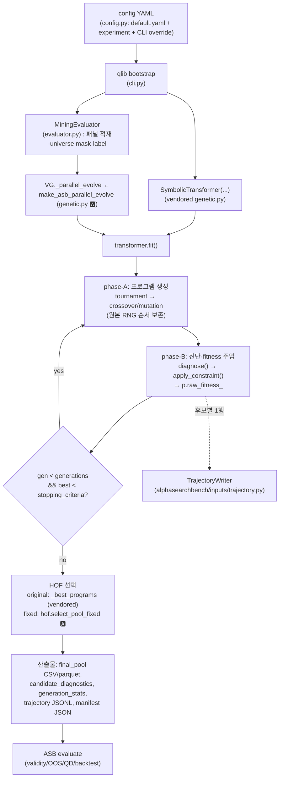

# GP (gplearn_asb) Implementation Design

이 문서는 **현재 저장소에 구현된 GP 코드를 직접 읽어** 작성한 implementation-level
설계 문서다. 일반 GP 이론은 구현 이해에 필요한 최소한만 다루고, 나머지는 모두
실제 파일·클래스·함수·config key를 근거로 기술한다.

* 대상 패키지: `AlphaSearchBench/gplearn_asb/`
* 원본 vendored 사본: `gplearn_asb/vendored_gplearn/` (**무수정 원칙** — 원본
  AlphaEval fork의 탐색 mechanics를 보존, `PROVENANCE`는 패키지 README 참조)
* ASB 측 확장: `gplearn_asb/{evaluator,fitness,genetic,hof,static_check,cache,trajectory,cli,config}.py`
* 평가 연동: `alphasearchbench/` (별도 문서 `docs/research_docs/backtest_design.md`)

표기: 🅾 = 원본 vendored 코드 그대로, 🅰 = ASB 확장, ⚠ = 보존된 원본 결함
(의도적으로 고치지 않음), ❌ = Not implemented.

---

## 1. Overview — GP란 무엇이며 이 프로젝트에서 어떤 역할인가

### 1.1 GP 일반 개념 (최소한)

| 용어 | 의미 |
|---|---|
| individual | 하나의 해(解). 여기서는 **alpha formula 하나** |
| population | 동시에 유지되는 individual 집합 (여기서 1,000개) |
| fitness | individual의 품질 점수. 클수록 좋음(greater_is_better) |
| generation | population을 한 번 교체하는 주기 |

GP는 (1) 무작위 population 생성 → (2) 각 individual의 fitness 평가 →
(3) fitness가 높은 individual을 부모로 선택 → (4) crossover/mutation으로 자식
생성 → (5) population 교체를 반복한다.

### 1.2 이 프로젝트에서의 individual

**individual = flattened expression tree**(파이썬 list)이며, 문자열로 렌더링하면
qlib factor expression이 된다. 예:

```python
program = ['Div', 'Less', '$low', '$change', 'Abs', '$amount']   # 내부 표현
str(program)  # → "Div(Less($low, $change), Abs($amount))"        # qlib expression
```

렌더링은 `_Program.__str__` (`vendored_gplearn/_program.py:266`) 🅾.

### 1.3 큰 흐름과 GP의 역할

GP는 **마이닝(생성) 단계 전담**이다: 후보 수식을 만들고 자체 fitness로 선택해
최종 alpha pool을 산출한다. 산출물의 **평가(타당성/OOS/QD/포트폴리오)는 전적으로
AlphaSearchBench(ASB)가 담당**하며, GP는 ASB 지표를 탐색에 사용하지 않는다
(단, ASB의 신호 엔진·validity 계산기를 마이닝 중 진단용으로 재사용한다 — §8).

최종 발견 대상: **미래 1일 수익률의 단면 순위를 예측하는 해석 가능한 수식들의
집합(alpha pool, 기본 10개)** 과 그 탐색 궤적(trajectory).

---

## 2. Overall Architecture & Execution Flow

### 2.1 Entry point

```bash
cd AlphaSearchBench/gplearn_asb
python -m gplearn_asb.cli mine --config configs/experiments/pilot_csi800_base.yaml \
    [--mode off|hard_penalty|strict_penalty] [--seed N] [--run-id ID] [--out DIR]
```

`cli.py:cmd_mine` 🅰 이 전 과정을 오케스트레이션한다. 중요한 것은 **import 순서
계약**(`cli.py:7-11`, 원본 러너 `scripts/run_gplearn_fast.py` 패턴): ① 실제 qlib
bootstrap → ② `qlib.init`를 no-op으로 치환(원본 ictester의 placeholder init 차단)
→ ③ `backtest.backtester` 모듈 사전 등록(`ensure_backtest_importable`) → ④ 그
후에만 vendored gplearn import. vendored 모듈이 **import 시점에 `D`를 평가**하기
때문이다.

### 2.2 실행 흐름



### 2.3 모듈 관계

| 모듈 | 역할 |
|---|---|
`cli.py` 🅰 | 진입점·config 검증·가드·산출물 작성·manifest
`config.py` 🅰 | `configs/default.yaml` + 실험 config deep-merge (ASB `Config` 재사용), `normalize_mode`(YAML `off`→False 함정 방어)
`vendored_gplearn/genetic.py` 🅾 | `SymbolicTransformer.fit()` 세대 루프·HOF·early stopping
`vendored_gplearn/_program.py` 🅾 | individual 표현·초기화·crossover/mutation·렌더링
`vendored_gplearn/config.py` 🅾 | terminal/operator/window 집합
`genetic.py` 🅰 | `make_asb_parallel_evolve` — vendored `_parallel_evolve` 대체(phase-A 보존 + phase-B 교체)
`evaluator.py` 🅰 | `MiningEvaluator` — 신호 계산, IC, validity 진단, net Sharpe, 정적 검사 게이트, 캐시
`fitness.py` 🅰 | `apply_constraint` — 진단 → effective fitness(worst-penalty), fitness metric 4종
`static_check.py` 🅰 | 데이터 접근 전 정적 규칙(상수식 등)
`hof.py` 🅰 | `hof_mode: fixed` 선택기 + 소급 repool용 pool 행 생성
`cache.py` 🅰 | `DiagnosticsCache` (formula → 진단, threshold와 분리)
`trajectory.py` 🅰 | `generation_row`/`GenStatsCollector` — 세대 통계

---

## 3. Alpha Representation & Search Space

### 3.1 내부 표현 — flattened tree (list)

`_Program.program`은 **전위순회(pre-order) flatten list** 🅾다. 원소는
① 연산자 이름 문자열(`functions_arity`의 key), ② feature 이름 문자열
(`'$close'` 등), ③ 숫자(rolling window 정수). 별도 노드 객체는 없다.

`validate_program` (`_program.py:253`)이 스택 계수로 구조 정합성을 검사하고,
`_depth`/`_length` (`:373`, `:391`)가 깊이·길이를 계산한다 —
**length = `len(self.program)`** (노드 수).

### 3.2 Terminal set (`vendored_gplearn/config.py:3`) 🅾

```
FEATURE_LIST = ["$adjclose", "$amount", "$change", "$close", "$factor",
                "$high", "$low", "$open", "$volume", "$vwap"]      # 10개
```

`cli.py`가 `feature_names=FEATURE_LIST`로 주입하므로 terminal은 이 10개 필드다.
**상수 terminal은 생성되지 않는다**: `const_range=None`이 기본이고
(`_program.py:218-228`) `cli.py`는 `const_range`를 넘기지 않는다 → 수치 상수는
rolling window 위치에만 등장한다(§3.4). 단 ⚠ point mutation 결함으로 정수가
terminal 자리에 들어올 수 있다(§6.3).

### 3.3 Operator set (`vendored_gplearn/config.py:5-46`) 🅾

| 종류 | 연산자 | `functions_arity` 값 |
|---|---|---|
| unary (3) | `Abs, Sign, Log` | 1 |
| binary (7) | `Add, Sub, Mul, Div, Power, Greater, Less` | 2 |
| rolling (19) | `Ref, Mean, Sum, Std, Var, Skew, Kurt, Min, Max, IdxMin, IdxMax, Med, Mad, Delta, Slope, Rsquare, Resi, WMA, EMA` | **4** |

총 **29개**. 주석 처리되어 비활성: `Not, And, Or, Cov, Corr, Quantile`.

주의 두 가지:
* `Greater`/`Less`는 비교가 아니라 **element-wise max/min**이다
  (`alphasearchbench/data/qlib_provider.py:14,107`). 따라서 `Greater(x,x)=x`
  (항등) — 상수가 아니다.
* rolling 연산자의 `functions_arity` 값 **4는 실제 인자 수가 아니다**. 트리
  빌더의 마커로 쓰이며, 렌더링 시 arity 2로 환원된다:
  `arity = 2 if functions_arity[node] == 4 else functions_arity[node]`
  (`_program.py:277`, `:419`). 즉 rolling 연산자는 `Op(x, window)` 2-인자다.

### 3.4 Rolling window의 표현 (`vendored_gplearn/config.py:1`) 🅾

```
window_lengths = [5, 12, 30, 64]
```

`build_program`에서 rolling 노드의 terminal_stack이 4→3이 되는 순간
`window_lengths`에서 무작위 1개를 뽑아 **정수 노드로 append**한다
(`_program.py:238-245`). 즉 window는 별도 파라미터 구조가 아니라 **트리 노드에
박힌 상수**이고, 후속 유전연산의 대상이 된다.

### 3.5 깊이·길이·복잡도 제한

| 제한 | 구현 |
|---|---|
초기 깊이 | `gp.init_depth` (기본 `[1,4]`) → `_Program.__init__`이 `(1,5)`로 보정해 `randint(1,5)` 사용 🅾 |
진화 후 깊이/길이 상한 | ⚠ **원본에 없음** — crossover/mutation은 depth·length 제약을 검사하지 않는다(bloat 무제한) |
길이 상한 (옵션) | 🅰 `gp.max_program_length` (기본 `null`=off). `static_check.program_size`를 `fitness.py`가 판정해 초과 시 worst fitness(`static_invalid:too_long`) — **penalty 모드 전용**, off 모드는 미적용 |
parsimony 패널티 | `gp.parsimony_coefficient` (기본 `0.0`) → `fitness_ = raw_fitness_ − c·len(program)·sign` (`_program.py:556`). 기본값 0이므로 **실효 없음** |

### 3.6 qlib expression으로의 변환

`__str__` (`_program.py:266`)이 flatten list를 문자열로 조립한다. 이 문자열이
곧 평가 입력이며, 두 경로에서 소비된다:

1. 🅰 마이닝 중: `MiningEvaluator.diagnose(formula)` →
   `alphasearchbench.data.qlib_provider.FormulaEngine.compute()` (자체 파서·
   벡터 엔진, silent fallback 없음)
2. 🅾 HOF 단계: `_Program.execute()`가 **qlib `D.features`로 재조회**하고,
   예외 시 ⚠ **조용히 `$close`로 대체**한다(`_program.py:455-473`). 실측: run당
   `hall_of_fame`개(50)의 "executing:" 로그가 남는다.

### 3.7 이 GP가 생성할 수 있는 alpha의 형태

10개 가격/거래량 필드에, 29개 연산자를 임의 깊이로 중첩하고, rolling 창은
{5,12,30,64}에서 뽑는 **모든 수식**. 상수항·비교연산·조건분기·순위(Rank) 연산은
공간에 없다(Rank는 연산자 목록에 없음). 예:
`Div(Less($low, $change), Abs($amount))`,
`Sub(EMA(Kurt(Var($amount, 30), 12), 30), EMA(Var($amount, 30), 30))`.

---

## 4. Inputs, Dataset & Labels

| 항목 | 값·출처 | config로 변경 가능? |
|---|---|---|
데이터 소스 | qlib 로컬 번들 (`dataset.provider_uri`, 기본 `.../QuantaAlpha/data/qlib/cn_data`), region `cn`, freq `day` | ✅ |
Universe | `market` (실험 config에서 `csi800`), PIT 멤버십 마스크 = `alphasearchbench.data.universe.build_universe_mask` → `universe_hash` manifest 기록 | ✅ (필수 키) |
Feature 패널 | `FormulaEngine`이 `FEATURE_LIST` 10필드를 **market="all"** 로 1회 적재 후 슬라이스. warmup 시작 `dataset.warmup_start`(기본 null → 2005-01-04), 우측 버퍼 `dataset.right_buffer_days`(기본 20) | ✅ |
마이닝 창 | `search.start_date` ~ `search.end_date` (파일럿 2010-01-01~2019-12-31) | ✅ (필수) |
Label | **forward k일 수익률**: `lead(close, k)/close − 1`, `k = label.horizon`(기본 1). `evaluator.py:58-66`에서 전체 패널에 lead를 적용한 뒤 창을 슬라이스하므로 **창 마지막 날도 우측 버퍼로 유효** | ✅ |
정렬 | 같은 날짜 행에서 factor 값 ↔ 그 날 기준 forward 수익률(단면 상관) | 코드 고정 |
결측 처리 | IC: `~isnan(F) & ~isnan(L) & universe_mask`인 셀만 사용, 유효쌍<2인 날 NaN, NaN 과반이면 IC=0.0(원본 `calculate1` 방어), ±inf → NaN 강등. validity: `compute_validity_stats`(isfinite 기준) | 코드 고정 |
⚠ 원본 label | vendored `BaseSymbolic.__init__`도 `(Ref($close,-1)−$close)/$close`를 qlib로 조회해 `self.y`·`X_shape`를 만든다(`genetic.py:235-247`). 이 `y`는 길이 검사·`X_shape`용으로만 쓰이며 🅰 phase-B는 사용하지 않는다 | — |

**train/valid/test와의 관계**: GP는 위 "마이닝 창" 하나만 본다. ASB 평가의
`splits`(train/valid/test)와는 **다른 축**이며, ASB-P1.0에서 마이닝 창
(2010–2019)이 곧 평가의 train으로 정의된다(§8.4).

---

## 5. Population Initialization

`_Program.build_program` (`_program.py:176`) 🅾:

1. `init_method`가 `'half and half'`(기본)면 개체마다 `randint(2)`로 `full` /
   `grow` 결정. `gp.init_method`로 `grow`/`full` 고정 가능.
2. `max_depth = randint(1, 5)` (즉 1~4; `gp.init_depth=[1,4]`).
3. **루트는 항상 연산자**(퇴화 방지): `function_set`에서 균등 무작위.
4. 이후 스택이 빌 때까지: `choice = randint(n_features + len(function_set))`
   (= `randint(39)`)이고,
   `depth < max_depth and (method=='full' or choice <= len(function_set))`이면
   연산자, 아니면 terminal을 추가한다.
   → **grow 모드의 연산자 선택 확률 ≈ 30/39 ≈ 0.77** (`choice <= 29`가
   0..29의 30개 값에서 성립). ⚠ 원본이 `<=`를 쓰므로 경계 1개가 연산자 쪽으로
   기울어 있다(gplearn upstream은 `<`).
5. terminal은 `randint(n_features)`로 feature 인덱스를 뽑아
   `feature_names[terminal]` 문자열을 append (`const_range=None`이라 상수 경로 없음).
6. rolling 노드는 스택이 3이 되는 순간 `window_lengths`에서 창을 뽑아 append.

**population size** = `gp.population_size` (필수 키, 파일럿 1000). 세대 0은
`parents=None`이므로 1,000개가 모두 이 절차로 생성된다(🅰 `genetic.py:74-75`).

**invalid 후보 처리**: 초기화 단계에서 구조적으로 invalid한 프로그램은 만들어질
수 없고(빌더가 스택을 닫음), **데이터상 invalid(평가 실패·coverage 부족)한 후보는
제거·재생성하지 않는다**. population 크기는 항상 보존되고 fitness만 강등된다(§7).

**실측 예시** (`out/pilot_csi800_fbfit_42` gen 0):
`Max(Max(Std(Mad($amount, 5), 30), 5), 5)` — rolling 4중 중첩, 창 5/30/5/5.

---

## 6. Evolution Operators

phase-A(생성)는 🅰 `genetic.py:make_asb_parallel_evolve` 안에 vendored
`_parallel_evolve`(`vendored_gplearn/genetic.py:39-160`)의 로직을 **verbatim
포팅**했다. RNG 소비 순서를 보존해야 원본과 동일한 프로그램이 나오기 때문이다
(883881 run 재현 테스트로 고정).

개체 i의 생성 절차 (`genetic.py:71-107` 🅰):

```
random_state = check_random_state(seeds[i])      # 개체별 독립 RNG
method = random_state.uniform()                  # 연산 선택
parent, parent_idx = _tournament(random_state)
  ├ method < method_probs[0]  → Crossover (donor도 _tournament로 1회 더)
  ├ < method_probs[1]         → Subtree Mutation
  ├ < method_probs[2]         → Hoist Mutation
  ├ < method_probs[3]         → Point Mutation
  └ else                      → Reproduction (복사)
prog.get_all_indices(...)                        # RNG 소비 보존용 (max_samples=1.0이라 실효 없음)
```

`seeds`는 세대마다 `random_state.randint(MAX_INT, size=population_size)`로
생성된다(`vendored genetic.py:472`).

### 6.1 Selection

* **tournament selection**: `tournament_size`(기본 20)개를
  `random_state.randint(0, len(parents), tournament_size)` — **복원추출** — 로
  뽑아 `parents[p].fitness_`의 argmax를 부모로 한다(greater_is_better=True).
* crossover는 부모+donor로 **tournament를 2회** 수행한다.
* **elitism·survivor selection 없음** ❌: 세대는 전량 교체된다. 유일한 생존
  경로는 Reproduction(부모 복사, 확률 7%)이다.
* fitness는 `fitness_`(= raw − parsimony·len)이며 parsimony 0이라 실질적으로
  `raw_fitness_`(=🅰 effective fitness, §8)와 같다.

### 6.2 Crossover (`_program.py:619`) 🅾

1. 자신에서 `get_subtree`로 교체할 subtree `[start,end)` 선택.
2. donor에서도 `get_subtree`로 기부 subtree 선택.
3. `self.program[:start] + donor[donor_start:donor_end] + self.program[end:]`.

`get_subtree` (`:576`)는 **연산자 노드에만 확률 1**을 주고(terminal 0) 누적분포
+ `searchsorted`로 시작점을 뽑는다 → 부분트리는 항상 연산자 루트에서 시작한다.
스택 계수 시 rolling 노드는 `+2`로 세어 arity 환원과 일관된다(`:607-610`).
⚠ **depth/length 제약 검사 없음**.

### 6.3 Mutation

| 종류 | 확률 config (기본) | 동작 |
|---|---|---|
Subtree Mutation | `gp.p_subtree_mutation` (0.01) | "headless chicken": `build_program`으로 새 트리를 만들고 그것을 donor로 crossover (`_program.py:652`) |
Hoist Mutation | `gp.p_hoist_mutation` (0.01) | 부분트리를 고르고, 그 안의 부분트리를 골라 상위 위치로 승격(bloat 억제) (`:678`) |
Point Mutation | `gp.p_point_mutation` (0.01) | 각 노드를 독립적으로 `p_point_replace`(0.05) 확률로 교체. 연산자는 **같은 arity 그룹**에서 교체(`self.arities[arity]`), terminal은 새 terminal로 교체 (`:708`) |
Reproduction | 나머지 = 1 − Σ (0.07) | 부모 프로그램 복사 |
Crossover | `gp.p_crossover` (0.9) | §6.2 |

⚠ **Point mutation의 보존된 결함**(`_program.py:741-753`): terminal 교체 시
`terminal = random_state.randint(self.n_features)`로 얻은 **정수 인덱스를 그대로
노드에 대입**한다(`feature_names[terminal]` 변환 누락). 결과:
* feature 자리에 0~9 정수가 들어가 상수처럼 렌더링된다 (`Add(3, $close)`).
* rolling window 자리에 0~9가 들어가 `window_lengths` 밖의 창이 생긴다
  (`Var($factor, 6)` 실측). 창 0은 qlib 의미론상 expanding으로 **유효 평가**된다.

이 결함은 원본 mechanics 재현을 위해 고치지 않고, 🅰 `static_check`가
`static_flag_nonstd_window` 플래그로 **기록만** 한다.

### 6.4 Mutation 이후 validity 검사

구조 검사는 `_Program.__init__` → `validate_program`이 담당하고(불완전 프로그램은
`ValueError`), 데이터 기반 validity는 phase-B에서 사후 진단된다. **연산 직후
재생성·거부 루프는 없다** ❌ — population 불변 원칙(§7).

---

## 7. Candidate Validity, Constraints & Deduplication

### 7.1 2단 게이트 (🅰 `evaluator.diagnose`)

```
생성 → [P1 문법: FormulaEngine 파서]  → [P2 정적 규칙: static_check.py]
     → (합격만) 데이터 접근·신호 계산 → [P3 데이터 validity]
```

**P2 정적 규칙** (`static_check.py`, 데이터 접근 0):
* `static_invalid:constant_expression` — `Sub(x,x)`, `Div(x,x)`, 전-인자-상수
  전파. (`Greater/Less`는 max/min이라 항등 → 상수 아님, 단위테스트로 고정)
* 기록 전용 플래그: `static_flag_constant_subtree`, `static_flag_nonstd_window`,
  `program_size`.
* 게이트 활성 조건: `gp.static_gate`(기본 true) **AND** `constraint.mode != off`
  → off 모드는 원형 유지(기록만). 게이트가 켜진 run은 캐시 네임스페이스가
  분리된다(`cache_ctx["static_gate"]`).

**P3 데이터 validity** — hard invalid 사유 4종
(`evaluator.HARD_INVALID_REASONS`): `formula_eval_failed:*`, `all_nonfinite`,
`no_correlatable_day`, `zero_ic_observations`. 여기에 research threshold 3종
(`validity.min_mean_daily_coverage_ratio` / `min_median_daily_n_valid` /
`min_valid_day_ratio`, 규약 **value ≥ threshold → pass**)이 더해진다.

개별 항목 대응:

| 항목 | 처리 |
|---|---|
NaN / Inf | IC 계산에서 마스킹, ±inf corr은 NaN 강등. `nan_cell_ratio`/`inf_cell_ratio` 기록 |
0으로 나눗셈·invalid log/power | 엔진에서 inf/NaN 생성 → 위 마스킹·`all_nonfinite` 경로 |
rolling window 부족 | 엔진이 `min_periods=1`로 계산(원본 qlib 의미론), 부족 구간은 warmup 버퍼로 완화 |
constant factor | 단면 분산 0 → 그 날 corr NaN → `no_correlatable_day`/`zero_ic_observations`. 정적으로 잡히면 P2에서 조기 차단 |
signal coverage 부족 | research threshold(`mean_daily_coverage_ratio` 등)로 판정 |
depth/complexity 초과 | 🅰 옵션 `gp.max_program_length`만 존재(기본 off) |
duplicate formula | **exact string** 기준. `DiagnosticsCache`가 재평가를 막고(`memo_hit`), fixed HOF가 pool에서 제거. ❌ 구조/의미 동등성(canonical form) 미구현 — 사전 실측(13 run, 22,539 unique)에서 교환법칙 중복 1.2%로 측정되어 보류 |

### 7.2 constraint mode 3종 (`fitness.apply_constraint` 🅰)

| mode | invalid 처리 | 비고 |
|---|---|---|
`off` | penalty 없음. 평가 실패 시 ⚠ **`$close`의 signed IC를 상속**(원본 루프홀 재현, `fallback_used=True`) | 원본 동등성 검증용 |
`hard_penalty` | hard invalid만 worst fitness | 실측상 off와 **동일 경로**(hard invalid는 raw가 NaN이라 off에서도 worst) → 별도 정보 없음 |
`strict_penalty` | hard invalid + research threshold 위반 → worst fitness | 파일럿 주 arm |

**핵심 규약**: invalid 후보를 **population에서 제거하거나 재생성하지 않는다.**
selection이 소비하는 fitness만 유한 sentinel `constraint.worst_fitness`
(기본 −1.0; net_sharpe/fb_fitness 계열은 −1e6)로 강등한다. 이유는 (a) 원본
population 동역학 보존, (b) NaN/−inf는 argmax/argsort에서 비결정적이므로 유한
sentinel이 필요, (c) `check_sentinel_separation`이 parsimony≠0일 때 sentinel이
valid보다 낮음을 검사.

---

## 8. Fitness Evaluation & Train/Validation Protocol

### 8.1 계산 흐름 (🅰 phase-B)

```
formula(str)
  → FormulaEngine.compute()            # (일자 × 종목) float32 신호
  → universe_mask & isfinite           # 유효 셀
  → _daily_ic(): 일별 단면 Pearson corr(신호, forward k일 수익률)
      · two-pass 중심화(pandas Series.corr와 동일 수치 의미론)
      · 유효쌍<2 → 그날 NaN, ±inf → NaN, NaN 과반 → IC=0.0
      · 반환 (signed IC 평균, 유한 관측일 수, 일별 IC 표준편차 ddof=1)
  → diagnose(): + compute_validity_stats 15키 (+ net_sharpe 계열 3값)
  → apply_constraint(mode, thresholds, worst, metric, opts)
  → p.raw_fitness_ = effective_fitness   # selection·HOF가 소비하는 값
```

### 8.2 fitness metric 4종 (`gp.fitness_metric`, 기본 `abs_ic`)

| 값 | 정의 | signed? |
|---|---|---|
`abs_ic` | **\|일별 단면 IC의 평균\|** (원본 AlphaEval GP와 동일) | absolute |
`ic_tstat` 🅰 | `\|mean(daily IC)\| / (std(daily IC, ddof=1)/√n_obs)` — 관측일 수 반영. 판정 불가(n<2, std=0) → NaN → worst | absolute |
`net_sharpe` 🅰 | 마이닝 창에서 oriented 신호의 일별 20/20 long-short **net Sharpe** (gross 1, 편도 회전 비용, 첫날 건립비용, ×√252) | signed |
`fb_fitness` 🅰 | `net_sharpe × √(\|net_ann_ret_arith\| / 연환산 편도 회전율)` — 원본 backtester의 미사용 `Fitness` 정신을 ASB 의미론으로 재정의 | signed |

**부호 처리**: `abs_ic`/`ic_tstat`는 절댓값을 쓰므로 방향 정보가 fitness에
들어가지 않는다. 대신 `signed_train_IC`를 항상 기록하고, 포트폴리오 계열
metric은 `sign = 1 if ic >= 0 else -1`로 신호를 **oriented**한 뒤 계산한다
(`evaluator._net_sharpe`). ASB 평가도 이 `train_sign`을 재사용한다.

**거래비용·회전율의 fitness 반영**: `abs_ic`/`ic_tstat`는 미반영,
`net_sharpe`(비용 차감)와 `fb_fitness`(비용+회전율)는 반영.
비용률은 `backtest.transaction_cost_rate`(0.0015), 분위는
`backtest.long_short_quantile`(0.2).

**부가 조건 (🅰 `gp.net_sharpe_min_traded_days`, `gp.net_sharpe_min_abs_ic`,
기본 null)**: `net_sharpe`·`fb_fitness`에서 거래일 수/최소 |IC| 미달 시
effective fitness를 worst로 강등하고 `fitness_condition_failed`를 기록한다.
raw 값은 보존한다.

### 8.3 IC/RankIC/Sharpe 사용 범위

* 마이닝 fitness: 위 4종만. **RankIC는 마이닝에 사용되지 않는다** ❌
  (ASB 평가 단계에서만 계산).
* `gp.metric`은 vendored `_fitness_map` 조회용(`'pearson'`)이며 실제 점수
  계산에는 쓰이지 않는다 — `greater_is_better`(argmax 방향)와 parsimony 부호만
  결정한다.

### 8.4 Train / Validation / Test

| 구간 | 역할 |
|---|---|
**마이닝 창** (`search.*`, 2010–2019) | GP의 **모든** fitness·validity 진단이 이 구간에서 계산된다. ASB-P1.0에서 이 구간이 평가의 `train`으로 정의된다 |
**valid** (ASB `splits.valid`, 2020) | **GP는 보지 않는다.** ASB 평가에서 배치 캘리브레이션·OOS 진단용 |
**test** (2021–2024) | GP·마이닝 파이프라인에서 완전히 봉인. ASB 최종 보고 전용 |

* **GP selection은 마이닝 창(=train) 지표만으로 결정된다.** hold-out validation을
  이용한 조기 종료·모델 선택은 ❌ 미구현이다.
* validation 결과가 탐색에 되먹임되는 경로는 없다.
* test 봉인은 ASB 노트북의 leakage assertion(마이닝 창 ∩ test = ∅)으로 검사된다.

### 8.5 요약 흐름

```
Formula → Factor Values (FormulaEngine, 마이닝 창)
        → Label (forward k일 수익률, 동일 창)
        → 일별 단면 평가 (Pearson IC / oriented LS 백테스트)
        → fitness (metric 4종) → apply_constraint (worst-penalty)
        → p.raw_fitness_ → tournament argmax → 다음 세대
```

---

## 9. Search Budget, Generations & Termination

| 항목 | 값·근거 |
|---|---|
population size | `gp.population_size` (파일럿 1000) |
generations | `gp.generations` (파일럿 5) |
세대당 후보 | population size와 동일(1000) — reject 경로가 없어 항상 고정 |
**총 평가 시도** | `population_size × generations` = 5,000 (실측 `generation_stats.n_candidates = [1000]×5`) |
**unique 평가 수** | 중복 제외 실측 1,300~2,100 (예: fbfit_42 → 1,506) |
Hall of Fame | `gp.hall_of_fame` (파일럿 50) → 최종 pool `gp.n_components` (10) |
early stopping | 있음 🅾: 세대 말 `best raw fitness >= gp.stopping_criteria`면 break (`vendored genetic.py:541-544`). 기본 1.0 — `abs_ic`에서는 사실상 발동 불가하나 병리적 \|IC\|=1에서 오발 가능. 🅰 `cli.py`가 `ic_tstat`/`net_sharpe`/`fb_fitness` 모드에서 `stopping_criteria ≥ 100`을 강제 |
종료 조건 | 위 early stopping 또는 generations 소진 |
중복 재평가 | `DiagnosticsCache`가 신호·IC 재계산을 막지만 **시도 예산에는 포함**된다(`memo_hit=True`로 표시). budget 3종을 manifest에 분리 기록: `total_evaluations`(=5,000), `unique_evaluations`, `memo_hits` |

**타 방법론과의 공정 비교 시 해석**: 예산 축은 **총 시도 수(5,000)** 를 1차
기준으로, **unique 평가 수**를 보조 기준으로 쓴다. LLM 계열은 호출 수와 후보
수가 다르므로(예: AlphaAgent 51 후보/127 LLM 호출) budget 정규화 없이 비교하면
탐색 알고리즘 차이와 예산 차이가 섞인다. ASB의 search-QD 지표는 "누적 시도
후보 수" 축에서 그려진다.

---

## 10. Configuration

기본값은 `gplearn_asb/configs/default.yaml`(🅰) 기준이며, 필수(null) 키는
실험 config가 채운다. **아래 표에 없는 키는 코드에 존재하지 않는다.**

### Dataset
| Config | 의미 | Default |
|---|---|---|
`dataset.provider_uri` | qlib 번들 경로 | `/gpfs/.../QuantaAlpha/data/qlib/cn_data` |
`dataset.region` | qlib region | `cn` |
`dataset.qlib_kernels` | qlib 병렬 커널 수 | 8 |
`dataset.warmup_start` | 패널 warmup 시작 | `null` (→ 2005-01-04) |
`dataset.right_buffer_days` | 우측 버퍼 일수(label lead용) | 20 |
`market` | universe (예: csi800) | `null` (필수) |
`search.start_date` / `search.end_date` | 마이닝 창 | `null` (필수) |
`label.horizon` | forward 수익률 일수 k | 1 |

### Search space
| Config | 의미 | Default |
|---|---|---|
(terminal/operator/window) | `vendored_gplearn/config.py`에 **하드코딩** — config 노출 없음 | FEATURE_LIST 10 / 29 ops / [5,12,30,64] |
`gp.init_depth` | 초기 트리 깊이 범위 | `[1, 4]` |
`gp.init_method` | `half and half` / `grow` / `full` | `half and half` |
`gp.max_program_length` 🅰 | 길이 상한(초과 시 worst, penalty 모드 전용) | `null` |

### Population / Evolution
| Config | 의미 | Default |
|---|---|---|
`gp.population_size` | 세대당 개체 수 | `null` (필수) |
`gp.generations` | 세대 수 | `null` (필수) |
`gp.tournament_size` | 토너먼트 크기(복원추출) | 20 |
`gp.p_crossover` | crossover 확률 | 0.9 |
`gp.p_subtree_mutation` | subtree mutation 확률 | 0.01 |
`gp.p_hoist_mutation` | hoist mutation 확률 | 0.01 |
`gp.p_point_mutation` | point mutation 확률 | 0.01 |
`gp.p_point_replace` | point mutation 내 노드별 교체 확률 | 0.05 |
`gp.parsimony_coefficient` | 길이 패널티 계수 | 0.0 |
`gp.max_samples` | 서브샘플 비율(1.0=미사용) | 1.0 |
`gp.metric` | vendored metric 이름(방향·부호 결정용) | `pearson` |
`gp.stopping_criteria` | early stopping 임계 | 1.0 |
`gp.hall_of_fame` | HOF 크기 | 25 |
`gp.n_components` | 최종 pool 크기 | 10 |
`gp.hof_mode` 🅰 | `original` / `fixed` | `original` |

### Fitness
| Config | 의미 | Default |
|---|---|---|
`gp.fitness_metric` 🅰 | `abs_ic` / `net_sharpe` / `ic_tstat` / `fb_fitness` | `abs_ic` |
`gp.net_sharpe_min_traded_days` 🅰 | 최소 거래일(미달 → worst) | `null` |
`gp.net_sharpe_min_abs_ic` 🅰 | 최소 \|train IC\|(미달 → worst) | `null` |
`backtest.transaction_cost_rate` | fitness 내 비용률 | 0.0015 |
`backtest.long_short_quantile` | fitness 내 LS 분위 | 0.2 |

### Constraints
| Config | 의미 | Default |
|---|---|---|
`constraint.mode` | `"off"` / `hard_penalty` / `strict_penalty` (YAML 따옴표 필수) | `"off"` |
`constraint.worst_fitness` | 유한 sentinel | −1.0 |
`validity.min_mean_daily_coverage_ratio` | research threshold | `null` |
`validity.min_median_daily_n_valid` | research threshold | `null` |
`validity.min_valid_day_ratio` | research threshold | `null` |
`gp.static_gate` 🅰 | 정적 invalid의 데이터 접근 스킵(penalty 모드에서만) | `true` |

### Seed / Output
| Config | 의미 | Default |
|---|---|---|
`seed` | GP RNG seed | 42 |
`run_id` | 산출물 식별자 | `null` (→ `{method}_{mode}_{seed}`) |
`output.root` | 산출 루트 | `null` (→ `gplearn_asb/out/{run_id}`) |

### ASB evaluation
마이닝 config에는 ASB 평가 키가 없다. 평가는 `AlphaSearchBench/configs/`의
별도 config(`csi800_ref.yaml` 등)로 수행되며 GP는 pool·trajectory만 넘긴다(§12).

---

## 11. Outputs, Logging & Reproducibility

### 11.1 디렉토리 구조 (실측 — `out/pilot_csi800_fbfit_42`)

```
out/<run_id>/
├── metrics/
│   ├── final_pool_<run_id>.csv           # 최종 alpha pool (ASB 입력)
│   ├── final_pool_<run_id>.parquet       #  동일 내용(OutputWriter)
│   ├── final_pool_<run_id>_fixedhof.csv  # (소급 repool 적용 시)
│   ├── candidate_diagnostics_<run_id>.parquet   # unique 후보 전량 진단
│   └── generation_stats_<run_id>.parquet        # 세대별 통계
├── trajectory/
│   └── <run_id>.jsonl                    # 후보 1건 = 1행 (append, line-flush)
├── manifests/
│   ├── run_<run_id>.json                 # config echo·budget·universe_hash 등
│   └── repool_<run_id>.json              # (repool 시) HOF 진단
├── asb_eval/ , asb_eval_ref/             # ASB 평가 산출(별도 실행)
└── cache/ , daily/ , plots/              # OutputWriter 표준 하위(미사용 가능)
```

### 11.2 주요 파일의 내용

**`final_pool_*.csv`** (`cli.py`): `formula`, `IC`(=원본 CSV 호환 필드,
`p.fitness_`), `signed_train_IC`, `train_sign`, `abs_train_IC`, `raw_fitness`,
`effective_fitness`, `hard_invalid`, `research_invalid`, `validity_pass`,
`invalid_reason`, `mean_daily_coverage_ratio`, `median_daily_n_valid`,
`valid_day_ratio`, `method`, `constraint_mode`, `seed`
(fixedhof는 `hof_mode`·`n_dedup_removed`·`decorr_*` 컬럼 추가).

**`trajectory/*.jsonl`** (30 필드, 실측): `run_id, method, seed, generation,
idx_in_population, formula, raw_fitness, effective_fitness, signed_train_IC,
abs_train_IC, fitness_metric, net_sharpe, ic_tstat, static_invalid_reason,
static_flag_constant_subtree, fitness_condition_failed, constraint_mode,
hard_invalid, research_invalid, validity_pass, invalid_reason, fallback_used,
mean_daily_coverage_ratio, median_daily_n_valid, valid_day_ratio,
program_length, program_depth, memo_hit, operation, parent_idx, donor_idx`.

**`candidate_diagnostics_*.parquet`** (42 컬럼): validity 15키 + IC 계열
(`ic_daily_std`, `ic_tstat`, `n_ic_obs`) + net_sharpe 계열
(`net_ann_ret_arith`, `mean_daily_turnover_oneway`, `n_traded_days`) + 정적
검사 3키 + 판정 필드 + `first_seen_generation`, `first_seen_candidate_id`.

**`generation_stats_*.parquet`** (`trajectory.generation_row`): 세대별
`n_unique`, `n_unique_valid`, `hard_invalid_rate`, `research_invalid_rate`,
`valid_candidate_rate`, coverage 통계, `mean/best_raw_train_IC`,
`mean/best_effective_fitness`, **부모 다양성**(`n_unique_parents_selected`,
`parent_selection_entropy`, `top_parent_selection_share`), `n_memo_hits`,
`wall_seconds`.

**`manifests/run_*.json`**: 버전(`gplearn_asb_version`, `semantics_version`),
`constraint_mode`, `fitness_metric`, `fitness_opts`, `hof_mode`, `static_gate`,
`seed`, `worst_fitness`, `thresholds`, `market`, `search_window`,
`label_horizon`, `universe_hash`, `close_fallback_signed_ic`, `gp_params`
16개, `budget`(총/unique/memo/wall), `cache_context`, `outputs`,
**`config_echo`(전체 config 스냅샷)**.

### 11.3 저장 여부 체크리스트

| 정보 | 저장 위치 |
|---|---|
formula / generation / fitness | trajectory (전 후보) ✅ |
parent / crossover·mutation 종류 | trajectory `operation`/`parent_idx`/`donor_idx` ✅ |
validity·사유 | trajectory + candidate_diagnostics ✅ |
factor complexity | `program_length`, `program_depth`(trajectory), `program_size`(diagnostics) ✅ |
Hall of Fame 자체(50개) | ❌ 별도 저장 없음 — 최종 pool(n_components)만 저장. HOF 순위는 trajectory 마지막 세대 fitness로 재구성 가능 |
final alpha pool | `final_pool_*.csv/parquet` ✅ |
random seed | manifest `seed` + trajectory 각 행 ✅ |
config snapshot | manifest `config_echo` ✅ |

### 11.4 재현성

* 단일 seed(`seed` → `SymbolicTransformer(random_state=seed)`)에서
  `check_random_state`로 `RandomState`를 만들고, 세대마다 개체별 seed 배열을
  파생시킨다. **Python `random`·전역 NumPy seed는 사용하지 않는다** — 모든
  난수는 이 RandomState 계보에서 나온다.
* `n_jobs=1`로 고정(`cli.py`) — 원본 러너와 동일하며 memo 공유·순서 재현 전제.
* 동일 config+seed → 동일 결과: 원본 run 883881에 대해 gen-0 프로그램 200/200
  일치, 전 후보 IC 차이 0.0으로 검증(`tests/regression/`).
* 캐시 키 문맥(`cache.context`: market/universe_hash/창/dataset_uri/
  `semantics_version`)을 manifest에 기록해 run 간 재사용 시 문맥 불일치를
  검출할 수 있다.

---

## 12. AlphaSearchBench Integration & End-to-End Example

### 12.1 역할 분리

| GP (`gplearn_asb`) | ASB (`alphasearchbench`) |
|---|---|
후보 생성(초기화·crossover·mutation) | Validity 게이트(평가 분할 기준) |
마이닝 창 fitness 평가·selection | OOS 평가(IC/RankIC/ICIR, valid→test 전이) |
worst-penalty·정적 게이트 | QD 평가(행동 기술자·PCA grid·search-QD) |
HOF → alpha pool 산출 | 포트폴리오 백테스트(프로토콜 격자) |
trajectory·진단 기록 | 지표 산출·manifest·프로파일 |

GP는 ASB 지표를 탐색에 쓰지 않는다. 반대로 ASB는 GP 내부 fitness를 평가에
쓰지 않는다(단 `signed_train_IC`는 방향 규약 재사용).

### 12.2 인터페이스

```bash
python -m alphasearchbench evaluate \
  --config configs/examples/csi800_ref.yaml \
  --input      gplearn_asb/out/<rid>/metrics/final_pool_<rid>.csv \
  --trajectory gplearn_asb/out/<rid>/trajectory/<rid>.jsonl \
  --method gplearn_asb_<arm> --seed-id <seed> --out gplearn_asb/out/<rid>/asb_eval_ref
```

* pool CSV 읽기: `alphasearchbench/inputs/loaders.py:load_result` — **필수 컬럼은
  `formula`**, 있으면 `signed_train_IC`(방향 복원용), `method`/`seed`는 인자로
  주입 가능. 없으면 ASB가 train 창에서 부호를 재계산한다
  (`runner.train_sign`).
* trajectory 읽기: `inputs/trajectory.py:load_trajectory` — `generation`,
  `idx_in_population`, `formula`가 search-QD·budget 산출의 필수 축.
* pool 결합 규약과 포트폴리오 규칙은 ASB 측 설계 문서 참조
  (`docs/research_docs/backtest_design.md`).

### 12.3 End-to-End Example (실측 run `pilot_csi800_fbfit_42` 기준)

```
1. gen 0: build_program('full', max_depth=3)으로 Parent A 생성
     program = ['Std','Mad','$amount',5,64]  → "Std(Mad($amount, 5), 64)"
2. phase-B: FormulaEngine이 신호 계산 → _daily_ic → validity 진단
     → fb_fitness 계산 → p.raw_fitness_ = effective_fitness (strict 통과)
3. gen 1: tournament(20 복원추출)로 A가 부모로 선택(uniform() < 0.9 → Crossover)
     donor B도 tournament로 선택 → get_subtree로 부분트리 교환 → Child C
4. Child C = "Sub(EMA(Kurt(Var($amount, 30), 12), 30), EMA(Var($amount, 30), 30))"
     (trajectory에 operation=Crossover, parent_idx, donor_idx 기록)
5. 마이닝 창(2010–2019)에서 factor 계산 → forward 1일 수익률과 단면 IC,
     oriented 20/20 LS 백테스트 → fb_fitness = +0.151 (train |IC| 0.0057)
6. static/validity 게이트 통과 → effective_fitness = raw_fitness
7. 이후 세대 tournament에서 반복 선택되어 생존(elitism은 없으나 fitness 상위)
8. 최종 세대에서 HOF(50) → n_components(10) 선택으로 final_pool 편입
     (original 모드는 ⚠ HOF decorrelation 결함으로 pool이 anti-selected —
      fixed 모드/소급 repool은 dedup + NaN-safe decorrelation 사용)
9. ASB evaluate: validity 게이트 → test IC → QD 기술자·grid → 포트폴리오
     백테스트(프로토콜별) → metrics parquet + manifest
```

### 12.4 알려진 한계 (구현 사실로서 명시)

* ⚠ **원본 HOF decorrelation 결함**(`vendored genetic.py:557-580`):
  `execute()`가 반환하는 원시 qlib 패널에 NaN이 있어 `np.corrcoef`가 전-NaN이
  되고, `argmax`가 매번 (0,1)을 지목해 인덱스 1을 반복 제거한다. 결과 pool =
  `{HOF 1위} ∪ {HOF 꼬리 n_components−1개}`. 🅰 `hof_mode: fixed`와
  `scripts/repool_fixed_hof.py`가 대안 경로를 제공한다.
* ⚠ HOF 단계는 `hof_mode`와 무관하게 항상 실행되므로 run당 `hall_of_fame`회의
  **qlib 재조회**(실패 시 `$close` 대체)가 발생한다.
* ❌ 미구현: 구조/의미 기반 중복 제거, 진화 중 depth·length 강제, hold-out
  validation 기반 조기 종료, RankIC·다목적 fitness, niching/다양성 압력,
  HOF 전체 스냅샷 저장.
* `hard_penalty` 모드는 실측상 `off`와 동일 경로여서 독립 정보를 주지 않는다.
