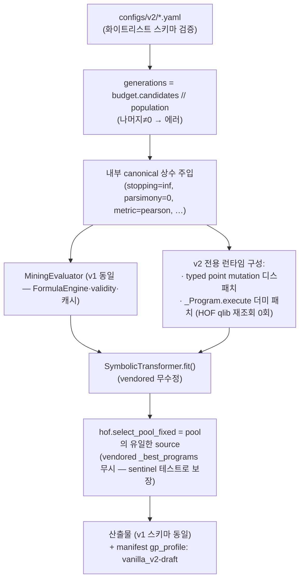

# GP (Clean Vanilla GP v2) — Implementation Design

> 상태: **구현·검증 완료 — 실측 기준 (2026-08-19).** `Vanilla_GP_v2.md` 수정
> 명세의 설계 문서이며, 기술된 모든 v2 항목은 구현되어 Slurm 889597에서
> 실측 검증되었다(전체 스위트 76 passed + v2 smoke + manifest 계약).
> freeze 전이므로 profile은 `vanilla_v2-draft`, L/D 값만 결정 대기(C-2).

v1 실측 설계는 `GP_asb_design.md`. 변경 없는 mechanics는 해당 절을
참조로 대체하고, 이 문서는 **v2에서 달라지는 것**을 완전 기술한다.
부록 B에 §별 v1→v2 차이표.

---

## 1. Overview

v2의 정체성: **결함 없는 Clean Vanilla GP baseline.** v1이 "AlphaEval 원본
재현 + 결함 계측"이었다면, v2는 그 계측 결과를 반영해 결함(buggy point
mutation, HOF anti-selection, $close fallback, 이중 평가 시맨틱, metric 의존
early stopping)을 제거하고 admissibility를 상시화한 연구 표준 baseline이다.

* individual = flattened expression tree(list) → qlib 표현식 문자열 (v1 동일).
* 발견 대상 = 새 temporal split(§4)의 test에서 평가될 alpha pool(기본 10개).
* **evidence 규약**: v1 + 기존 기간의 전 결과는 development evidence.
  v2 + 새 split이 공식 실험 시작점. profile freeze 조건 2개(L/D, 새 split)
  충족 전까지 `vanilla_v2-draft`이며 draft run은 correctness 검증용.
* ASB는 이 작업 범위 밖(무수정). v2 산출물의 ASB 평가는 후속 단계.

## 2. Overall Architecture & Execution Flow

```bash
python -m gplearn_asb.cli mine --config configs/v2/vanilla_baseline.yaml [--seed N]
```

`cli.py`가 config의 `profile: vanilla_v2-draft` 키로 **v2 분기**(freeze 전 `vanilla_v2` 표기는 SystemExit로 거부):



v1과의 구조 차이: 모드 분기·hof_mode 분기·fallback 경로가 v2 흐름에
존재하지 않는다. legacy 실행은 기존 config로 기존 경로 그대로(동결).

## 3. Alpha Representation & Search Space

`search_spaces/gp_native_v1.md`에 버전링된 문법을 따른다: terminal 10,
operator 29(Greater/Less=max/min), window {5,12,30,64}, 초기 깊이 1~4.

v1과의 차이 2건:
* **typed point mutation** (구현·테스트 완료): terminal 교체가 feature→feature 이름,
  window→`window_lengths` 내 값으로 제한되어 **문법 밖 표본(정수 유입)이
  사라진다.** v1의 실효 공간과 미세하게 다름을 명시(비교 시 주의).
* **complexity hard bound (L/D)**: `gp.max_program_length`(길이) 또는
  `gp.max_program_depth`(깊이) 초과 → worst fitness (사유
  `static_invalid:too_long`/`too_deep`; 둘 다 formula-결정적 정적 계량 —
  `static_check.py`의 `program_size`/`program_depth`). 값은 **결정 대기**
  (freeze 조건 ① — 교차 방법 문법 대조 후). parsimony 0.
  길이만으로는 얕고-넓은/깊고-좁은 트리를 구분하지 못하므로 L·D를 모두
  hard bound로 둔다(둘은 독립 축).

## 4. Inputs, Dataset & Labels

데이터 계층은 v1 동일(FormulaEngine 1회 적재, PIT universe, forward k=1
label, 우측 버퍼) — `GP_asb_design.md` §4 참조. v1과의 차이 1건:
**label tail exclusion** — train 마지막 `horizon` 거래일을 fitness label에서
제외(`evaluator.apply_label_tail_exclusion`, v2 전용·legacy off). 창 마지막
날 label이 우측 버퍼로 경계 밖 1일을 쓰는 leakage를 차단해 train-only
계약을 정확히 지킨다 (`Vanilla_GP_v2.md` §6 caveat 4).

**temporal split** [C-0 확정 — 2026-08-19 사용자 결정]: train/search
2015-01-01~2021-12-31 / validation 2022-01-01~2023-12-31(GP 설정 결정 전용,
candidate fitness 불개입) / test 2024-01-21~2026-06-30(동결, freeze 후 1회
평가). test 전반부(~2025-01-20)는 v1 development와 겹치는 부분 오염 —
통계력 확보를 위해 명시적으로 감수. 판독 사전 등록: **Primary Full
OOS**(2024-01-21~2026-06-30) + **Strict Untouched
Subset**(2025-01-21~2026-06-30) 병기 — 전체 test를 '완전 untouched
confirmation set'으로 표현하지 않는다. 상세·caveat 대장은
`Vanilla_GP_v2.md` §6. 번들 갱신(→2026-06-30+)·test 평가는 Phase D 소관 —
Phase C(C-2 L/D → C-1 budget → C-3 freeze)는 현행 번들로 진행 가능.

## 5. Population Initialization

v1 동일(`GP_asb_design.md` §5): half-and-half, 깊이 1~4, 루트는 연산자,
population 전량 무작위 생성, invalid 후보 제거·재생성 없음.

## 6. Evolution Operators

Selection·Crossover·Subtree/Hoist mutation·Reproduction: v1 동일
(`GP_asb_design.md` §6.1–6.2). 확률도 동일(0.9/0.01×3/0.07, canonical 상수).

**Point Mutation** (구현·테스트 완료 — v2 유일한 mechanics 변경):
`gplearn_asb/mutation.py::typed_point_mutation` —

```
각 노드를 p_point_replace(0.05) 확률로 독립 교체:
  연산자        → 동일 arity 군의 다른 연산자   (v1과 동일)
  feature 이름  → 다른 feature 이름             (v1: 정수 인덱스 대입 ⚠)
  window 정수   → window_lengths 내 다른 값     (v1: 0~9 정수 유입 ⚠)
```

legacy 재현 경로는 vendored 버전을 계속 호출한다(디스패치는 우리 layer,
vendored 무수정).

## 7. Candidate Validity, Constraints & Deduplication

v2는 **단일 admissibility 규칙**(모드 없음):

```
문법 invalid ∨ 평가 실패 ∨ all_nonfinite ∨ no_correlatable_day
∨ zero_ic_observations ∨ threshold 위반(coverage 0.05 / median_n 30 / valid_day 0.90)
∨ length/depth bound 초과
        → worst fitness (population 잔존, 삭제·재생성 없음)
```

* threshold 3종은 v2 config에 **명시-고정**(benchmark spec, 유도 출처 주석).
* 정적 사전검증(상수식 조기 차단)은 상시 ON.
* worst sentinel은 내부 상수(metric별 −1.0 / −1e6).
* 중복: attempt 포함·캐시·최종 pool만 exact dedup (v1 동일).
* $close fallback·off/hard/strict는 v2에 **존재하지 않는다**(legacy 전용).

## 8. Fitness Evaluation & Train/Validation Protocol

계산 흐름·엔진(MiningEvaluator, two-pass IC, net Sharpe 재료)은 v1 동일.

**canonical fitness = `fb_fitness`** = net_sharpe × √(|net AnnRet(산술)| /
연환산 편도 회전율). 비용 파라미터(0.0015, 0.2)는 config에 명시-고정.
ablation profile: `abs_ic`, `ic_tstat`, `net_sharpe`(+B2 가드) —
`configs/v2/ablations/`.

split 규약: **탐색은 mining 창(train)만** 사용. validation은 벤치마크
hyperparameter(budget 배분 C-1 등) 결정 전용, test는 공식 평가 전용.
early stopping 없음 — 항상 지정 예산 소진.

## 9. Search Budget, Generations & Termination

* **예산이 최상위 개념**: `budget.candidates`(기본 5,000)가 필수 키,
  `generations = candidates // population_size`, 나머지≠0 → 에러 (구현 완료).
* 종료 = 예산 소진뿐(stopping_criteria = +inf 내부 고정).
* 중복 재평가는 캐시로 계산은 절약하되 **attempt 예산에 포함**(v1 동일) —
  budget 3종(총/unique/memo)이 manifest에 기록.
* population×generation 배분(1000×5 vs 500×10 vs 250×20)은 **C-1에서
  새 valid 분할 기준으로 1회 결정**(사전 등록, 새 test 미사용).

## 10. Configuration

public 스키마 전문은 `Vanilla_GP_v2.md` §4. 요약:

| 티어 | 키 |
|---|---|
| **public (결과를 바꾸는 값)** | `market`, `search.start/end`, `label.horizon`, `budget.candidates`, `gp.population_size`, `gp.max_program_length`/`gp.max_program_depth`(결정 대기), `pool.size`, `seed`, `run_id`, `output.root` |
| **명시-고정 spec (튜닝 금지)** | `fitness.metric=fb_fitness`, `fitness.transaction_cost_rate=0.0015`, `fitness.long_short_quantile=0.2`, `fitness.net_sharpe_min_traded_days=252`(Sharpe 추정 최소 표본 — 포지션 보유일 계량), `validity.*` 3종 |
| **내부 상수** | §3 canonical profile 표(stopping/parsimony/metric/max_samples/worst/HOF/확률들) |
| **금지 (존재 시 에러)** | `constraint.*`, `gp.hof_mode`, `gp.stopping_criteria`, `gp.fitness_metric`, `gp.generations`, `gp.static_gate` 등 legacy 키 (스키마 검증 구현 완료) |

## 11. Outputs, Logging & Reproducibility

산출물 스키마(final_pool CSV, trajectory 30필드, candidate_diagnostics,
generation_stats, manifest)는 v1과 동일 — `GP_asb_design.md` §11 참조.
v2 추가분 (구현 완료):

* manifest: `gp_profile: vanilla_v2-draft`(freeze 후 `vanilla_v2`) +
  canonical 상수 전체 echo + `generations_derived_from_budget: true`.
* run ID 체계: `v2_<market>_<fitness>_<seed>`.
* pool CSV: fixed HOF 진단 컬럼(hof_mode·n_dedup_removed·decorr_*)이 항상 존재.
* **결정성 fixture**: seed 42 미니 run의 formula 목록을 동결한 회귀 테스트
  (v2의 "883881 대체물").

## 12. AlphaSearchBench Integration

역할 분리는 v1 동일(GP=마이닝, ASB=평가; `GP_asb_design.md` §12).
v2 관점의 추가 규정:

* **이번 작업에서 ASB는 무수정**이며, v2 산출물의 ASB 평가 통합은 v2
  mining correctness·설정 확정(freeze) 이후의 별도 단계다.
* GP가 import하는 ASB 모듈은 전부 데이터·직렬화 계층(FormulaEngine·
  universe·validity 통계·TrajectoryWriter·OutputWriter)이고 ASB의 평가
  정책은 GP selection에 불개입 — 공유는 leakage가 아니다. 장기적으로
  `alphacore` 공용 계층으로 분리(연기, `Vanilla_GP_v2.md` §7).
* **vendored HOF evaluation은 v2에서 최종 pool에 관여하지 않으며,
  fixed HOF가 mining에서 계산된 canonical signal/diagnostics를 기반으로
  최종 pool을 선택한다.** fixed HOF의 신호 재계산은 mining과 동일한
  FormulaEngine 인스턴스를 재사용한다(`cli.py`의
  `signal_fn=evaluator.engine.compute` — pool 격리 regression으로 검증).
  v1의 이중 시맨틱(vendored HOF의 qlib 재조회 50회 + $close fallback)이
  무력화된 것이 §12 수준의 유일한 변화.

---

## 부록 B. v1 → v2 차이표 (§별)

| § | v1 (`GP_asb_design.md`) | v2 |
|---|---|---|
| 1 | 원본 재현 + 결함 계측 | 결함 제거된 clean baseline, evidence 격하 선언 |
| 2 | mode·hof_mode 분기, legacy import 계약 | `profile: vanilla_v2-draft` 단일 분기, 스키마 화이트리스트 |
| 3 | 문법 이탈(정수 유입) 존재 | typed mutation으로 소멸, hard bound 키(값 대기) |
| 4 | split: 마이닝 창 2010–19, 평가 test 2021–24 | 새 split 결정 게이트(C-0), 기존 기간 development 격하 |
| 5 | — | 동일 |
| 6 | point mutation 결함 보존 ⚠ | typed point mutation (구현 완료) |
| 7 | off/hard/strict 3모드, $close fallback(off) | 단일 admissibility, fallback 부재 |
| 8 | fitness 4종 동급 옵션, 기본 abs_ic | canonical fb_fitness + ablation 계층화, 비용 파라미터 명시-고정 |
| 9 | generations 직접 지정, stopping 1.0(가드로 보완) | budget 파생 generations, early stop 없음 |
| 10 | public 키 23+ | public ~10 + 고정 spec + 내부 상수 + 금지 키 |
| 11 | 883881 재현이 결정성 앵커 | v2 자체 결정성 fixture + profile 스탬프 |
| 12 | HOF가 qlib 재조회(이중 시맨틱) ⚠ | 단일 엔진(execute 더미 패치 + fixed HOF 유일 경로) |
