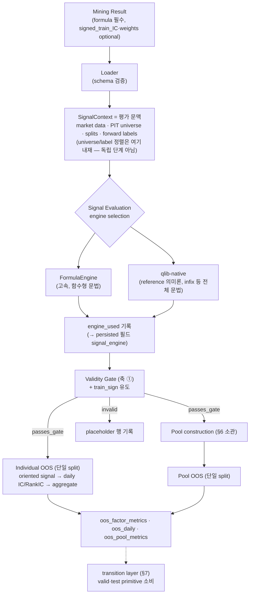

# OOS Test — Component Design Specification (축 ②)

상태: **설계·사양 기준 (2026-08-19).** 본 문서는 구현 실측 기록이 아니라
**normative design specification**이다 — 향후 구현·수정이 따라야 할 계약을
선언하고, 현행 구현의 충족도는 보조 annotation으로만 기술한다. 코드
인용(파일:줄)은 현행 충족도의 증거이지 사양의 근거가 아니다.
**`ASB_design_v2.md`가 framework 계약 정본이며 축 공통 계약(identity·
직렬화, split·purge, undefined 규약, placeholder·reason taxonomy, pool
객체 2층, 판독 단위, evidence class)의 owner다** — 본 문서는 그 소비자이며
OOS 축의 component-level specification이다. 선행 문서:
`validity_gate_design.md`(orientation 유도 — 축 고유 참조).

> 구 `ASB_design.md`(v1)는 **historical implementation evidence**로만
> 인용한다 — split·descriptor·identity·orchestration이 폐기됐다(v2 §14.2).

---

## 1. 개요 및 문서 범위

**목적.** OOS Test는 mining에 사용되지 않은 구간에서 **발견된 alpha의
cross-sectional predictive power가 유지되는가**를 측정하는 factor-level
generalization test다. 측정 대상은 포트폴리오 수익률이 아니라 **signal과
미래 수익률 사이의 예측 관계** 그 자체다.

**축 역할 구분.** OOS = 예측력(signal ↔ forward return), QD = 행동적
다양성, Backtest = 거래 가능한 투자 성과. 세 축은 동일 파이프라인에서
나란히 실행되되 책임이 겹치지 않는다(§3, §5.2).

**용어.**

| 용어 | 의미 |
|---|---|
| Framework axis | **OOS Factor Evaluation (축 ②, `ASB_design_v2.md` §6)** — 공식 명칭 |
| Document shorthand | "OOS Test" — 본 문서의 호칭 |
| primitive | 단일 split에서의 factor/pool OOS 평가 1회 (§3) |
| transition | valid·test의 **individual factor primitive**를 소비하는 파생 분석 계층 (§7). **Pool transition은 v1 scope-out** — 현행 schema는 factor 키(formula_id) 전용이며 pool까지 담으려면 polymorphic schema(entity_kind + formula_id\|pool_id)가 필요하다 |

**상태 annotation 규약.** 각 subsection 말미에 한 줄로만 표기한다:

* **Implemented** — 현행 구현이 본 사양을 충족한다.
* **Proposed** — 본 문서가 **사양으로 채택**하였으나 현행 구현에 변경이
  필요하다 (미결정 제안이 아니다).
* **Not implemented** — 사양상 정의되어 있으나 대응 구현이 전혀 없다.

혼합 subsection 규칙: 구현 변경이 필요한 normative requirement가 하나라도
있으면 그 subsection의 상태는 **Proposed**이며, 이미 구현된 하위 계약은
본문의 충족도 단락에서 명시한다. **implementation-bearing
numbered (sub)section당 status는 정확히 1개**이고, scope는 그 절이
선언하는 normative 계약 전체다 — 다른 절 소관으로 명시된 참조(예: §3의
transition 점선)는 scope 밖이다. §1(문서 범위)과 §2(설계 철학)는
implementation status 대상에서 제외한다.

**Scope / non-scope.** 본 문서는 OOS의 계산 규약·입출력 계약·pool
semantics·generalization 분석·재현성·acceptance criteria를 다룬다.
validity 판정(축 ①), QD descriptor, backtest 수익 계산은 각 문서 소관이다.

## 2. 설계 철학 및 핵심 불변식

1. **Factor-level predictive generalization.** OOS의 질문은 "이 alpha가
   unseen 구간에서 종목 간 상대 수익률을 예측하는가"이다. 비용·회전·
   포트폴리오 규칙은 개입하지 않는다(그것은 Backtest 소관 — §5.2).
2. **Train-only orientation, 재최적화 금지.** sign·weight·threshold 중
   어떤 것도 평가 구간(valid/test)을 보고 결정하지 않는다. 평가 구간에서
   성능이 음수라면 그 값 자체가 OOS 실패 신호이며 뒤집어 보고하지 않는다.
3. **Undefined ≠ zero.** 평가 불가능 상태는 성능 0으로 치환하지 않고
   validity/NaN semantics로 표현한다 — legacy AlphaEval(병리 상태를 0.0
   반환)과의 의도적 결별(§5.3).
4. **Daily primitive 보존.** 집계값만 저장하지 않고 일별 IC/RankIC
   series를 보존한다. 집계 정의(ddof, 최소 관측 등)를 바꿔도 신호
   재계산 없이 재집계 가능해야 하며, 이는 §9의 검증 가능한
   invariant(daily → aggregate 재계산 일치)로 강제된다.
5. **동일 SignalContext.** 모든 마이너의 formula가 동일한 데이터 문맥
   (market data·PIT universe·split·label)에서 평가된다 — 방법론 간
   공정성의 전제.

## 3. 전체 평가 프로세스와 모듈 책임



**계약.**

* universe/label 정렬은 SignalContext가 제공하는 평가 문맥으로,
  orientation 이후의 독립 처리 단계가 아니다.
* signal evaluation은 **engine selection**이다: FormulaEngine이 문법을
  지원하지 않는 경우에만 qlib-native로 같은 수식을 계산해 동일 격자에
  정렬한다. qlib이 reference 의미론이므로 이는 다른 신호로의 silent
  fallback(금지)이 아니며, 사용 엔진은 조회 API `engine_used`로 확인되고
  persisted 필드 `signal_engine`으로 기록된다(두 이름은 각각 런타임
  API와 저장 스키마 필드 — 혼용하지 않는다).
* Validity Gate(축 ①)가 선행하며 `passes_gate=False`는 OOS에서 계산되지
  않는다(placeholder 규약은 §4.2).
* **OOS evaluator가 하지 않는 일**: transaction cost, turnover,
  long/short 포트폴리오 구성, execution price, MDD — 전부 Backtest 소관.
* **단일 split primitive**: OOS 평가의 기본 단위는 "한 split에서의 1회
  평가"다. 여러 split의 비교는 primitive를 반복 실행한 뒤 파생
  계층(§7)이 수행한다.
* **Gate의 split 귀속 (계약 — v2 §3.5.2)**: 각 primitive는 **그 primitive의
  split에서 판정된 validity**를 소비한다 — `run_oos(valid)`는 VALID gate,
  `run_oos(test)`는 TEST gate. 어느 한 split의 gate를 양쪽에 재사용하면
  (TEST gate 고정 → VALID 산출물이 TEST computability에 의존 / VALID gate
  고정 → TEST에서 계산 불가한 factor가 metric NaN 양산) 둘 다 문제이므로
  **split-local**이 정본이다. 따라서 validity 행의 논리적 key는
  **`submission_id × evaluation_context_id × split × evaluation_key`**
  (정본: `validity_gate_design.md` §3 · v2 §10.2.3)이고, 두 split의 gate 통과
  집합이 다를 수 있으므로 `n_gate_only_valid`/`n_gate_only_test`/
  `n_gate_both`를 진단으로 기록한다. transition은 두 split의 validity를
  모두 보존한 상태에서 `TransitionValid`(§7)로 결합한다.

충족도: 현행 `runner.run_validity/run_oos`(runner.py:131-191 — run_validity :131-153, run_oos :156-191)와
`SignalContext.evaluate`(signal_context.py:166-178 docstring)가 위 계약과
일치한다. **status scope**: 본 절의 계약은 primitive pipeline까지다 —
점선의 transition layer와 pool dedup 상세는 각각 §7·§6 소관이며 그
절들의 status를 따른다. **단 본 절이 추가로 선언한 split-local gate 귀속·
validity row identity·차집합 진단은 미구현**이므로(현행은
`split="test"` 단일 호출) 혼합 subsection 규칙에 따라 절 status는
Proposed다. — *Implementation status: Proposed*

## 4. Input과 Output

### 4.1 Input

Conceptual input (함수 인자가 아니라 설계상의 입력):

1. **Formula** — mining result schema에서 **유일한 required column**
   (`RESULT_REQUIRED = ["formula"]`, inputs/schemas.py). 어느 마이너든 이
   공통 표현으로 들어온다. "유일 required"는 **컬럼 단위 제약**이며 행
   단위 유일성(같은 formula가 여러 행으로 오는 raw multiplicity)을
   금지하지 않는다 — dedup·multiplicity 규약은 §6·§7.
2. **Optional upstream `signed_train_IC` — diagnostic 전용 (Y2 확정
   2026-08-21)**: orientation과 admission의 기준은 **항상 ASB의 canonical
   train 재평가**이며 upstream 값은 **provenance + parity 진단**으로만
   쓰인다. 따라서 OOS는 upstream 값을 orientation 입력으로 소비하지 않는다.
   상태 어휘(`upstream_sic_status` 5값)와 처리 규약은
   **`ASB_design_v2.md` §4.4**가 정본이고 축 세부는
   `validity_gate_design.md` §3·§6이다 — 여기서 재정의하지 않는다.
3. **Provenance** — method, seed 등.
4. **SignalContext** — market data, PIT universe, train/valid/test split,
   forward labels. split 날짜는 experiment config가 주입한다.
5. **`oos.horizons`** — 설정 원문(`configs/default.yaml:51-53`):

   ```yaml
   oos:
     horizons: [1]          # OOS는 기본 1d (QD horizon은 qd.horizons)
     save_daily_series: true
   ```

   **Horizons invariant (필수)**: H = (h₁,…,h_m), m ≥ 1, hᵢ ∈ 양의 정수,
   **hᵢ ≠ hⱼ (unique 필수)**. 순서는 semantically meaningful하다 — 첫
   원소가 primary horizon이며 출력 스키마를 결정한다(§5.2). `[1,5]`와
   `[5,1]`은 같은 계산 대상이지만 다른 스키마를 낳으므로 config는 순서에
   책임을 진다.
6. **Pool weights / combiner 설정** — §6. **External weights leakage
   provenance (계약)**: miner 제공 weights는 실험 프로토콜상 허용된
   upstream 구간에서만 결정된 **frozen artifact**여야 하며, valid/test를
   사용해 결정된 weight는 OOS 입력으로 허용하지 않는다. `weight_source`·
   `weight_fit_scope` provenance를 manifest/row metadata에 기록한다.
   weights의 형식 계약(deduplicated formula_id당 정확히 1개 — positional
   mapping 불허)은 §6.

충족도 — formula 입력·signed_train_IC 소비·SignalContext: 구현됨 /
horizons invariant 검증: 구현 변경 필요 / weight provenance 필드: 구현
변경 필요. — *Implementation status: Proposed*

### 4.2 Output

두 층으로 기술한다: **현행 schema(실측)**와 본 문서가 채택한 **target
canonical schema(사양)**.

**현행 schema (실측, 2026-08-19 실 parquet 대조)**:

* `oos_factor_metrics` — **현행 코드 기준 18컬럼**(horizons=[1]; 구
  산출물은 `signal_engine` 없는 17컬럼 — 이 목록은 현행 코드 산출물
  기준이다): `split`, `IC`,
  `RankIC`, `ICIR`, `RankICIR`, `ICIR_ann`, `RankICIR_ann`, `n_ic_obs`,
  `formula`, `train_sign`, `kind`, `method`, `seed`, `signed_train_IC`,
  `train_sign_restored`, `valid`, `invalid_reason`, `signal_engine`.
  multi-horizon 시 `_kd` suffix 컬럼 추가(§5.2) — 고정 폭 아님.
* `oos_daily` — `date`, `formula_id`(주의: **raw formula 문자열** —
  stable id 아님), `horizon`, `IC`, `RankIC`, `n_valid`,
  `coverage_ratio`. pool의 daily 행도 이 테이블에 포함된다
  (formula_id = pool_id — runner.run_oos 실측).
* `oos_pool_metrics` — metric 컬럼(individual과 동형) + `kind="pool"`,
  `n_factors`, `n_unique_factors`, **`weights_source`**(값 `"input"` |
  `"equal_default"` — runner.py:64), **`n_factors_dropped_by_gate`**,
  그리고 현행 코드가 추가로 기록하는 `combiner`·`n_no_direction`
  (runner.py:183-186). 디스크의 구 산출물은 뒤 두 필드가 없다.

**Target canonical schema (사양)** — 채택된 계약들(§5.5·§6·§7)의 통합:

**Logical primary key (계약 — 정본은 `ASB_design_v2.md` §10.2)**. dimension
표기: D1 = `submission_id`, D5 = `evaluation_context_id`, D6 =
`report_window_id`.

```
oos_factor_metrics  PK = D1 × D5 × split × D6 × oos_protocol_version
                         × evaluation_key
oos_daily           PK = D1 × D5 × split × oos_protocol_version
                         × entity_kind × entity_id × horizon × date
oos_pool_metrics    PK = D1 × D5 × split × D6 × oos_protocol_version × pool_id
```

* **horizon 형식**: `oos_factor_metrics`는 **wide**(`_{h}d` suffix — §5.2)
  이므로 **horizon을 key에 넣지 않는다**. `oos_daily`·
  `oos_transition_metrics`는 **long**이므로 horizon이 key다. 두 형식을
  혼용하거나 wide 테이블에 horizon을 key로 넣으면 breaking change다.
* **`oos_protocol_version`이 PK에 있는 이유**: 이 버전은 D5 payload에
  들어가지 않으므로(v2 §3.1.6) key에 없으면 **같은 PK에 서로 다른 pair
  masking·aggregate semantics의 결과가 들어간다**.
* **daily에는 D6를 넣지 않는다**: daily panel은 split당 1회 생성되고
  window는 그 위의 날짜 필터이므로(v2 §3.3.3), D6를 넣으면 Strict 날짜가
  Full·Strict 아래 중복 저장된다. D6는 **집계 산출물에만** 붙는다.
* **`evaluation_key`를 쓰는 이유**: `formula_id = null`을 key로 쓰면
  canonicalization 실패 행이 전부 한 key로 충돌한다(v2 §3.1.2).

* `oos_factor_metrics` — 현행 + **`formula_id`**(stable hash, §7 —
  transition join key를 primitive가 직접 제공; `formula`는 audit field로
  유지) + `evaluation_key`.
* `oos_daily` — **polymorphic entity key**(factor 행과 pool 행을 한 key로
  겸할 수 없다):

  ```
  date, entity_kind,          # factor | pool   ← 논리 key 구성요소
  entity_id,                  # evaluation_key (factor) | pool_id (pool)
  formula_id, formula,        # entity_kind=factor 전용 (가독용 — pool 행은 null)
  pool_id,                    # entity_kind=pool 전용 (가독용)
  horizon, IC, RankIC,
  n_universe, n_signal_valid, signal_coverage_ratio,
  n_pair_valid, pair_coverage_ratio,
  n_valid, coverage_ratio     # deprecated aliases (§5.5)
  ```

  **Identity 분리 (계약)**: `formula_id`는 formula 전용 stable
  identity(§7)이므로 pool 행에 재사용하지 않는다 — 현행의
  "formula_id = pool_id" 관행은 폐기한다. 현행 `kind` 컬럼과 분리 컬럼
  (`formula_id`/`pool_id`)은 **가독용으로 유지**하되 논리 key는
  `entity_kind × entity_id`다(제3의 스키마를 만들지 않는다).
* `oos_pool_metrics` — 현행 + **`valid`, `invalid_reason`**(§6의
  pool-level placeholder가 요구 — schema bookkeeping),
  `pool_id`·**`factor_set_id`**·**`submission_id`**(§6 — v2 §3.1 ②③),
  `n_factors_raw`,
  `n_unique_factors`(dedup 후), **`n_active_factors`**(combiner
  eligibility 후 실제 weight ≠ 0인 component 수 — zero-support의 k 집합과
  일치), `duplicate_rate`(§6), **`weight_source`**, `weight_fit_scope`
  (§4.1-6). 기존 `n_factors`(현행 = raw 입력 count, evaluate_pool의
  len(formulas))는 **`n_factors_raw`의 deprecated alias**로 고정한다 —
  신규 코드는 사용 금지.
  **`weight_source` 명명 (계약)**: 현행에 이미 **`weights_source`**
  (복수형)가 존재하므로 이는 신규 필드가 아니라 **개명**이다 —
  canonical 이름은 `weight_source`(단수, `weight_fit_scope`와 짝),
  `weights_source`는 **deprecated alias**로 유지하며 두 컬럼을 동시에
  신설하지 않는다. **값 도메인 (canonical enum — 정본은
  `ASB_design_v2.md` 부록 A.10)**:
  `raw_equal` | `train_signed_equal` | `external` | `native`.
  **deprecated 값 매핑**: 현행 `"input"` → `external`,
  `"equal_default"` → `raw_equal`. 신규 코드는 canonical 값만 쓴다.
* **`zero_support_ratio`의 저장 위치 (결정)**: 일별 지표이므로 별도
  파일을 신설하지 않고 **`oos_daily`의 pool 행(kind="pool")의 추가
  컬럼**으로 저장한다 — 현행 구조상 pool daily가 이미 같은 테이블에
  있으므로 정합적.
* `oos_transition_metrics` — §7의 long-form schema. PK는 **window pair를
  포함**한다:

  ```
  PK = D1 × D5 × oos_protocol_version
       × source_split × source_window_id
       × target_split × target_window_id
       × evaluation_key × horizon
  ```

  window가 key에 없으면 Full transition과 Strict transition이 충돌한다.
  VALID은 window가 1개이므로 명시적 ID **`valid_full`** 을 부여한다
  (v2 부록 A.7).

**Invalid placeholder 행 invariant (계약)** — `passes_gate=False`
formula는 계산 없이 행으로 기록되며 반드시: `valid = False` ∧ metric
필드 전부 NaN/부재 ∧ `invalid_reason` non-empty (runner.py:161-165 —
충족).

충족도: 현행 schema는 위 실측과 같고 placeholder invariant는 구현됨;
target canonical schema(formula_id·coverage 신명명·kind·pool 진단·
provenance·transition)는 구현 변경 필요.
— *Implementation status: Proposed*

## 5. 평가 방법

### 5.1 Signal Orientation

* `train_sign = +1 if IC_train ≥ 0 else −1` — **0은 +1로** 귀속(경계
  규약). `IC_train`은 **ASB canonical train 재평가값**이다(Y2 확정 —
  upstream 제출값을 쓰지 않는다, `ASB_design_v2.md` §4.4).
  `oriented(values, train_sign)`은 ±1 외 입력을 거부한다
  (signal_context.py:222-225).
* valid/test에서 sign을 재추정하지 않는다 — OOS evaluator는 train_sign을
  **입력으로만** 받으며 평가 데이터로 방향을 추정하는 경로가 존재하지
  않는다(oos/evaluator.py:6-7).
* upstream `signed_train_IC`의 **diagnostic 지위**와 5-status 어휘는
  `ASB_design_v2.md` §4.4가 규범이며, 축 세부는
  `validity_gate_design.md` §3·§6이다(§4.1). **`zero_ic_observations`는
  경로와 무관하게 항상 적용**된다 — 이전 판의 "upstream 제공 시 우회"는
  폐기됐다.

충족도 — orientation의 **1회 적용**과 평가 구간 sign 재추정 금지: 구현됨
(`oos/evaluator.py:6-7`, `signal_context.py:222-225`) / **canonical
재평가 일원화**(upstream SIC를 orientation 입력으로 쓰지 않음): 현행
구현은 upstream 값을 사용하므로 **구현 변경 필요**.
— *Implementation status: Proposed*

### 5.2 Forward Return과 Multi-Horizon

* **Label 정의**: y_{i,t} = close_{i,t+h}/close_{i,t} − 1
  (labels.py:31-35). h = horizon.
* **Primary/additional**: primary = `horizons[0]` — 컬럼 suffix 없음;
  나머지 h는 `IC_{h}d` 식 suffix(oos/evaluator.py:46).
* **Post-end 가격 참조 (범위 잠금 — v2 §3.3.2)**: 이 허용은
  **terminal TEST extension 전용**이다 — 데이터셋 종료 이후 가격을 참조해
  **이미 고정된 TEST 구간**의 label을 완성하는 경우에만 적용되고,
  manifest에 `label_uses_post_end_price`로 기록된다(manifest.py:55).
  **내부 경계(TRAIN→VALID, VALID→TEST)에서는 이 플래그로 post-end 참조를
  정당화할 수 없다** — 그 경계는 purge 대상이다(그러지 않으면 VALID 마지막
  h일의 label이 TEST 가격을 쓰고, 그 label로 freeze한 QD τ_q·grid가 TEST를
  간접 소비한다). 또한 **post-end 관측은 target construction 전용**이다 —
  signal evaluation, orientation, universe 구성, weight/threshold 결정
  어디에도 사용할 수 없다. purge 거래일 수·buffer 거래일 수·실제 참조한
  마지막 날짜는 manifest에 기록한다.
* **status 주의**: 본 절의 label 정의·primary/additional suffix·enum 공존은
  구현됐으나 **post-end 범위 잠금(terminal TEST extension 한정)과 purge
  경계 판정, manifest 기록 의무는 미구현**이다 → 혼합 subsection 규칙에 따라
  절 status는 Proposed.
* **OOS label ≠ Backtest execution return.** labels.py에
  `forward_return`(OOS)과 `execution_return`(backtest,
  canonical enum `same_close`/`next_open_oo`/`next_open_oc`/
  `delayed_close_cc`)이 **별도 함수로 공존**한다
  (`forward_return` :31-35, `execution_return` :38-50). OOS는
  predictive relationship을, Backtest는 tradable execution outcome을
  측정하며, 두 정의를 일치시킬 의무는 설계상 존재하지 않는다 — 이것이
  축 분리의 구체적 표현이다.

충족도 — label 정의·primary/additional suffix·두 함수 공존: 구현됨 /
post-end 범위 잠금(terminal TEST extension 한정)·purge 경계 판정·manifest
기록: 구현 변경 필요. — *Implementation status: Proposed*

### 5.3 Daily IC / RankIC

* **Valid pair**: 날짜 t의 pair 집합 = U_t ∩ F(S_t) ∩ F(Y_t)
  (PIT universe ∧ finite signal ∧ finite label — 3중 교집합,
  oos/evaluator.py:56, metrics.py:32).
* **Daily IC** = pair 집합에서의 cross-sectional **Pearson** corr.
  **최소 pair 2**; pair < 2 또는 분산 퇴화/비유한 → 그날 NaN
  (metrics.py:43-44). 시간축 corr·panel flatten이 아니다.
  주의: 2는 Pearson이 정의되는 **수학적 최소치**이지 statistical/research
  adequacy threshold가 아니다 — pair 2개의 non-degenerate Pearson은
  사실상 ±1이다. 적정 관측 규모의 판정은 Validity Gate의 research
  threshold 소관(역할 분리).
* **Daily RankIC** = 같은 pair 집합에서 일별 **rank(tie = average)** 후
  Pearson(= Spearman, metrics.py:53-59).
* **±inf 처리 — legacy와의 의도적 차이**(metrics.py:12-15 명문): legacy
  AlphaEval ictester는 ±inf 셀을 corr에 포함시켜 그날 IC를 NaN으로
  만들고 NaN일 비율 > 50%면 **0.0을 반환**했다. ASB는 inf를 invalid
  cell로 제외하고(validity가 진단), 병리 상태를 0 치환이 아니라
  validity/invalid_reason과 NaN으로 보고한다(§2 불변식 3).

— *Implementation status: Implemented*

### 5.4 Aggregate Metrics

* Mean IC / Mean RankIC = **finite daily 값의 시간 평균**(flatten 금지).
* ICIR = mean(daily) / std(daily, **ddof=1**), raw — √252를 곱하지
  않는다(AlphaForge 관례 provenance, metrics.py:8-9). n_obs < 2 → NaN.
* `ICIR_ann`/`RankICIR_ann` = raw × √252, **항상 저장**되는 별도 컬럼.
  **통계적 주의(계약)**: 이는 252 trading-day **conventional scaling**
  이다. h > 1이면 forward label이 겹쳐 daily IC series에 serial
  dependence가 생기므로, `*_ann`을 독립 관측 전제의 엄밀한 annualized
  inference로 서술해서는 안 된다.

— *Implementation status: Implemented (annualization 주석은 문서 계약)*

### 5.5 Coverage와 Missingness

분자·분모를 수식으로 계약화한다:

* n_pair(t) = |U_t ∩ F(S_t) ∩ F(Y_t)| — 현행 `n_valid`
  (evaluator.py:56-57).
* PairCoverage(t) = n_pair(t) / |U_t| — 현행 `coverage_ratio`(분모 =
  universe, evaluator.py:58). **현행 두 이름의 분자는 pair count다 —
  signal coverage가 아니다.**
* SignalCoverage(t) = |U_t ∩ F(S_t)| / |U_t| — label과 무관한 신호
  자체의 커버리지. 두 지표는 label 결측이 있는 날 서로 다르며, 구분이
  없으면 "신호가 있는데 label이 없어 평가 못한 날"과 "신호 자체가 없는
  날"을 사후에 구별할 수 없다.
* **|U_t| = 0 edge (계약)**: 빈 universe 날의 coverage는 **NaN**이다 —
  0.0으로 두지 않는다(undefined ≠ zero, §2). 충족도: 현행 구현은
  `max(n_universe, 1)` 분모 치환으로 **0.0을 반환**한다
  (분모는 evaluator.py:58, ratio 대입은 :62). **층위 구분**: OOS
  산출물(`oos_daily`의 coverage 컬럼)에 대해서는 이것이 **계약**이며
  구현 필수다. 이를 **ASB 공통 규약**("empty-universe day의
  coverage = NaN")으로 승격하는 것은 **제안**이다 — validity
  축의 현행 규약(universe 0 → coverage 0,
  `validity_gate_design.md` §5의 threshold 표 실측 기재)과 어긋나므로
  `Known documentation discrepancy`로 기록하고 축 간 sync 대상으로
  관리한다. **소유권 (문서 관리 — 2026-08-21 해소)**: 축을 넘는 공통 규약이므로 최종
  선언은 **`ASB_design_v2.md` §3.4**가 맡으며, 그 문서가 **coverage =
  NaN을 공통 target으로 확정**했다(집계 규약 포함: 빈 날은 평균 분모에서
  제외하고 `n_empty_universe_days` 병기). 본 절은 소비자이며, validity
  구현의 0은 **Known implementation deviation**으로 남는다(변경은 판정
  semantics breaking change).
* **신명명 체계 채택**: `n_universe`, `n_signal_valid`,
  `signal_coverage_ratio`, `n_pair_valid`, `pair_coverage_ratio`. 기존
  `n_valid`/`coverage_ratio`는 backward-compatible alias로 유지한다.

충족도: pair 계열은 구현되어 있으나(위 인용) signal 계열 분리·신명명은
구현 변경이 필요하다. — *Implementation status: Proposed*

## 6. Alpha Pool OOS 평가

**원칙**: pool의 OOS는 component IC의 평균이 아니라 **결합된 signal
자체를 다시 평가**한 값이다 — IC_pool ≠ Σ wₖ·IC_k (factor 간 상관·scale·
missingness가 결합 신호를 바꾼다).

**결합 정의** (signal_context.combined_signal:241-257):
combined_t = Σₖ wₖ · CSZScore(alpha⁽ᵏ⁾_t). z-score는 일별 cross-sectional
(ddof=0, std < 1e-8 → 1 치환).

**Pool pipeline 순서 (계약)** — 결합의 각 단계는 아래 순서로 고정된다:

```
제출 components
→ formula_id 부여 (§7 — 정본은 ASB_design_v2 §3.1.3)
    └─ canonicalize 실패 → evaluation_key = raw_failure_key,
                            owner=factor / stage=identity, 집합에서 제외
→ canonical dedup (본 절 duplicate 사양)
→ **factor_set_id 생성**            ← split-local gate·combiner 이전
→ [guard] n_unique_factors == 0 ?
    └─ yes → submission_evaluation_status(empty_factor_set_after_identity)
             owner=submission / stage=identity, pool 행 없음 → STOP
→ split-local gate 적용 → gate_pass_components (해시에 들어가지 않음)
→ [guard] |gate_pass_components| == 0 ?
    └─ yes → pool placeholder(empty_pool_after_gate)
             owner=pool / stage=gate → pool_id 생성 → STOP
→ combiner별 eligibility
    └─ train_signed_equal: directional filtering (|sic| > sign_threshold)
→ [guard] Active == ∅ ?
    └─ yes → pool placeholder(no_active_components)
             owner=pool / stage=combiner → pool_id 생성 → STOP
→ weight construction / resolution / validation
    ├─ external:           formula_id → weight (매핑 invariant W = C 검사)
    │                       위반 → malformed_external_weights
    │                       owner=track / stage=input_validation (hard error)
    ├─ raw_equal:          1/N_unique
    └─ train_signed_equal: signᵢ / |kept|
→ pool_id 생성 (pool_scope = full_factor_set)
→ daily z-score
→ combined signal
→ OOS evaluation
```

**`factor_set_id`는 gate 이전에 생성된다 (계약)**: gate 이후에 만들면 같은
제출물이 VALID·TEST에서 다른 ID를 받아 combiner-independent submission
identity라는 정의가 깨진다. **전원 gate 탈락에도 원래 `factor_set_id`를
유지**한다(정본: `ASB_design_v2.md` §3.1.4).

canonical identity → dedup → **directional eligibility → weight
normalization**의 순서는 뒤집을 수 없다 — train_signed_equal의 분모
|kept|가 filtering 결과에 의존하기 때문이다. **두 guard는 pipeline의
필수 구성요소다** — weight construction 단계는 분모가 양수임이 보장된
상태에서만 진입하며, 이로써 "division-by-zero 경로는 존재해서는 안
된다"(아래 no-active 규약)가 순서 계약과 동시에 성립한다.

**Pool identity (계약)**: pool은 formula가 아니므로 `formula_id`를
재사용하지 않고 **`pool_id`**로 식별한다(§4.2). **`pool_id`의 본질은
canonical pool construction state의 identity**다 — dedup 후 candidate
set, combiner 및 construction-relevant parameters, 그리고 eligibility·
weight resolution 후의 active weighted component set을 **함께** 식별
한다. 구성원 목록만으로는 부족하고(구성원·combiner·threshold가 같아도
train_signed_equal의 sign 벡터가 run마다 다르면 combined signal이
다르다) resolved weights만으로도 부족하다(어떤 candidate가 걸러져
active가 비었는지 추적할 수 없다). 따라서 pool_id는 **resolved weights
확정 직후**, 아래 construction payload 전체로 생성한다:

```
factor_set_id : 제출 집합의 content identity (gate·combiner 이전)
pool_id       : construction identity (pool_scope·resolved weights 포함)
```

**payload의 정본은 `ASB_design_v2.md` 부록 A**(A.3·A.4)이며 본 절은
재정의하지 않는다. OOS 측에서 알아야 할 것만 요약한다:

* `factor_set_id`는 **combiner-independent**하고 gate 이전 집합을 담는다 →
  Final-Pool QD·as-submitted provenance의 key.
* `pool_id`는 `factor_set_id` + combiner + `combiner_params` +
  `weight_source` + **`ordered_resolved_weights`** + `pool_scope`를 담는다 —
  resolved weights가 없으면 **같은 active 집합에 서로 다른 external weight를
  적용한 두 pool이 같은 ID를 얻는다**.
* Track A는 하나의 `factor_set_id` 아래 **`pool_id` 2개**(combiner)를 만들고,
  각 `pool_id`에 **`deployment_config_id` 4개**가 붙어 8행이 된다 —
  `pool_id`는 "8 cell의 identity"가 아니다.
* ⚠ payload 변경은 **`pool_schema_version` bump**를 동반하며 기존 산출물의
  `pool_id`와 값이 달라진다.

**Active set의 단일 정의 (계약 — 세 축 공통)**:

\[
\text{Active} = \{\, i : i\ \text{eligible} \;\wedge\; w_i \neq 0 \,\}
\]

이 정의를 아래 세 곳이 **동일하게** 사용한다 — 어긋난 서술이 있으면
본 정의가 우선한다:

| 대상 | 집합 |
|---|---|
| `candidate_components` (**`factor_set_id` payload** — v2 부록 A.3) | canonicalizable + dedup된 **제출 formula 전체**(gate·combiner 이전) — external weight = 0인 component도 포함 |
| `gate_pass_components` (해시 밖, split별) | 위 중 split-local gate를 통과한 부분집합 |
| `active_components` (`pool_id` payload) / `n_active_factors` (§4.2) | Active (위 정의 — w = 0은 제외) |
| SupportCount·zero_support_ratio의 k 범위 (아래 zero-support 진단) | Active |

⚠ **소속 주의**: `candidate_components`는 **`factor_set_id`의 payload**이며
`pool_id` payload에는 없다 — `pool_id`는 `factor_set_id`를 참조한다
(v2 §3.1.5). 이전 판이 이를 pool_id payload 필드로 기술했던 것은 폐기됐다.

즉 external weights에서 명시적으로 0을 받은 component는
**construction candidate로는 존재하지만 signal support에는 기여하지
않는다** — combined signal에 실제로 들어가지 않으므로 active가 아니다.

`pool_id`가 `factor_set_id`를 참조하지 않으면 서로 다른 construction
attempt가 모두 active = []일 때 같은 pool_id를 얻어 "어떤 attempt가
실패했는지 추적"이라는 목적과 모순된다. 이 정의에서: [A,A,B]와 [A,B]는
dedup 후 factor set이 같아 **동일 `factor_set_id`**(dedup 동등성 보존) /
[A,B]→active=[]와 [C,D,E]→active=[]는 `factor_set_id`가 달라 **서로 다른
pool_id** / 같은 factor set이라도 threshold·combiner 또는 resolved weights가
다르면 서로 다른 pool_id.

이 규칙 하나로 raw_equal / train_signed_equal / external weights가 모두
동일 identity 체계로 처리된다. **pool_id는 signal-equivalence hash가
아니라 canonical pool construction identity다** — 동일한 resolved
signal이라도 construction policy(combiner)가 다르면 다른 pool_id를
가질 수 있으며, 이는 의도된 것이다(provenance-first: "어떻게
만들어졌는가"가 identity의 일부). 같은 이유로 **resolved mapping을
만드는 데 의미 있게 관여하는 combiner parameter(`sign_threshold` 등)도
`combiner_params`로 hash에 포함**한다 — 우연히 같은 kept·weights를 낳은
다른 threshold가 같은 ID를 얻으면 construction identity 명칭과
모순이다. construction에 관여하지 않는 부가 정책은 provenance
(manifest)로만 기록한다. 생성 위치는 pipeline의
weight resolution 직후(§ pipeline: … → weight construction →
**pool_id 생성** → daily z-score).

**Weights 출처 3종** (dedup된 canonical 집합 위에서 정의):
① miner 제공 frozen weights — **deduplicated stable formula_id당 정확히
하나의 weight**를 제공해야 한다(사실상 formula_id → weight 매핑 계약).
duplicate raw row + positional weight mapping은 canonical pool 입력으로
**허용하지 않는다**(거부 — 오류). duplicate weights의 합산 대안은
채택하지 않는다: raw multiplicity가 canonical weighting에 간접 재유입되기
때문이다. **매핑 invariant: W = C** — weight mapping의 key set(W)은
canonical component set(C)과 정확히 일치해야 한다: missing weight /
unknown·extra formula_id / duplicate key / non-finite 값 / all-zero
vector 전부 **오류**. ASB는 제공된 값을 암묵적으로 재정규화하지 않고
그대로 사용하며, 음수 weight는 허용한다(의도적 signed combination 지원). ② `raw_equal`(기본, label-free): **wᵢ = 1/N_unique**.
③ `train_signed_equal`: wᵢ = signᵢ/|kept|, kept = dedup 후
|signed_train_IC| > `sign_threshold`(기본 0.0)를 통과한 directional
component — **L1-normalized directional equal weighting**이다:
Σ|wᵢ| = 1이지만 일반적으로 Σwᵢ ≠ 1. **ASB 내부 weight fitting은
존재하지 않으며 도입하지 않는다** — 평가 구간 재최적화 금지 원칙(§2)의
pool 형태. external weights의 leakage provenance 계약은 §4.1-6.

**No-active-components 규약 (계약)**: 평가 가능한 pool이 존재하지 않는
상태는 입력 오류와 구분해 처리한다 —

**reason 3값 (배타 — v2 §3.5.3)**: 실패 단계가 다르므로 하나의 이름으로
접지 않는다.

| reason | 조건 | 처리 |
|---|---|---|
| `empty_pool_after_gate` | **`n_unique_factors > 0`이면서** split-local gate를 통과한 candidate가 **0개** → combiner 진입 불가 | pool-level invalid placeholder |
| `empty_factor_set_after_identity` | **`n_unique_factors = 0`**(canonicalizable formula가 없음) → pool construction 시도 자체가 없음 | **owner = submission** — `submission_evaluation_status` 1행, **`pool_id` 없음**(v2 §3.5.3) |
| `no_active_components` | candidate는 존재하나 combiner eligibility·weight support 이후 **Active = ∅**(예: train_signed_equal의 kept = ∅) | pool-level invalid placeholder |
| `malformed_external_weights` | 매핑 invariant W = C 위반 또는 non-empty all-zero external vector | **hard error**(placeholder 아님) |

* 위 두 placeholder 사유는 malformed input이 아니라 "평가할 pool이
  없음"이므로 hard error가 아닌 **pool-level invalid placeholder**로
  기록한다. **기록 범위 (계약)** — `valid = False`,
  `invalid_reason ∈ {empty_pool_after_gate, no_active_components}`이며 두
  필드군을 구분한다:
  * **diagnostic·identity·provenance 필드는 가능한 범위에서 기록**:
    `pool_id`, `n_factors_raw`, `n_unique_factors`,
    `n_active_factors = 0`, `duplicate_rate`, `weight_source`,
    `weight_fit_scope`, `combiner`.
  * **performance metric 필드는 NaN**: `IC`, `RankIC`, `ICIR`,
    `RankICIR`, `ICIR_ann`, `RankICIR_ann`, `n_ic_obs` 및 multi-horizon
    suffix 변형 전부.

  daily pool series는 미생성이며, pipeline의 guard(위)에 의해
  division-by-zero 경로는 존재해서는 안 된다.
  **placeholder의 pool_id는 null이 아니다** — `active_components: []`를
  포함하되 `construction_input_id`(= 원래 `factor_set_id`)는 **그대로
  보존**한 동일 payload의 deterministic hash를 부여한다(어떤 pool
  construction attempt가 실패했는지 안정적으로 추적 — provenance-first).
  결과 상태는 pool_id가 아니라 `valid=False`가 나타낸다.
* **external weights의 non-empty all-zero vector**: malformed input —
  `malformed_external_weights`로 **hard error**(매핑 invariant W = C 참조).

충족도: 현행 구현은 kept = ∅에서 빈 목록을 반환하고
(runner.py:107-108) `len(pool_f) >= 1` 가드로 pool 평가를 **기록 없이
건너뛴다**(silent skip — placeholder 행 없음). 0-나눗셈은 없지만 감사
기록이 남지 않으므로 placeholder 규약은 구현 변경이 필요하다.

충족도: 현행 구현은 dedup 없이 입력 목록 그대로 결합하며(1/n의 n = 전체
입력 factor 수, weights는 positional list — loaders의 길이 검증), 위
pipeline·매핑 계약은 구현 변경이 필요하다(runner.py:93-110 참조).

**sic = 0 이중 규약** (명문화): 개별 factor orientation은 +1(§5.1)이지만
`train_signed_equal`에서는 |sic| > threshold(기본 0)를 만족하지 못해
**no_direction으로 pool에서 제외**된다(runner.py:100-107) — 두 경로의 0
처리가 다르며 이는 의도된 차이다(방향 증거가 없는 factor를 pool 방향
결정에 쓰지 않는다).

**Missing-component semantics** (실측 계약화): component의 결측 셀은
z = 0으로 **중립 기여**한다(pool 신호를 NaN으로 만들지 않음). **weight
재정규화는 없다.** combined의 valid mask = universe mask("결합 신호는
결측을 0으로 본다" — signal_context.py:247-248 docstring). 상수
component는 std 치환에 의해 z = 0 기여.

**Zero-support 진단 (채택 사양)**: 위 semantics의 부작용 — 어떤 종목의
**모든** component가 결측이어도 combined = 0으로 "신호 존재"처럼 보인다.
이를 가시화하기 위해 SupportCount_{i,t} = Σₖ 1[alpha⁽ᵏ⁾_{i,t} finite],
zero_support_ratio_t = |{i ∈ U_t : Support = 0}| / |U_t| 를 pool 진단으로
저장한다(저장 위치는 §4.2). **k의 범위 = active component set의 단일
정의** — dedup → combiner eligibility 적용 후 **resolved weight ≠ 0**인
component만 센다(raw 입력이 아니며, "weight가 부여되었는지"가 아니라
**값이 0이 아닌지**가 기준이다). external weights에서 어떤 component에
명시적으로 0을 준 경우 그 component는 combined signal에 기여하지
않으므로 active가 아니다 — 이 정의는 §4.2의 `n_active_factors`와
**동일 집합**이어야 하며 두 곳의 문구가 어긋나면 본 정의를 따른다.
|U_t| = 0이면 zero_support_ratio_t = NaN(§5.5의 공통 undefined
semantics와 일관).

**Duplicate formula 처리 (사양 — 현행 동작을 승격하지 않음)**: 현행
구현은 pool 입력의 중복 formula를 제거하지 않아 multiplicity가 사실상
가중으로 작용한다(실측: pool 구성 목록이 unique 목록이 아님 —
`n_unique_factors` 진단 컬럼의 존재 이유). 이를 normative로 채택하지
**않는다**. **사양**: canonical pool evaluation은 **stable formula_id
기준으로 dedup**한다. raw multiplicity는 search/trajectory 계층에
보존하고 `n_factors_raw`/`n_unique_factors`/`duplicate_rate` 진단으로
노출한다 — **duplicate_rate = (n_factors_raw − n_unique_factors) /
n_factors_raw**, 단 n_factors_raw = 0이면 NaN(undefined ≠ zero, §2). miner가 특정 factor에 더 큰 가중을 의도한다면 duplicate
row가 아니라 **explicit weights로만** 표현해야 한다.
**Metadata conflict 규약**: 동일 stable formula_id로 collapse되는
rows는 contract-relevant metadata(`signed_train_IC` 등)가 일치해야
한다 — 불일치 시 canonical dedup을 중단하고 **hard error**
(first-row-wins 금지). raw multiplicity는 허용하되 semantic/provenance
conflict는 허용하지 않는다. 근거: 방법별
duplicate 발생률 차이가 pool weighting을 오염시키면 method-agnostic
비교가 깨지고, §7의 uniqueness 계약과도 충돌한다.

충족도 — 결합 수식·missing-component semantics·sic=0 이중 규약·
L1-normalized weighting: 구현됨(인용 참조) / pipeline의 dedup·weight
매핑·metadata conflict 검사·zero-support 진단: 구현 변경 필요.
— *Implementation status: Proposed*

## 7. Validation → Test Generalization

**아키텍처 (확정)**: OOS primitive는 split-local로 유지한다 —
`run_oos(valid)`와 `run_oos(test)`를 독립 실행하고, **transition은 두
primitive 결과를 소비하는 파생 계층**이다. primitive 스키마에
`IC_valid`/`IC_test` 병행 컬럼을 넣지 **않는다**(불채택).

**Entity scope (v1 확정)**: transition의 대상은 **individual factor
primitive 전용**이다 — 아래 long-form schema의 키가 `formula_id`이고
`pool_id`·`entity_kind` 컬럼이 없으므로 pool transition은 이 스키마로
표현되지 않는다. **Pool transition은 v1 scope-out**이며, 도입하려면
polymorphic schema(`entity_kind` + `formula_id`|`pool_id`)를 별도
설계해야 한다(§1 용어표와 동일 선언).

```
run_oos(valid) ─┐
                ├─→ oos_transition_metrics (derived layer)
run_oos(test) ──┘
```

현행 `runner.run()`은 단일 split만 실행하므로 2-split orchestration은
구현 변경 사항이다. 현재 transition 분석은 notebook 계층에 존재하며
(asb_results_explorer_v2.ipynb — 정의·cutoff 사전 등록), 본 사양은 이를
정식 산출물로 승격한다.

**IC_valid 출처의 변경 (명시)**: 구 구현 실측(`ASB_design.md` §4.3
[v1-hist])은
"OOS는 test에서만 실행되며 pool-level valid IC는 저장되지 않으므로
valid→test 전이 분석은 **QD descriptor의 `valid_IC_1d`** 를
사용한다"이다. 본 사양은 IC_valid의 출처를 **`run_oos(valid)`
primitive**로 바꾼다. 두 가지를 명시한다:

* **Factor-level parity**: QD descriptor의 IC는 `oos.metrics`의
  `daily_ic_series`/`aggregate_ic`를 그대로 호출하므로(동일 kernel·
  동일 pair masking·동일 oriented signal) 승격 후 값은 factor 단위로
  일치해야 한다 — 승격 시 **notebook 수치와의 parity 확인이 acceptance
  항목**이다(§9).
* **Pool-level**: pool valid IC는 현재 **존재하지 않으므로**
  pool transition은 2-split orchestration 이후에만 가능하다. v1
  transition 산출물의 키는 factor 단위(formula_id)이며 pool transition은
  scope 밖이다.

**Identity 계약 — canonical unique view.** 평가 계층 전체(factor OOS·
pool OOS·transition)는 **canonical unique formula 집합** 위에서
동작한다. raw multiplicity(탐색이 같은 formula를 몇 번 시도했는가)는
trajectory/search diagnostics 계층에만 보존한다:

```
Raw mined candidates
      ├─ raw multiplicity → trajectory / search diagnostics
      └─ canonical unique formulas → factor OOS · pool OOS · transition
```

**각 primitive split 내에서 독립적으로** (formula_id, method, seed,
horizon)이 unique여야 하며(valid∪test 합집합에는 당연히 같은 키가 양쪽에
존재한다), transition은 이 키로 valid ↔ test의 **one-to-one join**을
수행한다. join 전 split별 uniqueness assertion 필수 — **위반 시 hard
error**(동일 값이라도 자동 collapse하지 않는다).
**Evaluation context 계약**: method+seed만으로는 실험 문맥이 식별되지
않는다(예: CSI300과 CSI800의 GP seed 42가 섞이면 안 됨). transition은
join 전에 **valid와 test가 동일 `evaluation_context_id`이고 동일
`oos_protocol_version`** 이라는 assertion을 통과해야 하며 두 값을 출력에
포함한다. **`oos_protocol_version`을 별도로 검사하는 이유**: 이 버전은 D5
payload에 들어가지 않으므로(v2 §3.1.6) context 동일성만으로는 동일 OOS
semantics가 보장되지 않는다.

**`evaluation_context_id`의 payload는 본 문서가 정의하지 않는다** —
정본은 **`ASB_design_v2.md` 부록 A.6**이다. OOS가 알아야 할 두 가지만
기술한다:

1. **`oos_protocol_version`은 context payload에 들어가지 않는다**
   (v2 §3.1.6 — 축 버전을 공통 context에 넣으면 QD descriptor 버전 변경이
   OOS cache와 validity 행 identity까지 무효화한다). 대신 **OOS 산출물의
   PK와 cache key에 별도 컬럼으로 노출**된다(§4.2·§8).
2. **현재 평가 중인 split selector(valid|test)는 제외**된다 — 그래야 같은
   실험의 두 primitive가 `(evaluation_context_id = X, split=valid)`와
   `(X, split=test)`로 정확히 짝지어진다.

**transition의 논리적 identity**는 §4.2의 PK를 따른다 —
`D1 × D5 × oos_protocol_version × source_split × source_window_id ×
target_split × target_window_id × evaluation_key × horizon`. 이전 판의
`(evaluation_context_id × formula_id × method × seed × horizon)` 표기는
**폐기**한다: `method`·`seed`는 `submission_id`(D1)에 흡수되고,
`formula_id`는 canonicalize 실패 행을 담지 못하므로 `evaluation_key`로
대체되며, window pair가 없으면 Full/Strict transition이 충돌한다.

**normalized validity config 포함 (계약 — v2 §3.1 ⑤)**: validity의
**protocol/version만** 담으면 부족하다 — threshold 값은 experiment
config가 주입하므로(`validity_gate_design.md` §3) 같은 protocol version
아래에서 `report_only`+threshold null 실행과 `strict`+threshold 값 실행이
**같은 `evaluation_context_id`를 받는다.** metric kernel이 동일해도
admission population·placeholder·`TransitionValid`가 달라지므로 QD
reference population과 method 비교 문맥이 조용히 충돌한다. 따라서
payload에 `{validity.mode, 활성 threshold key/value(키 정렬),
comparison semantics version}`을 정규화해 포함한다. metric context와
admission context를 별도 ID로 분리하는 대안은 채택하지 않는다.
충족도: 현행 individual primitive는 이미 raw-string 기준
unique다(`runner.py:59`의 `unique_formulas`를 validity/OOS/backtest
individual 루프가 공유 — :134/:159/:452). 따라서 본 계약의 실질 변경분은
① identity를 raw string에서 **stable formula_id로 승격**(문법 변형이
같은 canonical form으로 접히는 경우 대비), ② pool 구성의 dedup(§6)
두 가지다.

**소유권 규약 (2026-08-21 갱신 — owner 이관 완료)**: identity 계약
(`formula_id`·`evaluation_key`·`factor_set_id`·`pool_id`·
`evaluation_context_id`)과 직렬화 규약의 **정의 원본은
`ASB_design_v2.md` §3.1**이다. 본 절은 **소비자**이며, 아래는 OOS가
소비하는 방식과 OOS 측 파생 규약만 기술한다(이전 판의 "본 절이 잠정
source of record"는 폐기).

```
formula_id = SHA256(JCS({          # 정의 원본: ASB_design_v2 §3.1 ①
  "canonicalization_version": <version>,
  "expression_semantics_version": <dsl version>,
  "canonical_formula": <canonical form>
}))
```

**`expression_semantics_version` 포함 (v2 §3.1 ①)**: 같은 canonical
문자열이 DSL 버전에 따라 다른 의미를 가지면 서로 다른 대상이 같은 ID를
얻는다. 입력 계약의 `dsl_version`(backtest §8)이 이 값의 출처다.

**canonical renderer의 문법 범위 (v2 §3.1 ①)**: renderer는 **ASB가
허용하는 전체 expression grammar**를 지원해야 하며 그 범위를
`FormulaEngine` 파서 범위와 **분리**한다 — §3의 engine selection에서
qlib-native만 평가할 수 있는 문법(infix 등)이 canonicalize되지 않으면
그 formula는 `formula_id = null`로 canonical 평가 전체에서 배제되어
**엔진 선택이 admission을 좌우**하게 된다. 이는 §2 불변식 5(동일
SignalContext)의 위반이다.

**직렬화 규약 (참조)**: hash 이전의 byte representation은 deterministic·
unambiguous해야 하며, ASB는 **RFC 8785 JCS**를 유일 serialization으로
확정했다. 수 표현·null 정책·배열 정렬·빈 배열·SHA-256 표기 등 **exact
규칙과 golden vector는 `ASB_design_v2.md` 부록 A.0·A.9**가 정본이다 — 본
문서는 재정의하지 않는다(두 곳에 두면 한쪽만 갱신되어 갈라진다).
`canonical_formula`는 ASB canonical renderer의 **syntactic canonical
form**이며 algebraic simplification(A+B ↔ B+A 동일화)은 하지 않는다.

**Canonicalization 실패 규약**: canonical renderer 자체가 실패하는
formula는 canonical form이 없어 stable formula_id를 만들 수 없다. 이
상태의 canonical reason은 **`identity_canonicalization_failed`**(v2
§3.5.3)이며 **`formula_eval_failed`로 분류하지 않는다** — 후자는 신호
계산 실패이고 전자는 identity 부여 실패로, 조치가 다르다(renderer 확장
vs 입력 수정). 따라서 "canonicalization 실패 ⊂ validity hard-invalid"로
동일시하지 않는다. 이 경우 **`formula_id = null`을
허용**하고 raw formula를 audit field로 반드시 보존한다 — raw string
hash를 대용하지 않는다(canonical ID와 raw ID의 semantics 혼합 금지).
**canonical unique evaluation과 transition의 대상은 non-null stable
formula_id를 가진 formula뿐**이다 — 단 이는 **필요조건**이며 충분조건이
아니다(transition은 추가로 §7의 TransitionValid를 요구한다).
**budget 계수는 예외 (계약 — v2 §3.1.2·§7.4)**: canonicalize 불가 후보도
evaluator 요청을 소비했으므로 Search-QD budget에서 사라져서는 안 된다.
계수는 두 층으로 분리된다 — 사건은 **`proposal_event_id`**, dedup 단위는
**`evaluation_key`**(성공 시 `formula_id`, 실패 시 `raw_failure_key`).
`formula_id = null`을 단일 key로 쓰면 서로 다른 실패가 합쳐지고(과소 계수)
동일 실패의 retry를 접을 수 없다(중복 계수). 실패 결과를 캐시하지 않더라도
ledger는 `raw_failure_key`로 retry를 dedup한다. \(B_{unique}\)는 **mining
run 내 logical first-seen**이며(평가 순서 의존성 차단) 소비 규약은
`qd_test_design.md` §7.3 소관이다.
**placeholder 행의 formula_id는 두
경우로 구분한다** (혼동 금지):

* **canonicalization 실패**(파스 불가 등): `formula_id = null` +
  raw formula 보존. canonical evaluation·transition 대상 아님.
* **canonicalizable하지만 gate 탈락**(coverage 미달·상수일 초과 등,
  §4.2 placeholder invariant의 주 대상): canonical form이 존재하므로
  **`formula_id`를 정상 부여·보존한다**. 이 행이 transition 대상이
  아닌 이유는 formula_id 부재가 아니라 `valid=False`(→ §7의
  TransitionValid 미충족)다.

**명칭 migration**: 현행 `oos_daily.formula_id`(raw
문자열)는 stable id 도입 시 `formula`로 개명하고 `formula_id`는 해시
전용으로 예약한다.

**Transition 산출물** — `oos_transition_metrics`, **long form** 고정
(horizon이 explicit key — multi-horizon join 단순화):

```
evaluation_context_id,
formula_id, formula, method, seed, horizon,
IC_valid, IC_test, delta_IC,
retention, retention_eligible, sign_preservation,
transition_valid, transition_invalid_reason
```

**지표 정의 (계약)**:

* delta_IC = IC_test − IC_valid.
* retention = IC_test / IC_valid — **분모 조건**: |IC_valid| ≥
  RETENTION_CUTOFF = **0.01** (notebook에서 사전 등록된 값). 미달 시
  retention 미정의(NaN).
* sign_preservation = 1[sign(IC_valid) = sign(IC_test)] — **primary
  보고는 retention과 동일 cutoff 부분집합**에서 하고, 전체집합 값은
  참고로 병기한다(극소 |IC|의 부호 노이즈 차단 — 본 문서의 결정).
* **retention은 signed predictive-relation retention ratio이며
  quality-improvement score가 아니다** — sign(r)은 방향 유지/역전을,
  |r|은 magnitude ratio를 나타낸다(부호가 살아있으므로 "magnitude
  ratio"라 부르지 않는다). unbounded이고 해석은:
  r = 1 → 동일 sign에서 magnitude 동일 / 0 < r < 1 → 동일 sign에서
  magnitude 감소 / r > 1 → 동일 sign에서 magnitude 증가 / r < 0 →
  sign reversal. **r > 1 = better로 해석하지 않는다** — 예:
  IC_valid = −0.02, IC_test = −0.04이면 r = 2이지만 이는 (train-oriented
  factor의) 역방향 관계의 magnitude가 커진 것이지 개선이 아니다.
  clipping하거나 [0,1] score로 해석해서는 안 된다.
* **transition은 이미 train-oriented된 IC를 소비한다** — 이 계층에서
  추가 sign correction을 하지 않는다(했다면 §5.1 위반).
* **Prerequisite (계약)** — `valid=True`만으로는 부족하다(gate를
  통과해도 평가 split에서 매일 pair < 2이면 aggregate IC가 NaN일 수
  있다). 정의는 2단이다:

  ```
  TransitionValid   = valid_valid ∧ valid_test
                      ∧ finite(IC_valid) ∧ finite(IC_test)
  RetentionEligible = TransitionValid ∧ |IC_valid| ≥ 0.01
  ```

  ¬TransitionValid → `transition_valid=False` +
  `transition_invalid_reason`(어느 split·어느 조건인지 명시), 모든
  transition metric은 NaN. TransitionValid이면 delta_IC와
  sign_preservation을 계산하고, **retention은 RetentionEligible일 때만**
  계산한다 — cutoff 미달은 **transition invalid가 아니라 retention
  ineligible**이며 `retention_eligible=False`, `retention=NaN`으로
  기록된다(NaN의 원인이 schema만으로 구분되도록).
* **Scope-out (v1)**: transition의 primary diagnostics는 IC 기반이며
  **RankIC analogues는 v1 표준 산출물에 포함하지 않는다**(사전 등록된
  IC 기준 유지 — 필요 시 v2에서 동형 확장).

**연구적 의미**: 어떤 방법이 validation에서 높은 IC의 alpha를 찾아도
test에서 무너지면(낮은 retention·sign 역전) "탐색 품질은 높아 보였지만
일반화가 약했다"를 정량 진단할 수 있다 — 발견 ≠ 일반화의 분리.

— *Implementation status: Proposed (notebook 분석은 존재, 정식 산출물·2-split orchestration·formula_id는 구현 변경 필요)*

## 8. 설정, 재현성 및 데이터 무결성

* **Config** — `oos.horizons`(invariant는 §4.1), `oos.save_daily_series`,
  pool 결합 정책(§6), split 정의는 experiment config 주입(`splits:
  null`이면 명시적 에러 — 하드코딩 금지 원칙, validity 문서 §3와 공유).
* **Pool 결합 config의 namespace (계약)** — pool combiner·sign_threshold는
  OOS와 Backtest가 **공유하는 축 중립 정책**이므로 축 소속이 아닌 공유
  네임스페이스에 둔다: `pool.combiner`, `pool.sign_threshold` — OOS와
  Backtest가 공통 소비. 충족도: 현행은 `backtest.combiner`/
  `backtest.sign_threshold`에 있고 **OOS pool 평가도 이를 소비**한다
  (runner.py:177-186 실측 — OOS pool 행에 combiner 필드 기록) — 축 분리
  철학과 어긋나는 배치이므로 이동이 필요하며, 기존 키는 deprecated
  alias로 유지한다.
* **Daily-series 저장 의무 (계약)**: canonical/research 평가에서는
  `save_daily_series: true`가 **필수**다. false는 smoke/debug 전용이며
  그 결과는 canonical로 간주하지 않는다 — §9의 daily→aggregate invariant
  를 사후 audit할 수 있어야 하기 때문. 현행 기본값은 true이나 강제는
  없다.
* **Cache identity (계약 — §7 identity 모델 재사용)** — formula만으로는
  부족하다. 개별 요소를 임의로 열거하지 않고 **§7이 이미 확정한
  identity를 그대로 재사용**한다(두 체계가 갈라지면 한쪽만 갱신되어
  stale·cross-protocol collision이 생긴다):

  ```
  Individual OOS cache key ⊇ (evaluation_context_id, split,
                              oos_protocol_version,
                              formula_id, horizon, train_sign)
  Pool OOS cache key       ⊇ (evaluation_context_id, split,
                              oos_protocol_version, pool_id, horizon)
  ```

  `evaluation_context_id`는 dataset/bundle·universe·calendar·전체 split
  날짜·label·canonical expression semantics·validity config·numerical
  policy를 담는다(v2 §3.1.6). **`oos_protocol_version`은 context에 없으므로
  cache key에 명시적으로 넣는다** — 그러지 않으면 pair masking·aggregate
  규약을 바꿔도 stale cache가 재사용된다. `split`을 별도 키로 두는 이유는
  context id가 **split selector를 제외**하기 때문이다. engine 의존
  cache라면 `signal_engine`(+engine version)을 추가한다.
  **PRNG·seed**: OOS는 난수를 쓰지 않지만, 축 공통 seed 규약(PCG64 pin +
  namespace별 결정론 파생 — `ASB_design_v2.md` 부록 A.8b)의 **소비자**로서
  manifest에 해당 값을 그대로 전달한다.
  **canonicalize 불가 formula(`evaluation_key = raw_failure_key`)는 캐시
  대상이 아니다** — 캐시할 값이 없다. 단 **budget ledger는 별개**로
  `raw_failure_key`로 retry를 dedup한다(§7).
* **Manifest** — dataset/version, market, universe, split 날짜, label
  정의(`label_uses_post_end_price` 포함), train sign rule, validity
  설정, formula 수/unique 수, weight_source/weight_fit_scope(§4.1).
  **Versioned identity 필드 (계약 — 전부 명시 기록)**: identity 해시의
  입력이 되는 버전·직렬화 규약은 결과 bundle만 보고 감사할 수 있어야
  하므로 hash payload 안에만 두지 않고 manifest에 노출한다 —
  `canonicalization_version`(§7), `oos_protocol_version`(§7),
  `pool_schema_version`(§6), `canonical_serialization = "RFC8785-JCS"`
  (§7), 그리고 `evaluation_context_id` 자체.
  **Pool identity 재구성 invariant (계약)**: canonical research
  bundle에서는 각 `pool_id`에 대해 hash 입력인 `factor_set_id`(→
  `candidate_components`)와 `ordered_resolved_weights`/`active_components`의
  (formula_id, weight) mapping을 **재구성할 수 있어야** 한다 — `oos_pool_metrics` 한 행에 넣을 필요는 없고
  companion artifact(예: pool 구성 테이블)나 manifest여도 된다.
  이것이 없으면 pool_id를 사후 검증할 수 없다. row-level provenance
  (method/seed/split/signal_engine)는 추적용 최소 필드이며 완전한
  재현에는 manifest/config·bundle·code version이 함께 필요하다
  (validity 문서 §8과 동일 체계).
* **Leakage 불변 조건**: 평가 split의 어떤 데이터도 sign·weight·
  threshold 결정에 사용되지 않는다(§2·§4.1·§6). post-end 가격은 target
  construction 전용(§5.2).
* **Label 정의 기록의 horizon 일반화 (계약)**: manifest의 label
  정의 문자열은 실제 사용 horizon을 반영해야 한다.
  `Known documentation discrepancy`: 현행 `manifest.py:53`은
  `"close_t -> close_(t+1) (Ref($close,-1)/$close - 1)"`를 **하드코딩**
  하므로 `label.horizon ≠ 1`(§4.1이 허용) 실험에서는 §5.2의 실제
  label(`close_{t+h}/close_t − 1`)과 어긋난 기록이 남는다. horizon을
  반영한 정의 생성으로 수정한다(acceptance: §9).

충족도 — cache identity 기본 요소·manifest 기본 필드·leakage 조건:
구현됨 / pool namespace 이동·daily-series 의무 강제·신규 manifest 필드
(canonicalization_version·oos_protocol_version)·cache key의
oos_protocol_version·label 정의 문자열의 horizon 반영: 구현 변경 필요.
— *Implementation status: Proposed*

## 9. 검증 및 구현 Acceptance Criteria

**테스트 2범주** (혼용 금지):

* **OOS-specific acceptance** — `tests/synthetic/test_synthetic_suite.py`:
  `test_oos_perfect_inverse_random`(완전 예측자 IC≈+1 / 역예측자 +
  train_sign=−1 → oriented IC≈+1 / random → IC≈0),
  `test_orientation_applied_exactly_once` — 구현·통과 중.
* **Cross-axis integration** (OOS acceptance criterion으로 쓰지 않음) —
  `test_backtest_hand_calculable`(Backtest 축),
  `test_same_seed_same_output`(전체 재현성).

**추가 요구 케이스** — min-pair 경계(pair=2에서 정의, 1에서 NaN),
Spearman tie(동률 → average rank 손계산 대조), `signed_train_IC == 0`
(개별 +1 / pool no_direction 이중 규약), multi-horizon suffix 스키마,
hand-calculated 2-factor pool OOS(z-score·결측 z=0·dedup), legacy 차이
regression(±inf 제외·0.0 미반환), horizons invariant 위반 시 에러,
placeholder row invariant, empty-universe day coverage = NaN(§5.5).

**신규 채택 계약의 acceptance tests** (본 문서가 현행 구현보다 앞서
확정한 Proposed 계약들의 검증 — 구현 시 필수):

1. **formula_id determinism** — 동일 canonical formula + 동일
   canonicalization_version → 동일 hash; version 변경 → identity
   namespace 변화 확인. **직렬화 모호성 검증 포함**: 서로 다른
   (version, formula) 조합이 같은 hash 입력을 만들 수 없음(§7 직렬화
   규약이 test 대상).
2. **pool duplicate dedup** — canonical pool([A, A, B]) = canonical
   pool([A, B]) (결합 신호·OOS 결과 동일), 진단(n_factors_raw/
   duplicate_rate)만 상이.
3. **explicit weight alignment** — duplicate raw input + positional
   weights 조합 → 명시적 거부(오류), formula_id → weight 매핑만 허용.
4. **transition uniqueness assertion** — 중복 join key → hard failure
   (자동 collapse 없음).
5. **zero-support 진단** — 전 component 결측 종목에서 combined = 0이되
   SupportCount = 0으로 보고됨.
6. **external-weight leakage provenance** — `weight_fit_scope`가 평가
   구간을 포함하면 canonical evaluation 거부.
7. **train_signed_equal 순서 검증** — directional filtering → 분모
   |kept| 계산 순서가 지켜지는지(§6 pipeline — filter 전 분모 계산은
   오류).
8. **dedup metadata conflict** — 동일 formula_id로 collapse되는 row가
   **contract-relevant metadata**에서 상충하면 hard error(§6). ⚠ **`signed_train_IC`는
   대상이 아니다** — Y2 확정으로 upstream SIC는 diagnostic-only이므로
   (§4.1·§5.1) canonical train IC가 같다면 upstream 값 차이가 admission을
   중단해서는 안 된다. 대신 `upstream_sic_status`·`parity_comparable`
   진단으로 기록하고, dedup 대상 metadata는 canonical 평가에 실제로
   관여하는 필드(예: `dsl_version`)로 한정한다.
9. **evaluation-context mismatch** — valid/test가 다른 manifest-level
   context면 transition 거부(§7).
10. **uncanonicalizable formula** — canonical renderer 실패 입력 →
    `identity_canonicalization_failed` + raw formula 보존 +
    **`evaluation_key = raw_failure_key`**(행이 유일해짐) + canonical
    unique evaluation·transition 대상에서 제외(§7). `formula_eval_failed`로
    분류되지 않는지도 확인.
11. **no_active_components** — 전 factor가 sign_threshold에 걸러지는
    입력 → division-by-zero 없이 pool-level invalid placeholder
    (`invalid_reason="no_active_components"`, `n_active_factors=0`,
    **pool_id ≠ null** — 빈 `active_components` + 원래 `factor_set_id`를
    담은 payload의 deterministic hash) 생성(§6).
11b. **empty_factor_set_after_identity** — canonicalizable formula가 0개인
    입력 → **pool 행이 생성되지 않고** `submission_evaluation_status` 1행만
    남으며 `factor_set_id`는 빈 집합의 deterministic ID, **`pool_id`는
    부재**인지. `empty_pool_after_gate`(gate-pass 0, `n_unique > 0`)와
    **서로 다른 owner·서로 다른 산출물**임을 확인.
12. **no-active pool identity** — 서로 다른 canonical candidate set이
    모두 active=[]이 되어도 **서로 다른 pool_id**를 가져야 하며,
    raw duplicate만 다른 [A,A,B]와 [A,B]는 **동일 pool_id**여야
    한다(§6 — `factor_set_id`가 payload에 있으므로).
13. **pool_id parameter sensitivity** — 동일 candidate set에서 **같은
    kept·resolved weights를 낳는 서로 다른 `sign_threshold`** 는
    `combiner_params` 때문에 **다른 pool_id**를 가져야 한다; 반대로
    동일 construction 입력의 반복 실행은 동일 pool_id(determinism).
    combiner가 다르면(raw_equal vs train_signed_equal) 결과 signal이
    같아도 다른 pool_id(§6 construction identity).
14. **evaluation-context pairing (positive)** — 같은 실험의
    `run_oos(valid)`와 `run_oos(test)`가 **동일
    `evaluation_context_id`** 를 산출하는지 확인한다(split selector
    제외 규칙이 실제로 작동해야 pairing이 성립 — test 9의 mismatch
    거부와 쌍을 이루는 positive 검증, §7).
15. **manifest label definition ↔ horizon** — `label.horizon = h ≠ 1`
    설정에서 manifest의 label 정의 문자열이 h를 반영하는지(§8의
    Known documentation discrepancy 해소 확인).
16. **transition IC_valid parity** — 승격된 `oos_transition_metrics`의
    `IC_valid`가 동일 factor·horizon에서 기존 notebook 경로(QD
    descriptor `valid_IC_1d`)와 수치 일치하는지(§7 — 동일 kernel
    전제의 검증).
17. **pipeline guard (no division by zero)** — 세 guard(`n_unique = 0` →
    submission 상태 / gate-pass = 0 → pool placeholder / `kept = ∅` →
    pool placeholder)가 **weight construction 진입 전에** 걸리는지(§6
    pipeline). weight 계산 코드에 0 분모가 도달하는 경로가 없음을 확인.
18. **active set 3축 일치** — external weights `{A:0.5, B:0, C:−0.5}`
    입력에서 `candidate_components` = {A,B,C},
    `active_components`/`n_active_factors` = {A,C}/2,
    SupportCount의 k = {A,C}로 **동일 active semantics**를 쓰는지(§6).
19. **invalid pool 기록 범위** — `no_active_components` 행에서
    performance metric(IC/RankIC/ICIR/…/n_ic_obs)은 NaN이고
    diagnostic·identity(pool_id·n_*·duplicate_rate·weight_source·
    combiner)는 채워지는지(§6).
20. **cache key ↔축 버전 직접 포함** — `oos_protocol_version`만 바뀐 두
    실행이 **다른 cache key**를 갖는지(§8 — 이 버전은 D5 payload에 없으므로
    **cache key에 직접 포함**되어야 한다. "context 경유"로는 격리되지
    않는다), 그리고 canonicalize 불가 입력(`evaluation_key =
    raw_failure_key`)이 캐시되지 않는지.

21. **factor_set_id combiner-invariance** — 같은 제출 집합에
    `raw_equal`과 `train_signed_equal`을 적용하면 **`factor_set_id`는
    동일**하고 `pool_id`는 **서로 다른지**(§6 — v2 §3.1 ②③). 또한
    raw duplicate만 다른 [A,A,B]와 [A,B]는 동일 `factor_set_id`.
22. **budget ledger dedup** — canonicalize 불가한 동일 raw formula를
    operational retry로 2회 제출하면 \(B_{unique}\)가 **1만 증가**하고
    (`retry_of` 연결), 서로 다른 두 개의 canonicalize-불가 formula는
    **2 증가**하며(`raw_failure_key` 상이), 다른 mining run이 먼저 같은
    formula를 평가했더라도 **후속 run의 \(B_{unique}\)가 줄지 않는지**
    (run-local first-seen — §7, v2 §3.1.2·§7.4).
23. **evaluation_context_id ↔ validity config** — `validity.mode` 또는
    활성 threshold 값만 다른 두 실행이 **다른
    `evaluation_context_id`** 를 갖는지(§7 — v2 §3.1 ⑤). 같은 값의
    반복 실행은 동일 ID(determinism).
24. **canonicalizer grammar coverage** — `FormulaEngine`이 파싱하지
    못하지만 qlib-native가 평가하는 문법(infix 등)이 **정상
    canonicalize되어 non-null `formula_id`를 받는지**(§7 — 엔진 선택이
    admission을 좌우하지 않음). 실패 시 reason이
    `identity_canonicalization_failed`이고 `formula_eval_failed`가
    아닌지.
25. **pool reason 3값 배타** — 전 factor gate 탈락 →
    `empty_pool_after_gate` / gate 통과 후 전 factor no_direction →
    `no_active_components` / all-zero external vector → hard error
    (`malformed_external_weights`)로 각각 갈리는지(§6).
26. **split-local gate** — 같은 formula가 VALID에서는 gate 통과,
    TEST에서는 탈락인 입력에서 `run_oos(valid)`는 metric을 산출하고
    `run_oos(test)`는 placeholder를 남기며, `n_gate_only_valid = 1`이
    기록되고 transition은 `transition_valid=False`가 되는지(§3·§7).

27. **PK uniqueness와 protocol version 분리** — §4.2의 세 PK에서
    duplicate logical key가 **hard failure**이고, **`oos_protocol_version`만
    바꾼 두 실행이 같은 PK를 만들지 않는지**.
28. **daily에 window가 없음** — Full과 Strict 집계가 **동일 `oos_daily`에서
    날짜 필터만으로** 산출되고 daily 행이 중복 저장되지 않는지
    (v2 §3.3.3의 재평가 없음 계약).
29. **transition window pair** — Full transition과 Strict transition이 같은
    `evaluation_key`·horizon에서 **충돌 없이 저장**되고, VALID 측
    `source_window_id = valid_full`인지.
30. **polymorphic daily key** — 같은 날짜·horizon에서 factor 행과 pool 행이
    `entity_kind`/`entity_id`로 분리되어 저장되는지(한 key로 겸하지 않음).
31. **upstream SIC 5-status** — `missing`/`finite_comparable`/
    `finite_not_comparable`/`nonfinite`/`parse_error` 전부에서 **canonical
    admission이 진행**되고, `upstream_sic_delta`는 `finite_comparable`에서만
    계산되며, 비수치가 **uncaught 예외로 새지 않는지**(§4.1·§5.1).
32. **`zero_ic_observations` 경로 무관성** — upstream SIC 제공 여부와
    무관하게 동일 판정이 나오는지(Y2 확정).

**핵심 invariants** (향후 어떤 구현 변경에서도 보존):

1. **Daily primitive → aggregate 재계산 일치**: 저장된 daily series에서
   Mean IC/ICIR(ddof=1)을 재계산하면 저장된 aggregate와 일치한다.
2. **Orientation은 정확히 1회 적용**된다(이중 적용·미적용·평가 구간
   재추정 전부 금지).
3. **평가 split 데이터는 sign/weight/threshold 결정에 불사용**.

충족도 — OOS-specific acceptance 2본: 구현·통과 / 추가 요구 케이스·
신규 계약 tests 1–32: 구현 필요. — *Implementation status: Proposed*

**문서-구현 정합 관리**: 본 문서의 Proposed 항목이 구현되면 해당
subsection의 상태만 Implemented로 갱신한다. 구현이 사양과 다르게
발견되면 우선순위 선언 대신 `Known documentation discrepancy: <문서>
states X; implementation behavior is Y` 형식으로 기록하고 sync 대상으로
관리한다(validity 문서와 동일 규약).
