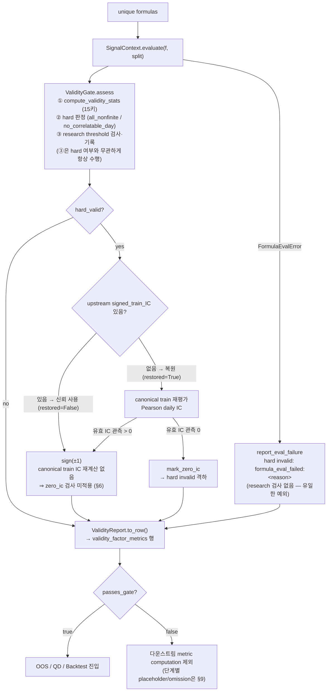

# Validity Gate — Component Design (축 ①)

상태: **구현 실측 기준 (2026-08-19).** 본 문서의 source of truth는 현재
구현(`alphasearchbench/validity/`, `runner.py`)과 config이며, 모든 인용은
실측이다. `ASB_design.md` §6이 framework-level overview를 제공하고, 본
문서는 Validity Gate의 **component-level implementation design**을 기술한다.
후속 심화 문서: OOS Test, QD Test (동일 양식).

---

## 1. 개요

**목적.** Validity Gate는 "이 alpha가 좋은가"가 아니라 **"이 alpha를 정상적인
factor로 간주하고 이후 평가를 수행해도 되는가"**(evaluation eligibility)를
판정하는 전처리·검증 계층이다. 성능이 낮거나 음수라는 사실(Mean IC < 0,
Sharpe < 0 등)은 invalid 사유가 아니다 — orientation을 뒤집으면 유용할 수
있는 factor를 이 단계에서 제거하면 평가 축의 책임 분리가 깨진다.

**위치.** ASB 파이프라인 load → **validity**(signal 평가 + 판정) → OOS →
QD → backtest (`runner.py:1`)의 첫 판정 단계다 — signal 평가는 별도 단계가
아니라 validity stage의 첫 단계다(§4의 흐름과 일치). `passes_gate=False`인
formula는 **다운스트림의 실제 metric computation 대상에서 제외**된다 —
단계별 placeholder/omission 정책은 §9를 따른다(행 자체는 기록될 수 있다).

**Scope / non-scope.** 본 문서는 게이트의 판정 semantics·입출력·설정·재현성을
다룬다. OOS 지표(IC/RankIC/ICIR) 정의, QD descriptor, portfolio backtest는
각 단계의 설계 문서 소관이다.

**용어.**

| 용어 | 의미 |
|---|---|
| Validity Gate (축 ①) | 공식 명칭. 일부 대화·외부 문서의 "Pool Validation Test"는 **역사적 별칭**이며 범위를 오해시킬 수 있다 — 본 게이트는 **factor-level 전용**이고, pool-level admissibility(`no_active_components` placeholder·active component set·pool_id)는 `oos_test_design.md` §6 소관이다 |
| hard invalid | canonical downstream evaluation에 필요한 최소 계산 조건을 충족하지 못한 상태(신호 생성 실패·유효 셀 부재·상관 정의 불가·orientation 재료 부재) — 코드 고정, `validity.mode`와 무관하게 제외 |
| research threshold | signal validity 통계에 적용되는 configurable research criterion. **hard validity와 독립적으로 평가·기록**되며(hard-invalid formula도 위반을 가질 수 있다), `report_only`에서는 diagnostic, `strict`에서는 admission criterion으로 소비된다 (§3·§5) |
| `passes_gate` | 다운스트림 진입 최종 판정 = `hard_valid ∧ research_pass` (§3) |

## 2. 설계 철학

1. **Validity ≠ Quality.** 게이트는 평가 가능성만 판정한다. 성능 지표
   (IC·RankIC·Sharpe·수익률)의 값은 어떤 방향으로도 reject 조건이 아니다.
2. **Cell / Day / Formula 3레벨 분리.** 개별 셀의 NaN → 그 셀만 배제
   (finite mask), 개별 날의 상관 불가 → 그 날만 배제(correlatable day).
   **cell/day-level signal 결함은 즉시 formula invalid로 승격되지 않고
   기간 통계로 집계된다** — 하위 레벨의 결함이 곧바로 상위 판정이 되지
   않는다는 뜻이다. 단 **formula 평가 자체의 실패(`formula_eval_failed`)와
   train-orientation 유도 실패(`zero_ic_observations`)는 기간 집계와
   무관한 별도의 formula-level hard-invalid 경로**다(§5·§6).
3. **Hard / Research 2계층 — 배타적 범주가 아니라 독립 축.** 구조적·수치적
   평가 불가능(코드 고정)과 연구 기준 미달(config 지정, 기본 비활성)을
   분리해 판정·기록한다(§5). 두 축은 **독립적으로 평가**되므로
   hard-invalid formula가 동시에 `research_fail_*`를 가질 수 있다 —
   집계 시 두 범주를 상호배타로 취급하면 중복·오분류가 발생한다(§9의
   "hard-invalid rate와 research-threshold failure rate 분리"가 이
   독립성의 귀결이다).
4. **Method-agnostic canonical evaluation (범위 한정).** **signal validity
   평가**는 GP/RL/LLM 어느 마이너의 formula든 동일한 FormulaEngine·PIT
   universe·label 규약으로 수행한다 — 마이너별 내부 evaluator 차이가
   벤치마크 비교를 오염시키는 것을 막는 장치다. **단 orientation source는
   §3의 upstream `signed_train_IC` 계약에 따른 예외 경계를 가지며, 그
   경계는 `zero_ic_observations` hard 판정에까지 미친다**(§6). Validity
   stage는 mining 이후 **공통 ASB semantics 아래에서 evaluation
   eligibility를 처음 판정하는 지점**이다(signal 평가는 이 stage의 첫
   단계 — §4).
5. **마이닝 게이트와의 책임 분리.** 이름이 비슷한 threshold가 두 소비자에
   존재하며 역할이 다르다:

   |  | Mining fitness gate (`gplearn_asb`) | ASB Validity Gate |
   |---|---|---|
   | 목적 | 탐색 중 fitness 강등(도태) | 공통 평가 eligibility |
   | 시점 | mining 중, 후보마다 | mining 이후, 평가 시 |
   | 데이터 | train(search) 창 | 지정 evaluation split (+ orientation용 train, §6) |
   | threshold | 0.05 / 30 / 0.90 (마이닝 고정 spec) | 기본 전부 `null` |
   | NaN threshold 관측 | fail | 현재 semantics상 failure 미표시 (§5) |
   | 영향 | worst fitness 강등 | downstream admission |

6. **Split-independent design.** 게이트 로직에 **calendar 날짜가
   하드코딩되지 않는다** — 날짜는 experiment config가 주입한다(§3).
   단 "어느 split에서 판정하는가"는 별개 사안이며 기본값은 `test`다 —
   그 방법론적 함의는 §3·§9에 기재한다.

## 3. Inputs, Evaluation Context, Configuration

게이트의 conceptual input은 4군이다 (함수 인자가 아니라 설계상의 입력):

1. **Factor definition** — canonical formula 문자열. 모든 마이너 산출물의
   공통 표현이며 게이트가 받는 유일한 factor 정의다.
2. **Evaluation context** — data provider(qlib 번들), PIT universe mask,
   signal engine(FormulaEngine). 사용된 엔진은 `signal_engine` 필드로
   provenance에 남는다(§7).
3. **Temporal / Orientation context** — 통계 산출 대상인 **evaluation
   split**과, orientation 유도 전용의 **train split**(§6). 두 시간창의
   역할이 다르다. 추가로 **optional upstream `signed_train_IC`**: 마이너
   결과 테이블이 train IC를 제공하면 ASB는 그 값을 신뢰해 orientation에
   사용하고(restored=False), 없을 때만 canonical train 재평가로 복원한다
   (B5 규약, `runner.py:113-128`). **전제(upstream contract)**: 제공값은
   ASB의 train split·label·sign convention과 호환되어야 한다. 이는
   **method-agnostic canonical evaluation의 예외적 경계**다 — 신호는
   canonical하게 재계산되지만 orientation은 upstream 제공값이 사용될 수
   있다.

   **값 유효성 계약 (실측 기준)**: 제공값은 **finite scalar**여야 한다.
   현행 동작 —
   * **결측/NaN** → `pd.notna` 검사에서 걸러져 **"미제공"으로 취급**되고
     canonical 복원 경로로 넘어간다(`runner.py:121`). 즉 NaN upstream
     값은 정의된 동작을 가진다.
   * **±Inf / 비수치** → `notna`를 통과해 그대로 사용되며
     `sign(+∞) = +1`, `sign(−∞) = −1`로 귀결된다. **입력 검증이 없다** —
     Known limitation(§9)으로 기재하며, 검증 추가는 판정 semantics 변경
     (breaking change, §9 호환성)이다.
4. **Validity policy** — `validity.mode`와 research threshold 3종.

**설정 원문** (`configs/default.yaml:41-49`):

```yaml
validity:
  mode: report_only      # report_only | strict
  min_valid_day_ratio: null
  min_mean_daily_coverage_ratio: null
  min_median_daily_n_valid: null
```

**동작 모드.** 동작 기준으로 먼저 요약하면:

| mode | hard violation | research threshold violation |
|---|---|---|
| `report_only` (기본) | Reject | **Diagnostic only** (기록만, 제외 없음) |
| `strict` | Reject | Reject |

정확한 구현 semantics는 다음과 같다. threshold 검사와 `research_fail_*`
기록은 **`ValidityGate.assess`에 진입한 경우 mode와 무관하게 항상
수행**되고(`evaluator.py:96-105`; formula evaluation failure는 assess에
진입하지 않으므로 예외 — §4), 최종
판정 변수는 `research_pass = (mode == "report_only") or (위반 없음)`으로
구성된다(`evaluator.py:106`) — 즉 report_only에서 research_pass는 항상
True다. 이 정의 하에서 최종 판정은:

```
passes_gate = hard_valid ∧ research_pass        (evaluator.py:38-40)
```

"report_only가 threshold 평가 결과를 무시한다"가 아니라, "평가·기록은 하되
research_pass 구성에 반영하지 않는다"가 정확한 서술이다.

**Split 주입.** ASB는 split 날짜를 하드코딩하지 않는다 —
`configs/default.yaml`은 `splits: null`이며 미지정 시 명시적 에러다
(`default.yaml:3-4`). experiment config가 train/valid/test 경계를 지정하는
형식 예시는 `configs/examples/csi800_ref.yaml:10-13`. 게이트 통계는
`run_validity(split=...)`가 지정한 evaluation split에서 계산되고(기본
`"test"`, `runner.py:131`), train split은 §6의 orientation 유도에만 쓰인다.
어떤 실험이 어떤 split을 쓰는지는 각 실험 설계 문서의 소관이다.

**Eligibility가 평가 split에서 결정되는 것의 함의 (명시).** 기본 설정
(`split="test"`)에서는 게이트 통계가 **동결 평가 구간에서 계산**되고,
§9에 따라 탈락 factor는 downstream에서 제외되므로 **평가 모집단이 평가
구간 데이터에 의존**한다. 이는 §6이 차단하는 orientation selection
leakage와는 다른 채널이다 — 성능이 아니라 *계산 가능성*만으로 제외하므로
방향·가중 최적화 누출은 아니지만, "어떤 factor가 평가되었는가"가 평가
구간에 의존한다는 사실은 남는다. `ASB_design.md` §4.3이 같은 사실을 ⚠로
기재한다. 대안(train에서 게이팅)은 평가 구간에서 계산 불가능한 factor를
받아들여 metric NaN을 양산하므로 현행 선택이 의도적이며, 한계로 §9에
등재한다.

## 4. End-to-End Evaluation Flow



코드 경로: `runner.run_validity`(`runner.py:131-153`)가 formula마다
① `ctx.evaluate`로 신호 계산(실패 시 `report_eval_failure`,
`evaluator.py:78-83`), ② `ValidityGate.assess`(`evaluator.py:86-109`)로
통계·hard 판정과 research threshold 검사를 수행(research 검사는 hard
여부와 무관하게 항상 실행·기록되며, eval-failure 경로만 예외), ③
hard_valid이면 `train_sign` 시도 — **upstream `signed_train_IC`가 있으면
그 값으로 sign만 정하고(재계산 없음), 없을 때만 canonical 재평가를 거쳐
유효 IC 관측 0이면 `mark_zero_ic`로 격하**(`runner.py:121-128`, `:143`,
`evaluator.py:111-117`). 즉 `zero_ic_observations`는 복원 경로 전용
검사다(§5·§6).
실패 행도 스키마를 유지한 채 항상 기록된다(§7 결측 규약) — 게이트는 행을
"지우는" 장치가 아니라 판정을 "남기는" 장치다.

## 5. Validity Criteria and Edge Semantics

**Hard invalid 4종** (코드 고정, mode 무관):

| 사유 | 조건 | 판정 위치 |
|---|---|---|
| `formula_eval_failed:<reason>` | 파서·엔진 예외 | `SignalContext.evaluate` (엔진 계층) |
| `all_nonfinite` | `n_valid_cells == 0` | `assess` (`evaluator.py:90-91`) |
| `no_correlatable_day` | `n_correlatable_days == 0` | `assess` (`evaluator.py:92-93`) |
| `zero_ic_observations` | train 분할 label 겹침에서 유효 일별 IC 관측 0. ⚠ **canonical 복원 경로에서만 발동** — upstream `signed_train_IC` 제공 시 우회된다(§6) | `train_sign` 이후 격하 (§6) |

`formula_eval_failed`의 하위 reason은 크게 2범주다:

| Category | reason prefix |
|---|---|
| Parse failure | `parse_error:*` |
| Evaluation/runtime failure | `eval_error:*` |

canonical reason 문자열은 `qlib_provider.py`(:49-246)가 생성하며, 평가
실패는 **silent fallback 없이** reason을 담아 전파된다
(`FormulaEvalError.reason`, `qlib_provider.py:49-56`).

**동일 예외 유형의 두 갈래 (명시)**: `FormulaEvalError`는 발생 지점에
따라 서로 다른 hard reason으로 귀결된다 — `SignalContext.evaluate`에서
발생하면 `formula_eval_failed:<reason>`(§4의 FAIL 경로),
`signed_ic_on_train`에서 `hard_invalid:zero_ic_observations` reason으로
발생하면 `mark_zero_ic` 격하(§6). 예외 타입이 같다는 이유로 두 사유를
같은 원인 계층으로 집계해서는 안 된다(§9의 `invalid_reason`별 세분화).

**Correlatable day의 정의** — `n_valid(t) ≥ 2` 이고 그날 valid 값의
분산 > 0. 상수 판정은 vmax≡vmin의 **정확 비교**(atol=0,
`metrics.py:44-47`)라 "거의 상수"는 상수로 치지 않는다. `const_day_ratio`의
분모는 n_valid≥2인 날이다.

**Research threshold 3종** — 비교 대상 통계의 정의(`metrics.py`):

| threshold | 관측 통계 | 정의 |
|---|---|---|
| `min_valid_day_ratio` | `valid_day_ratio` | n_valid(t) ≥ 1인 날의 비율 (분모 = split의 전체 거래일) |
| `min_mean_daily_coverage_ratio` | `mean_daily_coverage_ratio` | 일별 n_valid(t)/n_universe(t)의 평균 (universe 0인 날은 0 처리, 분모 = 전체 거래일) |
| `min_median_daily_n_valid` | `median_daily_n_valid` | 일별 n_valid(t)의 중앙값 |

**비교 술어 (정본 — 단일 정의)**: 구현 술어를 정본으로 삼는다 —

```
위반(research_fail) ≡ (observed < threshold)
pass                ≡ ¬위반            # NaN 관측 포함
```

유한 관측에서는 이것이 "`observed >= threshold` → pass"(경계값 통과)와
동등하지만, **NaN 관측에서는 두 표현이 갈린다**(`NaN >= th`와
`NaN < th`가 모두 False). 정본은 위 술어이므로 **NaN 관측은 위반이
아니다** — 아래 "NaN 임계 비교 비대칭"이 그 결과다. `null` threshold는
비활성. 15키 진단 통계(§7) 중 이 3키만 임계 비교에 쓰이고 나머지는 보고
전용이다.

**Known documentation discrepancy (축 간)**: 위 표의
`mean_daily_coverage_ratio`는 **universe 0인 날을 0으로 처리**하는데,
`oos_test_design.md` §5.5는 동일 상황의 coverage를 **NaN**으로
규정(undefined ≠ zero)하고 이를 ASB 공통 규약으로 제안한다.
`Known documentation discrepancy: oos_test_design states empty-universe
coverage = NaN; validity implementation behavior is 0.` — 두 축의 값이
다른 상태이며, 공통 규약 확정(ASB_design 또는 본 문서)까지 sync 대상으로
관리한다(§9).

**Finite semantics.**

* valid cell = universe cell ∧ finite(signal). **NaN은 그 자체로
  evaluation failure를 의미하지 않는다** — rolling operator의 warm-up
  결측이 대표적인 정상 발생 원인이며, `nan_cell_ratio`로 정량화만 한다.
  "NaN 존재 → invalid" 같은 규칙은 존재하지 않는다.
* **Inf는 변환하지 않는다** — Inf→NaN 치환 없이 finite mask가 배제하고,
  `inf_cell_ratio`를 별도 진단(계산 불안정 신호)으로 기록한다.
* **상수 factor**: 일별 분산 0 → 그 날 correlatable 미달. 전 기간 지속 시
  `no_correlatable_day`로 hard invalid.
* **희소 factor**: 날짜별 n_valid < 2 → 그 날만 배제. 전 기간 전멸이면
  hard, 부분적이면 research 통계(coverage·valid_day_ratio)에 반영될 뿐
  formula가 즉시 invalid가 되지 않는다.

**NaN 임계 비교 비대칭 (알려진 동작).** 이것은 signal NaN에 대한 것이
아니다 — signal NaN 셀은 위의 finite mask가 정상적으로 배제한다. 문제는
**관측 통계값 자체가 NaN인 경우**다: 구현이 `observed < th`로 위반을
판정하므로(`evaluator.py:102-105`) NaN 관측은 위반으로 표시되지 않는다 —
*NaN threshold observation → no research failure in current ASB comparison
semantics.* 마이닝 측 게이트는 반대로 NaN 관측을 fail 처리한다(§2 표).
두 소비자의 문서화된 규약 차이이며, strict 모드를 공식 채택할 때 재검토
대상이다(§9).

## 6. Train Sign Derivation

**왜 evaluation split 외에 train split을 참조하는가.** 목적은
**orientation selection leakage 방지**다 — evaluation/test label을 보고
factor의 long/short 방향(sign)을 정하면 평가 성능이 낙관 편향된다. 그래서
orientation은 train split에서만 유도하고, OOS evaluator는 `train_sign`을
**입력으로만** 받는다(`oos/evaluator.py:6`). 이는 일반적인 leakage 전체를
막는 장치가 아니라 이 특정 누출 경로를 막는 설계다.

```
Evaluation split ──> signal 통계 (§5) ──> hard_valid
                                             │ (hard_valid인 경우만)
                                             ▼
                        ┌── upstream signed_train_IC 존재 (restored=False)
                        │      → upstream 호환 계약 전제(§3)
                        │      → sign(±1)          [zero_ic 검사 없음]
hard_valid ─────────────┤
                        └── upstream signed_train_IC 부재 (restored=True)
                               → canonical train 재평가
                               → Pearson daily IC
                                   ├─ 유효 관측 > 0 → sign(±1)
                                   └─ 유효 관측 = 0 → FormulaEvalError
                                        → mark_zero_ic → hard invalid
```

구현(`runner.py:113-128`): ① 입력 결과 테이블에 `signed_train_IC`가 있으면
그 값을 사용(restored=False — 마이너가 이미 보고한 train IC), ② 없으면
(trajectory 전용 후보 등) train split 재평가로 복원(restored=True, B5 규약)
— `ctx.signed_ic_on_train`. `sign = +1 if signed_train_IC ≥ 0 else −1`.

**`zero_ic_observations`의 적용 범위 (실측 — 중요)**: 위 ①은
`signed_ic_on_train`을 **호출하지 않고 즉시 반환**하므로
(`runner.py:121-123`), `zero_ic_observations` hard 검사는 **② canonical
복원 경로에서만 발동**한다. 결과적 비대칭:

| 입력 | train IC 정의 불가 factor의 판정 |
|---|---|
| upstream `signed_train_IC` 제공 | 검사 없음 → **hard invalid 아님** → downstream 진입 |
| 미제공(복원 경로) | `zero_ic_observations` → **hard invalid** → 제외 |

즉 §2.4의 method-agnostic canonical evaluation은 **신호 계산에는
적용되지만 이 hard 판정에는 완전히 적용되지 않는다** — §3이 밝힌
"upstream sic = canonical evaluation의 예외적 경계"가 orientation 값에
그치지 않고 **admission 판정까지 미친다**는 뜻이다. 방법별 valid rate
비교 시 이 채널을 반드시 통제해야 하며(§9), 두 경로를 일치시키는
정책(upstream sic 사용 시에도 canonical zero-IC 가능성만 별도 검사)은
판정 semantics 변경 = **breaking change**이므로 §9 호환성 규약에 따라
버전 명기와 기존 결과 재평가가 선행되어야 한다 — 현재는 미채택
결정 대기 항목이다.

두 가지 경계를 명확히 한다:

* **`no_correlatable_day` vs `zero_ic_observations`** — 표면상 비슷하지만
  발생 위치와 데이터 창이 다르다. 전자는 **신호 단독** 판정(evaluation
  split에서 상관을 정의할 날이 없음, `assess` 단계), 후자는 **label과의
  겹침** 판정(train 분할에서 유효 일별 IC 관측이 없음, sign 유도 단계).
  게이트 자체는 IC를 계산하지 않으며, zero_ic는 sign 유도의 부수 검사로
  **사후 격하**된다.
* **RankIC는 관여하지 않는다** — computability·orientation 판정은 train
  Pearson daily IC 기준이고, RankIC는 OOS 성능 지표다(responsibility 경계).

## 7. Outputs and Schema

`ValidityReport`(`evaluator.py:26-54`)가 통계·판정·사유를 묶어 행으로
직렬화한다(`to_row`). 산출 테이블 `validity_factor_metrics`의 **base
schema는 24컬럼**(아래 표의 앞 3개 의미군 — 실 산출물 parquet과 1:1 대조
완료 2026-08-19)이며, 여기에 **`research_fail_<threshold key>` diagnostic
컬럼이 조건부로 추가될 수 있다**: `to_row`는 research threshold 위반이
실제로 발생한 경우에만 해당 키의 컬럼을 만든다(`evaluator.py:52-53`).
지금까지의 공식 run은 전부 report_only + threshold null이라 위반이 없어
실측 산출물에 이 컬럼이 존재하지 않는다 — 고정 24컬럼 스키마가 아니다.

**조건부 컬럼과 비교 가능성 (알려진 긴장 + 권고 정책)**: 위반 유무에
따라 컬럼 집합이 run마다 달라지면 다중 run 결합·엄격 스키마 판독이
깨져 §9 호환성이 보호하려는 **비교 가능성 자체가 훼손**된다. 권고
정책: **설정에서 활성화된 threshold 키에 대해서는 위반 여부와 무관하게
`research_fail_<key>` 컬럼을 항상 emit**(위반 없으면 null/False)하고,
비활성(`null`) threshold의 컬럼은 만들지 않는다. 이 정책 채택은
schema 변경이므로 §9 호환성 절차(버전 명기)를 따른다 — 현재 구현은
위반 시에만 생성한다.

| 의미군 | 컬럼 |
|---|---|
| **Identity / provenance** | `formula`, `method`, `seed`, `split`, `signal_engine` |
| **Decision** | `valid`(=`passes_gate`), `hard_valid`, `invalid_reason`, `formula_eval_failed` — **파생 bool**: `invalid_reason`이 `"formula_eval_failed"`로 시작하는지에서 계산되며(`evaluator.py:48-49`) 독립 정보가 아니다 |
| **Signal validity statistics** (15키) | `n_total_days`, `n_valid_days`, `valid_day_ratio`, `mean/median/min_daily_n_valid`, `mean/median/p10_daily_coverage_ratio`, `const_day_ratio`, `n_correlatable_days`, `nan_cell_ratio`, `inf_cell_ratio`, `n_universe_cells`, `n_valid_cells` |
| **Research diagnostics (조건부)** | `research_fail_<threshold key>` — 위반 발생 시에만 생성, 위반 관측값 기록 |

**`invalid_reason`의 범위와 strict research rejection (계약 — 미발효)**:
현행 `invalid_reason`은 **hard-invalid 사유 전용**이다(§5의 4종). 그런데
`strict` 모드에서는 `hard_valid=True ∧ research_pass=False`인 행이
`passes_gate=False`가 되므로(§3), 그 행의 사유와 downstream placeholder
(§9)가 무엇을 담을지가 정의되어야 한다. **계약**: 이 경우
`invalid_reason = "research_threshold_fail:<key>"`(복수 위반 시 key를
정렬해 `,`로 연결)로 채우고, OOS·Backtest placeholder에 **동일 문자열을
전파**한다. 위반 관측값 자체는 validity 테이블의
`research_fail_<key>` 컬럼에 남는다(§7 조건부 컬럼). strict가 아직 공식
실행된 적이 없으므로(§8) 이 계약은 **strict 채택 시 발효**되며, 채택은
판정 semantics 변경(§9 호환성)이다.

**Orientation provenance의 부재 (알려진 한계)**: `restored`(upstream 사용
vs canonical 복원)와 `signed_train_IC`·`train_sign`은 **본 스키마에 없다**
— §6의 경로 분기가 `zero_ic_observations` 적용 여부까지 좌우하는데,
`validity_factor_metrics`만으로는 어느 경로였는지 판정할 수 없다. 참고:
`oos_factor_metrics`에는 `train_sign`·`signed_train_IC`·
`train_sign_restored`가 존재하므로(oos_test_design §4.2) 사후 대조는 OOS
테이블 경유로만 가능하다. provenance 필드 추가는 스키마 변경 후보이며
§9 limitations에 등재한다.

**평가 실패 행의 결측 규약** — 스키마 유지를 위해 키 이름 prefix 기준으로
채운다(`evaluator.py:79-80`, `_EMPTY_STATS_KEYS` :57-63): **`n_` 또는
`min_`으로 시작하는 키 → 0**(`n_total_days`, `n_valid_days`,
`n_correlatable_days`, `n_universe_cells`, `n_valid_cells`,
`min_daily_n_valid`), **그 외 평균·중앙값·비율 통계 → NaN**
(`mean_daily_n_valid`, `median_daily_n_valid` 포함 — 비율이 아니어도
NaN 쪽이다).

**저장 정책과 한계** — 15개의 aggregate validity statistics를 저장하며,
그 안에 cell-level 비율인 `nan_cell_ratio`·`inf_cell_ratio`가 포함된다.
원본 finite mask(일×종목)는 저장하지 않는다. 따라서 "어느 날짜·종목이 왜
결측인가"의 사후 forensic은 signal 재계산이 필요하다 — **동일
data bundle·config·code 환경이 보존되어 있다면** 계산이 결정적이므로
mask를 재구성할 수 있으나 즉답은 불가능하다(완전 재현에 필요한 요소는
§8).

## 8. Reproducibility and Verification

* **Provenance (row-level traceability)** — 모든 행에 `method`/`seed`/
  `split`/`signal_engine` 4필드 스탬프(`runner.py:150-151`). 이는 행의
  평가 출처를 추적하기 위한 **최소 provenance**이며 완전한 재현 키가
  아니다 — `split`은 라벨이지 실제 날짜가 아니므로, 완전한 재현에는 해당
  run의 manifest/experiment config(실제 split 날짜), data bundle 버전,
  universe 구성, validity config, code version이 함께 필요하다.
* **구현 경로** — `validity/evaluator.py`(ValidityGate·ValidityReport·
  mark_zero_ic), `validity/metrics.py`(compute_validity_stats),
  `runner.run_validity` → `validity_factor_metrics` 기록(`runner.py:487-488`).
* **테스트** — `tests/smoke/test_phase1_signal_validity.py`: 정상/상수/
  전체 NaN/대부분 NaN/Inf/평가 실패의 6개 판정 케이스 + 엔진의
  no-silent-fallback·reference 동등성 검증.
* **Implementation evidence** — 2026-08-19까지의 기존 ASB run들에서
  hard-invalid 분기가 실제로 관찰되었다(`no_correlatable_day` 및 formula
  evaluation failure 사례 포함). 즉 본 문서의 판정 경로는 코드로만 존재하는
  기능이 아니라 실제 평가에서 발동된 경로다.
* **Known behavior — 구현 ≠ 실행 이력.** strict 모드와 threshold 게이팅은
  구현되어 있으나, **기존 공식 run은 전부 `report_only` + threshold `null`
  로 실행되었다**(실행된 manifest 전수 실측). 따라서 지금까지의 ASB 결과는
  사실상 hard-invalid 4종만으로 게이팅된 것이다. strict 경로를 공식
  채택하려면 threshold 값의 사전 등록과 회귀 검증이 선행되어야 한다.

## 9. Downstream Contract and Limitations

**계약.** `passes_gate=False`인 formula의 처리는 다운스트림 단계별로
다르다:

| 단계 | invalid formula 처리 |
|---|---|
| **OOS (개별)** | 계산하지 않고 `invalid_reason`이 담긴 **placeholder 행 기록** (`runner.py:161`) |
| **QD** | **gated-valid formula만 순회** — placeholder 행 없음 (`runner.run_qd`) |
| **Backtest (개별)** | 계산하지 않고 **placeholder 행 기록** (`runner.py:454`) |
| **pool / combiner 입력** | 게이트 통과 목록만 사용 (`runner.py:177, 198, 467`) |

**방법별 validity rate 비교 원칙.** 방법별 valid 비율은 우선 **평가 대상
output set의 evaluability**를 나타낸다 — 게이트의 모집단은 마이너가
제출한 입력 결과(`runner`의 unique formulas)이지 탐색 전체가 아니다.
이를 **search guidance efficiency로 해석하려면 동일 search budget, 동일
candidate scope(all candidates vs final pool — 예: `smoke_allcand` 입력),
동일 deduplication 규약, 그리고 **`signed_train_IC` 제공 여부의 통일**
(§6 — 제공 여부에 따라 `zero_ic_observations` hard 검사가 적용되거나
우회되므로, 이것이 다르면 valid rate가 방법의 성질이 아니라 **제출
포맷의 차이**를 반영한다)이 전제되어야 한다. 내부에서 invalid를 대량
폐기하고 valid만 제출한 방법과 거의 전부 valid인 방법이 final-pool
게이트에서는 똑같이 100%로 보이기 때문이다. 집계는 **hard-invalid rate와
research-threshold failure rate를 분리**하고, **hard-invalid 내부는
`invalid_reason`별로 세분화**한다(`formula_eval_failed` /
`all_nonfinite` / `no_correlatable_day` / `zero_ic_observations`) —
네 사유는 원인 계층이 다르며(문법·평가 실패 vs 신호 성질 vs label 겹침),
실측에서도 eval 실패보다 `no_correlatable_day`가 지배적이었다.

**Validity Gate가 하지 않는 것** (각 소관 문서 참조):

* IC/RankIC/ICIR의 성능 우열 판단 — OOS Test 소관.
* QD descriptor 계산(horizon·activation breadth 등) — QD Test 소관.
* 수익률·Sharpe·비용·turnover — Portfolio Backtest 소관.
* formula 복잡도 판정 — 진단 메타데이터 소관(validity 기준 아님).

**Known limitations.**

1. NaN threshold 관측의 pass 동작(§5) — strict 모드 공식 채택 시 재검토.
2. 원본 finite mask 미저장(§7) — 사후 분석은 재계산 필요.
3. strict 모드 실행 이력 부재(§8).
4. **`zero_ic_observations`의 경로 의존성**(§6) — upstream
   `signed_train_IC` 제공 시 이 hard 검사가 우회되어 admission 판정이
   제출 포맷에 의존한다. 두 경로를 일치시키는 정책은 판정 semantics
   변경(breaking change)이므로 미채택 결정 대기.
5. **Eligibility가 평가 split(기본 `test`)에서 결정된다**(§3) — 평가
   모집단이 평가 구간 데이터에 의존하는 채널. 성능 기반 선택은 아니지만
   설계 선택으로 기재해 둔다.
6. **`research_fail_*` 조건부 컬럼으로 인한 스키마 가변성**(§7) —
   다중 run 결합 시 비교 가능성 훼손 가능. 권고 정책은 §7.
7. **축 간 coverage 규약 불일치**(§5 Known documentation discrepancy)
   — empty-universe day의 coverage가 validity 0 / OOS NaN.
8. **upstream `signed_train_IC`의 입력 검증 부재**(§3) — ±Inf·비수치가
   검증 없이 sign으로 귀결된다(NaN은 "미제공"으로 정의된 동작).
9. **Orientation provenance가 산출 스키마에 없음**(§7) —
   `restored`/`signed_train_IC`/`train_sign` 부재로 §6 경로 분기를
   validity 테이블만으로 감사할 수 없다(OOS 테이블 경유 필요).
10. **strict research rejection의 사유·전파 계약이 미발효**(§7) —
    계약은 정의됐으나 strict 실행 이력이 없어 검증되지 않았다.

**호환성.** 판정 semantics(hard 4종과 그 적용 경로, 비교 술어
`위반 ≡ observed < th`(§5 정본), 15키 통계 정의, 산출 스키마)의 변경은
breaking change다 — 기존 `validity_factor_metrics`와의 비교
가능성이 깨지므로, 변경 시 버전 명기와 기존 결과 재평가가 필요하다.
문서와 구현 사이의 불일치가 발견되면 우선순위를 선언하는 대신
`Known documentation discrepancy: <문서> states X; implementation behavior
is Y` 형식으로 기록하고 sync 대상으로 관리한다.
